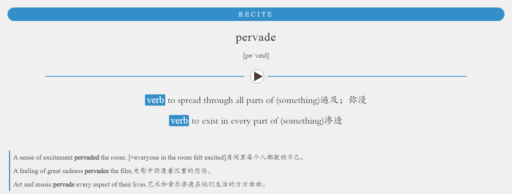

在 Anki 的模板中除了可以使用 HTML 之外还可以使用 JavaScript, 如下读取卡片正面的单词，为卡片背面例句出现的此单词加上 `<span class="emphasize-word"></span>`， 然后用 CSS 设置样式。

```js
<script>
  // Anki 对 ES6 不是完全支持，使用 var 定义变量
  var wordText = document.querySelector(".Word").innerText;
  // 使用 RegExp 定义 正则表达式 \\ 表示 \;
  // HTML 中的空格是 &nbsp;
  // 以 pervade 为例，如下正则表达式使用字面量可以表示为 /(pervade\w*(&nbsp;)?\.?)/gi
  // var re = new RegExp('(' + wordText + '\\w*(&nbsp;)?\\.?)', 'gi');
  var re = new RegExp('(' + wordText.slice(0, -1) + '\\w*)', 'gi');
  // $1 引用第一个 group 中的值
  var emphasizeWordText = '<span class="emphasize-word">$1</span>';

  var example = document.querySelector(".Example");
  var exampleHTML = example.innerHTML.replace(re, emphasizeWordText);
  example.innerHTML = exampleHTML;

</script>
```

```css
span.emphasize-word {
  font-weight: bold;
}
```

