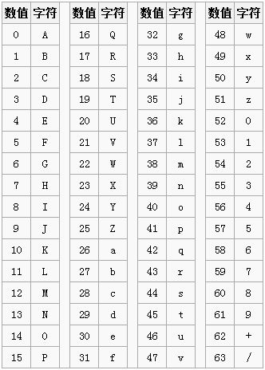

> 转载: [Base64 原理解析 - 方方和圆圆 - 博客园](https://www.cnblogs.com/diligenceday/p/6002382.html)

### Base64 编码由来

为什么会有 Base64 编码呢？`因为有些网络传送渠道并不支持所有的字节，例如传统的邮件只支持可见字符的传送，像 ASCII 码的控制字符就不能通过邮件传送。` 这样用途就受到了很大的限制，比如图片二进制流的每个字节不可能全部是可见字符，所以就传送不了。最好的方法就是在不改变传统协议的情况下，做一种扩展方案来支持二进制文件的传送。把不可打印的字符也能用可打印字符来表示，问题就解决了。Base64 编码应运而生，`Base64 就是一种基于 64 个可打印字符来表示二进制数据的表示方法。`

### Base 的索引表

看一下 Base64 的索引表，字符选用了 `A-Z、a-z、0-9、+、/` 64 个可打印字符。数值代表字符的索引，这个是标准 Base64 协议规定的，不能更改。



### Base64 的原理

Base64 的码表只有 64 个字符， 如果要表达 64 个字符的话，使用 6 个 bit 即可完全表示(2 的 6 次方为 64)。

因为 Base64 的编码只有 6 个 bit 即可表示，而正常的字符是使用 8 个 bit 表示， 8 和 6 的最小公倍数是 24，所以 4 个 Base64 字符可以表示 3 个标准的 ascll 字符；

如果是字符串转换为 Base64 码， 会先把对应的字符串转换为 ascll 码表对应的数字， 然后再把数字转换为 2 进制， 比如 a 的 ascll 码味 97， 97 的二进制是：01100001， 把 8 个二进制提取成 6 个，剩下的 2 个二进制和后面的二进制继续拼接， 最后再把 6 个二进制码转换为 Base64 对于的编码， 以下为具体的解析过程案例：

把 abc 这三个字符转换为 Base64 的过程

| str     | a        | b        | c        |        |
| ------- | -------- | -------- | -------- | ------ |
| ascii   | 97       | 98       | 99       |        |
| 8bit    | 01100001 | 01100010 | 01100011 |        |
| 6bit    | 011000   | 010110   | 001001   | 100011 |
| decimal | 24       | 22       | 9        | 35     |
| base64  | Y        | W        | J        | j      |

现在还有一点小问题，当转换到最后， 最后的字符不足 3 个字符咋办， 如果不足三个字符的话，我们直接在最后添加＝号即可， 具体可以参考以下两个字符串转换案例：


### Base64 转换示例

```python
import base64

r = base64.b64encode('abc'.encode('utf-8')).decode('utf-8')
print(r)  # YWJj
r = base64.b64encode('A'.encode('utf-8')).decode('utf-8')
print(r)  # QQ==
```
