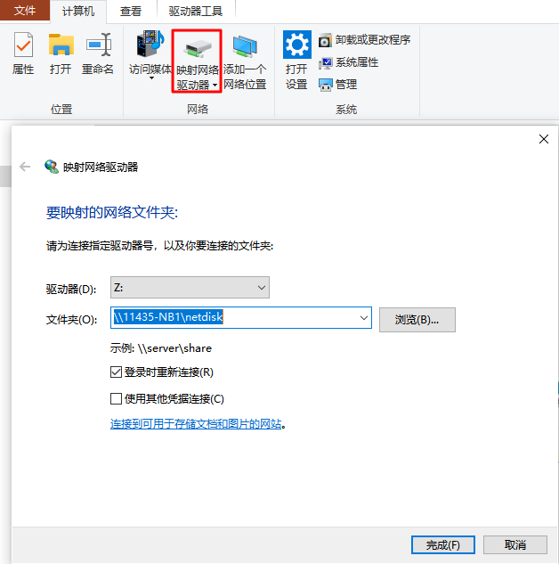

### help

window bat 查看命令的帮助，在命令后面使用 `/?`

例如：`set /?`

### set

参数：

| option | meaning                                     |
| ------ | ------------------------------------------- |
| /A     | expression 指定等号右边的字符串为数字表达式 |
| /P     | variable=[promptString] 提示用户输入        |

示例：

```powershell
@echo off
set /p b=please input number:
echo %b%
set /a a=2*%b%
echo %b%+%b%=%a%
pause>nul

:: please input number:2
:: 2
:: 2+2=4
```

### move

功能：

1. 移动一个或多个文件到你指定的位置
2. 重命名目录

注意：

move 命令可以跨分区移动文件，却不可以跨分区移动文件夹

参数：

| option | meaning                  |
| :----- | :----------------------- |
| /Y     | 发生文件覆盖时不进行提示 |
| /-Y    | 发生文件覆盖时进行提示   |

示例：

```powershell
move /-Y "E:\study\bash\source\e.jpg" "E:\study\bash\dest\d.jpg"
```

### del

参数：

| option | meaning                                |
| :----- | :------------------------------------- |
| /P     | 删除每一个文件之前提示确认             |
| /F     | 强制删除只读文件                       |
| /S     | 从所有子目录删除指定文件               |
| /Q     | 安静模式，删除全局通配符时，不要求确认 |
| /A     | 根据属性选择要删除的文件               |

/A 属性选择：

| option | meaning     |
| :----- | :---------- |
| r      | 只读        |
| a      | 存档        |
| s      | 系统        |
| h      | 隐藏        |
| -      | 前缀表明 非 |

存档：表示该文件在上次备份前已经修改过了，一些备份软件在备份系统后会把这些文件默认的设为存档属性

### for

在 cmd 窗口中，for 之后的形式变量 `i` 必须使用单百分号引用，即 `%i`；而在批处理文件中，引用形式变量 `i` 必须使用双百分号，即 `%%i`。

在 cmd 窗口中：

```powershell
FOR %variable IN (set) DO command [command-parameters]
```

在批处理文件中：

```powershell
FOR %%variable IN (set) DO command [command-parameters]
```

基本用法：

```powershell
for %%i in (1 2 3) do @echo %%i

for %%i in (java, ruby, python) do @echo %%i

set str=c d e f g h i j k l m n o p q r s t u v w x y z
for %%i in (%str%) do if exist %%i: echo %%i

for %%i in (*.bat) do echo "%%i"

:: ? 0个或一个字符
for %%i in (???.bat) do echo "%%i"
```

#### for /f

解析文本、读取文件内容、提取某几行字符、截取某个字符片段、对提取到的内容再处理。

使用方式：

-   `for /f %%i in (文件名) do`
-   `for /f %%i in ('命令语句') do`
-   `for /f %%i in ("字符串") do`
-   `for /f "usebackq" %%i in ("文件名") do (这种方式文件名可以使用空格)`
-   `for /f "usebackq" %%i in (命令语句) do`
-   `for /f "usebackq" %%i in ('字符串') do`

参数：

| option   | meaning                          |
| :------- | -------------------------------- |
| delims=, | 以，作为分隔符；默认为空格       |
| tokens=2 | 提取切分的第二部分内容；默认为 1 |
| skip=2   | 跳过无关内容；跳过前两行内容     |
| eol=,    | 忽略以，开头的行；默认为；       |

测试文本 test.txt：

```txt
php is the best language in the world
life is short, i use python, and you?
```

测试脚本：

```powershell
::默认 delims 是空格
for /f %%i in (test.txt) do echo %%i
::php
::life

for /f "delims=," %%i in (test.txt) do echo %%i
::php is the best language in the world
::life is short

for /f "delims=, tokens=1-2,*" %%i in (test.txt) do echo %%i %%j %%k
::php is the best language in the world
::life is short  i use python  and you?

for /f "delims=, tokens=1-2,* eol=p" %%i in (test.txt) do echo %%i %%j %%k
::life is short  i use python  and you?

for /f "delims=, tokens=1-2,* skip=1" %%i in (test.txt) do echo %%i %%j %%k
::life is short  i use python  and you?
```

#### for /r

遍历文件夹

```powershell
::遍历文件夹和子文件夹，每个文件夹后添加.
for /r E:\study\bash %%i in (.) do echo %%i
::E:\study\bash\.
::E:\study\bash\dest\.
::E:\study\bash\source\.

::遍历文件夹和子文件夹下以.txt结尾的文件，不包括文件夹
for /r E:\study\c#\bash %%i in (*.txt) do echo %%i
::E:\study\bash\test.txt
::E:\study\bash\dest\test.txt
```

#### for /l

计数循环

```powershell
::x、y和z都只能取整数，正负皆可，x指代起始值，y指代步长，z为终止值
for /l %%i in (1, 2, 10) do echo %%i
::1
::3
::5
::7
::9
```

### forfiles

从文件夹或树中选择要进行批处理的文件 , 进行相关处理。

`forfiles [/p Path ][/m SearchMask ] [/s ][/c Command ] [/d [{+ | - }][{MM / DD / YYYY | DD }]]`

参数：

| option        | meaning                                                                                                     |
| :------------ | :---------------------------------------------------------------------------------------------------------- |
| /p Path       | 指定 Path ，表明要从哪里开始搜索。默认的文件夹是当前工作目录`(.)`                                           |
| /m SearchMask | 按照 SearchMask（模糊搜索） 搜索文件。默认的 SearchMask 是 `*.*`                                            |
| /s            | 指示 forfiles 在子目录中搜索                                                                                |
| /c Command    | 在每个文件上运行指定的 Command, 带有空格的命令字符串必须用引号括起来；默认的 Command 是 `cmd /c echo @file` |
| /d            | `/d [{+ or -}][{MM/DD/YYYY or DD }]` 选择日期 `+(>=) or -(<=)` 指定日期的文件                               |

删除两天前的文件

`forfiles /p e:/bak /s /m *.* /d -2 /c "cmd /c del @file"`

/c command 中可以使用的变量

| 变量     | 描述                                                |
| -------- | --------------------------------------------------- |
| @file    | 文件名                                              |
| @fname   | 无扩展名的文件名                                    |
| @ext     | 文件扩展名                                          |
| @path    | 文件的完整路径                                      |
| @relpath | 文件的相对路径                                      |
| @isdir   | 如果文件类型是目录，则计算值为 TRUE，否则值为 FALSE |
| @fsize   | 用字节表示的文件大小                                |
| @fdate   | 文件中上次修改的日期戳                              |
| @ftime   | 文件中上次修改的时间戳                              |

### dir

显示目录下的文件和文件夹

`dir [D:][PATH][NAME][[/A][:attrib]][/o:[sorted][/s][/b][/l][/c[h]`

参数：

| option        | meaning                                                |
| ------------- | ------------------------------------------------------ |
| **/a:attrib** | **以指定属性显示文件，未指定显示所有文件包括隐藏文件** |
| [h/-h]        | 只显示隐含文件或非隐含文件。                           |
| [r/-r]        | 只显示只读文件或非只读文件                             |
| [s/-s]        | 只显示系统文件或非系统文件                             |
| [a/-a]        | 只显示要归档文件或非归档文件                           |
| **/o[:]**     | **sorted: 缺省完全按字母顺序，子目录显示在文件之前**   |
| [n/-n]        | 按字母顺序或按文件名顺序 / 反向显示                    |
| [e/-e]        | 按扩展名字母顺序 / 反向显示                            |
| [d/-d]        | 按时间顺序 / 反向显示                                  |
| [s/-s]        | 按大小从大到小或 / 反向显示                            |
| [g/-g]        | 按子目录先于文件或文件先于子目录                       |
| /s 参数       | 对当前目录及其子目录中所有文件进行列表                 |
| /b 参数       | 将只显示文件名与扩展名                                 |
| /l  参数      | 将全部用小写字母对文件或子目录进行列表                 |

示例：

```powershell
:: d:test 路径, /b 文件名.扩展名, /o-d 时间倒序排列, o* 以 o 开头的文件
dir d:test /b /o-d o*
```

### findstr

findstr 用于查找某路径下指定的一个或多个文件中包含某些特定字符串的行，并将该行完整的信息打印出来，或者打印查询字符串所在的文件名。

| option    | meaning                                |
| --------- | -------------------------------------- |
| /i        | 指定搜索不区分大小写                   |
| /s        | 在当前目录和所有子目录中搜索匹配的文件 |
| /c:string | 使用指定的文本作为文字搜索字符串       |

注意：`/c:cmd` 指定的文本 cmd 作为文字搜索字符串，会查找 `'c','m','d','cm','cmd' ...` 所在行数据

```powershell
findstr /s /i /c:"cmd" C:\tmp\*.txt
```

精确查找字符串：`"\<string\>"`

```powershell
echo hello world computer|findstr "\<computer\>"
echo hello worldcomputer|findstr ".*computer\>"
```

### example

测试文本 test.txt

```txt
php @123 the best language in the world
life is short, i use python
```

测试脚本

```powershell
:: 以 @ 和 空格分割
:: test*.txt 模式匹配，匹配会包含文件名
:: test.txt:php 123
for /f "tokens=1,2 delims==@ " %%i in ('findstr /c:"@" test*.txt') do (
    echo %%i %%j
)

:: test.txt 完整匹配，匹配不会包含文件名
:: php 123
for /f "tokens=1,2 delims==@ " %%i in ('findstr /c:"@" test.txt') do (
    echo %%i %%j
)

:: 只以 @ 分割
:: php 123 the best language in the world
for /f "tokens=1,2 delims==@" %%i in ('findstr /c:"@" test.txt') do (
    echo %%i %%j
)


REM 以 t, h, e, th ... the 分割
REM p
REM p @123
REM  b
REM s
REM  languag
for /f "tokens=1,2,3,4,5 delims==the" %%i in ('findstr /c:"@" test.txt') do (
    echo %%i
    echo %%j
    echo %%k
    echo %%l
    echo %%m
）
```

### delayedexpansion

批处理运行命令的机制：批处理读取命令时是按行读取的（另外 for 命令等，其后用一对圆括号闭合的所有语句也当作一行），在处理之前要完成必要的预处理工作，这其中就包括对该行命令中的变量赋值。例如：批处理在运行到这句 `set a=5&echo %a%` 之前，先把这一句整句读取并做了预处理—之前对变量 a 赋了值，那么 %a% 就是 4

```powershell
@echo off
set a=4
set a=5&echo %a%
pause
:: 4
```

为了能够感知环境变量的动态变化，批处理设计了变量延迟。简单来说，在读取了一条完整的语句之后，不立即对该行的变量赋值。变量引用要用 `! !` 包裹

```powershell
@echo off
setlocal enabledelayedexpansion
set a=4
set a=5&echo !a!
pause
::5
```

for 命令等，其后用一对圆括号闭合的所有语句也当作一行，下面是使用变量延迟扩展和不使用的区别

```powershell
@echo off&setlocal enabledelayedexpansion
for /l %%i in (1, 2, 5) do (
    set "a=%%i"
    echo !a!
)
pause>nul
:: 1
:: 3
:: 5

@echo off
for /l %%i in (1,2,5) do (
    set "a=%%i"
    echo %a%
)
pause>nul
:: ECHO 处于关闭状态。
:: ECHO 处于关闭状态。
:: ECHO 处于关闭状态。
```

### goto :eof

-   在主程序中使用

    如果是在主程序使用 goto :eof，那它的作用就是退出批处理并关闭 cmd 窗口，作用相当于 exit

-   在子程序中使用

    子程序就是指，用 call 调用的部分，如果是在子程序使用 goto :eof 作用就是结束当前子程序并把控制权交还给调用它的主程序以便主程序继续执行下面的命令

### call

-   调用另一个批处理

    在批处理中，可以使用 `%*` 代表所有参数 `%1-%9` 代表 9 个参数，`%0` 代表批处理自己

    ```powershell
    :: %0 代表 a.bat 自己，%1 代表 hello，%2 代表 world
    call a.bat hello world
    ```

-   调用一个命令

    ```powershell
    call ping 127.0.0.1
    ```

-   调用一个应用程序

    ```python
    call python test.py
    ```

-   调用批处理的一个标签

    goto :no1 是转到标签 :no1 处运行，运行完就退出，而 call 是调用 :no1，运行完继续执行 call 下面的命令

    ```powershell
    :: 先启动 calc 然后启动 notepad.exe 再退出
    @echo off
    call :no1
    start notepad.exe
    exit
    :no1
    start calc

    :: 只启动 calc 不会启动 notepad.exe 也不会退出
    @echo off
    goto :no1
    start notepad.exe
    exit
    :no1
    start calc
    ```

### strreplace

```powershell
:: 将 .txt 文件中的 aa 替换为 bb
@echo off&&setlocal enabledelayedexpansion
for %%i in (*.txt) do (
    set original=%%i
    set replaced=!original:aa=bb!
    if !original! neq !replaced! (ren "!original!" "!replaced!")
)
endlocal

:: 将 .txt 文件重命名为 .bat
:: delims=表示不使用默认空格分隔，避免处理带空格文件时错误
:: /s 对当前目录及其子目录中所有文件进行列表
@echo off
for /f "tokens=* delims=" %%i in ('dir /b/s *.txt') do (
    rename "%%i" "*.bat"
)
:: 可以直接使用 rename 当前目录文件
ren *.txt *.bat

:: 替换 # 为换行
:: start tmp.txt 打开 tmp.txt
:: goto :eof 跳到 for 循环中继续执行
:: %~1 扩充 %1 删除引号(")
@echo off>tmp.txt
for /f "delims=" %%i in (a.txt) do (
set "s=%%i"
call set "s=%%s:#=&echo.%%"
call call :write "echo.%%s%%"
)
start tmp.txt
exit
:write
(%~1)>>tmp.txt
goto :eof
```

### errorlevel

当 copy 错误时会记录日志到 test.log

```powershell
copy a b || echo copy error %ERRORLEVEL% >> test.log
```

### pause

`pause` 就是暂停命令，执行时会在命令行窗口显示 `请按任意键继续. . .` 并等待你按键。

`pause > nul` 的作用是同样的，区别是不显示 `请按任意键继续. . .` 这些字，nul 相当于空文件，把这些文字隐去了。但是同样是等待你按键。

### date

```powershell
echo off
echo %date% %time%
echo %date:~0,10% %time:~0,8%
:: 2018/12/21 周五 16:28:54.34
:: 2018/12/21 16:28:54
```

### tree

显示目录结构

### tasklist

tasklist 列出正在运行的进程

```txt
tasklist /fi "imagename eq python.exe"  查找映像名称为 python.exe 的进程

映像名称                       PID 会话名              会话#       内存使用
========================= ======== ================ =========== ============
python.exe                    1688 Console                    1     74,972 K
python.exe                    5312 Console                    1     24,556 K

tasklist /fi "imagename eq python.exe" | findstr python.exe
python.exe                    1688 Console                    1     74,972 K
python.exe                    5312 Console                    1     24,556 K
```

### rd

rd dir /s /q

删除目录

```powershell
C:\Users\11435>rd/?
删除一个目录。

RMDIR [/S] [/Q] [drive:]path
RD [/S] [/Q] [drive:]path

    /S      除目录本身外，还将删除指定目录下的所有子目录和
            文件。用于删除目录树。

    /Q      安静模式，带 /S 删除目录树时不要求确认
```

### other

#### check network driver connect

建立映射网络驱动器` Z:` 连接到` \\11435-NB1\netdisk` （netdisk 是一个共享文件夹）



移动映射网络驱动器` Z:`中的文件到 `D:\program\filepool`

当映射网络驱动器断开时，会产生 `错误: 指定的目录不存在。` 这时 `echo netdisk "%netdisk-path%" disconnected >> %logfile% ` 将 映射网络驱动器断开信息写入日志

```bash
SET logfile=D:\program\log\error.log
SET netdisk-path=Z:\
SET dst-path=D:\program\filepool

forfiles /p %netdisk-path% /m *.* /c "cmd /c move /y @FILE %dst-path%@FILE || echo move @FILE failed >> %logfile%"  || echo netdisk "%netdisk-path%" disconnected >> %logfile%
```
