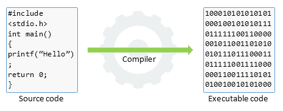
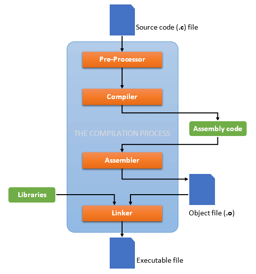

> reproduced: [The C compilation process - Codeforwin](https://codeforwin.org/2017/08/c-compilation-process.html#)

In the series of C tutorial we learned some basic of [C programming language](https://codeforwin.org/2017/08/introduction-c-programming.html), [configured C compiler](https://codeforwin.org/2017/08/setting-c-environment-lab.html) and learned to [compile and execute C program](https://codeforwin.org/2017/08/compile-c-program-using-command-line.html).

Since the compilation and execution of [first C program](https://codeforwin.org/2017/08/hello-world-program-c.html), I must answer few questions before moving ahead. Questions such as - what is meant by compilation, what happens during compilation, how a simple plain text file gets converted to executable binary file.

In this post I will take a deep dive into the C compilation process. So let's begin.

## What is meant by Compilation?

The process of translating source code written in [high level](https://codeforwin.org/2017/05/high-level-languages-advantages-disadvantages.html) to [low level](https://codeforwin.org/2017/05/low-level-languages-advantages-disadvantages.html) machine code is called as Compilation. The compilation is done by a special software known as [compiler](https://codeforwin.org/2017/05/compiler-and-its-need.html). The compiler checks source code for any syntactical or structural errors and generates object code with extension **.obj** (in Windows) or **.o** (in Linux) if source code is error free.

Source code and executable code

## The C compilation

The entire C compilation is broken to four stages.

1. [Pre-processing](https://codeforwin.org/2017/08/c-compilation-process.html#pre-processing)
2. [Compilation](https://codeforwin.org/2017/08/c-compilation-process.html#compilation-process)
3. [Assembling](https://codeforwin.org/2017/08/c-compilation-process.html#assembling) and
4. [Linking](https://codeforwin.org/2017/08/c-compilation-process.html#linking)

The below image describes the entire C compilation process.

The C compilation process

To take a deep dive inside the C compilation process let’s compile a C program. Write or copy below C program and save it as compilation.c.

```c
/* Learning C compilation process */
#include <stdio.h>

int main()
{
    printf("Learn at Codeforwin!");
    return 0;
}
```

To compile the above program open command prompt and hit below command.

```plain
gcc -save-temps compilation.c -o compilation
```

The `-save-temps` option will preserve and save all temporary files created during the C compilation. It will generate four files in the same directory namely.

```plain
- compilation.i   (Generated by pre-processor)
- compilation.s   (Generated by compiler)
- compilation.o   (Generated by assembler)
- compilation     (On Linux Generated by linker) or (compilation.exe On Windows)
```

Now lets look into these files and learn about different stages of compilation.

### Pre-processing of source file

The C compilation begins with pre-processing of source file. **Pre-processor** is a small software that accepts C source file and performs below tasks.

-   Remove comments from the source code.
-   Macro expansion.
-   Expansion of included header files.

After pre-processing it generates a temporary file with `.i` extension. Since, it inserts contents of header files to our source code file. Pre-processor generated file is larger than the original source file.

To view contents of the pre-processed file open `<file-name>.i` in your favourite text editor. As in our case below is an extract of compilation.i file.

```plain
# 1 "compilation.c"
# 1 ""
# 1 ""
# 1 "compilation.c"

# 1 "C:/Program Files (x86)/CodeBlocks/MinGW/include/stdio.h" 1 3
# 293 "C:/Program Files (x86)/CodeBlocks/MinGW/include/stdio.h" 3
 int __attribute__((__cdecl__)) __attribute__ ((__nothrow__)) fprintf (FILE*, const char*, ...);
 int __attribute__((__cdecl__)) __attribute__ ((__nothrow__)) printf (const char*, ...);
 int __attribute__((__cdecl__)) __attribute__ ((__nothrow__)) sprintf (char*, const char*, ...);

 int __attribute__((__cdecl__)) __attribute__ ((__nothrow__)) scanf (const char*, ...);
 int __attribute__((__cdecl__)) __attribute__ ((__nothrow__)) sscanf (const char*, const char*, ...);


...
...
...

 int __attribute__((__cdecl__)) __attribute__ ((__nothrow__)) putw (int, FILE*);
# 3 "compilation.c" 2

int main()
{
    printf("Learn at Codeforwin!");
    return 0;
}
```

You can notice that the statement `#include <stdio.h>` is replaced by its contents. Comment before the `#include` line is also trimmed.

### Compilation of pre-processed file

In next phase of C compilation the compiler comes in action. It accepts temporary pre-processed `<file-name>.i` file generated by the pre-processor and performs following tasks.

-   Check C program for [syntax errors](https://codeforwin.org/2015/05/introduction-to-programming-errors.html#compilation).
-   Translate the file into intermediate code i.e. in assembly language.
-   Optionally optimize the translated code for better performance.

After compiling it generates an intermediate code in assembly language as `<file-name.s>` file. It is assembly version of our source code.
Let us look into compilation.s file.

```plain
	.file	"compilation.c"
	.def	___main;	.scl	2;	.type	32;	.endef
	.section .rdata,"dr"
LC0:
	.ascii "Learn at Codeforwin!\0"
	.text
	.globl	_main
	.def	_main;	.scl	2;	.type	32;	.endef
_main:
	pushl	%ebp
	movl	%esp, %ebp
	andl	$-16, %esp
	subl	$16, %esp
	call	___main
	movl	$LC0, (%esp)
	call	_printf
	movl	$0, %eax
	leave
	ret
	.ident	"GCC: (tdm-1) 4.9.2"
	.def	_printf;	.scl	2;	.type	32;	.endef
```

### Assembling of compiled source code

Moving on to the next phase of compilation. Assembler accepts the compiled source code (**compilation.s**) and translates to low level machine code. After successful assembling it generates `<file-name.o>` (in Linux) or `<file-name.obj>` (in Windows) file known as [object file](https://codeforwin.org/2017/05/life-cycle-computer-program.html#object-code). In our case it generates the compilation.o file.

This file is encoded in low level machine language and cannot be viewed using text editors. However, if you still open this in notepad, it look like.

```plain
L     J       .text           $   Ü   ,           0`.data                               @ 0À.bss                                € 0À.rdata                            @ 0@/4                               @ 0@U‰åƒäðƒìè    Ç$    è    ¸    ÉÃLearn at Codeforwin!    GCC: (tdm-1) 4.9.2

           .file       þÿ  gcompilation.c     _main                            .text          !                .data                            .bss                             .rdata                                                         ___main          _printf             .rdata$zzz .rdata$zzz
```

### Linking of object files

Finally, the linker comes in action and performs the final task of compilation process. It accepts the intermediate file `<file-name.o>` generated by the assembler. It links all the function calls with their original definition. Which means the function `printf()` gets linked to its original definition.

Linker generates the final executable file (.exe in windows).

Huuhh, these all happens in a blink by a software known as `gcc`.
