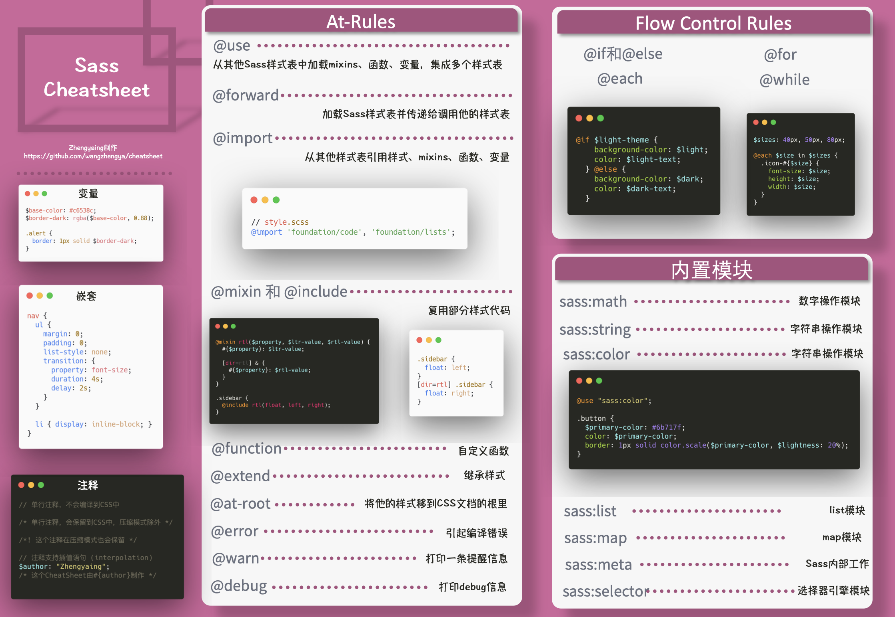

> 转载: [前端 Cheat Sheet 分享 | cheatsheet-frontend](http://zhengyaing.com/#)
> 转载: [AakashRao-dev/CSS-Cheatsheets: Get all of my CSS Cheatsheets from here which I have created & shared on twitter. Thanks for the support. 💜](https://github.com/AakashRao-dev/CSS-Cheatsheets)

## HTML Head

## HTML Input Types

## CSS Units

## CSS BoxModel

## CSS FlexBox

## CSS Grid

## CSS Selector

## CSS Transform

## CSS Animation

## CSS Functions

## CSS Filters

## Sass

## HTTP

## Console

## Regex

## Git

**本地操作**

`git add --patch -- file_name` 分段提交。

`git commit --amend` 修复提交上次提交的 message。

`git commit --amend --no-edit` 修复提交不更改上次提交的 message。

`git commit -a -m commit_message` 等价于 `git add + git commit`。

`git checkout --patch branch_name file_name` 取出指定分支文件和当前工作区做交互式比对。

**分支操作**

-   `git checkout -b branch_name` 根据当前分支创建新的分支并切换到新的分支，等价于 `git branch branch_name + git checkout branch_name`。
-   `git merge --abort` 取消 merge。

**远程操作**

-   `git push origin --delete branch_name` 删除远程分支。
-   `git push -u origin/branch_name` push 并绑定远程分支。

**回退**

- git reset [option] 版本号

    - git reset --mixed 688b4a 对归档区和缓存区回滚，工作区的改动还在，是 reset 的默认 option。
    - git reset --hard 688b4a 对归档区和缓存区以及工作区回滚。
    - git reset --soft 688b4a 对归档区回滚缓存区和工作区还在。
    - git reset --hard HEAD~1 回退到上一个提交。

- git revert  版本号

    删除中间的某个版本提交，但保留其后续提交，并且会生成一个新的提交。

    - git revert e6875c 
    - git revert HEAD
    - git revert -n `master~5..master~2`

- git reflog

  查看操作的记录，使用 git reset 之后想再撤回时可以使用 git reflog 查看之前的版本号。

**分支合并**

master branch: `git merge dev` 产生冲突。

1. git reset --hard dbced3f 回退到 merge 之前的状态。
2. git checkout dev 切换到 dev 分支。
3. git merge master 合并解决冲突然后 add，commit。
4. git checkout mater 切换到 master 分支。
5. git merge dev 在 master 合并 dev 分支。

## Markdown

