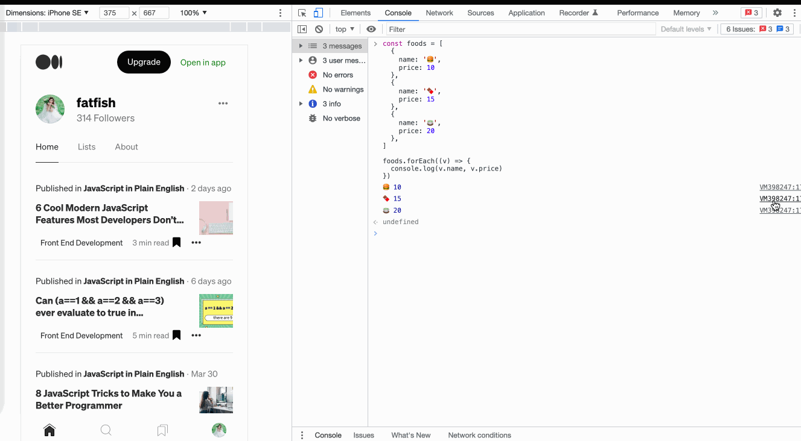
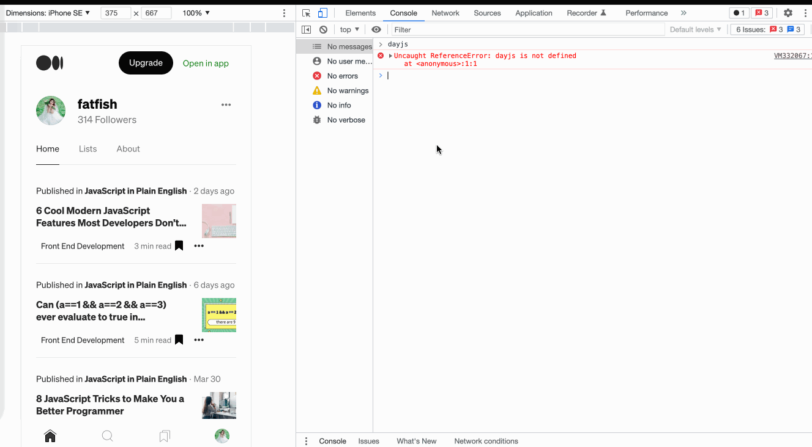
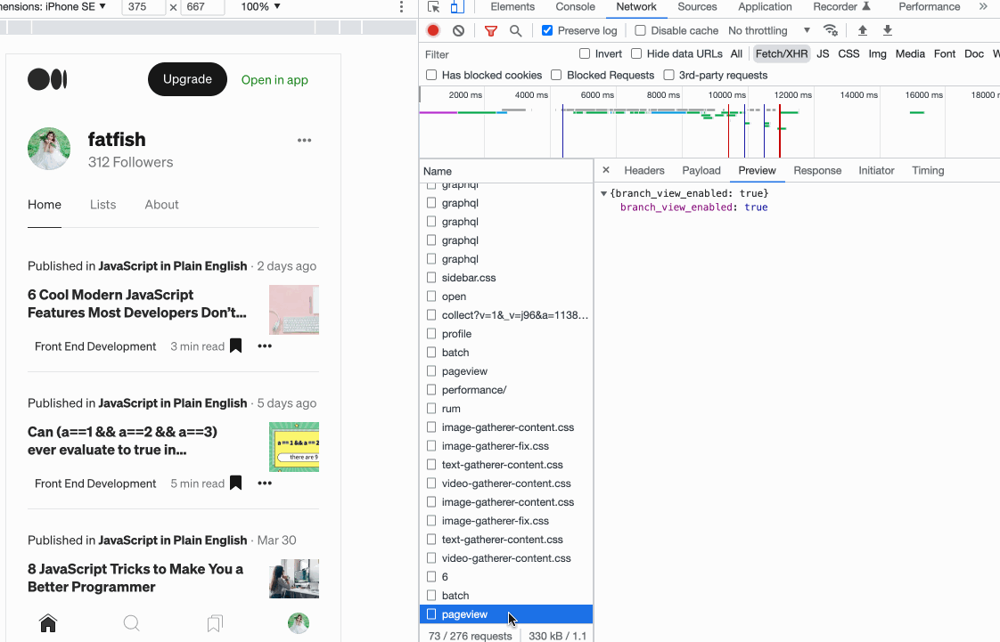
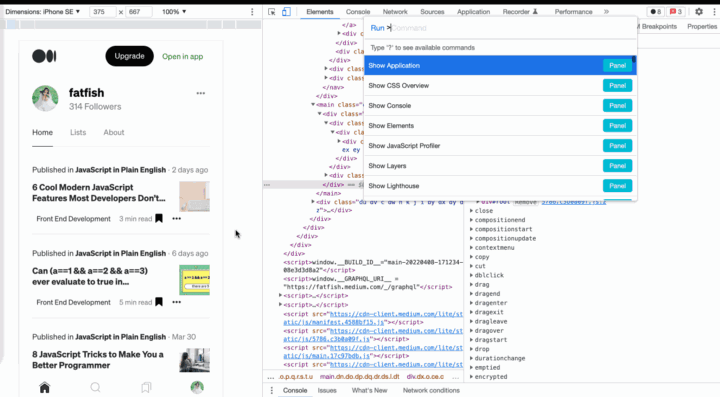
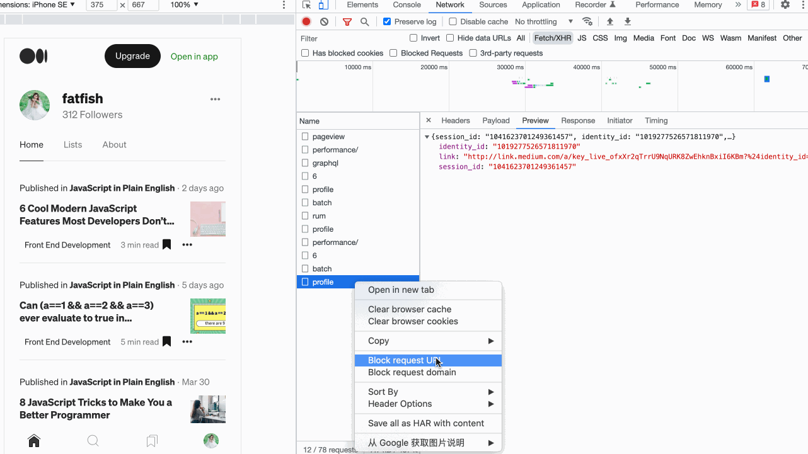
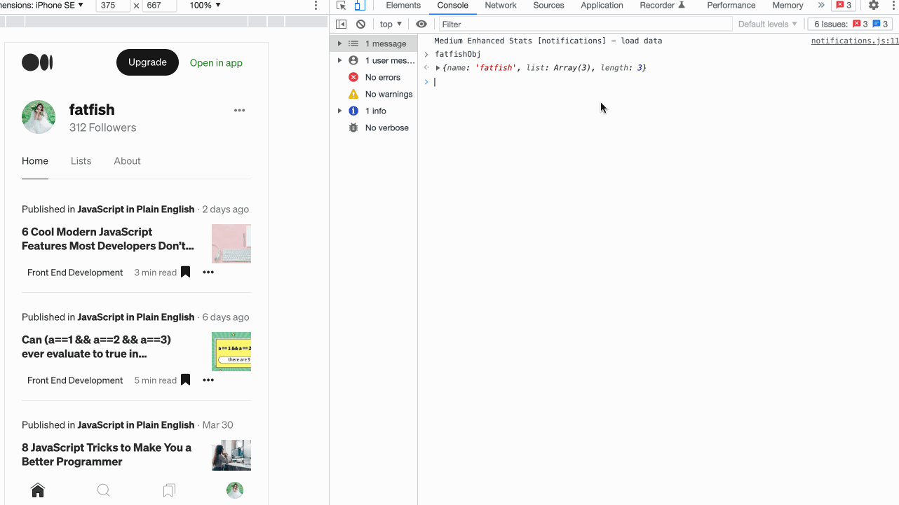
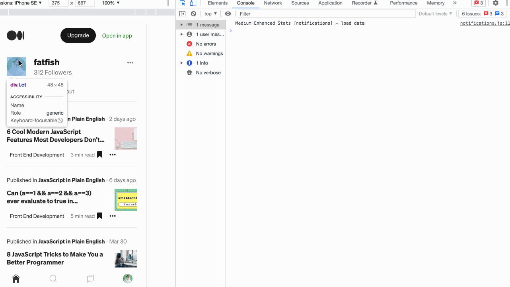
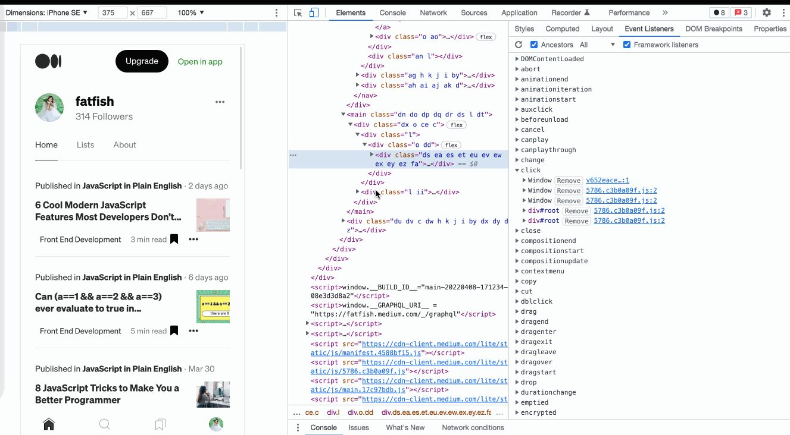
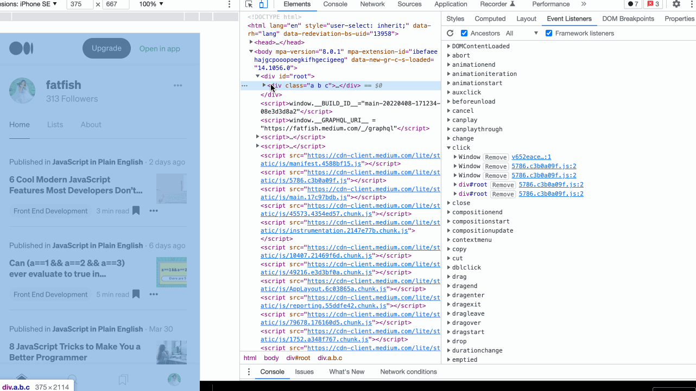
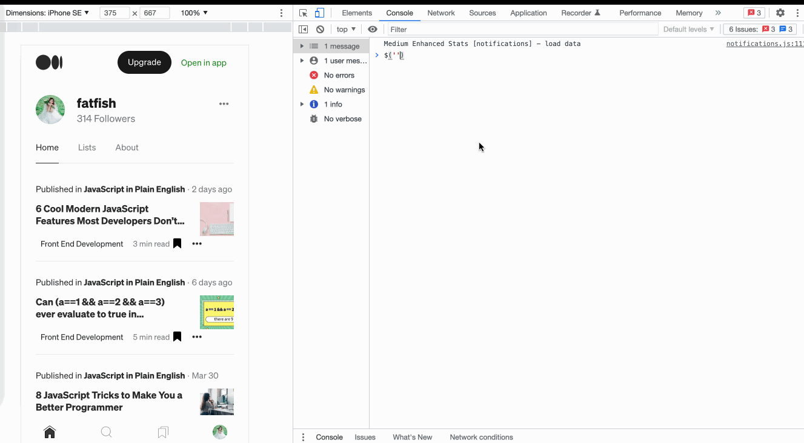

> 转载：[11 Cool Chrome Devtools Tips and Tricks I Wish I Knew already | JavaScript in Plain English](https://javascript.plainenglish.io/11-cool-chrome-devtools-tips-and-tricks-i-wish-i-knew-already-a9e2e078f78)

Chrome browser, as the closest partner of front-end developers, I believe you must be familiar with it. We can use it to view network requests, analyze web page performance, and debug the latest JavaScript features…

**In addition to these, it also provides many powerful but uncommon functions, which can greatly improve our development efficiency.**

**Let's have a look.**

# 1. Add conditional breakpoint

With the following code, we hope the name of the food is` 🍫` When the breakpoint is triggered, how can I do it?

```js
const foods = [
  {
    name: "🍔",
    price: 10,
  },
  {
    name: "🍫",
    price: 15,
  },
  {
    name: "🍵",
    price: 20,
  },
];
foods.forEach((v) => {
  // debugger
  console.log(v.name, v.price);
});
```

In the case of large amounts of data, using conditional breakpoints will be very helpful for development work and greatly improve efficiency.



# 2. Use `$I` to install the npm package on the console

Sometimes I want to use an `API` such as `dayjs` or `lodash`, but I don't want to go to the official website to check it. It would be nice if you can try it directly on the console.

1. Install the [Console Importer](https://chrome.google.com/webstore/detail/console-importer/hgajpakhafplebkdljleajgbpdmplhie/related) plugin
2. `$i('name')` install npm package



# 3. Resend XHR request

We often need to debug the interface with back-end developers in our work. Using this function can improve our docking efficiency.

**You just need to do these steps：**

1. Select the `Network` panel
2. Click `Fetch/XHR`
3. Select the request you want to resend
4. Right click and select `Replay XHR`



# 4. Quickly switch theme colors

Some people like the white theme of chrome, and some like black, we can use the shortcut keys to quickly switch between the two themes.

1. `cmd + shift + p` execute Command command
2. Enter "Switch to dark theme" or "Switch to light theme" to switch the theme



# 5. Quickly send requests in the console

For the same request, sometimes it is necessary to modify the input parameters and resend it. What is the shortcut?

**You just need to do these steps：**

1. Select the `Network` panel.
2. Click `Fetch/XHR`.
3. Select the request you want to resend.
4. Select the `Copy as fetch` panel.
5. Modify the input parameter and resend it.



# 6. Copy JavaScript Variables

How can we copy complex data to clipboard？

It's amazing. You can do it by using the `Copy` function provided by Chrome browser.



# 7. Get selected DOM element in console

When we select an element through the "Elements" panel, what should we do if we want to print some of its attributes through JavaScript, such as width, height, position, etc?

1. Select the DOM element through the `Elements panel`.
2. Use `$0` to access the element in the console.



# 8. Capture full-sized screenshots

If we want to take a screenshot of a page that is more than one screen, is there any good way?

The powerful Chrome browser can do this easily.

1. Prepare the content of the page you want to capture
2. `CMD + Shift + P` execute `Command`
3. Enter `Capture full size screenshot` and press enter

Wow, that's cool!!!

Now there's a new question. We just want to take a part of the screenshot page. What should we do?

It's also very easy, just enter "Capture node screenshot" in the third step.



# 9. Expand all child nodes

How do I expand all the child nodes of a DOM element at once? Not one by one?

You can use the key combination "Alt + click" in the "elements" panel to expand all child nodes at once.



# 10. Use "`$_`" to Reference the result of the last execution

Let's take a look at this scene, we have performed various operations on the string, and then we want to know the result of each step, what should we do?

```js
"fatfish".split("").reverse().join(""); // hsiftaf
```

**You might do something like this**

```js
// step 1
"fatfish"
  .split("") // ['f', 'a', 't', 'f', 'i', 's', 'h']
  [
    // step 2
    ("f", "a", "t", "f", "i", "s", "h")
  ].reverse() // ['h', 's', 'i', 'f', 't', 'a', 'f']
  [
    // step 3
    ("h", "s", "i", "f", "t", "a", "f")
  ].join(""); // hsiftaf
```

**An easier way**

Use "$\_" Get the result of the last operation without copying it every time.

```js
// step 1
"fatfish".split(""); // ['f', 'a', 't', 'f', 'i', 's', 'h']
// step 2
$_.reverse(); // ['h', 's', 'i', 'f', 't', 'a', 'f']
// step 3
$_.join(""); // hsiftaf
```

# 11. Use "`$`" And "`$$`" to select DOM elements quickly

Using `document.querySelector` and `document.querySelectorAll` to select elements of the current page in the console is the most common requirement, but it is a bit too long, we can use `$` and `$$` instead.


