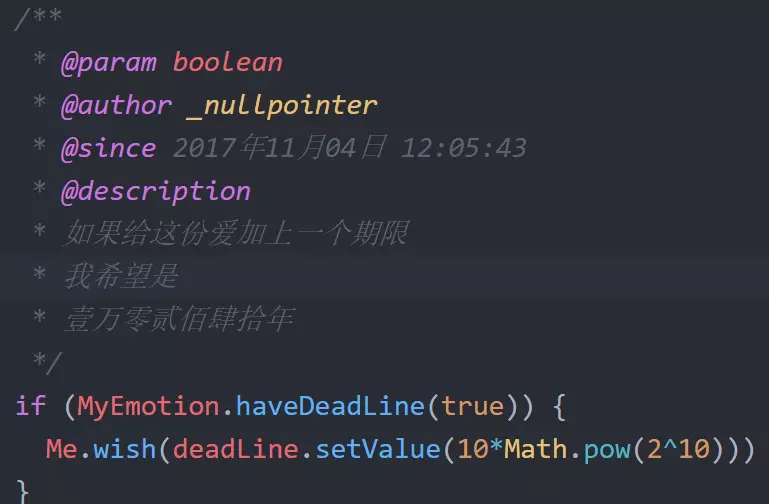
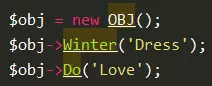
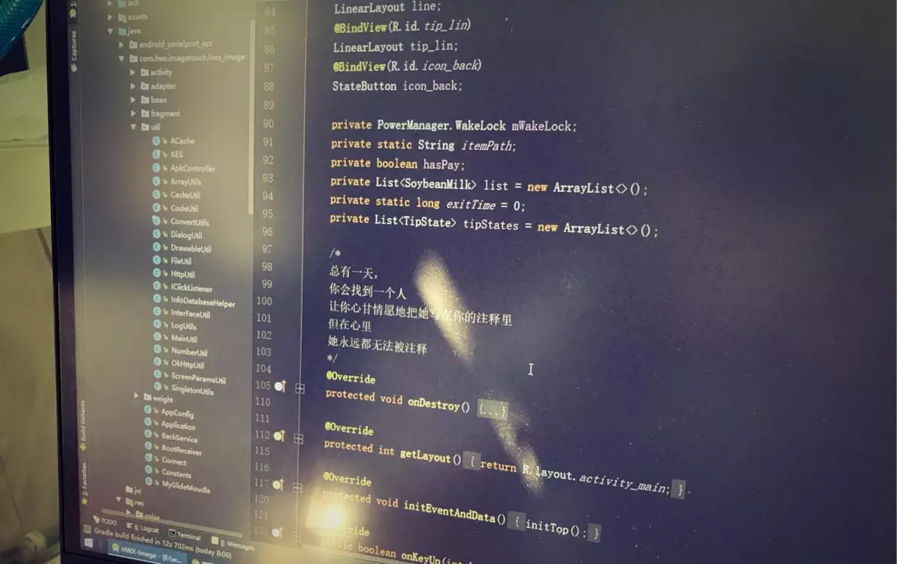
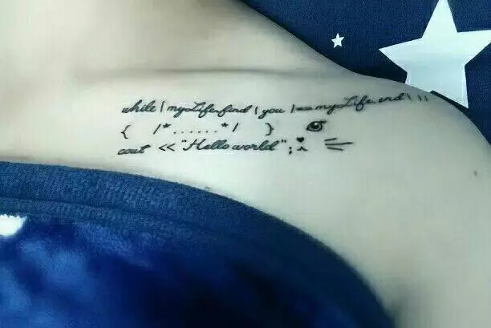

> 转载: [程序员代码情诗收录 - 简书](https://www.jianshu.com/p/76953113cf1b)

### 1.先向大佬低头

```php
/**
 * I love three things in this world.Sun, moon and you. Sun for morning, moon
 * for night, and you forever.
 */
class LoveThreeThings extends Me
{
    const loveFirstThings  = 'Sun';
    const loveSecondThings = 'Moon';
    const loveThirdThings  = 'You';

    public function MyLove()
    {
        return 'I Love' . self::loveThirdThings . 'forever. Never change!';
    }
}
```

作者链接：[http://www.jianshu.com/p/b226df2550f6](https://www.jianshu.com/p/b226df2550f6)

### 2.百年好合

```python
while('ILoveyou'):
    for IBeWithYou in range(0, 50*365):
        time.sleep(60*60*24)
//程序能一直执行，执行完50年，若我们还有50年，余生继续。
//从前的日色变得很慢
//车马邮件都慢
//一生只够爱一人
```

作者链接：[http://www.jianshu.com/p/f1c874b0731f](https://www.jianshu.com/p/f1c874b0731f)

### 3.古语代码你怕不怕

```cpp
girl.collectWormwood(true);
me.meetEveryday(false);
oneDay = oneAutumn *3;
//彼采萧兮，一日不见，如三秋兮。
```

作者链接：[http://www.jianshu.com/p/198b8e2d6820](https://www.jianshu.com/p/198b8e2d6820)

### 4.我特么怕

```python
for live in [生，死]：
    live.with(you).

myhand.have(youhand).goto(old).

// 死生契阔，与子成说；执子之手，与子偕老。
```

作者链接：[http://www.jianshu.com/p/325ebcbadcdb](https://www.jianshu.com/p/325ebcbadcdb)

### 5.你这该死的温柔

```c#
world.controlledBy(NoOne)
withMyGentle() {
    you.control(me).equals(true)
}
//谁都不能掌控全世界，但你至少可以掌控我，这是我的温柔
```

作者链接：[http://www.jianshu.com/p/5c845090d0a6](https://www.jianshu.com/p/5c845090d0a6)

### 6.同行的代码可以说是很认真啦

```c#
I *i = [I new];
[i Get:@"愿" Person:@"得" Heart:@"一人❤️"];
[i Never:@"白首" Be:@"不" Apart:@"分离"];
```

作者链接：[http://www.jianshu.com/p/7163ea70c238](https://www.jianshu.com/p/7163ea70c238)

### 7.若爱,请深爱, 如弃,请彻底, 不要暧昧,伤人伤己

```cpp
if(love==1)  {
    while(1) {love_depth ++;}
}
//若爱，请深爱 。
```

作者链接：[http://www.jianshu.com/p/f2b80291c751](https://www.jianshu.com/p/f2b80291c751)

### 8.没错，凑了个整



注释不算，代码三行

作者链接：[http://www.jianshu.com/p/afe9eb48e301](https://www.jianshu.com/p/afe9eb48e301)

### 9. 这就是你冬天把你冰冷的手放在我脸上取暖的理由？

```kotlin
if(you.hand==cold&&weather==winter)    //如果冬天里你的手是冰冷的

giveyoulove(myhand.temp,yourhand.temp);    //将我手上的温度全部给予你

return you.happyface;     //换取你幸福的脸庞
```

作者链接：[http://www.jianshu.com/p/5fac1053c0dc](https://www.jianshu.com/p/5fac1053c0dc)

### 10.我觉得你差不多找到了

```dart
/**
 * 我一直在找你
 * 当我找到你
 * 也就找到了整个世界
 */
while (i.findYou()) {
      if (i.get() == you) {
          System.out.print("Hello,Word!");
      }
 }
```

作者链接：[http://www.jianshu.com/p/3c4bd6eb4bfa](https://www.jianshu.com/p/3c4bd6eb4bfa)

### 11.你已经找到了

```php
<?php

/**
 * 我一直在寻找
 * 找到了你
 * 便找到了整个世界
 * @author unknown
 **/

while (me->find()) {
    if (me->meet() == your->self()) {
        print("Hello,World!");
    }
}
?>
```

作者链接：[http://www.jianshu.com/p/a95d4efc8cce](https://www.jianshu.com/p/a95d4efc8cce)

### 12.是一个小姐姐哦

```c#
BoyFriend 小哥哥  =  new BoyFriend（）;

小哥哥.add（"不如私聊小姐姐。。。"）;

小哥哥.add（"教小姐姐小米推送。。"）;
```

小姐姐链接：[http://www.jianshu.com/p/02bac047b6fe](https://www.jianshu.com/p/02bac047b6fe)

### 13.emmmm...



作者链接：[http://www.jianshu.com/p/79eb8b7e5eaf](https://www.jianshu.com/p/79eb8b7e5eaf)

### 14.这么简单的代码，打出这么牛逼的注释也是没谁了

```java
/**
 * @author 文艺范码农
 * @description 代码情诗
 * @date 2017年11月7日
 */
private void love(int you) {
    int i = you;         //一见钟情
    you = i;             //相濡以沫
    if(i==you) {         //不忘初心
        love(1);         //真爱永恒
    }
}
```

作者链接：[http://www.jianshu.com/p/fd099f1a33f2](https://www.jianshu.com/p/fd099f1a33f2)

### 15.best wishes for everyOne

```kotlin
if(you love me && I love you){ // 如果彼此相爱
       this.liveToOld();// 那就白头偕老
}else{// 否则
       this.bestWishesToYou(); // 祝你一切安好
}
```

作者链接：[http://www.jianshu.com/p/a570de564385](https://www.jianshu.com/p/a570de564385)

### 16.最烦的就是这种人，代码情诗，一句有用代码都没有，哇啦哇啦写一堆注释，看的老子眼泪都止不住



作者链接：

### 17.我敢打赌，你们肯定毫不犹豫的马上会点击以下小姐姐的传送门

```c#
[Mountains delete edges];

[heaven stringByAppendingString earth];

[We separate];

//山无棱，天地合，乃敢与君绝
```

小姐姐传送门：[http://www.jianshu.com/p/a1fc757ea975](https://www.jianshu.com/p/a1fc757ea975)

### 18.小姐姐最浪漫的承诺

```go
StringBuilder love=newStringBuilder("");

for(;;)

love.append(Math.random()>0.5?1:0);

//陪伴是最长情的告白。

//最浪漫的事，就是和你一起慢慢变老。
```

小姐姐传送门：[http://www.jianshu.com/p/3462e717762f](https://www.jianshu.com/p/3462e717762f)

### 19.这个纹身就很有灵性了

```cpp
while(mylife.find(you) == mylife.end())
{/* …… */}
cout<< "Hello world"
```


