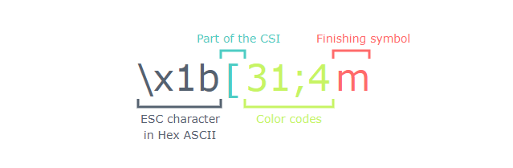
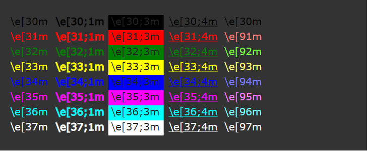

> 转载: [Jafrog's dev blog](http://jafrog.com/2013/11/23/colors-in-terminal.html)

## Colors In Terminal

If you use terminal on a daily basis I bet you played with some color settings at least once. Colorizing `ls` output, shell prompt, `git` logs - those are very common tasks. And it’s not surprising as color helps us parse information faster, pay attention to important parts and generally makes things prettier. Everybody loves pretty things, especially the ones you have to look at every day.

This post is an attempt to gather in one place and structure things I know about colors in terminal.

### Escape sequences

You’ve probably seen things like `\e[32m` or `\x1b[1;31m`. These are [ANSI escape codes](http://en.wikipedia.org/wiki/ANSI_escape_code) used for defining a color. All ANSI escape sequences start with, well, `ESC`. There’re several ways of encoding an `ESC`:

| Shell     | `\e`    |
| :-------- | ------- |
| ASCII Hex | `\0x1B` |
| ASCII Oct | `\033`  |

So `\x1b[31;4m`, `\e[31;4m` and `\033[31;4m` are different ways to write the same sequence. Let’s look at the structure of this sequence.



`\x1b[` is a **Control Sequence Introducer** that consists of hexadecimal ASCII `ESC` character code and a `[`.

`31;4` is a list of instructions separated by `;`. Usually this list is formatted as follows:

`[<PREFIX>];[<COLOR>];[<TEXT DECORATION>]`

For example `31;4` means “no prefix, color - red, underline”. `<PREFIX>` is used for 256 color mode. More on color modes later.

Finally `m` indicates the end of control sequence so terminal would know not to interpret text after `m` as a color code.

The following command should print “hello” in red underscore text:

```
> echo "\x1b[31;4mHello\x1b[0m"
```

at git bash

```
echo -e "\e[31;4mHello\e[0m"
```

`\x1b[0m` means “reset all attributes”.

### Color codes

Back in the old days terminals were different. Some of them could display only 16 colors and some of them went as far as 256. Now you probably work with a terminal emulator that runs on a machine that could display [more than 16 million colors](http://en.wikipedia.org/wiki/List_of_monochrome_and_RGB_palettes#24-bit_RGB). But as terminal applications emulate older terminals, they usually support far less colors. For example a terminal app could be set up with 16 colors support or 256 colors support. The exact values of those colors depend on a terminal’s settings.

To list all available colors in 16-color mode run:

```shell
> for code in {30..37}; do \
echo -en "\e[${code}m"'\\e['"$code"'m'"\e[0m"; \
echo -en "  \e[$code;1m"'\\e['"$code"';1m'"\e[0m"; \
echo -en "  \e[$code;3m"'\\e['"$code"';3m'"\e[0m"; \
echo -en "  \e[$code;4m"'\\e['"$code"';4m'"\e[0m"; \
echo -e "  \e[$((code+60))m"'\\e['"$((code+60))"'m'"\e[0m"; \
done
```

You should see something like this:



Or, in fact, something completely different! You can set up red to look like blue but I wouldn’t recommend such a deception as it probably mess up some color themes in `bash`, `zsh` or anything else that runs in a terminal.

As you can see from command’s output there’re several sets of color codes:

| Basic 8 colors               | 30..37 |
| :--------------------------- | ------ |
| Basic "high contrast" colors | 90..97 |
| xterm-256 colors             | 0..255 |

And a set of text decoration indicators that should be placed right after the color code:

| Bold       | 1   |
| :--------- | --- |
| Underscore | 4   |
| Background | 3   |

If color code is prefixed by `38;5` it is interpreted as one of 256 colors. E.g. `\e[38;5;91m` will color following text purple, while `\e[91m` will indicate bright red.

There’re several 256 color palettes out there. For example, a couple of the popular ones are [Web safe colors](http://en.wikipedia.org/wiki/Web_colors#Web-safe_colors) and [X11 colors](http://en.wikipedia.org/wiki/X11_color_names). And though they’re both include 256 colors, they’re two different palettes!

To enable 256 colors support, you have to set up your terminal as `xterm-256color` (in `iTerm2` go to **Preferences** > **Profiles** > **Terminal** > **Report Terminal Type** and put `xterm-256color` into the field). The set of colors you’ll get is [xterm-256 pallete](http://en.wikipedia.org/wiki/File:Xterm_256color_chart.svg). In some places, like Mac OSX default color picker, this palette is called “emacs”, though it doesn’t have anything to do with Emacs.

To list all colors available in 256 color mode with their codes run

```shell
> for code in {0..255}
    do echo -e "\e[38;5;${code}m"'\\e[38;5;'"$code"m"\e[0m"
  done
```

**Bonus**: To list all colors available in `Emacs` run `M-x list-colors-display`.
