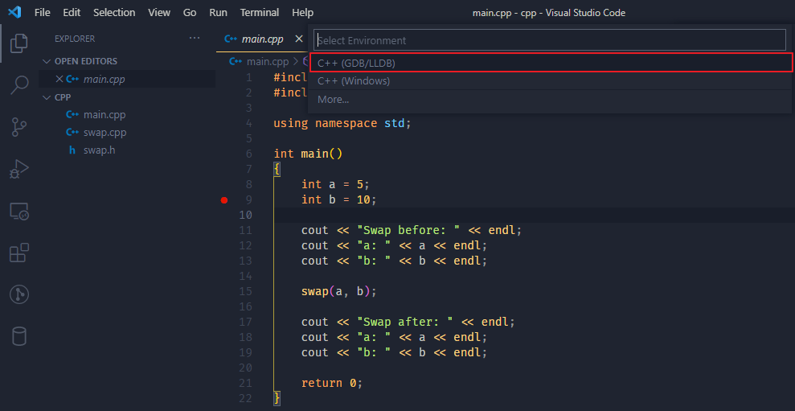
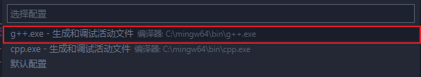
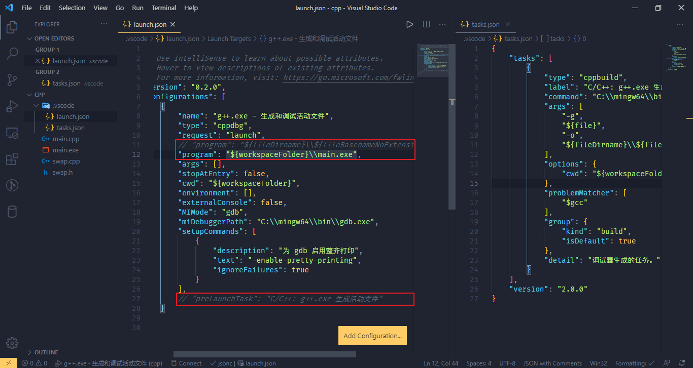
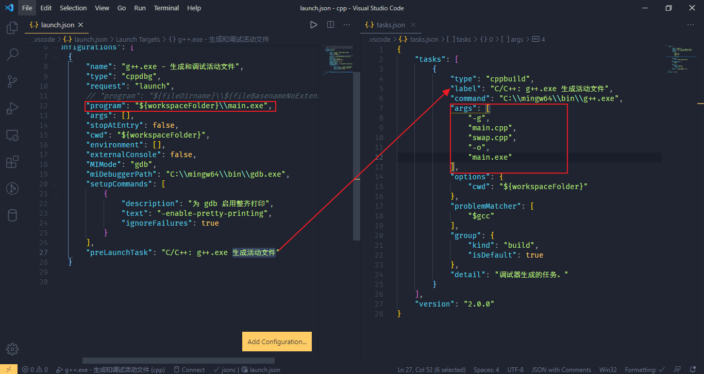
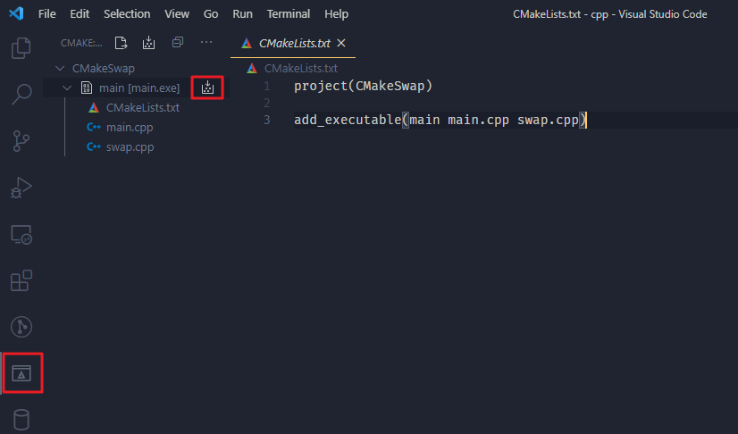
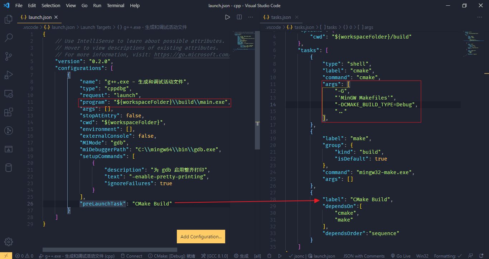
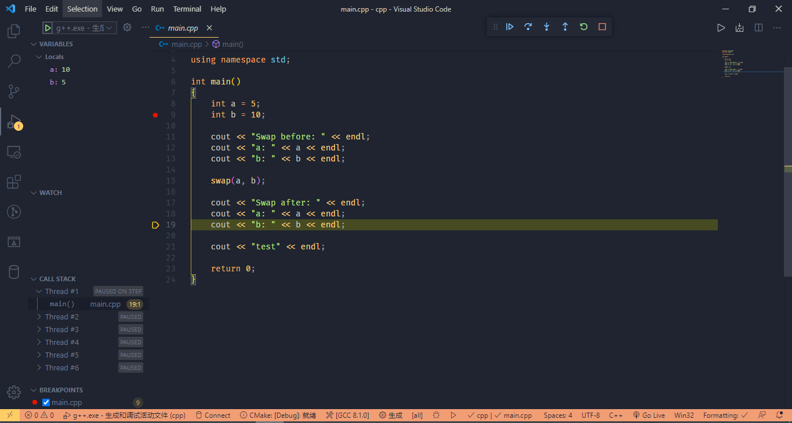

### Sorce Files

swap.h

```c++
void swap(int &a, int &b);
```

swap.cpp

```c++
#include "swap.h"

void swap(int &a, int &b)
{
    (a ^= b), (b ^= a), (a ^= b);
}
```

main.cpp

```c++
#include <iostream>
#include "swap.h"

using namespace std;

int main()
{
    int a = 5;
    int b = 10;

    cout << "Swap before: " << endl;
    cout << "a: " << a << endl;
    cout << "b: " << b << endl;

    swap(a, b);

    cout << "Swap after: " << endl;
    cout << "a: " << a << endl;
    cout << "b: " << b << endl;

    return 0;
}
```

### g++ compile

`g++ -g main.cpp swap.cpp -o main`

`-g` 表示保留 gdb 调试信息, 如果不加没办法调试。

```shell
11435@11435-NB1 MINGW64 /d/study/vscode/cpp
$ g++ -g main.cpp swap.cpp -o main

11435@11435-NB1 MINGW64 /d/study/vscode/cpp
$ ./main.exe
Swap before:
a: 5
b: 10
Swap after:
a: 10
b: 5
```

### g++ compile debug

F5 启动调试

Enviroment 选择 C++ (GDB/LLDB)。

编译器配置选择 g++。





修改 launch.json 的 program 指向 g++ compile 生成的 main.exe。

注释 preLaunchTask（在 lanuch 之前运行 tasks 中定义的任务), 默认生成的 task 只能编译单文件。

重新按 F5 或者左侧 Debug 按钮启动调试。



### tasks.json setting g++ compile

配置 launch.json 和 tasks.json , 按 F5 或者左侧 Debug 按钮启动调试。



### CMake compile

安装 CMake 工具

在项目的根目录下创建 CMakeLists.txt

```cmake
project(CMakeSwap)

add_executable(main main.cpp swap.cpp)
```

#### Manual Compile

`cmake -G "MinGW Makefiles" -DCMAKE_BUILD_TYPE=Debug .. `

`-G <generator-name> = Specify a build system generator.` Window 默认是 Visual Studio, 这里指定为 MinGW

`-DCMAKE_BUILD_TYPE=Debug` 指定模式为调试模式，也可以指定为 Release

`..` 表示 CMakeLists.txt 在上层目录

```powershell
11435@11435-NB1 MINGW64 /d/study/vscode/cpp
$ mkdir build && cd build

11435@11435-NB1 MINGW64 /d/study/vscode/cpp/build
$ cmake -G "MinGW Makefiles" ..
-- The C compiler identification is GNU 8.1.0
-- The CXX compiler identification is GNU 8.1.0
-- Detecting C compiler ABI info
-- Detecting C compiler ABI info - done
-- Check for working C compiler: C:/mingw64/bin/gcc.exe - skipped
-- Detecting C compile features
-- Detecting C compile features - done
-- Detecting CXX compiler ABI info
-- Detecting CXX compiler ABI info - done
-- Check for working CXX compiler: C:/mingw64/bin/g++.exe - skipped
-- Detecting CXX compile features
-- Detecting CXX compile features - done
-- Configuring done
-- Generating done
-- Build files have been written to: D:/study/vscode/cpp/build

11435@11435-NB1 MINGW64 /d/study/vscode/cpp/build
$ mingw32-make.exe
Scanning dependencies of target main
[ 33%] Building CXX object CMakeFiles/main.dir/main.cpp.obj
[ 66%] Building CXX object CMakeFiles/main.dir/swap.cpp.obj
[100%] Linking CXX executable main.exe
[100%] Built target main

11435@11435-NB1 MINGW64 /d/study/vscode/cpp/build
$ ./main.exe
Swap before:
a: 5
b: 10
Swap after:
a: 10
b: 5
```

#### Plugin Compile

安装 VSCode CMake 插件， Ctrl + Shift + P 选择 CMake Configure 配置 MinGW 编译。

Ctrl + S 保存 CMakeLists.txt 会配置项目生成 build 目录和内容，cd 到 build 目录执行 mingw32-make.exe 。

之后文件变动点击左侧 Buid 按钮，然后执行 mingw32-make.exe 即可。



### tasks.json setting CMake compile



tasks.json

```json
{
    "version": "2.0.0",
    "options": {
        "cwd": "${workspaceFolder}/build"
    },
    "tasks": [
        {
            "type": "shell",
            "label": "cmake",
            "command": "cmake",
            "args": [
                "-G",
                "'MinGW Makefiles'",
                "-DCMAKE_BUILD_TYPE=Debug",
                ".."
            ]
        },
        {
            "label": "make",
            "group": {
                "kind": "build",
                "isDefault": true
            },
            "command": "mingw32-make.exe",
            "args": []
        },
        {
            "label": "CMake Build",
            "dependsOn": ["cmake", "make"],
            "dependsOrder": "sequence"
        }
    ]
}
```

按 F5 调试


