> 转载: [C#中 Thread，Task，Async/Await，IAsyncResult 的那些事儿！ - Mr 靖 - 博客园](https://www.cnblogs.com/doforfuture/p/6293926.html)

说起异步，Thread，Task，async/await，IAsyncResult 这些东西肯定是绕不开的，今天就来依次聊聊他们

### 1.线程（Thread）

多线程的意义在于一个应用程序中，有多个执行部分可以同时执行；对于比较耗时的操作(例如 io，数据库操作)，或者等待响应(如 WCF 通信)的操作，可以单独开启后台线程来执行，这样主线程就不会阻塞，可以继续往下执行；等到后台线程执行完毕，再通知主线程，然后做出对应操作！

在 C#中开启新线程比较简单

```c#
static void Main(string[] args)
{
    Console.WriteLine("主线程开始");
    //IsBackground=true，将其设置为后台线程
    Thread t = new Thread(Run) { IsBackground = true };
    t.Start();　　 Console.WriteLine("主线程在做其他的事！");
    //主线程结束，后台线程会自动结束，不管有没有执行完成
    //Thread.Sleep(300);
    Thread.Sleep(1500);
    Console.WriteLine("主线程结束");
}
static void Run()
{
    Thread.Sleep(700);
    Console.WriteLine("这是后台线程调用");
}
```

执行结果如下图，

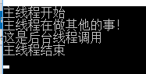

可以看到在启动后台线程之后，主线程继续往下执行了，并没有等到后台线程执行完之后。

#### 1.1 线程池

试想一下，如果有大量的任务需要处理，例如网站后台对于 HTTP 请求的处理，那是不是要对每一个请求创建一个后台线程呢？显然不合适，这会占用大量内存，而且频繁地创建的过程也会严重影响速度，那怎么办呢？线程池就是为了解决这一问题，把创建的线程存起来，形成一个线程池(里面有多个线程)，当要处理任务时，若线程池中有空闲线程(前一个任务执行完成后，线程不会被回收，会被设置为空闲状态)，则直接调用线程池中的线程执行(例 asp.net 处理机制中的 Application 对象)，

使用事例：

```c#
for (int i = 0; i < 10; i++)
{
    ThreadPool.QueueUserWorkItem(m =>
    {
        Console.WriteLine(Thread.CurrentThread.ManagedThreadId.ToString());
    });
}
Console.Read();
```

运行结果：

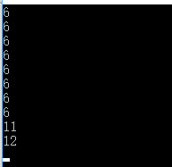

可以看到，虽然执行了 10 次，但并没有创建 10 个线程。

#### 1.2 信号量(Semaphore)

Semaphore 负责协调线程，可以限制对某一资源访问的线程数量

这里对 SemaphoreSlim 类的用法做一个简单的事例：

```c#
static SemaphoreSlim semLim = new SemaphoreSlim(3); //3表示最多只能有三个线程同时访问
static void Main(string[] args)
{
    for (int i = 0; i < 10; i++)
    {
        new Thread(SemaphoreTest).Start();
    }
    Console.Read();
}
static void SemaphoreTest()
{
    semLim.Wait();
    Console.WriteLine("线程" + Thread.CurrentThread.ManagedThreadId.ToString() + "开始执行");
    Thread.Sleep(2000);
    Console.WriteLine("线程" + Thread.CurrentThread.ManagedThreadId.ToString() + "执行完毕");
    semLim.Release();
}
```

执行结果如下：

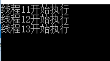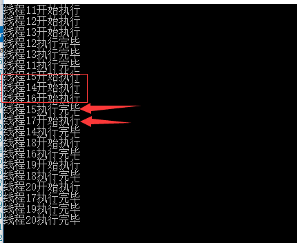

可以看到，刚开始只有三个线程在执行，当一个线程执行完毕并释放之后，才会有新的线程来执行方法！

除了 SemaphoreSlim 类，还可以使用 Semaphore 类，感觉更加灵活，感兴趣的话可以搜一下，这里就不做演示了！

### 2.Task

Task 是.NET4.0 加入的，跟线程池 ThreadPool 的功能类似，用 Task 开启新任务时，会从线程池中调用线程，而 Thread 每次实例化都会创建一个新的线程。

```c#
Console.WriteLine("主线程启动");
//Task.Run启动一个线程
//Task启动的是后台线程，要在主线程中等待后台线程执行完毕，可以调用Wait方法
//Task task = Task.Factory.StartNew(() => { Thread.Sleep(1500); Console.WriteLine("task启动"); });
Task task = Task.Run(() => {
    Thread.Sleep(1500);
    Console.WriteLine("task启动");
});
Thread.Sleep(300);
task.Wait();
Console.WriteLine("主线程结束");
```

执行结果如下：

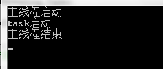

开启新任务的方法：Task.Run()或者 Task.Factory.StartNew()，开启的是后台线程

要在主线程中等待后台线程执行完毕，可以使用 Wait 方法(会以同步的方式来执行)。不用 Wait 则会以异步的方式来执行。

比较一下 Task 和 Thread：

```c#
static void Main(string[] args)
{
    for (int i = 0; i < 5; i++)
    {
        new Thread(Run1).Start();
    }
    for (int i = 0; i < 5; i++)
    {
        Task.Run(() => { Run2(); });
    }
}
static void Run1()
{
    Console.WriteLine("Thread Id =" + Thread.CurrentThread.ManagedThreadId);
}
static void Run2()
{
    Console.WriteLine("Task调用的Thread Id =" + Thread.CurrentThread.ManagedThreadId);
}
```

执行结果：

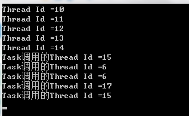

可以看出来，直接用 Thread 会开启 5 个线程，用 Task(用了线程池)开启了 3 个！

#### 2.1 Task\<TResult\>

Task<TResult>就是有返回值的 Task，TResult 就是返回值类型。

```c#
Console.WriteLine("主线程开始");
//返回值类型为string
Task<string> task = Task<string>.Run(() => {
    Thread.Sleep(2000);
    return Thread.CurrentThread.ManagedThreadId.ToString();
});
//会等到task执行完毕才会输出;
Console.WriteLine(task.Result);
Console.WriteLine("主线程结束");
```

运行结果：


通过 task.Result 可以取到返回值，若取值的时候，后台线程还没执行完，则会等待其执行完毕！

简单提一下：

Task 任务可以通过 CancellationTokenSource 类来取消，感觉用得不多，用法比较简单，感兴趣的话可以搜一下！

### 3. async/await

async/await 是 C#5.0 中推出的，先上用法：

```c#
static void Main(string[] args)
{
    Console.WriteLine("-------主线程启动-------");
    Task<int> task = GetStrLengthAsync();
    Console.WriteLine("主线程继续执行");
    Console.WriteLine("Task返回的值" + task.Result);
    Console.WriteLine("-------主线程结束-------");
}

static async Task<int> GetStrLengthAsync()
{
    Console.WriteLine("GetStrLengthAsync方法开始执行");
    //此处返回的<string>中的字符串类型，而不是Task<string>
    string str = await GetString();
    Console.WriteLine("GetStrLengthAsync方法执行结束");
    return str.Length;
}

static Task<string> GetString()
{　　 //Console.WriteLine("GetString方法开始执行")
    return Task<string>.Run(() =>
    {
        Thread.Sleep(2000);
        return "GetString的返回值";
    });
}
```

async 用来修饰方法，表明这个方法是异步的，声明的方法的返回类型必须为：void，Task 或 Task<TResult>。

await 必须用来修饰 Task 或 Task<TResult>，而且只能出现在已经用 async 关键字修饰的异步方法中。通常情况下，async/await 成对出现才有意义，

看看运行结果：

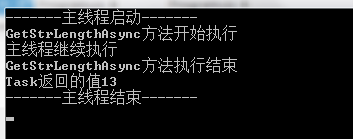

可以看出来，main 函数调用 GetStrLengthAsync 方法后，在 await 之前，都是同步执行的，直到遇到 await 关键字，main 函数才返回继续执行。

那么是否是在遇到 await 关键字的时候程序自动开启了一个后台线程去执行 GetString 方法呢？

现在把 GetString 方法中的那行注释加上，运行的结果是：

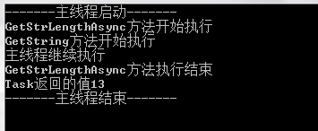

大家可以看到，在遇到 await 关键字后，没有继续执行 GetStrLengthAsync 方法后面的操作，也没有马上反回到 main 函数中，而是执行了 GetString 的第一行，以此可以判断 await 这里并没有开启新的线程去执行 GetString 方法，而是以同步的方式让 GetString 方法执行，等到执行到 GetString 方法中的 Task<string>.Run()的时候才由 Task 开启了后台线程！

那么 await 的作用是什么呢？

可以从字面上理解，上面提到 task.wait 可以让主线程等待后台线程执行完毕，await 和 wait 类似，同样是等待，等待 Task<string>.Run()开始的后台线程执行完毕，不同的是 await 不会阻塞主线程，只会让 GetStrLengthAsync 方法暂停执行。

那么 await 是怎么做到的呢？有没有开启新线程去等待？

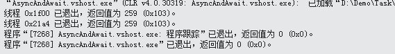

只有两个线程(主线程和 Task 开启的线程)！至于怎么做到的(我也不知道......>\_<)，大家有兴趣的话研究下吧！

### 4.IAsyncResult

IAsyncResult 自.NET1.1 起就有了，包含可异步操作的方法的类需要实现它，Task 类就实现了该接口


在不借助于 Task 的情况下怎么实现异步呢？

```c#
class Program
{
    static void Main(string[] args)
    {
        Console.WriteLine("主程序开始--------------------");
        int threadId;
        AsyncDemo ad = new AsyncDemo();
        AsyncMethodCaller caller = new AsyncMethodCaller(ad.TestMethod);

        IAsyncResult result = caller.BeginInvoke(3000,out threadId, null, null);
        Thread.Sleep(0);
        Console.WriteLine("主线程线程 {0} 正在运行.",Thread.CurrentThread.ManagedThreadId)
        //会阻塞线程，直到后台线程执行完毕之后，才会往下执行
        result.AsyncWaitHandle.WaitOne();
        Console.WriteLine("主程序在做一些事情！！！");
        //获取异步执行的结果
        string returnValue = caller.EndInvoke(out threadId, result);
        //释放资源
        result.AsyncWaitHandle.Close();
        Console.WriteLine("主程序结束--------------------");
        Console.Read();
    }
}
public class AsyncDemo
{
    //供后台线程执行的方法
    public string TestMethod(int callDuration, out int threadId)
    {
        Console.WriteLine("测试方法开始执行.");
        Thread.Sleep(callDuration);
        threadId = Thread.CurrentThread.ManagedThreadId;
        return String.Format("测试方法执行的时间 {0}.", callDuration.ToString());
    }
}
public delegate string AsyncMethodCaller(int callDuration, out int threadId);
```

关键步骤就是红色字体的部分，运行结果：


和 Task 的用法差异不是很大！result.AsyncWaitHandle.WaitOne()就类似 Task 的 Wait。

### 5.Parallel

最后说一下在循环中开启多线程的简单方法：

```c#
Stopwatch watch1 = new Stopwatch();
watch1.Start();
for (int i = 1; i <= 10; i++)
{
    Console.Write(i + ",");
    Thread.Sleep(1000);
}
watch1.Stop();
Console.WriteLine(watch1.Elapsed);

Stopwatch watch2 = new Stopwatch();
watch2.Start();

//会调用线程池中的线程
Parallel.For(1, 11, i =>
{
    Console.WriteLine(i + ",线程ID:" + Thread.CurrentThread.ManagedThreadId);
    Thread.Sleep(1000);
});
watch2.Stop();
Console.WriteLine(watch2.Elapsed);
```

运行结果：

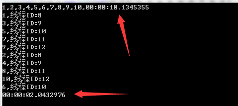

循环 List<T>：

```c#
List<int> list = new List<int>() { 1, 2, 3, 4, 5, 6, 6, 7, 8, 9 };Parallel.ForEach<int>(list, n =>
{
    Console.WriteLine(n);
    Thread.Sleep(1000);
});
```

执行 Action[]数组里面的方法：

```c#
Action[] actions = new Action[] {
   new Action(()=>{
       Console.WriteLine("方法1");
   }),
    new Action(()=>{
       Console.WriteLine("方法2");
   })
};
Parallel.Invoke(actions);
```

### 6.异步的回调

文中所有 Task<TResult>的返回值都是直接用 task.result 获取，这样如果后台任务没有执行完毕的话，主线程会等待其执行完毕，这样的话就和同步一样了（看上去一样，但其实 await 的时候并不会造成线程的阻塞，web 程序感觉不到，但是 wpf，winform 这样的桌面程序若不使用异步，会造成 UI 线程的阻塞）。简单演示一下 Task 回调函数的使用：

```c#
Console.WriteLine("主线程开始");
Task<string> task = Task<string>.Run(() => {
    Thread.Sleep(2000);
    return Thread.CurrentThread.ManagedThreadId.ToString();
});
//会等到任务执行完之后执行
task.GetAwaiter().OnCompleted(() =>
{
    Console.WriteLine(task.Result);
});
Console.WriteLine("主线程结束");
Console.Read();
```

执行结果：


OnCompleted 中的代码会在任务执行完成之后执行！

另外 task.ContinueWith()也是一个重要的方法：

```c#
Console.WriteLine("主线程开始");
Task<string> task = Task<string>.Run(() => {
    Thread.Sleep(2000);
    return Thread.CurrentThread.ManagedThreadId.ToString();
});

task.GetAwaiter().OnCompleted(() =>
{
    Console.WriteLine(task.Result);
});
task.ContinueWith(m=>{Console.WriteLine("第一个任务结束啦！我是第二个任务");});
Console.WriteLine("主线程结束");
Console.Read();
```

执行结果：

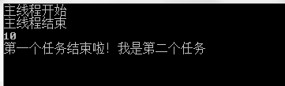

ContinueWith()方法可以让该后台线程继续执行新的任务。

Task 的使用还是比较灵活的，大家可以研究下，好了，以上就是全部内容了，篇幅和能力都有限，希望对大家有用！
