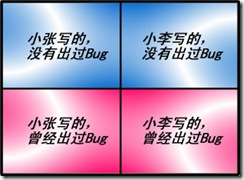
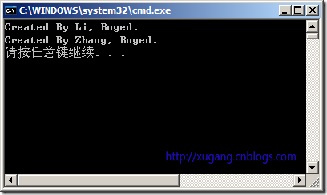
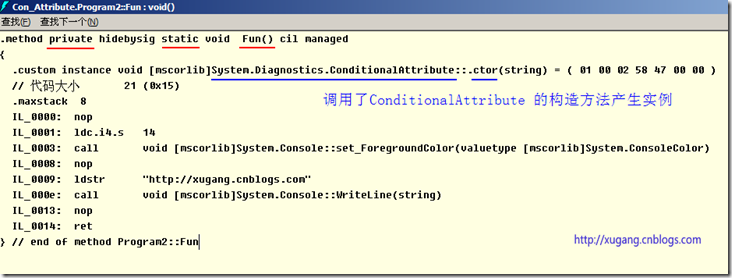
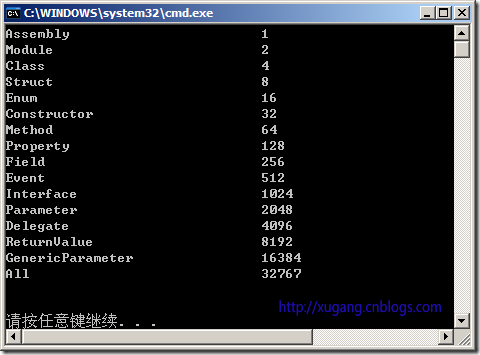

> 转载: [关于 C# 中的 Attribute 特性*知识库*博客园](https://kb.cnblogs.com/page/87531/)

**摘要：** 纠结地说，这应该算是一篇关于 Attribute 的笔记，其中的一些思路和代码借鉴了他人的文笔（见本文底部链接）。但是，由于此文对 Attribute 的讲解实在是叫好（自夸一下 ^\_^），所以公之于众，希望能对大家有所帮助。

**Attribute 与 Property 的翻译区别**

Attribute 一般译作“特性”，Property 仍然译为“属性”。

**Attribute 是什么**

Attribute 是一种可由用户自由定义的修饰符（Modifier），可以用来修饰各种需要被修饰的目标。`简单的说，Attribute 就是一种“附着物” —— 就像牡蛎吸附在船底或礁石上一样。` 这些附着物的作用是为它们的附着体追加上一些额外的信息（这些信息就保存在附着物的体内）—— 比如“这个类是我写的”或者“这个函数以前出过问题”等等。

**Attribute 的作用**

特性 Attribute 的作用是添加元数据。
元数据可以被工具支持，比如：编译器用元数据来辅助编译，调试器用元数据来调试程序。

**Attribute 与注释的区别**

- 注释是对程序源代码的一种说明，主要目的是给人看的，在程序被编译的时候会被编译器所丢弃，因此，它丝毫不会影响到程序的执行。
- 而 Attribute 是程序代码的一部分，不但不会被编译器丢弃，而且还会被编译器编译进程序集（Assembly）的元数据（Metadata）里，在程序运行的时候，你随时可以从元数据里提取出这些附加信息来决策程序的运行。

举例：

在项目中，有一个类由两个程序员（小张和小李）共同维护。这个类起一个“工具包”（Utilities）的作用（就像.NET Framework 中的 Math 类一样），里面含了几十个静态方法。而这些静态方法，一半是小张写的、一半是小李写的；在项目的测试中，有一些静态方法曾经出过 bug，后来又被修正。这样，我们就可以把这些方面划分成这样几类：



我们分类的目的主要是在测试的时候可以按不同的类别进行测试、获取不同的效果。比如：统计两个人的工作量或者对曾经出过 bug 的方法进行回归测试。如果不使用 Attribute，为了区分这四类静态方法，我们只能通过注释来说明，但这种方式会有很多弊端；如果使用 Attribute，区分这四类静态方法将会变得简单多了。示例代码如下：

```c#
#define Buged
//C# 的宏定义必须出现在所有代码之前。当前只让 Buged 宏有效。
using System;
using System.Diagnostics; // 注意：这是为了使用包含在此名称空间中的ConditionalAttribute特性
namespace Con_Attribute
{
    class Program
    {
        static void Main(string[] args)
        {
            // 虽然方法都被调用了，但只有符合条件的才会被执行！
            ToolKit.FunA();
            ToolKit.FunB();
            ToolKit.FunC();
            ToolKit.FunD();
        }
    }
    class ToolKit
    {
        [ConditionalAttribute("Li")] // Attribute名称的长记法
        [ConditionalAttribute("Buged")]
        public static void FunA()
        {
            Console.WriteLine("Created By Li, Buged.");
        }
        [Conditional("Li")] // Attribute名称的短记法
        [Conditional("NoBug")]
        public static void FunB()
        {
            Console.WriteLine("Created By Li, NoBug.");
        }
        [ConditionalAttribute("Zhang")]// Attribute名称的长记法
        [ConditionalAttribute("Buged")]
        public static void FunC()
        {
            Console.WriteLine("Created By Zhang, Buged.");
        }
        [Conditional("Zhang")] // Attribute名称的短记法
        [Conditional("NoBug")]
        public static void FunD()
        {
            Console.WriteLine("Created By Zhang, NoBug.");
        }
    }
}
```

运行结果如下：



注意：运行结果是由代码中“#define Buged ”这个宏定义所决定。

分析：

1. 在本例中，我们使用了 ConditionalAttribute 这个 Attribute，它被包含在 System.Diagnostics 名称空间中。显然，它多半时间是用来做程序调试与诊断的。

2. 与 ConditionalAttribute 相关的是一组 C# 宏，它们看起来与 C 语言的宏别无二致，位置必须出现在所有 C# 代码之前。顾名思义，ConditionalAttribute 是用来判断条件的，凡被 ConditionalAttribute （或 Conditional）“附着”了的方法，只有满足了条件才会执行。

3. Attribute 就像船底上可以附着很多牡蛎一样，一个方法上也可以附着多个 ConditionalAttribute 的实例。把 Attribute 附着在目标上的书写格式很简单，使用方括号把 Attribute 括起来，然后紧接着写 Attribute 的附着体就行了。当多个 Attribute 附着在同一个目标上时，就把这些 Attribute 的方括号一个挨一个地书写（或者在一对方括号中书写多个 Attribute），而且不必在乎它们的顺序。

4. 在使用 Attribute 的时候，有“长记法”和“短记法”两种，请君自便。

由上面的第 3 条和第 4 条我们可以推出，以下四种 Attribute 的使用方式是完全等价：

```c#
// 长记法
[ConditionalAttribute("LI")]
[ConditionalAttribute("NoBug")]
public static void Fun()
{ Console.WriteLine("Created By Li, NoBug."); }
// 短记法
[Conditional("LI")]
[Conditional("NoBug")]
public static void Fun()
{ Console.WriteLine("Created By Li, NoBug."); }
// 换序
[Conditional("NoBug")]
[Conditional("LI")]
public static void Fun()
{ Console.WriteLine("Created By Li, NoBug."); }
// 单括号叠加
[Conditional("NoBug"), Conditional("LI")]
public static void Fun()
{ Console.WriteLine("Created By Li, NoBug."); }
```

**Attribute 的本质**

从上面的代码中，我们可以看到 Attribute 似乎总跟 public、static 这些关键字（Keyword）出现在一起。

莫非使用了 Attribute 就相当于定义了新的修饰符（Modifier）吗？让我们来一窥究竟！

示例代码如下：

```c#
#define XG //C# 的宏定义必须出现在所有代码之前
using System;
using System.Diagnostics; // 注意：这是为了使用包含在此名称空间中的ConditionalAttribute 特性
namespace Con_Attribute
{
    class Program2
    {
        [Conditional("XG")]
        static void Fun()
        {
            Console.ForegroundColor = ConsoleColor.Yellow;
            Console.WriteLine("http://xugang.cnblogs.com");
        }
        static void Main(string[] args)
        {
            Fun();
        }
    }
}
```

使用微软的中间语言反编译器查看 MSIL 中间语言中 TargetMethod:void() 方法的代码，截图如下：



可以看出：Attribute 本质上就是一个类，它在所附着的目标对象上最终实例化。

仔细观察中间语言（MSIL）的代码之后，那些被 C# 语言所掩盖的事实，在中间语言（MSIL）中就变得赤身裸体了。而 Attribute 也变得毫无秘密！

图中红色所指的是 Fun 方法及其修饰符，但 Attribute 并没有出现在这里。

图中蓝色所指的是在调用 mscorlib.dll 程序集中 System.Diagnostics 名称空间中 ConditionalAttribute 类的构造函数。

可见，Attribute 并不是修饰符，而是一个有着独特实例化形式的类!

**Attribute 实例化有什么独特之处呢？**

1. 它的实例是使用.custom 声明的。查看中间语言语法，你会发现.custom 是专门用来声明自定义特性的。

2. 声明 Attribute 的位置是在函数体内的真正代码（IL_0000 至 IL_0014 ）之前。

这就从“底层”证明了 Attribute 不是什么“修饰符”，而是一种实例化方式比较特殊的类。

**元数据的作用**

MSIL 中间语言中，程序集的元数据（Metadata）记录了这个程序集里有多少个 namespace、多少个类、类里有什么成员、成员的访问级别是什么。而且，元数据是以文本（也就是 Unicode 字符）形式存在的，使用.NET 的反射（Reflection）技术就能把它们读取出来，并形成 MSIL 中的树状图、VS 里的 Object Browser 视图，以及自动代码提示功能，这些都是元数据与反射技术结合的产物。一个程序集（.EXE 或.DLL）能够使用包含在自己体内的元数据来完整地说明自己，而不必像 C/C++ 那样带着一大捆头文件，这就叫作“自包含性”或“自描述性”。

**Attribute 的实例化**

就像牡蛎天生就要吸附在礁石或船底上一样，Attribute 的实例一构造出来就必需“粘”在一个什么目标上。

Attribute 实例化的语法是相当怪异的，主要体现在以下三点：

1. 不使用 new 操作符来产生实例，而是使用在方括号里调用构造函数来产生实例。

2. 方括号必需紧挨着放置在被附着目标的前面。

3. 因为方括号里空间有限，不能像使用 new 那样先构造对象，然后再给对象的属性（Property）赋值。

因此，对 Attribute 实例的属性赋值也在构造函数的圆括号里。

并且，Attribute 实例化时尤其要注意的是：

1. 构造函数的参数是一定要写。有几个就得写几个，因为你不写的话实例就无法构造出来。

2. 构造函数参数的顺序不能错。调用任何函数都不能改变参数的顺序，除非它有相应的重载（Overload）。因为这个顺序是固定的，有些书里称其为“定位参数”（意即“个数和位置固定的参数”）。

3. 对 Attribute 实例的属性的赋值可有可无。反正它会有一个默认值，并且属性赋值的顺序不受限制。有些书里称属性赋值的参数为“具名参数”。

**自定义 Attribute 实例**

在此，我们不使用.NET Framework 中的各种 Attribute 系统特性，而是从头自定义一个全新的 Attribute 类。

示例代码如下：

```c#
using System;
namespace Con_Attribute
{
    class Program3
    {
        static void Main(string[] args)
        {
            //使用反射读取Attribute
            System.Reflection.MemberInfo info = typeof(Student); //通过反射得到Student类的信息
            Hobby hobbyAttr = (Hobby)Attribute.GetCustomAttribute(info, typeof(Hobby));
            if (hobbyAttr != null)
            {
                Console.WriteLine("类名：{0}", info.Name);
                Console.WriteLine("兴趣类型：{0}", hobbyAttr.Type);
                Console.WriteLine("兴趣指数：{0}", hobbyAttr.Level);
            }
        }
    }
    //注意："Sports" 是给构造函数的赋值， Level = 5 是给属性的赋值。
    [Hobby("Sports", Level = 5)]
    class Student
    {
        [Hobby("Football")]
        public string profession;
        public string Profession
        {
            get { return profession; }
            set { profession = value; }
        }
    }
    //建议取名：HobbyAttribute
    class Hobby : Attribute // 必须以System.Attribute 类为基类
    {
        // 参数值为null的string 危险，所以必需在构造函数中赋值
        public Hobby(string _type) // 定位参数
        {
            this.type = _type;
        }
        //兴趣类型
        private string type;
        public string Type
        {
            get { return type; }
            set { type = value; }
        }
        //兴趣指数
        private int level;
        public int Level
        {
            get { return level; }
            set { level = value; }
        }
    }
}
```

为了不让代码太长，上面的示例中 Hobby 类的构造函数只有一个参数，所以对“定位参数”体现的还不够淋漓尽致。大家可以为 Hobby 类再添加几个属性，并在构造函数里多设置几个参数，体验一下 Attribute 实例化时对参数个数及参数位置的敏感性。

**能被 Attribute 所附着的目标**

Attribute 可以将自己的实例附着在什么目标上呢？这个问题的答案隐藏在 AttributeTargets 这个枚举类型里。

这个类型的可取值集合为：

All Assembly Class Constructor

Delegate Enum Event Field

GenericParameter Interface Method Module

Parameter Property ReturnValue Struct

一共是 16 个可取值。上面这张表是按字母顺序排列的，并不代表它们真实值的排列顺序。

使用下面这个小程序可以查看每个枚举值对应的整数值，示例代码如下：

```c#
using System;
namespace Con_Attribute
{
    class Program4
    {
        static void Main(string[] args)
        {
            Console.WriteLine("Assembly\t\t\t{0}", Convert.ToInt32(AttributeTargets.Assembly));
            Console.WriteLine("Module\t\t\t\t{0}", Convert.ToInt32(AttributeTargets.Module));
            Console.WriteLine("Class\t\t\t\t{0}", Convert.ToInt32(AttributeTargets.Class));
            Console.WriteLine("Struct\t\t\t\t{0}", Convert.ToInt32(AttributeTargets.Struct));
            Console.WriteLine("Enum\t\t\t\t{0}", Convert.ToInt32(AttributeTargets.Enum));
            Console.WriteLine("Constructor\t\t\t{0}", Convert.ToInt32(AttributeTargets.Constructor));
            Console.WriteLine("Method\t\t\t\t{0}", Convert.ToInt32(AttributeTargets.Method));
            Console.WriteLine("Property\t\t\t{0}", Convert.ToInt32(AttributeTargets.Property));
            Console.WriteLine("Field\t\t\t\t{0}", Convert.ToInt32(AttributeTargets.Field));
            Console.WriteLine("Event\t\t\t\t{0}", Convert.ToInt32(AttributeTargets.Event));
            Console.WriteLine("Interface\t\t\t{0}", Convert.ToInt32(AttributeTargets.Interface));
            Console.WriteLine("Parameter\t\t\t{0}", Convert.ToInt32(AttributeTargets.Parameter));
            Console.WriteLine("Delegate\t\t\t{0}", Convert.ToInt32(AttributeTargets.Delegate));
            Console.WriteLine("ReturnValue\t\t\t{0}", Convert.ToInt32(AttributeTargets.ReturnValue));
            Console.WriteLine("GenericParameter\t\t{0}", Convert.ToInt32(AttributeTargets.GenericParameter));
            Console.WriteLine("All\t\t\t\t{0}", Convert.ToInt32(AttributeTargets.All));
            Console.WriteLine("\n");
        }
    }
}
```

结果显示如下：



AttributeTargets 使用了枚举值的另一种用法 —— 标识位。
　　除了 All 的值之外，每个值的二进制形式中只有一位是“1”，其余位全是“0”。
　　如果我们的 Attribute 要求既能附着在类上，又能附着在类的方法上。就可以使用 C# 中的操作符“|”（也就是按位求“或”）。有了它，我们只需要将代码书写如下：

AttributeTargets.Class | AttributeTargets.Method

因为这两个枚举值的标识位（也就是那个唯一的“1”）是错开的，所以只需要按位求或就解决问题了。

这样，你就能理解：为什么 AttributeTargets.All 的值是 32767 了。

默认情况下，当我们声明并定义一个新的 Attribute 类时，它的可附着目标是 AttributeTargets.All。

大多数情况下，AttributeTargets.All 就已经满足需求了。不过，如果你非要对它有所限制，那就要费点儿周折了。

例如，你想把前面的 Hobby 类的附着目标限制为只有“类”和“字段”使用，则示例代码如下：

```c#
[AttributeUsage(AttributeTargets.Class, AttributeTargets.Field)]
class Hobby : Attribute // 必须以System.Attribute 类为基类
{
    // Hobby 类的具体实现
}
```

这里是使用 Attribute 的实例（AttributeUsage）附着在 Attribute 类（Hobby）上。Attribute 的本质就是类，而 AttributeUsage 又说明 Hobby 类可以附着在哪些类型上。

附加问题：

1. 如果一个 Attribute 类附着在了某个类上，那么这个 Attribute 类会不会随着继承关系也附着在派生类上呢？

2. 可不可以像多个牡蛎附着在同一艘船上那样，让一个 Attribute 类的多个实例附着在同一个目标上呢？

答案：可以。代码如下：

```c#
[AttributeUsage(AttributeTargets.Class | AttributeTargets.Field, Inherited = false, AllowMultiple = true)]
class Hobby : System.Attribute
{
    // Hobby 类的具体实现
}
```

AttributeUsage 这个专门用来修饰 Attribute 的 Attribute ，除了可以控制修饰目标外，还能决定被它修饰的 Attribute 是否可以随宿主“遗传”，以及是否可以使用多个实例来修饰同一个目标！

那修饰 ConditionalAttribute 的 AttributeUsage 又会是什么样子呢？（答案在 MSDN 中）

参考来源：

[Attribute 在.NET 编程的应用](http://blog.csdn.net/niwalker/archive/2003/07.aspx)

[深入浅出 Attribute[上\] —— Attribute 初体验](http://blog.csdn.net/FantasiaX/archive/2007/05/28/1627694.aspx)

[深入浅出 Attribute[中\] —— Attribute 本质论](http://blog.csdn.net/FantasiaX/archive/2007/06/04/1636913.aspx)
