### 概述

与 ASP.NET 时代不同，ASP.NET Core 不再是由 IIS 工作进程（w3wp.exe）托管，而是使用自托管 Web 服务器（Kestrel）运行，IIS 则是作为反向代理的角色转发请求到 Kestrel 不同端口的 ASP.NET Core 程序中，随后就将接收到的请求推送至中间件管道中去，处理完你的请求和相关业务逻辑之后再将 HTTP 响应数据重新回写到 IIS 中，最终转达到不同的客户端（浏览器，APP，客户端等）。而配置文件和过程都会由些许调整，中间最重要的角色便是 AspNetCoreModule，它是其中一个的 IIS 模块，请求进入到 IIS 之后便立即由它转发，并迅速重定向到 ASP.NET Core 项目中，所以这时候我们无需设置应用程序池来托管我们的代码，它只负责转发请求而已。

部署之前要确保你的 IIS 上已经安装了 AspNetCoreModule 托管模块，如果没有的话，点击[这里](https://go.microsoft.com/fwlink/?linkid=844461)进行下载并安装

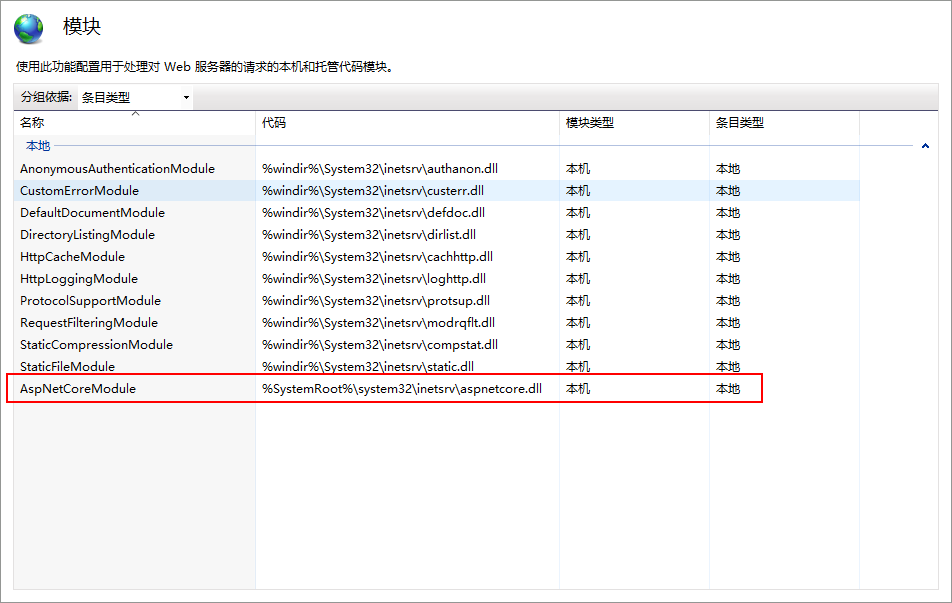

### 一、安装 IIS

1、在控制面板 → 程序 → 启用或关闭 Windows 功能 → 勾选 Internet Information Services 以及 Web 管理工具下的 IIS 管理控制台

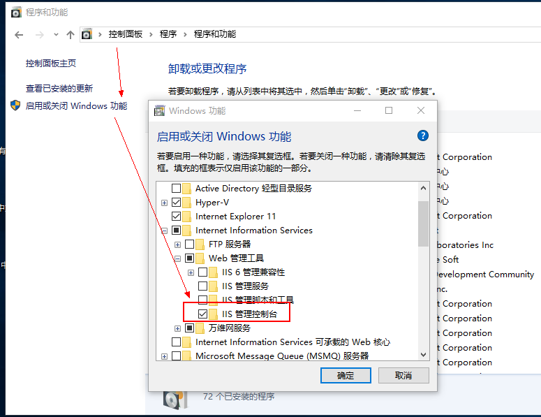

### 二、发布项目

1、发布我们上一篇建好的 ASP.NET Core API 项目，然后选择 IIS，新建一项发布配置

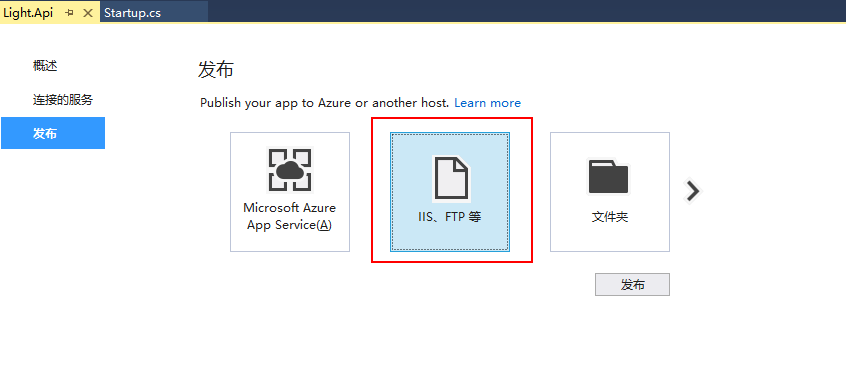

2、发布方法选择文件系统，然后设置一个发布路径

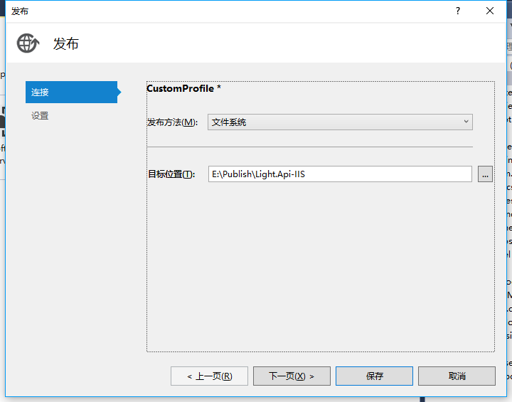

3、配置文件可以根据你线上、线下的环境进行选择，因为是基于.NET Core，所以目标框架为 netcoreapp1.1，然后保存发布即可

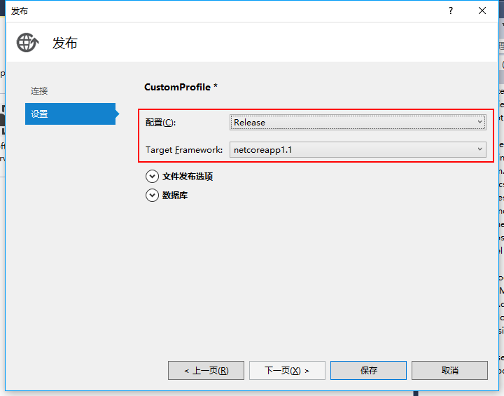

4、当然了，你还可以基于 CLI 的 Publish 命令进行发布，只需切换到 Light.API 根目录下，输入以下命令即可

```c###
dotnet publish --framework netcoreapp1.1 --output "E:\Publish" --configuration Release
```

framework 表示目标框架，output 表示要发布到的目录文件夹，configuration 表示配置文件，等同于和上面我们通过管理器来发布的操作，如图：

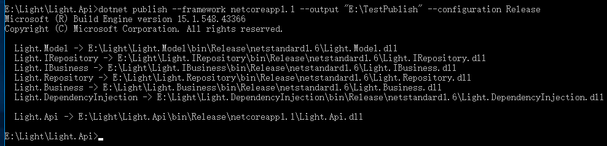

### 三、在 IIS 中添加网站

1、添加一个网站，设置一下名称，并将路径指向你刚才发布的文件夹，然后启动网站即可

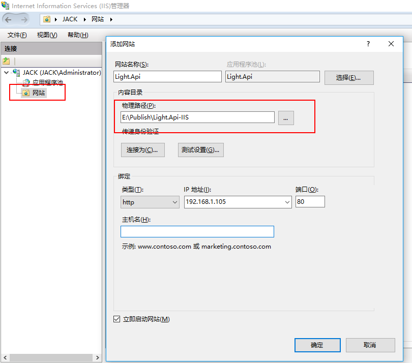

2、设置应用程序池的.NET CLR 版本为“无托管代码”，因为刚才也说了，IIS 是作为一个反向代理的角色，并不需要它来托管代码

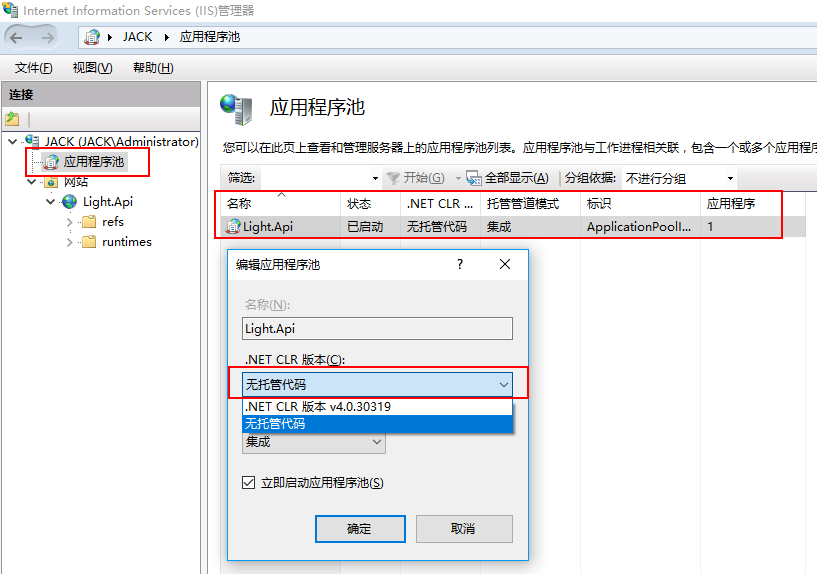

3、OK，大功告成，浏览一下我们的网站。

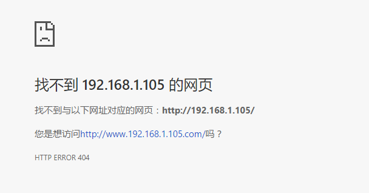

此时我的内心是崩溃的，没有任何有用的提示信息，看来只能自己动手查看应用程序的运行日志了

4、设置 IIS 的日志记录方式为日志文件和 ETW 事件

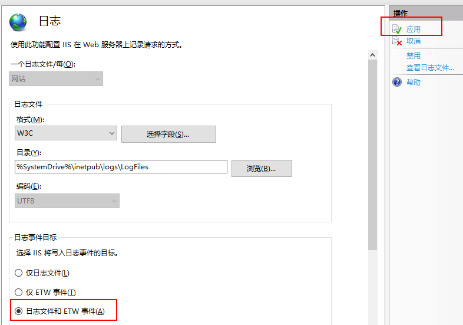

5、重新访问网站，然后打开 Windows 应用程序日志，你会看到这样一条信息。意思是说你的应用程序已经由 PID 为 3236 的进程启动，并且在 25636 的端口上监听着。

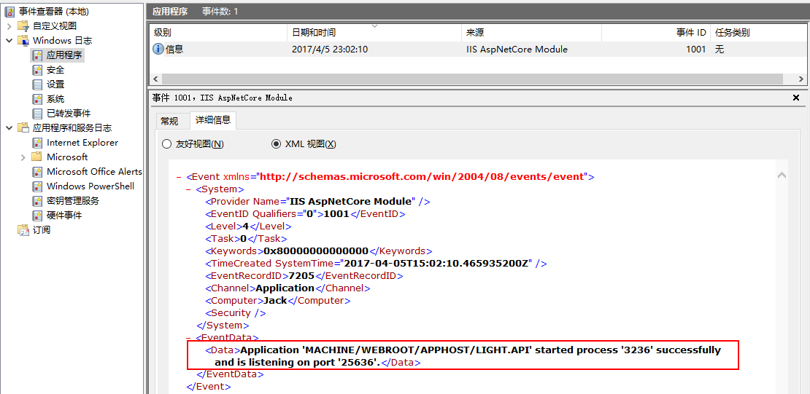

我打开任务管理器查看了一下，说的很对。应该是一切正常才对啊，那为啥访问网站是 404 呢。


纠结了半天，原来是因为网站没有自动重定向到/swagger/ui 页面，重新访问：http://192.168.1.105/swagger/ui，你会看到熟悉的画面

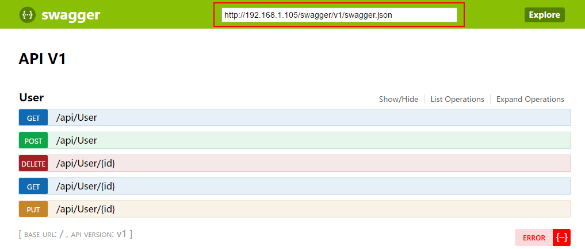

6、最后一点，其实你还可以通过 CLI 来运行你发布的程序，切换到你发布文件夹下，输入以下命令：

```
dotnet Light.API.dll
```

看到这个提示，那么说明你成功了。试着访问一下：http://localhost:5000/swagger/ui

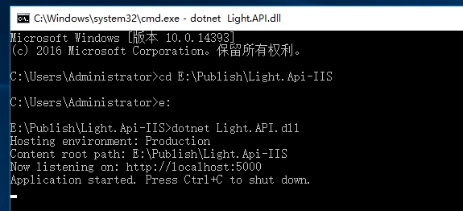

而此时你再回过头来看任务管理器，那么就会又多了一个 dotnet 的进程

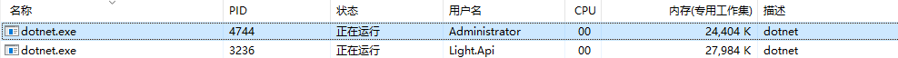

### 写在最后

至此，整个 IIS 的搭建已经完成，不知道你是否有所收获。接下来不知道把它发布到 Linux 上，会有什么样的坑。不管怎样，你的每一步，回过头来看，都是值得的！

> [在 IIS 上部署你的 ASP.NET Core 项目 - 王杰光 - 博客园](https://www.cnblogs.com/wangjieguang/p/core-iis.html)
