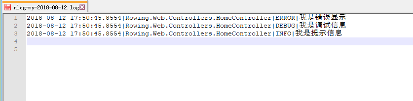
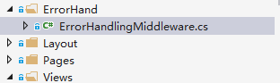

> 转载: [.NET Core 使用 NLog 日志记录 - 潇十一郎 - 博客园](https://www.cnblogs.com/zhangxiaoyong/p/9463791.html)

### 前言

每个项目都会需要使用到日志功能，这对于项目上线后 出现的 bug 异常，能及时定位和便于后期错误分析。那我们今天来看看在.NET Core 中如何使用 NLog 日志。

### NLog

NLog 是一个基于.NET 平台编写的类库，我们可以使用 NLog 在应用程序中添加极为完善的跟踪调试代码。
NLog 是一个简单灵活的.NET 日志记录类库。通过使用 NLog，我们可以在任何一种.NET 语言中输出带有上下文的（contextual information）调试诊断信息，根据喜好配置其表现样式之后发送到一个或多个输出目标（target）中。
NLog 的 API 非常类似于 log4net，且配置方式非常简单。NLog 使用路由表（routing table）进行配置，这样就让 NLog 的配置文件非常容易阅读，并便于今后维护。
NLog 遵从 BSD license，即允许商业应用且完全开放源代码。任何人都可以免费使用并对其进行测试，然后通过邮件列表反馈问题以及建议。
NLog 支持.NET、C/C++以及 COM interop API，因此我们的程序、组件、包括用 C++/COM 编写的遗留模块都可以通过同一个路由引擎将信息发送至 NLog 中。
简单来说 Nlog 就是用来记录项目日志的组件

### 使用步骤

已入 Nlog 包

① 在 NuGet 中安装：Nlog 和 Nlog.Web.AspNetCore

② 配置 Configure 如下

```c#
public void Configure(IApplicationBuilder app, IHostingEnvironment env, ILoggerFactory loggerFactory)
{
     loggerFactory.AddNLog();//添加NLog            //引入Nlog配置文件        env.ConfigureNLog("nlog.config");
}
```

③ 添加 nlog 配置文件 **nlog.config**

```xml
<?xml version="1.0" encoding="utf-8" ?>
<nlog xmlns="http://www.nlog-project.org/schemas/NLog.xsd"
      xmlns:xsi="http://www.w3.org/2001/XMLSchema-instance"
     autoReload="true"
       internalLogLevel="Warn"
       internalLogFile="internal-nlog.txt">
     <!--define various log targets-->
     <targets>
        <!--write logs to file-->
         <target xsi:type="File" name="allfile" fileName="nlog-all-${shortdate}.log"
                  layout="${longdate}|${logger}|${uppercase:${level}}|${message} ${exception}" />

         <target xsi:type="File" name="ownFile-web" fileName="nlog-my-${shortdate}.log"
                  layout="${longdate}|${logger}|${uppercase:${level}}|${message} ${exception}" />
        <target xsi:type="Null" name="blackhole" />
  </targets>
     <rules>
         <!--All logs, including from Microsoft-->
         <logger name="*" minlevel="Trace" writeTo="allfile" />

       <!--Skip Microsoft logs and so log only own logs-->
         <logger name="Microsoft.*" minlevel="Trace" writeTo="blackhole" final="true" />
         <logger name="*" minlevel="Trace" writeTo="ownFile-web" />
  </rules>
</nlog>
```

⑤ 在 HomeController 中添加 DI 注入

```c#
private readonly ILogger<HomeController> _logger;
public HomeController(ILogger<HomeController> logger)
{
    _logger = logger;
}
```

⑥ 测试效果

```c#
_logger.LogError("我是错误显示");
_logger.LogDebug("我是调试信息");
_logger.LogInformation("我是提示信息");
```

执行后，查看 bin/debug/netcoreapp2.0 下面的 nlog-my-2018-08-12.log 文件即可看到输出日志：



### 日志文件生成在指定目录下

大家会发现文件是生成在项目目录下的，日志多的时候，会导致文件目录太乱

此时，只需更改 nlog.config 中的内容如下即可生成在 logs 目录里

```xml
<targets>
    <!--write logs to file-->
        <target xsi:type="File" name="allfile" fileName="logs/all/nlog-all-${shortdate}.log"
                layout="${longdate}|${logger}|${uppercase:${level}}|${message} ${exception}" />

        <target xsi:type="File" name="ownFile-web" fileName="logs/my/nlog-my-${shortdate}.log"
                layout="${longdate}|${logger}|${uppercase:${level}}|${message} ${exception}" />
    <target xsi:type="Null" name="blackhole" />
</targets>
```

关于 Nlog 日志的就先介绍到这儿，这只是一个基础入门讲解，更多内容可以参考：[Nlog 官网](http://nlog-project.org/)

### 异常处理

对于全局异常处理，通常有几种方式，我们这里介绍一个常见的做法：

① 我们在 web 下新建一个文件夹 ErrorHand

② 在此文件夹中新建一个 ErrorHandlingMiddleware 类如下



```c#
public class ErrorHandlingMiddleware
    {
        private readonly RequestDelegate _next;
        private readonly ILogger<ErrorHandlingMiddleware> _logger;

        public ErrorHandlingMiddleware(RequestDelegate next,ILogger<ErrorHandlingMiddleware> logger)
        {
            this._next = next;
            _logger = logger;
        }

        public async Task Invoke(HttpContext context)
        {
            try
            {
                await _next(context);
            }
            catch (Exception e)
            {
                var statusCode = context.Response.StatusCode;
                if (e is ArgumentException)
                {
                    statusCode = 200;
                }

               await  HandleExceptionAsync(context, statusCode, e.Message);
            }
            finally
            {
                var statusCode = context.Response.StatusCode;
                var msg = "";
                if (statusCode != 200)
                {
                    _logger.LogError(context.Request.GetAbsoluteUri()+"\r\n"+statusCode.ToString());
                }

                if (!string.IsNullOrEmpty(msg))
                {
                   await  HandleExceptionAsync(context, statusCode, msg);
                }
            }
        }

        private static Task HandleExceptionAsync(HttpContext context, int statusCode, string msg)
        {
            var data = new {code = statusCode.ToString(), is_success = false, msg = msg};
            var result = JsonConvert.SerializeObject(new {data = data});
            context.Response.ContentType = "application/json;charset=utf-8";
            return context.Response.WriteAsync(result);
        }
    }
```

这里类内容比较简单，就不多赘述了，此时，我们全局异常类已经编写好了，但是，还无法正常使用，我们需要在 Startup 中配置一下

③ 我们需要在 Configure 方法中加入：

```c#
//全局错误
app.UseMiddleware(typeof(ErrorHandlingMiddleware));
```

这个地方就是绑定了我们自定义的错误类。

注：.netCore 中 提供了两个我们可以跳转到错误页面，一个是 404 的，一个是 500 的，同样在 Configure 方法中加入：

```c#
app.UseExceptionHandler("/Home/NothingFound");
app.UseStatusCodePagesWithReExecute("/Home/NothingFound");
```

这样当有对应异常出现的时候，就可以跳转到自己的错误页。然后配合 NLog 可以查看到相应输出日志。
