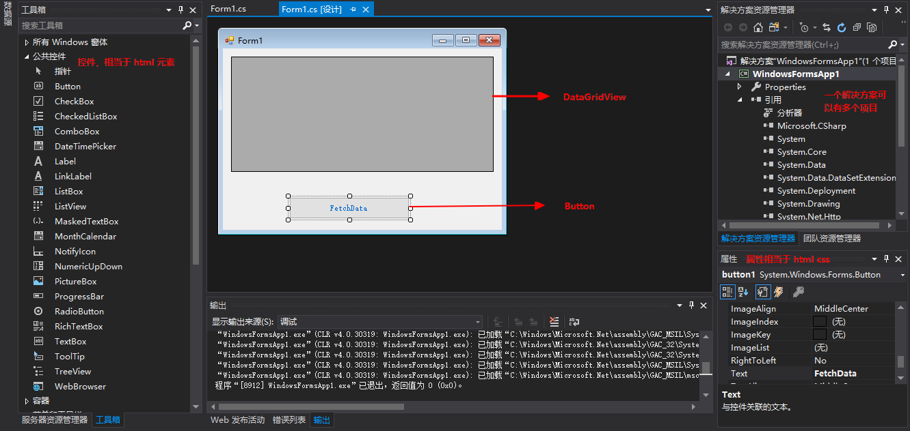
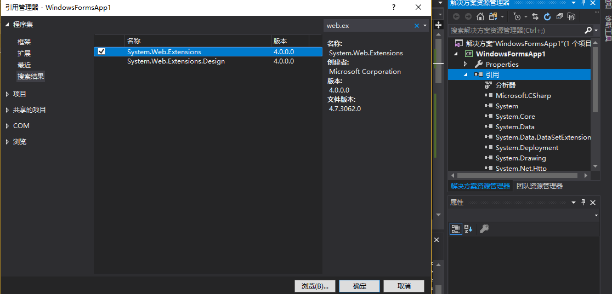

### 新建 webform 窗体程序



### 实现按钮点击事件

```c#
using System;
using System.Collections.Generic;
using System.ComponentModel;
using System.Data;
using System.Drawing;
using System.IO;
using System.Linq;
using System.Net;
using System.Text;
using System.Threading.Tasks;
using System.Web.Script.Serialization;
using System.Windows.Forms;

namespace WindowsFormsApp1
{
    public partial class Form1 : Form
    {
        public Form1()
        {
            InitializeComponent();
        }

        private void Button1_Click(object sender, EventArgs e)
        {
            // 获取数据
            var url = "https://jsonplaceholder.typicode.com/users";
            HttpWebRequest req = (HttpWebRequest)WebRequest.Create(url);
            Stream stream = req.GetResponse().GetResponseStream();
            StreamReader reader = new StreamReader(stream);
            String content = reader.ReadToEnd();
            JavaScriptSerializer jss = new JavaScriptSerializer();
            List<User> list = jss.Deserialize<List<User>>(content);

            // 填充页面
            DataTable dt = new DataTable();
            dt.Columns.Add("id");
            dt.Columns.Add("name");
            dt.Columns.Add("email");
            list.ForEach(u =>
            {
                DataRow row = dt.NewRow();
                row["id"] = u.id;
                row["name"] = u.name;
                row["email"] = u.email;
                dt.Rows.Add(row);
            });
            dataGridView1.DataSource = dt;

        }
    }
}
```

`JavaScriptSerializer` 类需要添加 `System.Web.Extensions` 引用，因为此程序不是 web 程序



User.cs

需要将 User 属性设置为 public, 否则 json 序列化数据都是默认空值

```c#
using System;
using System.Collections.Generic;
using System.Linq;
using System.Text;
using System.Threading.Tasks;

namespace WindowsFormsApp1
{
    class User
    {
        public int id;
        public String name;
        public String email;
    }
}

```

### 运行效果


> 引用: https://www.bilibili.com/video/av67718217
