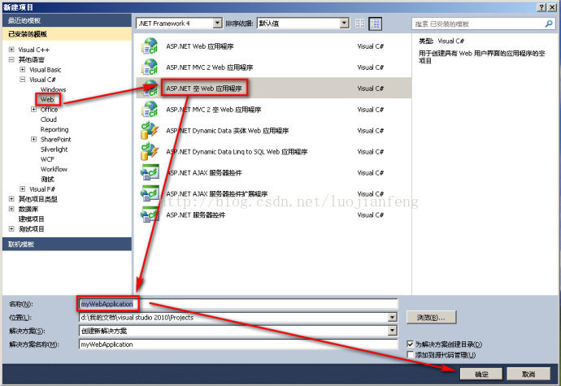
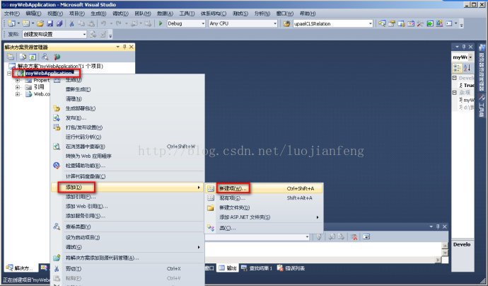
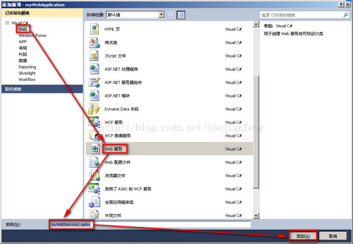
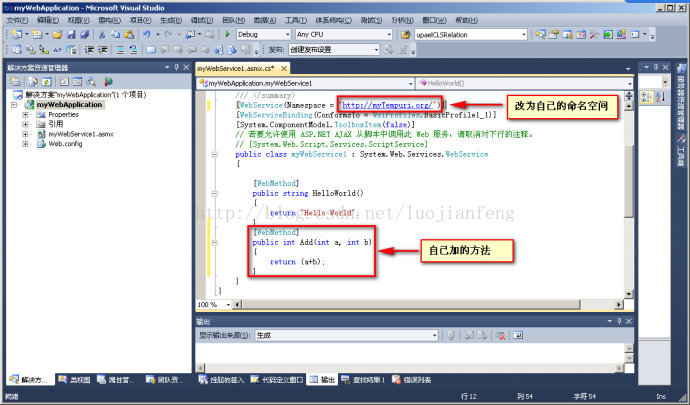
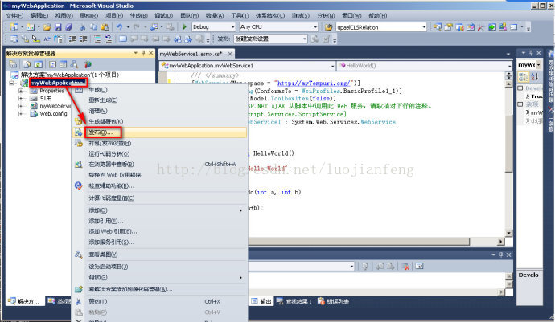
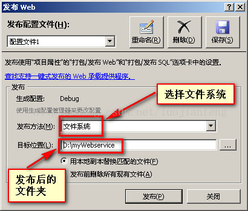
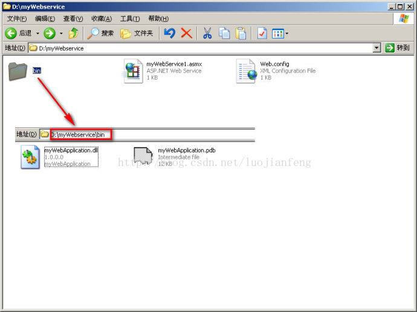
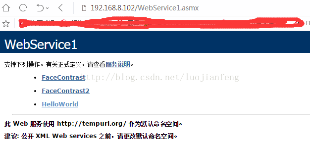

1 打开 VS2010，菜单 文件->新建->项目

2 选择【ASP.net 空 web 应用程序】，将其命名为自己想的工程名称。

3 右键点击工程，添加->新建项

选择 web 服务。然后命名服务名称， 比如 myWebSevice 。

4 在 asmx 文件中，继续加入自己的 WebService 方法，其中也要改变命名空间为容易记忆的名称。

5 方法写完后，右击项目->发布。

6 选择【文件系统】发布，选择发布后的文件夹地址，点击【发布】即可；

7 在发布的文件夹中，有如下的几个文件。

8 打开 IIS，建立网站，右键点击 默认网站->新建->虚拟目录，

    选择网站名称,比如myWebService，关联刚刚发布的文件夹地址，还有发布的IP和端口，需要设置一下默认文档和文件权限，版本等。

————————————————
版权声明：本文为 CSDN 博主「luojianfeng」的原创文章，遵循 CC 4.0 BY-SA 版权协议，转载请附上原文出处链接及本声明。
原文链接：https://blog.csdn.net/luojianfeng/article/details/78517126
