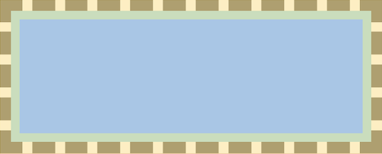
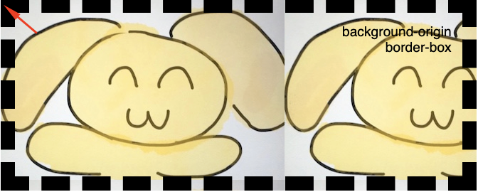
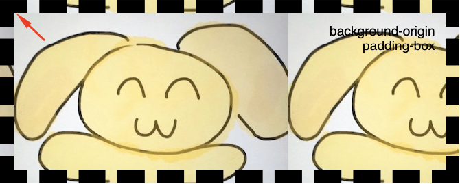
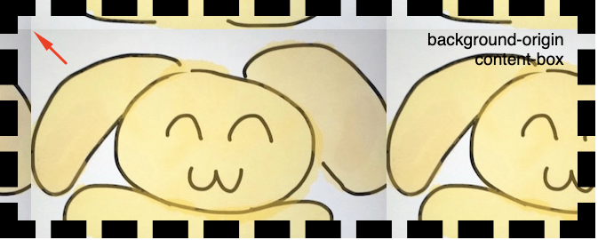
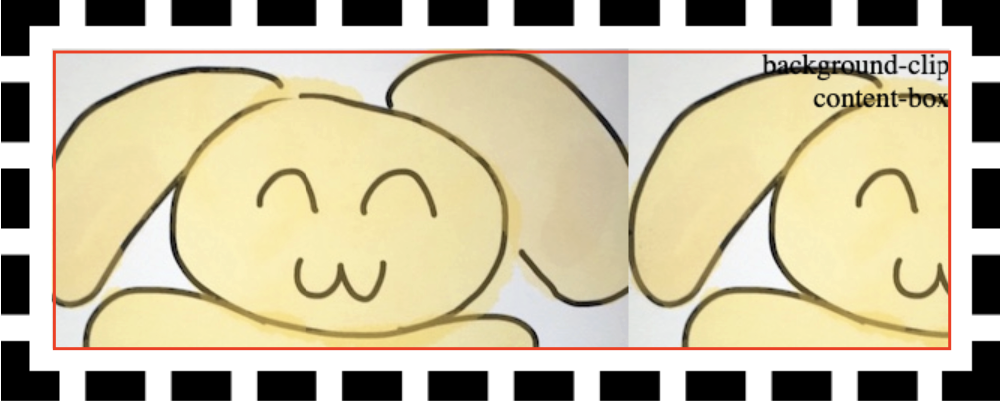
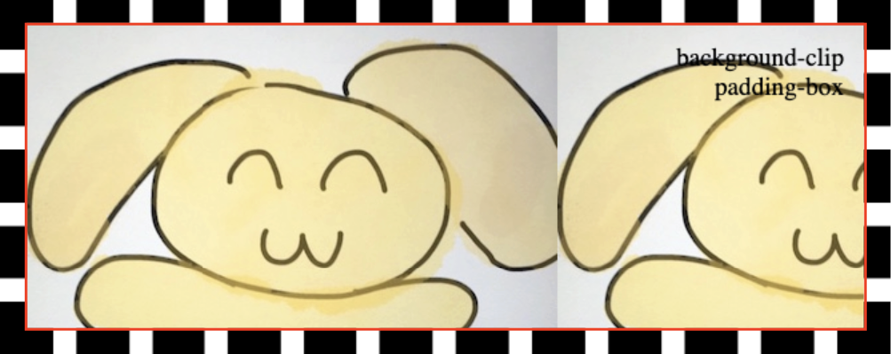
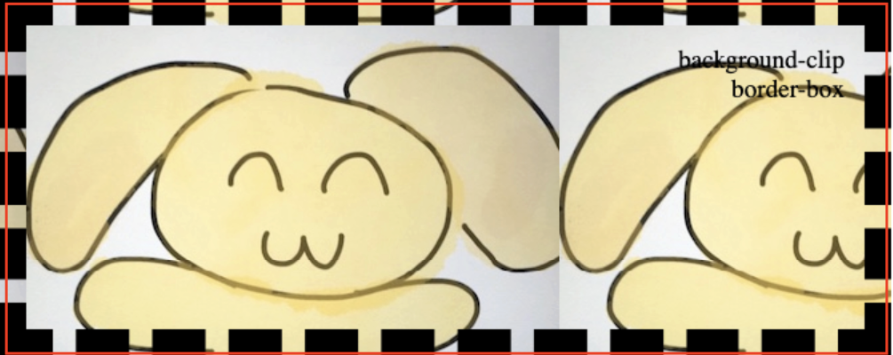
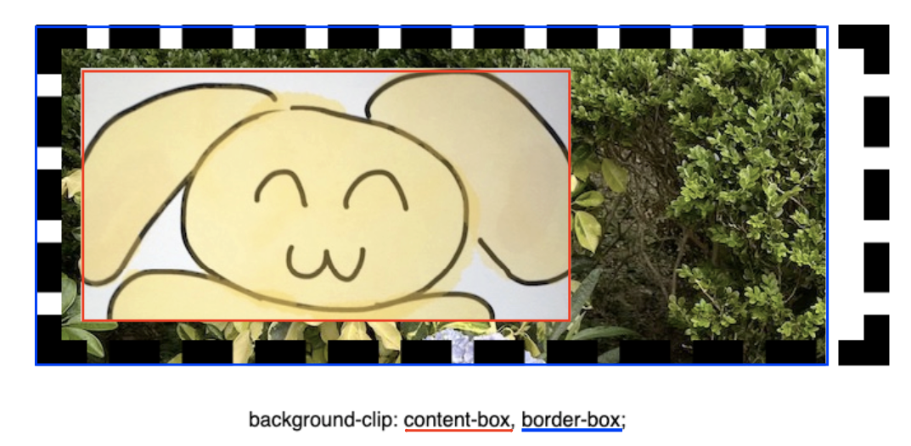
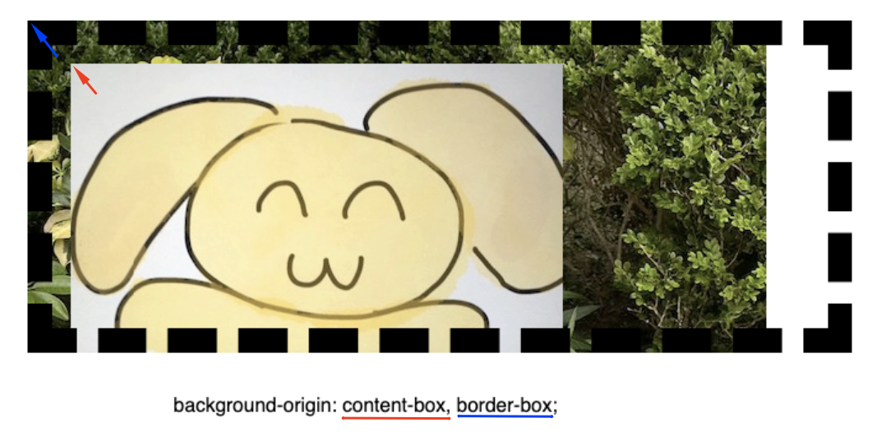
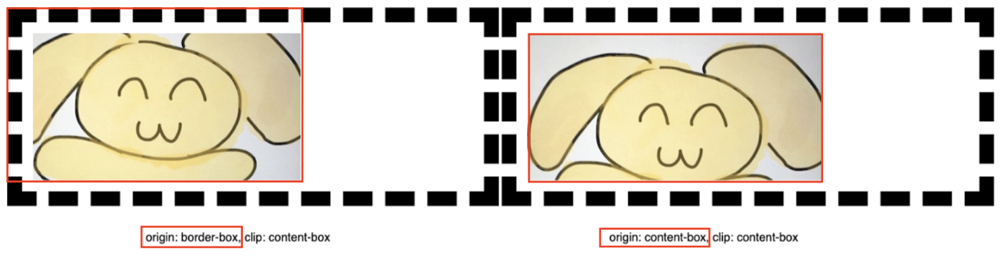

> 转载：[CSS — background-clip vs. background-origin properties | by Tsz | Level Up Coding](https://levelup.gitconnected.com/css-background-clip-vs-background-origin-properties-e2a15d5d7fa0)

When I was learning these 2 CSS properties, I felt confused since both of them have the same set of property values and their demonstration effect looks similar. After research and investigation, here's how I understood the 2 properties right now.

In all the below examples, I will use a div with a 20px dashed border and 15px padding, with background-repeat. (The orange, green, and blue color below represents the border, padding, and content area respectively)

## background-origin

It defines where the starting **position** of the background. (from the upper left corner)

### border-box

When we set the value to "border-box", the background begins at the upper-left corner of the border area

### padding-box

The background begins at the upper-left corner of the padding area

### content-box

The background begins at the upper-left corner of the content area

## background-clip

After understanding what the "background-origin" does, it's easier to understand what is "background-clip".

### Differences between the 2 properties

"background-clip" — let you define in which **area** the background should be displayed, background outside the area will be "clipped".

"background-origin" — defines **only the starting position** of the background, we don't have the power to define anything else (e.g.: where does it end) using this property on its own.

### content-box

We will start from "content-box" this time as it shows the most obvious effect. We can see that the background only fills up within the content area, but not the padding nor border area.

### padding-box

The background extended to the padding area this time.

### border-box

The background extends to the complete div, including its border area.

## More use cases

After understanding what each property does, we can use them independently or together for different use cases!

### Applying multiple values

Apart from the above single value examples, both properties support giving multiple values (separated by comma), to define the multiple background behavior.

In the coming examples, I set 2 background image URLs in the "background-image" property.

Then in the "background-clip" demo, I can define image A to be extended to the content box area; while image B can extend to the border-box area.

In the "background-origin" demo, the starting point of background A & background B can be different. (A begins at the content box, B begins at the border-box).

### Apply the 2 properties together

The 2 properties can be used together. In the below examples, I used "background-origin" to set the background image's position; and used "background-clip" to decide what area of background images should be shown.

the starting points of the 2 background images are different!
