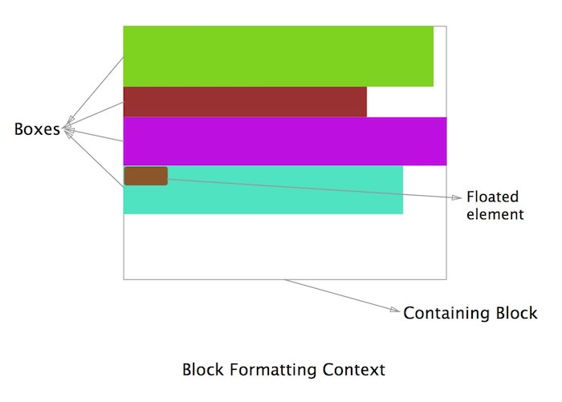
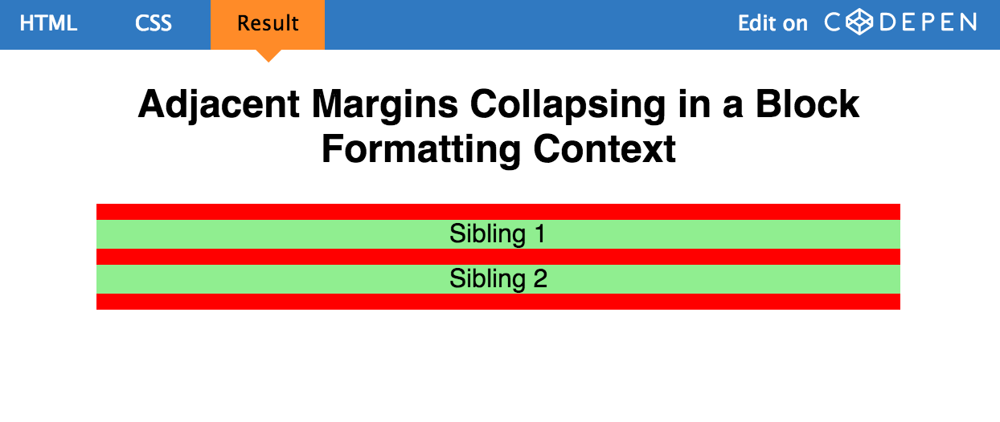
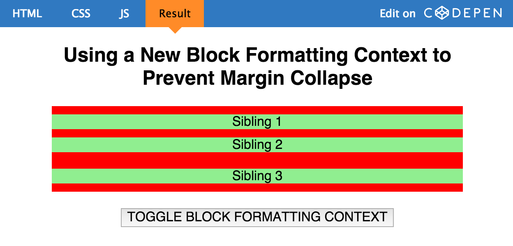
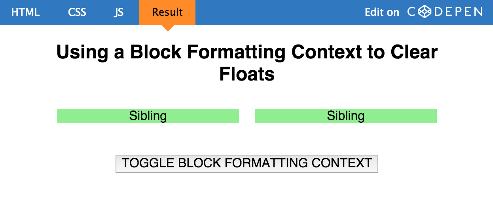
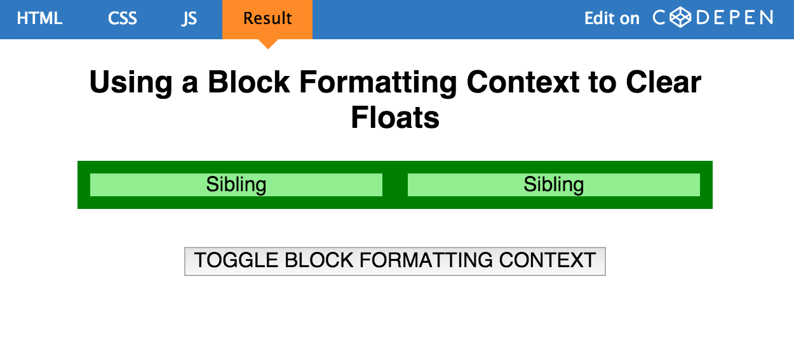
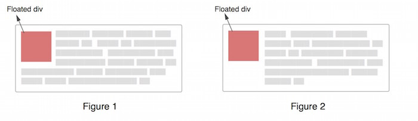
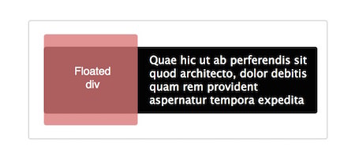
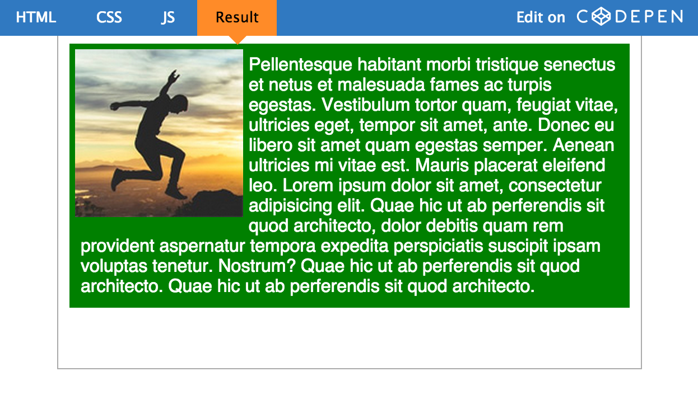
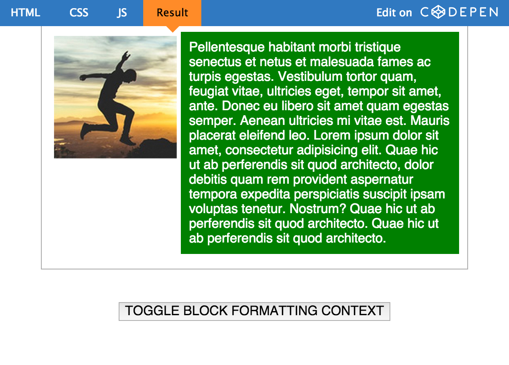

> 转载：[理解 CSS 中的 BFC(块级可视化上下文)](http://flypursue.com/jekyll/update/2015/08/10/bfc.html)

#### 开篇

> 一些元素，如 float 元素，如 position 为 absolute,inline-block,table-cell 或 table-caption 的元素，以及 overflow 属性不为 visible 的元素，它们将会建立一个新的块级格式化上下文。

上述定义已经很详细的描述了块级格式化上下文(Block Formatting Context)是如何形成的，为了方便起见，文中均用 BFC 代替。现在，让我们用一种简单的方式对其进行重新定义: BFC 也是 HTML 中的一个盒子（看不见而已），只有满足至少下列条件之一才能形成 BFC:

-   float 属性不为`none.`
-   position 属性不为`static和relative.`
-   display 属性为下列之一:`table-cell,table-caption,inline-block,flex,or inline-flex.`
-   overflow 属性不为`visible.`

#### 让我们建立一个 BFC

HTML 代码如下：

```html
<div class="container">
    Some Content here
</div>
```

我们可以用 CSS 为 container 容器附加上述条件,如`overflow: scroll, overflow: hidden, display: flex, float: left, or display: table.`尽管这些条件都能形成一个 BFC，但是它们各自却有着不一样的表现：

-   display: table : `在响应式布局中会有问题`
-   overflow: scroll : `可能会出现你不想要的滚动条`
-   float: left: `使元素左浮动，并且其他元素对其环绕`
-   overflow: hidden: `消除溢出部分`

这么看来，建立 BFC 的最好方式莫过于`overflow:hidden`了：

```css
.container {
    overflow: hidden;
}
```

#### 在 BFC 中，块级元素又是怎么布局的呢？

W3C 规范描述如下：

> In a block formatting context, each box’s left outer edge touches the left edge of the containing block (for right-to-left formatting, right edges touch). This is true even in the presence of floats (although a box’s line boxes may shrink due to the floats), unless the box establishes a new block formatting context (in which case the box itself may become narrower due to the floats).bfcbfc.jpg



简单的说：上图中所有属于 BFC 的 box 都默认左对齐，并且它们的左边距可以触及到容器 container 的左边。最后一个 box，尽管它是浮动的，但它依然遵循这个原则。（BFC 中的浮动下面会介绍）

```css
－那么，BFC到底有什么卵用呢？
－实际上，真的特别有用
```

#### 1.利用 BFC 可以消除 Margin Collapse

在正常情况下，在一个容器内的所有 box 将会由上至下依次垂直排列，即我们所说的一个元素占一行，并切垂直相邻的距离(即 margin)是由各自的 margin 决定的，而不是两个 margin 的叠加。

让我们看一个例子：红色的 div 包含三个绿色的 p 元素。

HTML 代码：

```html
<div class="container">
    <p>Sibling 1</p>
    <p>Sibling 2</p>
    <p>Sibling 3</p>
</div>
```

CSS 代码：

```css
.container {
    background-color: red;
    overflow: hidden; /* creates a block formatting context */
}

p {
    background-color: lightgreen;
    margin: 10px 0;
}
```

理想情况下，我们会认为 p 标签之间的 margin 应该是它们的和(20px),但实际上却是 10px.这其实是[collapsing margins](http://www.sitepoint.com/web-foundations/collapsing-margins/)。

结果如下：



这似乎让人有点困惑，BFC 导致了 margin collapse，而现在又要用它来解决 margin cllapse.但是始终要记住一点：只有当元素在同一个 BFC 中时，垂直方向上的 margin 才会 clollpase.如果它们属于不同的 BFC，则不会有 margin collapse.因此我们可以再建立一个 BFC 去阻止 margin collpase 的发生。

现在 HTML 变成：

```html
<div class="container">
    <p>Sibling 1</p>
    <p>Sibling 2</p>
    <div class="newBFC">
        <p>Sibling 3</p>
    </div>
</div>
```

CSS 也有改变：

```css
.container {
    background-color: red;
    overflow: hidden; /* creates a block formatting context */
}

p {
    margin: 10px 0;
    background-color: lightgreen;
}

.newBFC {
    overflow: hidden; /* creates new block formatting context */
}
```

现在的结果为：



由于第二个 p 元素和第三个 p 元素属于不同的 BFC，因此避免了 margin collapse.

\####2.利用 BFC 去容纳浮动元素

我相信大家经常会遇到一个容器里有浮动元素，但是这个容器的高度却是 0 的场景，如下图：

看下面的例子：

HTML:

```html
<div class="container">
    <div>Sibling</div>
    <div>Sibling</div>
</div>
```

CSS:

```css
.container {
    background-color: green;
}

.container div {
    float: left;
    background-color: lightgreen;
    margin: 10px;
}
```

结果：



在上边的情形中，container 是不会有高度的，因为它包含了浮动元素。通常我们解决这个问题的办法是利用一个伪元素去实现[clear fix](http://www.sitepoint.com/clearing-floats-overview-different-clearfix-methods/)，但是现在我们有了更好的解决办法，即利用 BFC，因为它够容纳浮动元素的。 我们现在让 container 形成 BFC 规则，结果如下：

```css
.container {
    overflow: hidden; /* creates block formatting context */
    background-color: green;
}

.container div {
    float: left;
    background-color: lightgreen;
    margin: 10px;
}
```

结果：



#### 3.利用 BFC 阻止文本换行

有时候，确切的说大多数情况(若没有特殊设置)，文本将会环绕浮动元素(如 Figure 1), 但有时候这并不是我们期望的，我们想要的是 Figure2。



往往可能大家都会选择利用 margin－left 来强行让 p 的容器有一个左边距，而距离恰好为 Floated div 的宽度，但现在我们可以利用 BFC 更好的解决这个问题。

首先让我们了解一下文本换行的原理吧：



在 Figure1 中，整个 p 元素实际上是处于上图中的黑色区域，p 元素没有移动是因为它在浮动元素的下方。但实际上 p 作为行块级别的元素（相对于行内文本）却发生了移动，因为要给 float 元素’腾’位置，而随着文本的增加，文本高度超过浮动元素的部分则不会在水平方向上收缩内部距离，因此看起来像是环绕。

如图：



在解决这个问题之前，我们先来看一下 W3C 的规范在这方面的描述：

> In a block formatting context, each box’s left outer edge touches the left edge of the containing block (for right-to-left formatting, right edges touch). This is true even in the presence of floats (although a box’s line boxes may shrink due to the floats), unless the box establishes a new block formatting context (in which case the box itself may become narrower due to the floats).

W3C 为这种情况提供了一个解决方案：`unless the box establishes a new block formatting context`，即为 p 建立 BFC。

结果：



注：此文为译文 [原文请戳](http://www.sitepoint.com/understanding-block-formatting-contexts-in-css/)
