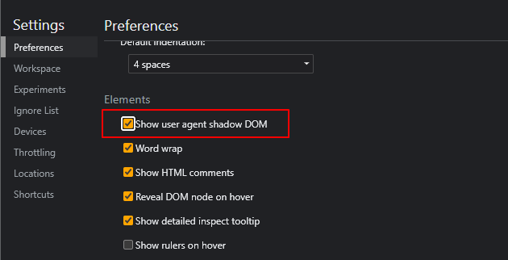
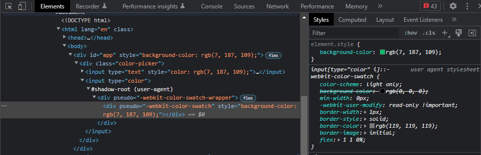
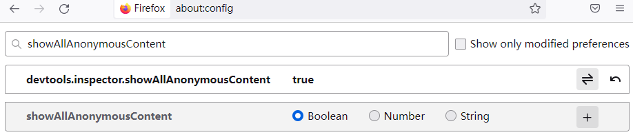
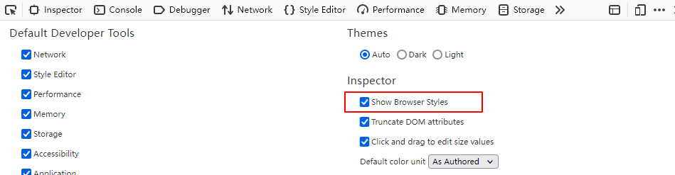
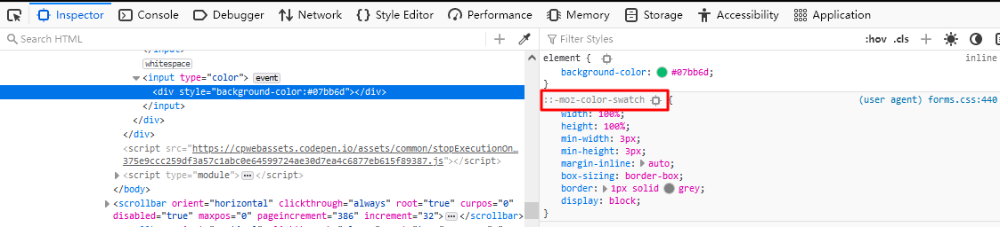

## CSS Color Picker

```html
<template>
   <div id="app" :style="{ backgroundColor: color }">
    <div class="color-picker">
      <input type="text" :style="{ color: color }" v-model="color"/>
      <input type="color" v-model="color"/>
    </div>
  </div>
</template>

<script>
export default {
  data() {
    return {
      color: "#07bb6d"
    };
  }
};
</script>

<style>
html, body {
  height: 100%;
  margin: 0;
  padding: 0;
}

#app {
  display: flex;
  height: 100%;
  justify-content: center;
  align-items: center;
}

input {
  border: none;
}

input[type="text"] {
  padding: 1rem;
  font-size: 2rem;
  background: #fff;
  border-radius: 3px;
}

input[type="color"] { 
  width: 40px;
  height: 40px;
  margin-left: 10px;
  border-radius: 5px;
  background: #fff;
  padding: 5px;
}

input[type="color"]::-webkit-color-swatch-wrapper   {
  padding: 0;
}

input[type="color"]::-webkit-color-swatch {
  border: none;
}

input[type="color"]::-moz-color-swatch {
  border: none;
}
</style>
```

<iframe height="300" style="width: 100%;" scrolling="no" title="Color Picker" src="https://codepen.io/lhchen74/embed/MWGxmeQ?default-tab=html%2Cresult" frameborder="no" loading="lazy" allowtransparency="true" allowfullscreen="true">
  See the Pen <a href="https://codepen.io/lhchen74/pen/MWGxmeQ">
  Color Picker</a> by lhchen74 (<a href="https://codepen.io/lhchen74">@lhchen74</a>)
  on <a href="https://codepen.io">CodePen</a>.
</iframe>

## Debug User Agent Style

在未开启显示 Shadow Dom 和 User Agent Styles 的情况下, 没有办法看到元素的 Shadow DOM 和其 User Agent Styles 样式，当需要覆盖元素的代理样式时需要在浏览器设定中开启相关设置。

默认 color input 在浏览器中的显示如下：

```html
<input type="color"/>
```

### Chrome Setting

在 Chrome devtools/Settings/Preferences/Elements 中勾选 Show user agent shadow DOM。





### Firefox Setting

在地址栏输入 about:config 开启 devtools.inspector.showAllAnonymousContent。



在 Inspector 设置中勾选 Show Browser Styles.



