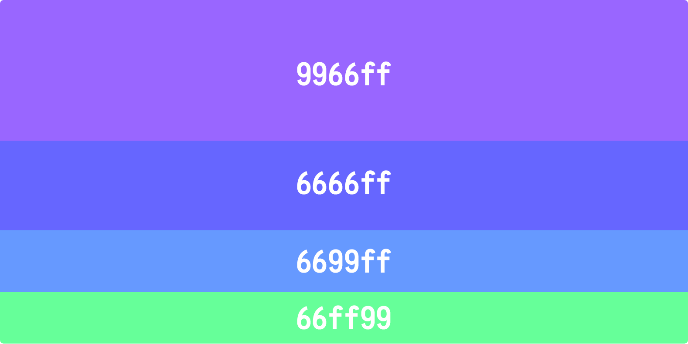
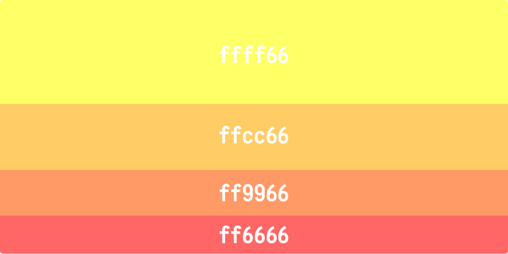
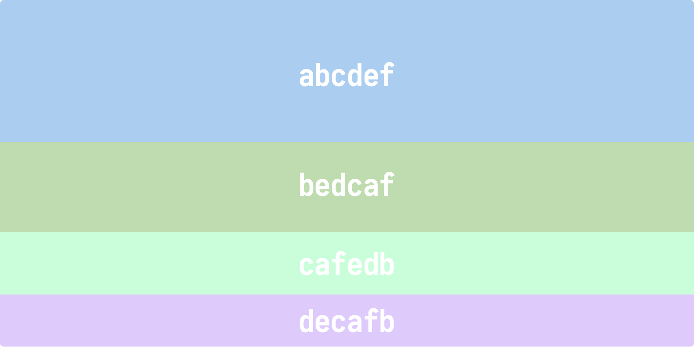
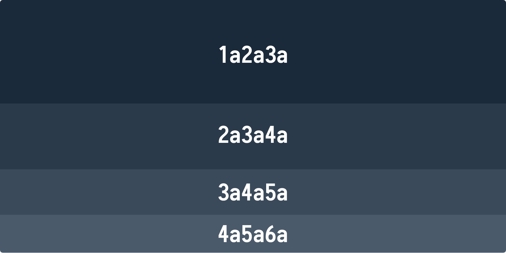
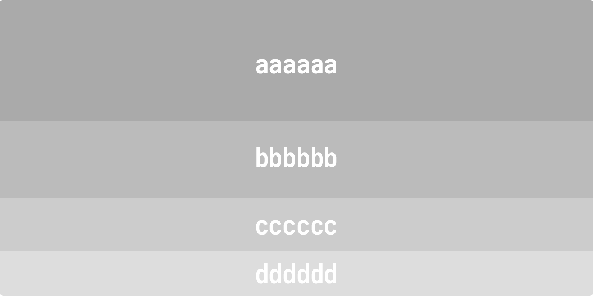

> 转载: [Easy to Remember Color Guide for Non-Designers - Send With SES](https://docs.sendwithses.com/random-stuff/easy-to-remember-color-guide-for-non-designers)

# Easy to Remember Color Guide for Non-Designers

**NOTE**: I'm not a designer. This is what i've self-learnt over the years because i couldn't afford good designers. I don't know if this is scientific. This works for me. I hope it works for you.

I think you already know that a color is represented by a [6 digit code](https://en.wikipedia.org/wiki/Web_colors) (hex code) containing any permutation of the the six alphabets **a,b,c,d,e,f** and the ten digits **0,1,2,3,4,5,6,7,8,9**. The hex codes i use and describe here are the ones i chanced upon over the years. They are easy to remember and i don't need to keep referring to any color picker tool.

For any app, you will need colors for ... 

1. Main Theme Color(s)
2. Text
3. Backgrounds, Boxes, Lines

## **1. Main Theme Color**

Remember VIBGYOR (Violet, Indigo, Blue, Green, Yellow, Orange, Red) from school days? You can generate a nice VIBGYOR palette using a permutation of just four codes **c, f, 6, 9** ... like so ...

Violet, Indigo, Blue, Green

Yellow, Orange, Another Orange, Red

The colors above are the softer side of their darker variants. The darker colors (for example the darkest red is ff000) are harsh on the eyes and are best avoided.

Prefer soft pastel colors instead? Just remember **a,b,c,d,e,f**. Using a permutation of these six codes (abcdef, bafedc, etc.) you can generate many soft pastel colors ... like below ...

Just A-B-C-D-E-F

## **2. Text**

Text is usually dark (blacks). Here also i tend to avoid the darkest darks (full black is 000000). I like the colors below because they give me a nice dark blue tint. The codes are also easy to remember. **1a2a3a** is darker and you can go all the way to **7a8a9a** which is lighter.

Text Colors

## **3. Backgrounds, Boxes, Lines**

These are usually grays (or 'greys' if you insist). Mostly used for backgrounds, table header or table row colors, lines, and, occasionally for text. These hex codes are the easiest to remember.

Grays 

That's all there is. Once you get a hang of this it becomes easy to play around and arrive at colors that you like better than what are presented here. I recommend https://colorhunt.co/. You should check out [Canva's Color Wheel](https://www.canva.com/colors/color-wheel/) too.