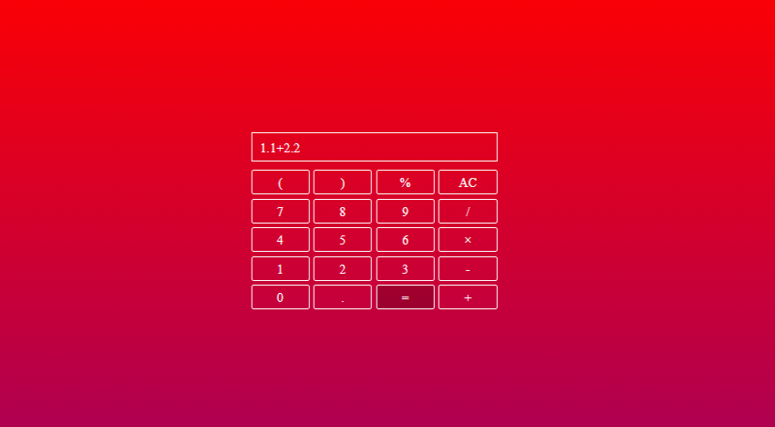
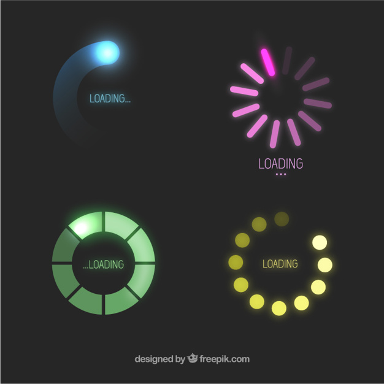
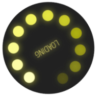

## Caculator

```html
<!DOCTYPE html>
<html lang="en">
    <head>
        <meta charset="UTF-8" />
        <meta name="viewport" content="width=device-width, initial-scale=1.0" />
        <title>caculator</title>
        <link rel="stylesheet" href="style.css" />
    </head>
    <body>
        <div class="caculator">
            <div class="view"></div>
            <div class="keybord">
                <p class="char-btn" data-char="(">(</p>
                <p class="char-btn" data-char=")">)</p>
                <p class="char-btn" data-char="%">%</p>
                <p id="clear-btn">AC</p>
                <p class="char-btn" data-char="7">7</p>
                <p class="char-btn" data-char="8">8</p>
                <p class="char-btn" data-char="9">9</p>
                <p class="char-btn" data-char="/">/</p>
                <p class="char-btn" data-char="4">4</p>
                <p class="char-btn" data-char="5">5</p>
                <p class="char-btn" data-char="6">6</p>
                <p class="char-btn" data-char="*">×</p>
                <p class="char-btn" data-char="1">1</p>
                <p class="char-btn" data-char="2">2</p>
                <p class="char-btn" data-char="3">3</p>
                <p class="char-btn" data-char="-">-</p>
                <p class="char-btn" data-char="0">0</p>
                <p class="char-btn" data-char=".">.</p>
                <p id="result-btn">=</p>
                <p class="char-btn" data-char="+">+</p>
            </div>
        </div>
        <script>
            const view = document.querySelector(".view");
            const charBtns = document.querySelectorAll(".char-btn");
            const clearBtn = document.querySelector("#clear-btn");
            const resultBtn = document.querySelector("#result-btn");

            charBtns.forEach((btn) => {
                btn.addEventListener("click", function () {
                    const char = this.getAttribute("data-char");
                    view.innerHTML += char;
                });
            });

            clearBtn.addEventListener("click", function () {
                view.innerHTML = "";
            });

            resultBtn.addEventListener("click", function () {
                const result = eval(view.innerHTML);
                view.innerHTML = result;
            });
        </script>
    </body>
</html>
```

style.css

```css
* {
    margin: 0;
    padding: 0;
    box-sizing: border-box;
}

body {
    height: 100vh;
    background: linear-gradient(red, purple);
}

.caculator {
    margin: 200px auto;
    width: 300px;
    color: white;
}

.view {
    height: 36px;
    line-height: 36px;
    border: 1px solid white;
    padding-left: 10px;
    margin-bottom: 10px;
}

.keybord {
    display: grid;
    grid-template-columns: 1fr 1fr 1fr 1fr;
    /* Specifies the size of implicitly created rows */
    grid-auto-rows: 30px;
    /* grid-gap is obsolete, use gap or column-gap or row-gap */
    gap: 5px;
    text-align: center;
}

.keybord p {
    /* background-color: transparent; */
    border-radius: 3px;
    line-height: 30px;
    cursor: pointer;
    transition: background-color 0.3s ease-in-out;
    border: 1px solid white;
}

.keybord p:hover {
    background-color: rgba(0, 0, 0, 0.2);
}
```



## Load Animation

sprite.jpg



index.html

```html
<!DOCTYPE html>
<html lang="en">
    <head>
        <meta charset="UTF-8" />
        <meta name="viewport" content="width=device-width, initial-scale=1.0" />
        <meta http-equiv="X-UA-Compatible" content="ie=edge" />
        <title>Animation</title>
        <link rel="stylesheet" href="style.css" />
    </head>
    <body>
        <div class="box"></div>
    </body>
</html>
```

style.css

```css
.box {
    width: 200px;
    height: 200px;
    border-radius: 50%;
    background: url("sprite.jpg") no-repeat -353px -330px;
    animation: round 2s steps(12) infinite;
}

@keyframes round {
    100% {
        transform: rotate(360deg);
    }
}
```


