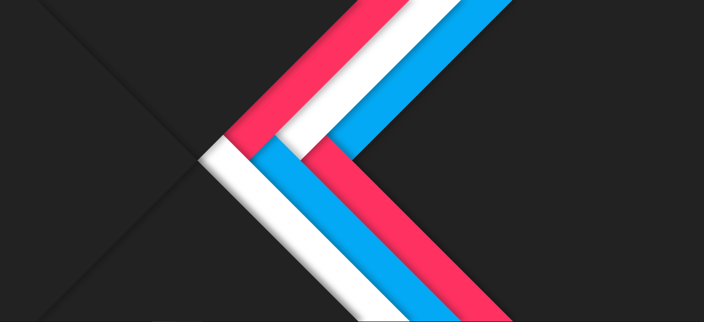
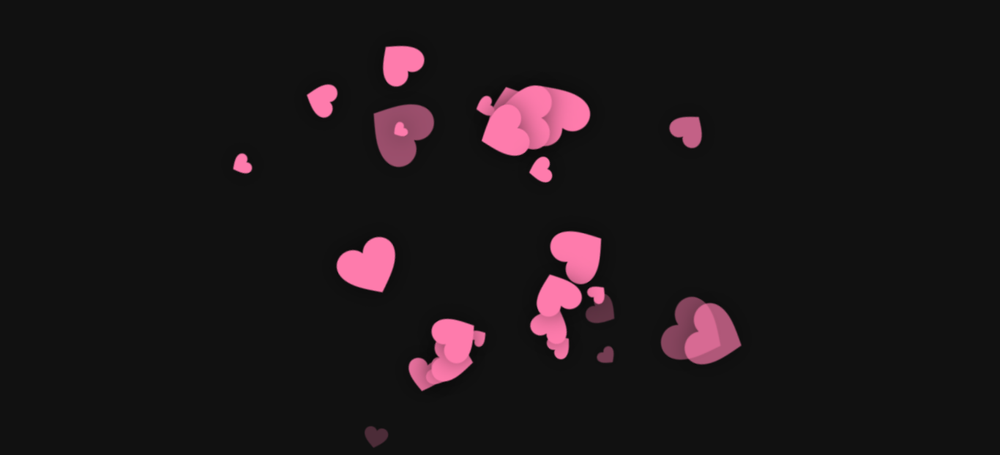
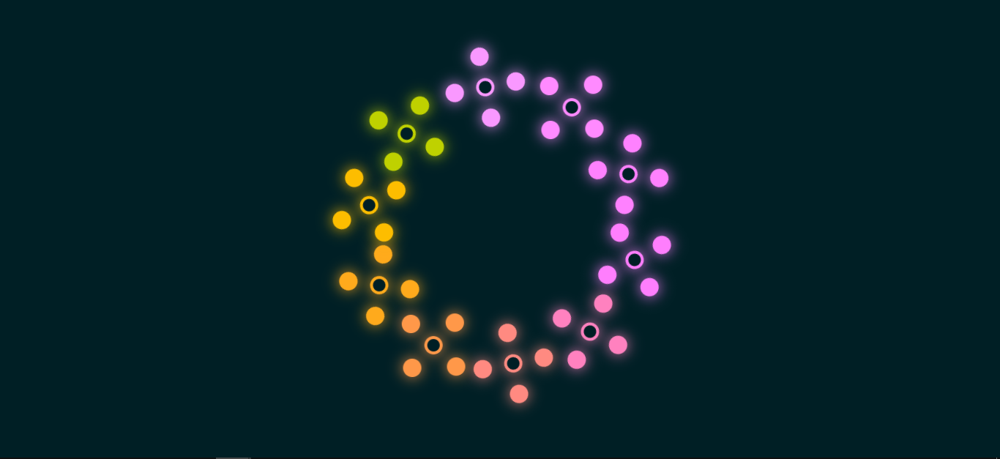

## Calculator

```html
<!DOCTYPE html>
<html lang="en">
    <head>
        <meta charset="UTF-8" />
        <meta name="viewport" content="width=device-width, initial-scale=1.0" />
        <title>calculator</title>
        <link rel="stylesheet" href="style.css" />
    </head>
    <body>
        <div class="caculator">
            <div class="view"></div>
            <div class="keybord">
                <p class="char-btn" data-char="(">(</p>
                <p class="char-btn" data-char=")">)</p>
                <p class="char-btn" data-char="%">%</p>
                <p id="clear-btn">AC</p>
                <p class="char-btn" data-char="7">7</p>
                <p class="char-btn" data-char="8">8</p>
                <p class="char-btn" data-char="9">9</p>
                <p class="char-btn" data-char="/">/</p>
                <p class="char-btn" data-char="4">4</p>
                <p class="char-btn" data-char="5">5</p>
                <p class="char-btn" data-char="6">6</p>
                <p class="char-btn" data-char="*">×</p>
                <p class="char-btn" data-char="1">1</p>
                <p class="char-btn" data-char="2">2</p>
                <p class="char-btn" data-char="3">3</p>
                <p class="char-btn" data-char="-">-</p>
                <p class="char-btn" data-char="0">0</p>
                <p class="char-btn" data-char=".">.</p>
                <p id="result-btn">=</p>
                <p class="char-btn" data-char="+">+</p>
            </div>
        </div>
        <script>
            const view = document.querySelector(".view");
            const charBtns = document.querySelectorAll(".char-btn");
            const clearBtn = document.querySelector("#clear-btn");
            const resultBtn = document.querySelector("#result-btn");

            charBtns.forEach((btn) => {
                btn.addEventListener("click", function () {
                    const char = this.getAttribute("data-char");
                    view.innerHTML += char;
                });
            });

            clearBtn.addEventListener("click", function () {
                view.innerHTML = "";
            });

            resultBtn.addEventListener("click", function () {
                const result = eval(view.innerHTML);
                view.innerHTML = result;
            });
        </script>
    </body>
</html>
```

```css
* {
    margin: 0;
    padding: 0;
    box-sizing: border-box;
}

body {
    height: 100vh;
    background: linear-gradient(red, purple);
}

.caculator {
    margin: 200px auto;
    width: 300px;
    color: white;
}

.view {
    height: 36px;
    line-height: 36px;
    border: 1px solid white;
    padding-left: 10px;
    margin-bottom: 10px;
}

.keybord {
    display: grid;
    grid-template-columns: 1fr 1fr 1fr 1fr;
    /* Specifies the size of implicitly created rows */
    grid-auto-rows: 30px;
    /* grid-gap is obsolete, use gap or column-gap or row-gap */
    gap: 5px;
    text-align: center;
}

.keybord p {
    /* background-color: transparent; */
    border-radius: 3px;
    line-height: 30px;
    cursor: pointer;
    transition: background-color 0.3s ease-in-out;
    border: 1px solid white;
}

.keybord p:hover {
    background-color: rgba(0, 0, 0, 0.2);
}
```


## Load Animation


```html
<!DOCTYPE html>
<html lang="en">
    <head>
        <meta charset="UTF-8" />
        <meta name="viewport" content="width=device-width, initial-scale=1.0" />
        <meta http-equiv="X-UA-Compatible" content="ie=edge" />
        <title>Animation</title>
        <link rel="stylesheet" href="style.css" />
    </head>
    <body>
        <div class="box"></div>
    </body>
</html>
```

```css
.box {
    width: 200px;
    height: 200px;
    border-radius: 50%;
    background: url("sprite.jpg") no-repeat -353px -330px;
    animation: round 2s steps(12) infinite;
}

@keyframes round {
    100% {
        transform: rotate(360deg);
    }
}
```


## Abstract Background

```html
<!DOCTYPE html>
<html lang="en">
    <head>
        <meta charset="UTF-8" />
        <meta http-equiv="X-UA-Compatible" content="IE=edge" />
        <meta name="viewport" content="width=device-width, initial-scale=1.0" />
        <title>Background</title>
        <style>
            * {
                margin: 0;
                padding: 0;
                box-sizing: border-box;
            }

            section {
                position: relative;
                width: 100%;
                height: 100vh;
                background: #222;
                overflow: hidden;
            }

            .layer {
                position: absolute;
                top: 0;
                left: -50%;
                width: 100%;
                height: 100vh;
                box-shadow: 10px 0 10px rgba(0, 0, 0, 0.25);
            }

            .layer1 {
                background: #03a9f4;
                transform: skewX(-45deg) translateX(0);
                z-index: 1;
            }

            .layer2 {
                background: #fff;
                transform: skewX(-45deg) translateX(-100px);
                z-index: 3;
            }

            .layer3 {
                background: #ff3161;
                transform: skewX(-45deg) translateX(-200px);
                z-index: 5;
            }

            .layer4 {
                background: #222;
                transform: skewX(-45deg) translateX(-300px);
                z-index: 10;
            }

            .layer5 {
                background: #ff3161;
                transform: skewX(45deg);
                z-index: 2;
            }

            .layer6 {
                background: #03a9f4;
                transform: skewX(45deg) translateX(-100px);
                z-index: 4;
            }

            .layer7 {
                background: #fff;
                transform: skewX(45deg) translateX(-200px);
                z-index: 6;
            }

            .layer8 {
                background: #222;
                transform: skewX(45deg) translateX(-300px);
                z-index: 8;
            }

            .layer9 {
                background: transparent;
                transform: skewX(45deg) translateX(-300px);
                z-index: 10;
            }
        </style>
    </head>
    <body>
        <section>
            <div class="layer layer1"></div>
            <div class="layer layer2"></div>
            <div class="layer layer3"></div>
            <div class="layer layer4"></div>
            <div class="layer layer5"></div>
            <div class="layer layer6"></div>
            <div class="layer layer7"></div>
            <div class="layer layer8"></div>
            <div class="layer layer9"></div>
        </section>
    </body>
</html>
```



## Mouse Move with Hearts


```html
<!DOCTYPE html>
<html lang="en">
    <head>
        <meta charset="UTF-8" />
        <meta http-equiv="X-UA-Compatible" content="IE=edge" />
        <meta name="viewport" content="width=device-width, initial-scale=1.0" />
        <title>Hearts</title>
        <style>
            * {
                margin: 0;
                padding: 0;
                box-sizing: border-box;
            }

            body {
                min-height: 100vh;
                background: #111;
                overflow: hidden;
            }

            span {
                position: absolute;
                pointer-events: none;
                filter: drop-shadow(0 0 15px rgba(0, 0, 0, 0.5));
                animation: fadeInOut 1s linear infinite;
            }

            @keyframes fadeInOut {
                0%,
                100% {
                    opacity: 0;
                }

                20%,
                80% {
                    opacity: 1;
                }
            }

            span::before {
                content: "";
                position: absolute;
                width: 100%;
                height: 100%;
                background: url(heart.png);
                background-size: contain;
                background-repeat: no-repeat;
                animation: moveShape 1s linear infinite;
            }

            @keyframes moveShape {
                0% {
                    transform: translate(0) rotate(0deg);
                }

                100% {
                    transform: translate(300px) rotate(300deg);
                }
            }
        </style>
    </head>
    <body>
        <script>
            document.addEventListener("mousemove", function (e) {
                const body = document.querySelector("body");
                const heart = document.createElement("span");
                const x = e.offsetX;
                const y = e.offsetY;
                heart.style.left = x + "px";
                heart.style.top = y + "px";

                const size = Math.random() * 80;
                heart.style.width = 20 + size + "px";
                heart.style.height = 20 + size + "px";

                const transformValue = Math.random() * 360;
                heart.style.transform = `rotate(${transformValue}deg)`;

                body.appendChild(heart);

                setTimeout(() => {
                    heart.remove();
                }, 1000);
            });
        </script>
    </body>
</html>
```



## Responsive Login

```html
<!DOCTYPE html>
<html lang="en">
    <head>
        <meta charset="UTF-8" />
        <meta http-equiv="X-UA-Compatible" content="IE=edge" />
        <meta name="viewport" content="width=device-width, initial-scale=1.0" />
        <title>Responsive Login</title>
        <style>
            * {
                margin: 0;
                padding: 0;
            }

            .content {
                width: 100vw;
                height: 100vh;
                /* background-color: aqua; */
                background: url(./images/bg.jpg) no-repeat;
                display: flex;
                justify-content: center;
                align-items: center;
            }

            .login-content {
                position: relative;
                width: 800px;
                height: 360px;
                background-color: rgb(52, 0, 73);
                border-radius: 30px;
                padding: 30px;
            }

            .banner-box {
                display: inline-block;
                width: 500px;
                height: 100%;
                /* background-color: rgb(0, 92, 92); */
                background: url(./images/bg.jpg) no-repeat;
                background-size: cover;
                border-radius: 20px 0 0 20px;
            }

            .login-box {
                width: 330px;
                height: 100%;
                /* background-color: rgb(172, 106, 26); */
                position: absolute;
                top: 0;
                right: 0;
                border-radius: 0 30px 30px 0;
                display: flex;
                flex-direction: column;
                align-items: center;
            }

            .login-box > h1 {
                font-size: 36px;
                margin: 60px 0;
                color: #fff;
            }

            .login-box > input {
                margin-bottom: 20px;
                width: 200px;
                height: 36px;
                padding: 0 20px;
                border-radius: 36px;
                border: none;
                outline: none;
                font-size: 18px;
            }

            .login-btn {
                margin-top: 20px;
                width: 200px;
                height: 40px;
                background-color: rgb(122, 0, 223);
                border-radius: 40px;
                border: none;
                color: #fff;
                font-size: 18px;
            }

            @media screen and (max-width: 900px) {
                .login-content {
                    margin: 0 30px;
                }

                .banner-box {
                    border-radius: 20px;
                }

                .login-box {
                    background-color: rgba(52, 0, 73, 0.5);
                }
            }

            @media screen and (max-width: 600px) {
                .content {
                    background: url(./images/bg.jpg) no-repeat center;
                }

                .login-content {
                    background-color: rgba(52, 0, 73, 0);
                }

                .banner-box {
                    display: none;
                }

                .login-box {
                    position: initial;
                    margin: -40px auto;
                    background-color: rgba(52, 0, 73, 0);
                }
            }
        </style>
    </head>
    <body>
        <div class="content">
            <div class="login-content">
                <a href="" class="banner-box"></a>
                <div class="login-box">
                    <h1>账号登录</h1>
                    <input type="text" placeholder="账号" />
                    <input type="text" placeholder="密码" />
                    <button class="login-btn">登录</button>
                </div>
            </div>
        </div>
    </body>
</html>
```


## Animation with Hover Effects

```html
<!DOCTYPE html>
<html lang="en">
    <head>
        <meta charset="UTF-8" />
        <meta http-equiv="X-UA-Compatible" content="IE=edge" />
        <meta name="viewport" content="width=device-width, initial-scale=1.0" />
        <title>Creative Animation & Hover Effects</title>
        <style>
            * {
                margin: 0;
                padding: 0;
                box-sizing: border-box;
            }

            body {
                display: flex;
                justify-content: center;
                align-items: center;
                min-height: 100vh;
                overflow: hidden;
                background: #001f25;
            }

            .loader {
                position: relative;
                width: 300px;
                height: 300px;
            }

            .loader span {
                position: absolute;
                top: 0;
                left: 0;
                width: 100%;
                height: 100%;
                transform: rotate(calc(36deg * var(--i)));
            }

            .loader span::before {
                content: "";
                position: absolute;
                top: 0;
                left: 0;
                width: 25px;
                height: 25px;
                background: transparent;
                border: 4px solid #00efff;
                border-radius: 50%;
                box-sizing: border-box;
                box-shadow: 0 0 20px #00efff, -30px -30px 0 #00efff,
                    -30px -30px 20px #00efff, 30px 30px 0 #00efff,
                    30px 30px 20px #00efff, 30px -30px 0 #00efff,
                    30px -30px 20px #00efff, -30px 30px 0 #00efff,
                    -30px 30px 20px #00efff;
                animation: animate 5s linear infinite;
                animation-delay: calc(-0.25s * var(--i));
                transform-origin: 20px;
                transition: 2s;
            }

            .loader:hover span::before {
                transform-origin: 200px;
                box-shadow: 0 0 20px #00efff, -200px -200px 0 #00efff,
                    -200px -200px 20px #00efff, 200px 200px 0 #00efff,
                    200px 200px 20px #00efff, 200px -200px 0 #00efff,
                    200px -200px 20px #00efff, -200px 200px 0 #00efff,
                    -200px 200px 20px #00efff;
            }

            @keyframes animate {
                0% {
                    transform: rotate(0deg);
                    filter: hue-rotate(0deg);
                }

                100% {
                    transform: rotate(360deg);
                    filter: hue-rotate(360deg);
                }
            }
        </style>
    </head>

    <body>
        <div class="loader">
            <span style="--i: 1"></span><span style="--i: 2"></span
            ><span style="--i: 3"></span><span style="--i: 4"></span
            ><span style="--i: 5"></span><span style="--i: 6"></span
            ><span style="--i: 7"></span><span style="--i: 8"></span
            ><span style="--i: 9"></span><span style="--i: 10"></span>
        </div>
    </body>
</html>
```



