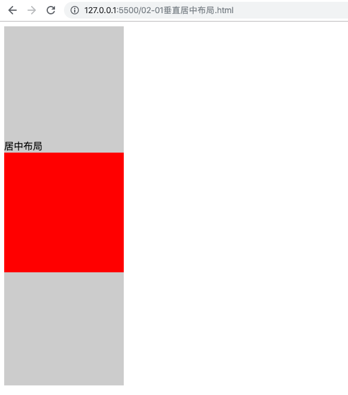
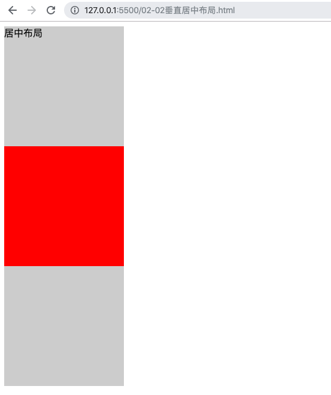
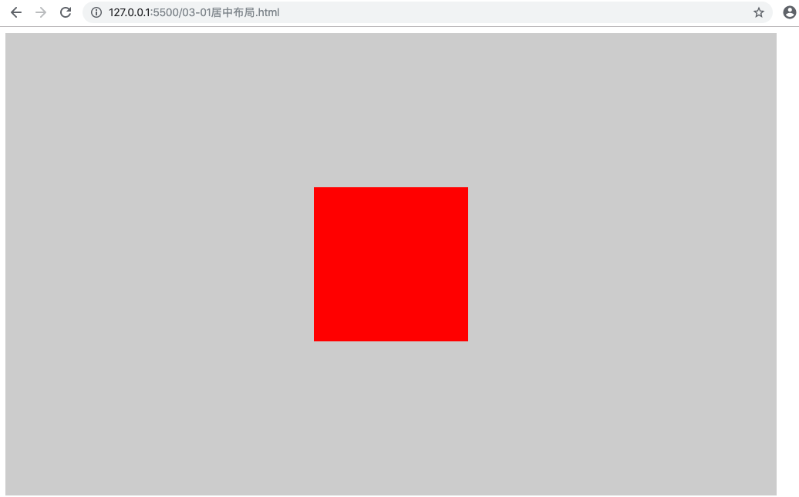

### 水平居中布局

**方式一**

父级元素开启定位

```css
.parent {
    position: relative;
}
```

当前需要居中的子元素设置 position 和 transform

```css
.child {
    position: absolute;
    left: 50%;
    transform: translateX(-50%);
}
```

优点：父级元素是否脱离文档流，不影响子级元素居中效果

缺点：transform 是 css3 中新增属性，浏览器支持情况不好


```html
<!DOCTYPE html>
<html lang="en">
    <style>
        .parent {
            width: 100%;
            height: 200px;
            background-color: #ccc;

            /* 开启定位 */
            position: relative;
        }

        .child {
            width: 200px;
            height: 200px;
            background-color: #f00;

            /**
             * 当前元素设置为绝对定位后：
             * 如果父级元素没有开启定位的话，当前元素相对于页面定位
             * 如果父级元素开启了定位的话，当前元素相对于父级元素定位
             */
            position: absolute;
            left: 50%;
            transform: translateX(-50%);
        }
    </style>

    <body>
        <div class="parent">
            <div class="child">水平居中</div>
        </div>
    </body>
</html>
```


### 垂直居中布局

**方式一**

父元素设置 `display: table-cell; vertical-align: middle;`

```css
.parent {
    display: table-cell;
    vertical-align: middle;
}
```

优点：浏览器兼容性好

缺点：vertical-align 会导致父级元素中的文本也会垂直居中对齐


```html
<!DOCTYPE html>
<html lang="en">
    <style>
        .parent {
            width: 200px;
            height: 600px;
            background-color: #ccc;

            /**
         * display:
         *  table: 设置当前元素为<table>元素
         *  table-cell: 设置当前元素为<td>元素（单元格), 可以使用 vertical-align 设置对齐方式
         */
            display: table-cell;

            /**
         * vertical-align 用于设置文本的垂直对齐方式
         *  top
         *  middle
         *  bottom
         */
            vertical-align: middle;
        }

        .child {
            width: 200px;
            height: 200px;
            background-color: #f00;
        }
    </style>
    <body>
        <div class="parent">
            居中布局
            <div class="child"></div>
        </div>
    </body>
</html>
```



**方式二**


优点：父级元素是否脱离文档流，不影响子级元素居中效果

缺点：transform 是 css3 中新增属性，浏览器支持情况不好


```html
<!DOCTYPE html>
<html lang="en">
    <style>
        .parent {
            width: 200px;
            height: 600px;
            background-color: #ccc;

            position: relative;
        }

        .child {
            width: 200px;
            height: 200px;
            background-color: #f00;

            position: absolute;
            top: 50%;
            transform: translateY(-50%);
        }
    </style>
    <body>
        <div class="parent">
            居中布局
            <div class="child"></div>
        </div>
    </body>
</html>
```



### 水平垂直居中布局

**方式一**


优点：浏览器兼容性好

缺点：需要在父级元素和子级元素同时设置样式,语义差


```html
<!DOCTYPE html>
<html lang="en">
    <style>
        .parent {
            width: 1000px;
            height: 600px;
            background-color: #ccc;

            display: table-cell; /* <td> */
            vertical-align: middle;
        }

        .child {
            width: 200px;
            height: 200px;
            background-color: #f00;

            /* display: table; */ /* <table> */
            /* display: block; */
            margin: 0 auto;
        }
    </style>
    <body>
        <div class="parent">
            <div class="child"></div>
        </div>
    </body>
</html>
```



**方式二**


优点：语义好

缺点：需要在父级元素和子级元素同时设置样式, 浏览器兼容性不好


```html
<!DOCTYPE html>
<html lang="en">
    <head>
        <meta charset="UTF-8" />
        <meta name="viewport" content="width=device-width, initial-scale=1.0" />
        <meta http-equiv="X-UA-Compatible" content="ie=edge" />
        <title>Document</title>
    </head>
    <style>
        .parent {
            width: 1000px;
            height: 600px;
            background-color: #ccc;

            position: relative;
        }

        .child {
            width: 200px;
            height: 200px;
            background-color: #f00;

            position: absolute;
            top: 50%;
            left: 50%;
            transform: translate(-50%, -50%);
        }
    </style>
    <body>
        <div class="parent">
            <div class="child"></div>
        </div>
    </body>
</html>
```

### 两列布局

两列布局一般情况下是指定宽度与子适应布局，两列中左列是确定宽度，右列是自动填满剩余空间的一种效果。

**方式一**


优点：实现方式简单

缺点：

自适应元素的 margin 属性元素需要与定宽元素的宽度保持一致

定宽元素浮动但是自适应元素不浮动会导致浏览器兼容性问题 ???

自适应元素的子元素不能使用 clear: both ???


```html
<!DOCTYPE html>
<html lang="en">
    <style>
        .left,
        .right {
            height: 300px;
        }

        .left {
            /* 定宽 */
            width: 300px;
            background-color: #ff0000;

            float: left;
        }

        .right {
            background-color: #ccc;

            margin-left: 300px;
        }

        /*
        .inner {
            height: 300px;
            background-color: green;

            clear: both;
        }
        */
    </style>
    <body>
        <div class="left"></div>
        <div class="right">
            <div class="inner"></div>
        </div>
    </body>
</html>
```


**方式二**

优点：

解决了定宽元素浮动但是自适应元素不浮动会导致浏览器兼容性问题

解决了自适应元素的子元素不能使用 clear: both

缺点：

自适应元素的 margin 属性元素需要与定宽元素的宽度保持一致

实现复杂


```html
<!DOCTYPE html>
<html lang="en">
    <style>
        .left,
        .right {
            height: 300px;
        }

        .left {
            /* 定宽 */
            width: 300px;
            background-color: #ff0000;

            float: left;
            /* 设置显示层级更高，position 显示层级高于 float, 所以左列显示层级高于右列 */
            position: relative;
        }

        .right-fix {
            float: right; /*设置为浮动会导致默认宽度为0，所以需要设置 width*/
            width: 100%;
            margin-left: -400px; /*必须大于300px*/
            background-color: hotpink;
        }

        .right {
            /* 会覆盖父类的 bgc */
            background-color: #ccc;
        }

        .inner {
            background-color: green;
            height: 300px;
            clear: both;
        }
    </style>
    <body>
        <div class="left"></div>
        <div class="right-fix">
            <div class="right">
                <div class="inner"></div>
            </div>
        </div>
    </body>
</html>
```


without .left { position: relative} and inner

```html
<!DOCTYPE html>
<html lang="en">
    <style>
        .left,
        .right {
            height: 300px;
        }

        .left {
            /* 定宽 */
            width: 300px;
            background-color: #ff0000;

            float: left;
            /* 设置显示层级更高，position 显示层级高于 float, 所以左列显示层级高于右列 */
            /* position: relative; */
        }

        .right-fix {
            float: right;
            /* 设置为浮动会导致默认宽度为0 */
            width: 100%;
            margin-left: -400px;
            background-color: hotpink;
        }

        .right {
            /* 会覆盖父类的 bgc */
            background-color: #ccc;
        }

        /* .inner {
        background-color: green;
        height: 300px;
        clear: both;
    } */
    </style>

    <body>
        <div class="left"></div>
        <div class="right-fix">
            <div class="right">
                <div class="inner"></div>
            </div>
        </div>
    </body>
</html>
```


**方式二**


优点：

实现方式简单

右列不依赖于左列的宽度

定宽元素浮动与自适应元素不浮动导致浏览器兼容性问题, BFC 模式不存在这个问题 ???

缺点：overflow 属性不仅解决了两列布局问题，同时设置了内容溢出

实现复杂


```html
<!DOCTYPE html>
<html lang="en">
    <style>
        .left,
        .right {
            height: 300px;
        }

        .left {
            /* 定宽 */
            width: 300px;
            background-color: #ff0000;

            float: left;
        }

        .right {
            background-color: #ccc;

            /* 开启 BFC 模式 - 当前元素的内部环境与外界完全隔离 ??? */
            overflow: hidden;
        }
    </style>
    <body>
        <div class="left"></div>
        <div class="right"></div>
    </body>
</html>
```

**方式三**


优点：浏览器兼容性好

缺点：会存在表格的一些问题


```html
<!DOCTYPE html>
<html lang="en">
    <style>
        .parent {
            /* 表格的单元格格宽度会自动分配 */
            display: table;
            table-layout: fixed; /* ??? */

            width: 100%;
        }

        .left,
        .right {
            height: 300px;

            display: table-cell;
        }

        .left {
            /* 定宽 */
            width: 300px;
            background-color: #ff0000;
        }

        .right {
            background-color: #ccc;
        }
    </style>

    <body>
        <div class="parent">
            <div class="left"></div>
            <div class="right"></div>
        </div>
    </body>
</html>
```

### 三列布局

#### 定宽 + 定宽 + 自适应


```html
<!DOCTYPE html>
<html lang="en">
    <style>
        .left,
        .center,
        .right {
            height: 300px;
        }

        .left {
            /* 定宽 */
            width: 300px;
            background-color: #ff0000;

            float: left;
        }

        .center {
            /* 定宽 */
            width: 300px;
            background-color: green;

            float: left;
        }

        .right {
            background-color: #ccc;

            margin-left: 600px;
        }
    </style>
    <body>
        <div class="left"></div>
        <div class="center"></div>
        <div class="right"></div>
    </body>
</html>
```


#### 定宽 + 自适应 + 定宽(圣杯布局)

**方式一**


缺点: center 页面核心元素放在最下面，不利于搜索引擎搜索，搜索引擎按照页面顺序搜索

```html
<!DOCTYPE html>
<html lang="en">
    <style>
        .left,
        .center,
        .right {
            height: 300px;
        }

        .left,
        .right {
            width: 300px;
        }

        .left {
            background-color: #ff0000;

            float: left;
        }

        .center {
            background-color: green;

            margin-left: 300px;
            margin-right: 300px;
        }

        .right {
            background-color: #ccc;

            float: right;
        }
    </style>

    <body>
        <div class="left"></div>
        <!-- 
    <div class="center"></div>
    浮动元素放在非浮动元素的后面，浮动元素会换行
    <div class="right"></div> 
    -->

        <!--float 元素放在前面-->
        <div class="right"></div>
        <div class="center"></div>
    </body>
</html>
```


**方式二**

解决圣杯布局 center 在页面最下面的问题

```html
<!DOCTYPE html>
<html lang="en">
    <style>
        .parent {
            height: 300px;

            margin-left: 300px;
            margin-right: 300px;
        }

        .left,
        .center,
        .right {
            height: 300px;

            float: left;
        }

        .left,
        .right {
            width: 300px;
        }

        .left {
            background-color: #ff0000;

            /* 将当前元素从当前行移动到上一行同一个位置 */
            margin-left: -100%;

            /* 将当前元素移动到理想位置，center 的左边 */
            position: relative;
            left: -300px; /* 需要设置position */
        }

        .center {
            /* div 默认宽度是父级元素的 100%, 设置 float 后会失效，
           没有设置宽度，默认宽度就为 0 */
            width: 100%;
            background-color: green;
        }

        .right {
            background-color: #ccc;
            /* 将当前元素从当前行移动到上一行 center 最右边
           当前元素的最右边和 center 最右边重合, 因为 parent 设置了 margin-right: 300px */
            margin-left: -300px;

            position: relative;
            right: -300px;
        }
    </style>

    <body>
        <div class="parent">
            <div class="center"></div>
            <div class="left"></div>
            <div class="right"></div>
        </div>
    </body>
</html>
```

**方式三**

```html
<!DOCTYPE html>
<html lang="en">
    <style>
        .parent {
            height: 300px;
        }

        .left,
        .center,
        .right {
            height: 300px;
            float: left;
        }

        .left,
        .right {
            width: 300px;
        }

        .left {
            background-color: #ff0000;

            /* 将当前元素从当前行移动到上一行同一个位置 */
            margin-left: -100%;
        }

        .center {
            /* div 默认宽度是父级元素的 100%, 设置 float 后会失效，
           没有设置宽度，默认宽度就为 0 */
            width: 100%;
            background-color: green;
        }

        .right {
            background-color: #ccc;
            /* 将当前元素从当前行移动到上一行 center 最右边
           当前元素的最左边边和 center 最右边重合，因为 parent 没有设置 margin-right: 300px*/
            margin-left: -300px;
        }

        .inner {
            height: 300px;
            background-color: hotpink;

            margin-left: 300px;
            margin-right: 300px;
        }
    </style>

    <body>
        <div class="parent">
            <div class="center">
                <div class="inner"></div>
            </div>
            <div class="left"></div>
            <div class="right"></div>
        </div>
    </body>
</html>
```


