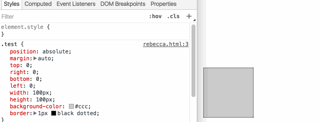

> 转载：[The "Hidden" Purple Memorial in Your Web Browser | by Victor Algaze | Medium](https://medium.com/@valgaze/the-hidden-purple-memorial-in-your-web-browser-7d84813bb416)

I recently encountered a visual bug where the style I was attempting to apply to an SVG element just wasn't working. My first instinct when debugging a tricky styling issue is to fire up Chrome Dev Tools and attempt a sanity-test. I usually start by setting the misbehaving element to a noisy and ugly CSS color value like 'blue' or 'red' and examine any clues.

To my surprise, when I typed the first two letters of "red" — just "re" — the element was filled with purple. Was "re" some type of new obscure shorthand?

It turns out that Chrome Dev Tools was autcompleting "re" to a named CSS color I had never encountered before. The color was named "**rebeccapurple**"

## What's rebeccapurple?

That autocomplete behavior led to me to learn about a tiny gesture of kindness/remembrance that is baked in to [every](https://bugs.webkit.org/show_bug.cgi?id=133804) [major](https://bugs.webkit.org/show_bug.cgi?id=133804) [web browser](https://bugzilla.mozilla.org/show_bug.cgi?id=1024642) and has been [part of the official CSS standard](https://drafts.csswg.org/css-color/#valdef-color-rebeccapurple) since 2014.

Purple was the favorite color of Rebecca Alison Meyer who passed away twelve hours into her sixth birthday from brain cancer. Rebecca was the daughter of prolific [CSS standards pioneer Eric Meyer](http://meyerweb.com/). Eric kept his online colleagues informed of the battle his daughter and family were waging through blog posts and brief updates on Twitter.

After hearing the awful news, designer/author Jeffrey Zeldman decided to do _something_ and started a [Twitter hashtag campaign in her memory](http://www.zeldman.com/2014/06/10/the-color-purple/):

> It's so easy to do, there's no reason not to. Go to Twitter on 12 June and post the hashtag #663399Becca along with any additional words or pictures you feel moved to share. Or just share the hashtag. **It will not be enough. Nothing will ever be enough. But it will be something.**

What started as a hashtag charity campaign evidently transformed into a much larger project. Given Eric's prolific work on CSS, it was proposed that the hex-value #663399, a shade of purple, be aliased to "beccapurple."

When informed of the initiative, Eric had one request if the standards body were to adopt the proposal: call it "rebeccapurple" instead. [Eric writes that](http://meyerweb.com/eric/thoughts/2014/06/19/rebeccapurple/) "_Rebecca informed us that she was about to be a big girl of six years old, and Becca was a baby name. Once she turned six, she wanted everyone (not just me) to call her Rebecca, not Becca_."

In late June 2014 the proposal was finalized and "_rebeccapurple_" was now officially the color purple with a hex value of #663399.

> "The ability just to connect to each other and help each other — that feature, that fundamental aspect of the web helped me survive the last couple of years. And I don't know where I'd be without the ability to share what I was experiencing and just in blogging about stuff and sharing things and having people say '**Man, we hear you. And we're here**.' Really helped me in profound ways, ways I don't think I could ever express and that most of those people will never know. The web made all that possible. And I love that that capability is there." — Eric Mayer

I sure didn't expect a silly CSS problem to reveal so much kindness.

If nothing else, the next time you find yourself trying to pick a color or debug a fussy element, how about "_rebeccapurple_"?

## Further Reading:

- http://www.zeldman.com/2014/06/10/the-color-purple/
- http://www.economist.com/blogs/babbage/2014/06/digital-remembrance
- http://meyerweb.com/eric/thoughts/2014/06/10/so-many-nevers/
- http://lists.w3.org/Archives/Public/www-style/2014Jun/0312.html
- http://meyerweb.com/eric/thoughts/2014/06/05/the-thief-of-light/
- http://www.cleveland.com/metro/index.ssf/2014/06/a_young_girls_death_on_her_bir.html
- http://meyerweb.com/eric/thoughts/2014/06/05/the-thief-of-light/
- http://www.metafilter.com/140112/A-hue-angle-of-270-degrees-a-saturation-of-50-and-a-lightness-of-40
- http://www.crockford.com/wrrrld/color.html
