## Font

### Units

| 单位      | 含义                                                       |
| --------- | ---------------------------------------------------------- |
| px        | 一个像素点，1920 x 1080                                    |
| em        | 相对父容器的 font-size 的倍数                              |
| rem       | 相对根元素(html) font-size 的倍数                          |
| vw/vh     | 相对 viewport width/height 的百分比，100vw， 100% 视口宽度 |
| vmin/vmax | 相对荧幕较短的一边/较长的一边(一般用于手机横竖屏)          |

em，第一层 div 的 font-size 是 body font-size 的两倍，即 20px，第二层 div font-size 是第一层的两倍，即 40px, 第三层 div font-size 是第二层的两倍，即 80px.

```html
<!DOCTYPE html>
<html lang="en">
  <head>
    <meta charset="UTF-8" />
    <meta name="viewport" content="width=device-width, initial-scale=1.0" />
    <title>unit</title>
    <style>
      html {
        font-size: 30px;
      }

      body {
        font-size: 10px;
      }

      div {
        border: 2px solid black;
        margin: 4px;
        font-size: 2em;
      }
    </style>
  </head>
  <body>
    <div>
      Coding
      <div>
        Coding
        <div>Coding</div>
      </div>
    </div>
  </body>
</html>
```

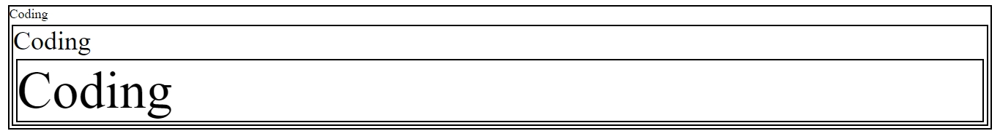

rem，替换上边 div 中的 font-size: 2em 为 font-size: 2rem, div 的 font-size 都为根元素 html font-size: 30px 的两倍即 60px

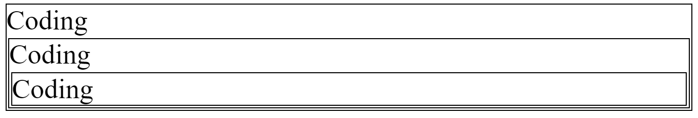

vw，vh， 100vw，100vh 可以全屏显示。

```html
<!DOCTYPE html>
<html lang="en">
  <head>
    <meta charset="UTF-8" />
    <meta name="viewport" content="width=device-width, initial-scale=1.0" />
    <title>viewport width & viewport height</title>
    <style>
      body {
        margin: 0;
        padding: 0;
      }

      .box {
        width: 50%;
      }

      .son {
        background-color: brown;
        width: 100vw;
        height: 100vh;
      }
    </style>
  </head>
  <body>
    <div class="box">
      <div class="son"></div>
    </div>
  </body>
</html>
```

vw 和 % 区别是，vw 始终相对于视口，% 相对于父元素，将 div.son 中的 width: 100vw 替换为 width: 100%, 此时只会显示屏幕宽度的一半，因为 div.son 的父元素 div.box width: 50%.

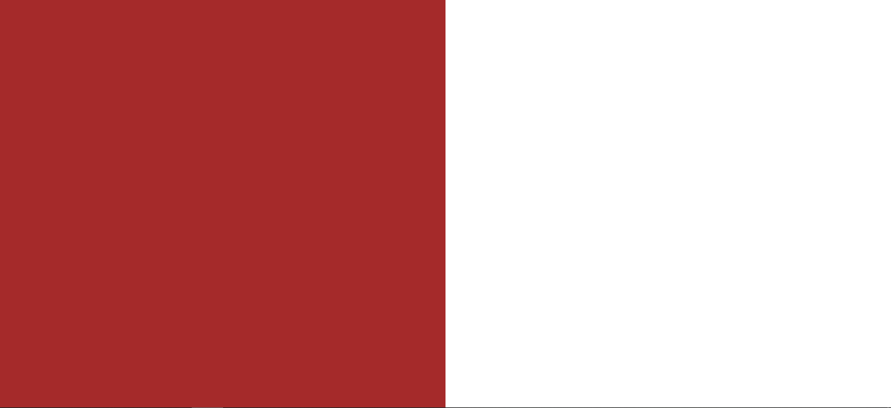

#### rem

在使用 rem 作为单位时，为了便于计算会在 html 标签中设置`font-size` 为 10px, 这样需要将 px 转换为 rem 只需要除以 10 即可。另外因为用户可以调整浏览器的字体大小，不能直接设定为固定的 10px, 应该使用百分比设定。浏览器默认字体为 16px, 10 / 16 = 62.5%.

```css
html {
  font-size: 62.5%;
}
```

### Convert Units from Relative to Absolute(px)

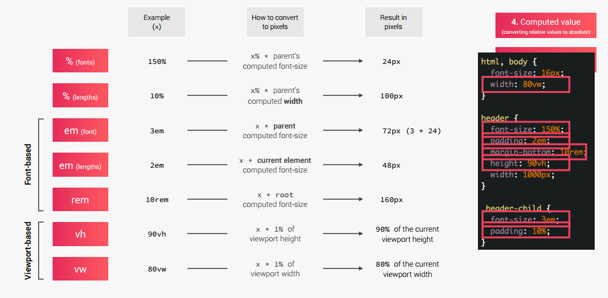

### line-height

The line-height property defines the minimum distance from baseline to baseline in text. The line-height property is said to specify a "minimum" distance because if you
put a tall image or large characters on a line, the height of that line expands to accommodate it.

A baseline is the imaginary line upon which the bottoms of characters sit. Setting a line height in CSS is similar to adding leading in traditional typesetting; however, instead of space being added between lines, the extra space is split above and below the text. The result is that line-height defines the height of a line-box in which the text line is vertically centered.

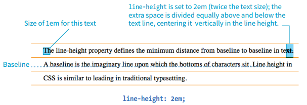

### color

The color property is not strictly a text-related property. In fact, according to the CSS specification, it is used to change the foreground (as opposed to the background) color of an element. The foreground of an element consists of both the text it contains as well as its border. So, when you apply a color to an element (including image elements), know that color will be used for the border as well, unless there is a specific border-color property that overrides it.

```html
<p class="color1">Test Foreground</p>
<p class="color2">Test Foreground</p>
```

```css
.color1 {
  border: 1px solid;
  color: red;
}

.color2 {
  border: 1px solid green;
  color: red;
}
```

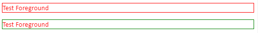

### Generic font families

```css
p {
  font-family: "Duru Sans", Verdana, sans-serif;
}
```

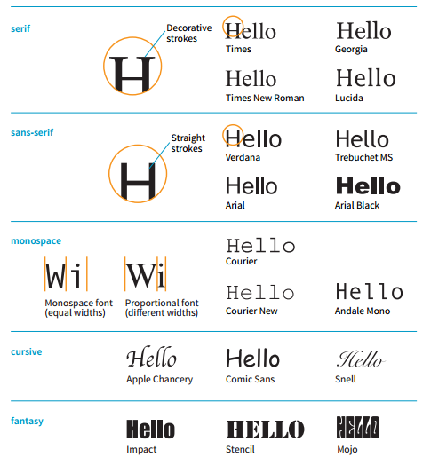

## Background

### background-position

It is important to note that the percentage value applies to both the canvas area and the image itself. A horizontal value of 25% positions the point 25% from the left edge of the image at a point that is 25% from the left edge of the background positioning area. A vertical value of 100% positions the bottom edge of the image at the bottom edge of the positioning area. `background-position: 25% 100%;` As with keywords, if you provide only one percentage, the other is assumed to be 50% (centered) .

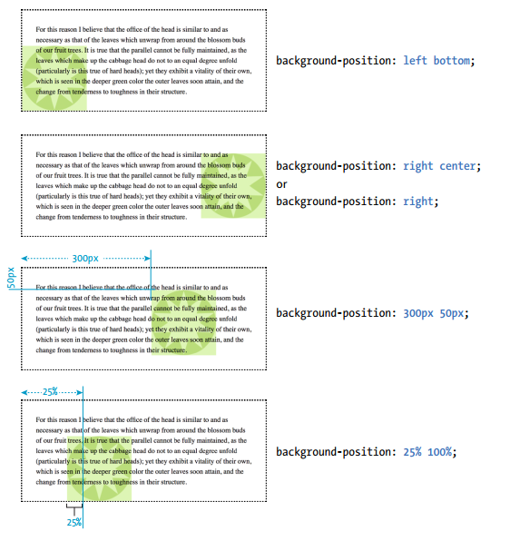

### background-clip

Traditionally, the **background painting area** (the area on which fill colors are applied) of an element extends all the way out to the outer edge of the border.CSS3 introduced the `background-clip` property to give designers more control over where the painting area begins and ends.

The default `border-box` value draws the painting area to the outside edge of the border. `padding-box` starts the painting area on the outside edge of the padding area for the element (and to the inside edge of the border). Finally, `content-box` allows the background to fill only the content area for the element.

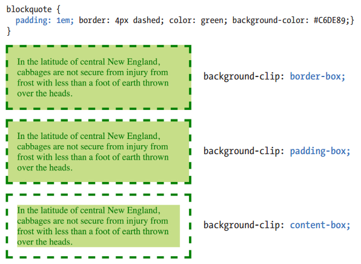

### background-origin

This property defines the boundaries of the background positioning area in the same way `background-clip` defined the background painting area. But it's default value is `padding-box` You can set the boundaries to the `border-box` (so the origin image is placed under the outer edge of the border, `padding-box` (outer edge of the padding, just inside the border), or `content-box` (the actual content area of the element).

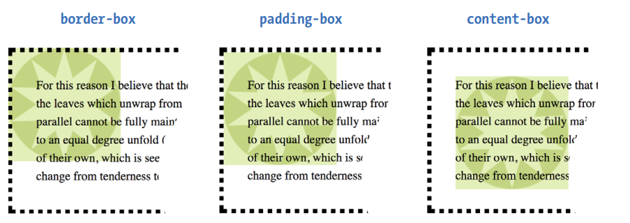

### background-image

背景图片太显眼和容器背景不协调时可以在背景图片上加上透明的渐变背景渐变背景。

```css
.cta-img-box {
  background-image: linear-gradient(
      to bottom right,
      rgba(235, 151, 78, 0.35),
      rgba(230, 125, 34, 0.35)
    ), url(../img/eating.jpg);
  background-size: cover;
  background-position: center;
}
```

| Before                     | After                                   |
| -------------------------- | --------------------------------------- |
|  |  |

## Shadow

css 中 shadow 包括 text-shaow 和 box-shadow, 常用形式分别为 `h-offset v-offset blur color` 和 `h-offset v-offset blur spread color` 其中 text-shadow 没有 spread 属性。

```html
<!DOCTYPE html>
<html lang="en">
  <head>
    <meta charset="UTF-8" />
    <meta name="viewport" content="width=device-width, initial-scale=1.0" />
    <title>shadow</title>
    <style>
      .box {
        width: 200px;
        height: 200px;
        background-color: yellow;
        /* h-offset v-offset blur spread color*/
        box-shadow: 20px 40px 10px 5px green;
      }

      h1 {
        font-size: 90px;
        color: red;
        /* h-offset v-offset blur color*/
        text-shadow: 4px 5px 4px #999;
      }
    </style>
  </head>
  <body>
    <div class="box"></div>
    <br />
    <h1>Hello</h1>
  </body>
</html>
```

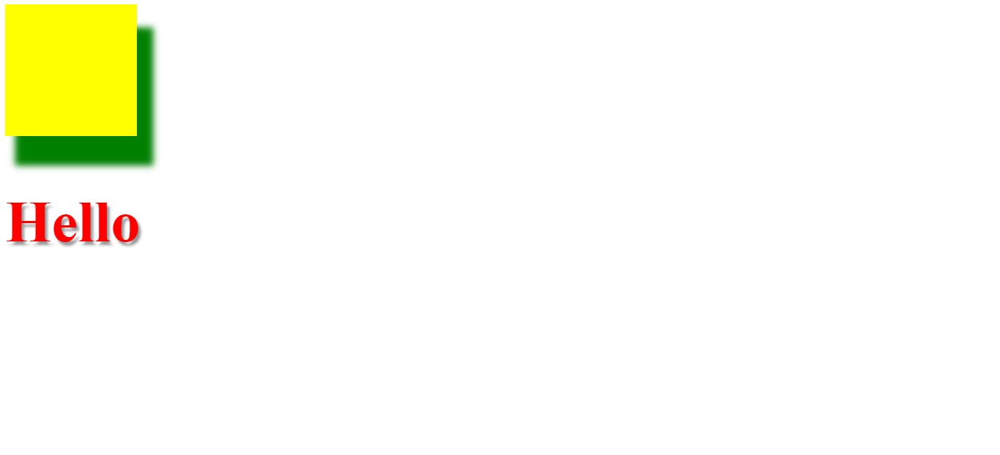

### Inset border

使用 `border` 给元素添加外部边框时会影响到外部元素的布局，如果边框在元素内部就可以解决这种问题，但是 `border` 不支持内部边框，可以使用 `box-shadow` 模拟, 例如 ` box-shadow: inset 0 0 0 3px #fff;` 看起来像是在元素内部添加了 `3px` 的白色边框。

**THE MARKUP**

```html
<a href="#" class="btn btn--full margin-right-small">Start eating well</a>
<a href="#" class="btn btn--outline">Learn more &darr;</a>
```

**THE STYLE**

```css
.btn:link,
.btn:visited {
  display: inline-block;
  text-decoration: none;
  font-size: 2rem;
  font-weight: 600;
  padding: 1.6rem 3.2rem;
  border-radius: 9px;

  /* Put transition on original state */
  transition: background-color 0.3s;
}

.btn--full:link,
.btn--full:visited {
  background-color: #e67e22;
  color: #fff;
}

.btn--full:hover,
.btn--full:active {
  background-color: #cf711f;
}

.btn--outline:link,
.btn--outline:visited {
  background-color: #fff;
  color: #555;
}

.btn--outline:hover,
.btn--outline:active {
  background-color: #fdf2e9;

  /* Outside border maybe effect current layout */
  /* border: 3px solid #fff; */

  /* Trick to add border inside */
  box-shadow: inset 0 0 0 3px #fff;
}

.margin-right-small {
  margin-right: 1.6rem !important;
}
```

## Box

### box-sizing

```css
p {
  box-sizing: content-box;
  background: #f2f5d5;
  width: 500px;
  height: 150px;
  padding: 20px;
  border: 5px solid gray;
  margin: 20px;
}
```

Element box = 20px + 5px + 20px + **500px width** + 20px + 5px + 20px = 590 pixels

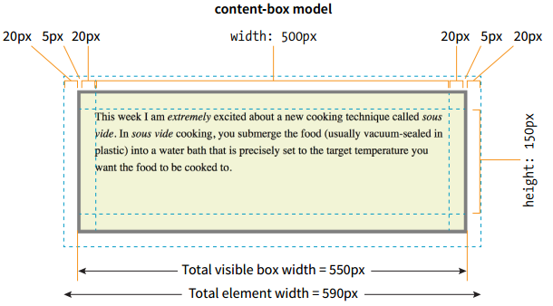

Element box = 20px + **500px width** + 20px = 540 pixels

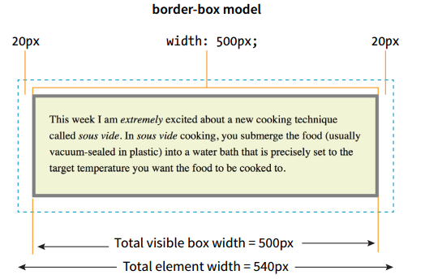

### border-radius

Elliptical corners you can make a corner elliptical by specifying two values: the first for the horizontal radius and the second for the vertical radius (see FIGURE A and B).

**A**

```css
border-top-right-radius: 100px 50px;
```

**B**

```css
border-top-right-radius: 50px 20px;
border-top-left-radius: 50px 20px;
```

If you want to use the shorthand property, the horizontal and vertical radii get separated by a slash (otherwise, they’d be confused for different corner values). The following example sets the horizontal radius on all corners to 60px and the vertical radius to 40px (FIGURE C):

**C**

```css
border-radius: 60px / 40px;
```

If you want to see something really nutty, take a look at a border-radius shorthand property that specifies a different ellipse for each of the four corners. All of the horizontal values are lined up on the left of the slash in clockwise order (top-left, top-right, bottom-right, bottom-left), and all of the corresponding vertical values are lined up on the right (FIGURE D):

```css
border-radius: 36px 40px 60px 20px / 12px 10px 30px 36px;
```

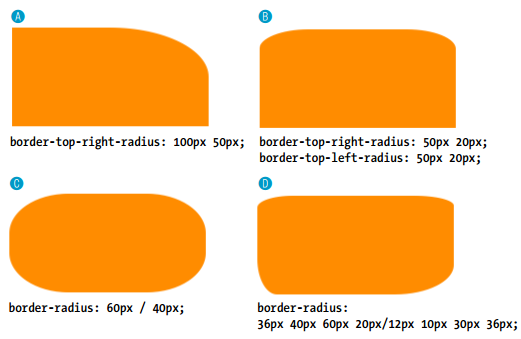

### Collapsing margins

The most significant margin behavior to be aware of is that the top and bottom margins of neighboring elements **collapse**. This means that instead of accumulating, adjacent margins overlap, and only the largest value is used.

Using the two paragraphs as an example, if the top element has a bottom margin of 4em, and the following element has a top margin of 2em, the resulting margin space between elements does not add up to 6ems Rather, the margins collapse and the resulting margin between the paragraphs will be 4em, the largest specified value. This is demonstrated as below.

**The only time top and bottom margins don’t collapse is for floated or absolutely positioned elements. Margins on the left and right sides never collapse, so they’re nice and predictable.**

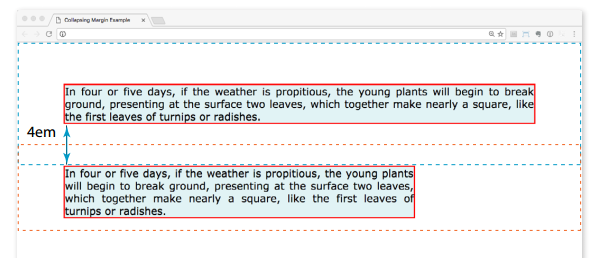

### Margins on inline elements

You can apply top and bottom margins to inline text elements (or "nonreplaced inline elements," to use the proper CSS terminology), but it won’t add vertical space above and below the element, and the height of the line will not change. However, when you apply left and right margins to inline text elements, margin space will be held clear before and after the text in the flow of the element, even if that element breaks over several lines.

Just to keep things interesting, margins on replaced inline elements, such as images, do render on all sides, and therefore do affect the height of the line.

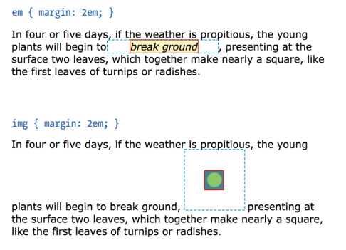

### aspect-ratio

The **aspect-ratio** CSS property sets a **preferred aspect ratio** for the box, which will be used in the calculation of auto sizes and some other layout functions.

在 box 中输入文字, box 的长宽比保持在 2 / 1.

```html
<!DOCTYPE html>
<html>
  <head>
    <style>
      .box {
        display: inline-block;
        background-color: sienna;
        aspect-ratio: 2 / 1;
      }
    </style>
  </head>

  <body>
    <div class="box" contenteditable="true">
      The aspect-ratio CSS property sets a preferred aspect ratio for the box
    </div>
  </body>
</html>
```

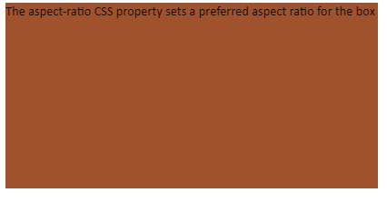

### Setting height use padding-bottom

当父容器没有 intrinsic 的高度时，子元素设置 `height` 相对于父容器的百分比时没有效果，这时可以使用 `padding` 设置相对于父容器宽度的百分比，实现子元素 `height` 的设置, 例如 `padding-bottom: 60%;` 如果子元素不包含其它内容，会设置子元素的高度是父元素宽度的 60%。

```css
.step-img-box {
  position: relative;

  display: flex;
  justify-content: center;
  align-items: center;
}

.step-img-box::before,
.step-img-box::after {
  content: "";
  display: block;
  border-radius: 50%;
  position: absolute;
  top: 50%;
  left: 50%;
  transform: translate(-50%, -50%);
}

.step-img-box::before {
  width: 60%;
  /* step-img-box not has intrinsic width, height:60% no effect */
  /* height: 60%; */

  /* 60% of parent's width */
  padding-bottom: 60%;
  background-color: #fdf2e9;
  z-index: -1;
}

.step-img-box::after {
  width: 45%;
  padding-bottom: 45%;
  background-color: #fae5d3;
  z-index: -1;
}
```

### Inline、Block and Inline-block

block 元素不设定宽度默认会占据一整行，inline, inline-block 会占据内容的宽度

block 元素水平居中使用 margin: 0 auto, inline, inline-block 水平居中使用 text-align:center

block, inline-block 元素可以设置宽度高度，inline 元素宽度高度设置无效

```html
<!DOCTYPE html>
<html lang="en">
  <head>
    <meta charset="UTF-8" />
    <meta name="viewport" content="width=device-width, initial-scale=1.0" />
    <title>inline block</title>
    <style>
      * {
        margin: 0;
        padding: 0;
      }

      div {
        width: 50%;
        margin: 0 auto; /* 设置 block 元素水平居中*/
      }

      strong {
        display: inline-block;
      }

      div,
      span,
      strong {
        background-color: black;
        color: white;
      }

      body {
        text-align: center; /*设定 inline, inline-block 元素水平居中*/
      }

      span,
      strong {
        height: 100px;
      }
    </style>
  </head>
  <body>
    <div>Block</div>
    <span>Inline</span>
    <br />
    <strong>Inline-Block</strong>
  </body>
</html>
```

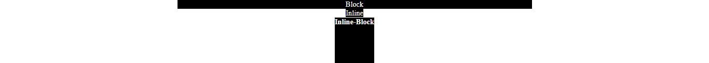

inline 元素的上下外边距无效，如果需要为 inline 元素设置上下外边距，需要将 dispaly 设置为 inline-block

```html
<!DOCTYPE html>
<html lang="en">
  <head>
    <meta charset="UTF-8" />
    <meta name="viewport" content="width=device-width, initial-scale=1.0" />
    <title>box model</title>
    <style>
      strong {
        background-color: red;
        opacity: 0.6;
        margin: 10px;
        padding: 20px;
      }
    </style>
  </head>
  <body>
    <p>
      Lorem ipsum dolor sit, amet consectetur adipisicing elit. Doloribus,
      corrupti similique. Iste, minus modi?
      <strong>Aspernatur</strong> asperiores maxime aliquam repellat ea?
      Tenetur, deleniti repellendus et distinctio tempore error ab officia
      debitis? Lorem ipsum, dolor sit amet consectetur adipisicing elit. Laborum
      beatae dolor, maxime inventore, natus repellat vitae repellendus ex esse
      sit itaque dolorum deserunt totam ducimus cum, quas perferendis quia
      nulla!
    </p>
  </body>
</html>
```

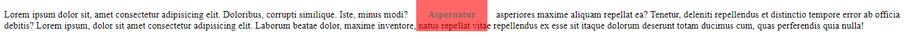

为 strong 添加 disply: inline-block

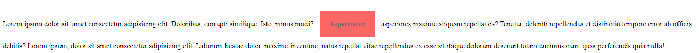

## Position

### position: absolute

```css
p {
  position: relative;
  padding: 15px;
  background-color: #f2f5d5;
  border: 2px solid purple;
}

em {
  width: 200px;
  margin: 25px;
  position: absolute;
  top: 2em;
  left: 3em;
  background-color: fuchsia;
}
```

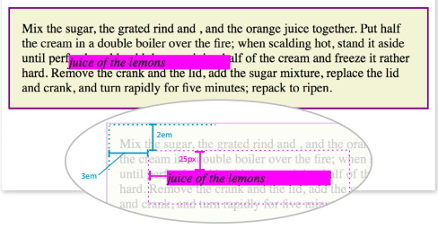

- The offset values apply to the outer edges of the element box (the outer margin edge) for absolutely positioned elements. For relatively positioned elements, the offset is measured to the box itself (not the outer margin edge).
- Absolutely positioned elements always behave as block-level elements. For example, the margins on all sides are maintained, even though this is an inline element. It also permits a width to be set for the element.

Be careful when positioning elements at the bottom of the initial containing block (the html element). Although you may expect it to be positioned at the bottom of the whole page, browsers actually place the element at the bottom of the browser window. Results may be unpredictable. If you want something positioned at the bottom of your page, put it in a containing block element at the end of the document source, and go from there.

## Layout

### Float and Overflow

float 元素父容器未设定高度

```html
<!DOCTYPE html>
<html lang="en">
  <head>
    <meta charset="UTF-8" />
    <meta name="viewport" content="width=device-width, initial-scale=1.0" />
    <title>overflow</title>
    <style>
      .container {
        border: 1px solid green;
      }

      .container img {
        float: left;
        height: 100px;
      }
    </style>
  </head>
  <body>
    <div class="container">
      
    </div>
  </body>
</html>
```

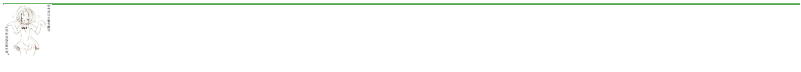

div.container 设定 height: 200px

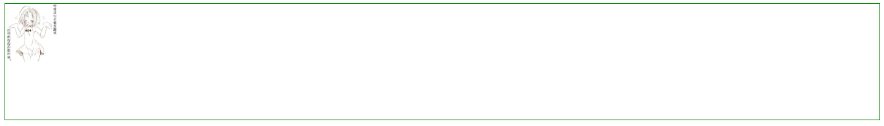

div.container 设定 overflow: hidden, 删除 height: 200px, 在不给元素设置高度的情况下，将 overflow 设置为 hidden 时，它会显示内部元素的高度。

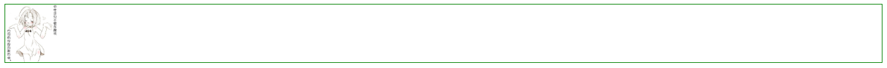

float + overflow 实现 navbar

```html
<!DOCTYPE html>
<html lang="en">
  <head>
    <meta charset="UTF-8" />
    <meta name="viewport" content="width=device-width, initial-scale=1.0" />
    <title>page</title>
    <style>
      * {
        box-sizing: border-box;
      }

      body {
        margin: 0;
        padding: 0;
      }

      ul.topmenu {
        list-style: none;
        margin: 0;
        padding: 0;
        /* Anything inside that might be floating does not get clipped unless you have the overflow set to either hidden, scroll or auto. 
         The real magic of the method is that without having given the element a set height, when you set overflow to hidden it takes on the height of the inner elements.*/
        overflow: hidden;
        background-color: #666;
      }

      ul.topmenu li {
        float: left;
      }

      ul.topmenu li a {
        display: inline-block;
        color: white;
        padding: 16px;
        text-decoration: none;
        text-align: center;
      }

      ul.topmenu li a:hover {
        background-color: #333;
      }

      ul.topmenu li a.active {
        background-color: #4caf50;
      }
    </style>
  </head>

  <body>
    <ul class="topmenu">
      <li><a class="active" href="">Home</a></li>
      <li><a href="">News</a></li>
      <li><a href="">Contact</a></li>
      <li><a href="">About</a></li>
    </ul>
  </body>
</html>
```

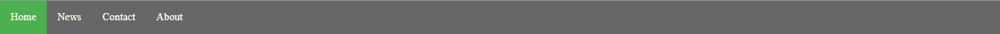

### Overflow and Position

当子元素使用 position 定位，而父元素没有使用 position 定位时，使用 `overflow: hidden`, 子元素超出父元素的内容不会被隐藏，需要在父元素上添加定位，例如 `position: relative`.

**THE MARKUP**

```html
<div class="parent">
  <div class="child"></div>
</div>
```

**THE STYLE**

```css
.parent {
  width: 300px;
  height: 300px;
  border: 1px solid green;
  overflow: hidden;
    
  /* position: relative; */
}

.child {
  width: 200px;
  height: 200px;
  background-color: orange;
  transform: translatex(200px);
  
  position: absolute;
  top: 0;
  left: 0;
}
```

| without position of parent | has position of parent                  |
| -------------------------- | --------------------------------------- |
| 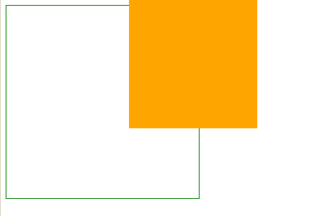 | 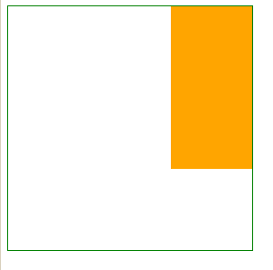 |

在 body 中使用 overflow 时需要注意，只有在没有 `position:absolute` 相对于 body 的情况下才会起作用。

```css
body {
  font-family: "Rubik", sans-serif;
  line-height: 1;
  font-weight: 400;
  color: #555;

  overflow-x: hidden;
}
```

### Aligning items with margins in Flexbox

**THE MARKUP**

```html
<ul>
  <li class="logo"></li>
  <li>About</li>
  <li>Blog</li>
  <li>Shop</li>
  <li>Contact</li>
</ul>
```

**THE STYLES**

```css
ul {
  display: flex;
  align-items: center;
  background-color: #00af8f;
  list-style: none; /* removes bullets */
  padding: 0.5em;
  margin: 0;
}
li {
  margin: 0 1em;
}
li.logo {
  margin-right: auto;
}
```

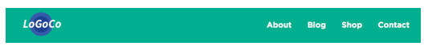

I’ve turned the unordered list (ul) into a flex container, so its list items (li) are now flex items. By default, the items would stay together at the start of the main axis (on the left) with extra space on the right. Setting the right margin on the logo item to `auto` moves the extra space to the right of the logo, pushing the remaining items all the way to the right (the "main end").

This technique applies to a number of scenarios. If you want just the last item to appear on the right, set its left margin to `auto`. Want equal space around the center item in a list? Set both its left and right margins to `auto`. Want to push a button to the bottom of a column? Set the top margin of the last item to `auto`. The extra space in the container goes into the margin and pushes the neighboring items away.

When you use `margin: auto` on a flex item, the `justify-content` property no longer has a visual effect because you’ve manually assigned a location for the extra space on the main axis.

### Handy shortcut flex item values

1. flex: initial

   This is the same as `flex: 0 1 auto`. It prevents the flex item from growing even when there is extra space, but allows it to shrink to fit in the container. The size is based on the specified `width/height` properties, defaulting to the size of the content. With the initial value, you can use `justify-content` for horizontal alignment.

2. flex: auto

   This is the same as `flex: 1 1 auto`. It allows items to be fully flexible, growing or shrinking as needed. The size is based on the specified `width/height` properties.

3. flex: none

   This is equivalent to `flex: 0 0 auto`. It creates a completely inflexible flex item while sizing it to the `width` and `height` properties. You can also use `justify-content` for alignment when flex is set to `none`.

4. flex: integer

   This is the same as flex: `integer 1 0px`. The result is a flexible item with a flex basis of 0, which means it has absolute flex (see the `Absolute Versus Relative Flex`) and free space is allocated according to the flex number applied to items.

### Absolute Versus Relative Flex

If `flex-basis` is set to any size other than zero (0), such as a particular `width/height` value or `auto`. This is called **relative flex**.

However, if you reduce the value of `flex-basis` to 0, something interesting happens. With a basis of 0, the items get sized proportionally according to the flex ratios, which is known as **absolute flex**. So with `flex-basis: 0`, an item with a flex-grow value of 2 would be twice as wide as the items set to 1. Again, this kicks in only when the `flex-basis` is 0.

In practice it is recommended that you always include a unit after the 0, such as 0px or the preferred 0%.

In this example of absolute flex, the first box is given a `flex-grow` value of 2, and the fourth box has a `flex-grow` value of 3 via the aforementioned shortcut `flex: integer`. In below FIGURE, you can see that the resulting overall size of the boxes is in proportion to the `flex-grow` values because the `flex-basis` is set to 0.

```css
.box {
  /* applied to all boxes */
  flex: 1 0 0%;
}
.box1 {
  flex: 2; /* shortcut value for flex: 2 1 0px */
}
.box4 {
  flex: 3; /* shortcut value for flex: 3 1 0px */
}
```

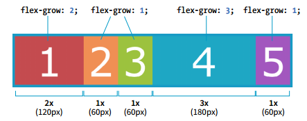

### inline-flex

使用 inline-flex 可以实现两个元素保持同等宽度.

**THE MARKUP**

```html
<div class="box">
  <div class="one" contenteditable="true">
    隐约雷鸣 阴霾天空 但盼风雨来 能留在此 隐约雷鸣 阴霾天空 即使天无雨
    我亦留此地
  </div>
  <div class="two" contenteditable="true">
    长月黄昏后 伫立露沾身 莫问我为谁 我自待伊人
  </div>
  <div></div>
</div>
```

**THE STYLES**

```css
.box {
  display: inline-flex;
  flex-direction: column;
  /*  align-items default is stretch */
  /*   align-items: stretch; */
}

.one {
  background: red;
  height: 100px;
}

.two {
  background: orange;
  height: 100px;
}
```

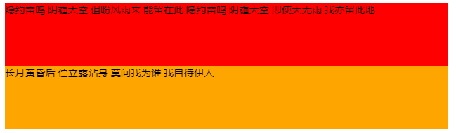

### Grid Specifying track size values

#### Fractional units (flex factor)

The Grid-specific fractional unit (`fr`) allows developers to create track widths that expand and contract depending on available space. As below, if I set the middle column to 1fr, the browser assigns all leftover space (after the 200-pixel column tracks are accommodated) to that column track.

```css
#layout {
  display: grid;
  grid-template-rows: 100px 400px 100px;
  grid-template-columns: 200px 1fr 200px;
}
```

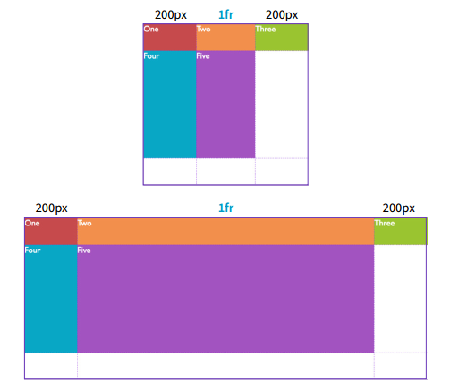

#### Minimum and maximum size range

You can constrict the size range of a track by setting its minimum and maximum widths using the minmax() function in place of a specific track size.

```css
grid-template-columns: 200px minmax(15em, 45em) 200px;
```

This rule sets the middle column to a width that is at least 15em but never wider than 45em. This method allows for flexibility but allows the author to set limits

#### Content-based sizing

The min-content, max-content, and auto values size the track based on the size of the content within it.

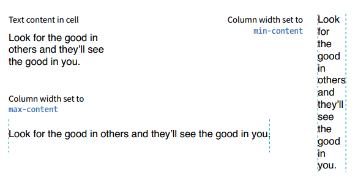

The `min-content` value is the _smallest_ that track can get without overflowing (by default, unless overridden by an explicit `min-width`). It is equivalent to the “largest unbreakable bit of content”—in other words, the width of the longest word or widest image. It may not be useful for items that contain normal paragraphs, but it may be useful in some cases when you don’t want the track larger than it needs to be. This example establishes three columns, with the right column sized just wide enough to hold the longest word or image:

```css
grid-template-columns: 50px 1fr min-content;
```

The `max-content` property allots the maximum amount of space needed for the content, even if that means extending the track beyond the boundaries of the grid container. When used as a column width, the column track will be as wide as the widest content in that track without line wrapping. That means if you have a paragraph, the track will be wide enough to contain the text set on one line. This makes `max-content` more appropriate for short phrases or navigation items when you don’t want their text to wrap (auto may work better because it allows wrapping if there’s not enough room).

Using the `auto` keyword for a track size is basically like handing the keys over to the browser. In general, it causes the track to be sized large enough to accommodate its content, while taking into consideration what other restrictions are in place.

In the `minmax()` function, the `auto` keyword behaves very similarly to either `min-content` or `max-content`, depending on whether you put it in the minimum or maximum slot. As a keyword on its own, it functions similarly to `minmax(min-content, max-content)`, allowing the track to squeeze as narrow as it can without anything overflowing, but grow to fit its content without wrapping if there’s enough space.

Unlike `max-content`, an auto maximum allows `align-content` and `justify-content` to stretch the track beyond the size of the content. As a minimum, it has a few more smarts than `min-content`—for example, using a specified `min-width` or `min-height` on an item (if any) instead of its `min-content` size, and ignoring the contents of any grid items with scrollbars.

If you want to size a track based on its content, but you’re not sure which
keyword to use, start with `auto`.

### Repeating track sizes

In the previous `repeat()` examples, we told the browser how many times to repeat the provided pattern. You can also let the browser figure it out itself based on the available space by using the `auto-fill` and `auto-fit` values instead of an integer in `repeat()`.

For example, if I specify `grid-template-rows: repeat(auto-fill, 10em);` and the grid container is 35em tall, then the browser creates a row every 10 ems until it runs out of room, resulting in three rows. Even if there is only enough content to fill the first row, all three rows are created and the space is held in the layout.

The `auto-fit` value works similarly, except any tracks that do not have content get dropped from the layout. If there is leftover space, it is distributed according to the vertical (`align-content`) and horizontal (`justify-content`) alignment values provided (we’ll discuss alignment later in this section).

### Implicit Grid Behavior

Along the way, we’ve encountered a few of the Grid system’s automatic, or implicit, behaviors. For example, without explicit placement instructions, grid items flow into the grid sequentially. I also pointed out how creating a named area implicitly generates grid lines with the “-start” and “-end” suffixes, and vice versa.

Another implicit Grid behavior is the creation of row and column tracks on the fly to accommodate items that don’t fit in the defined grid. For example, if you place an item outside a defined grid, the browser automatically generates tracks in the grid to accommodate it. Similarly, if you simply have more items than there are cells or areas, the browser generates more tracks until all the items are placed.

By default, any row or column automatically added to a grid will have the size auto, sized just large enough to accommodate the height or width of the contents. If you want to give implicit rows and columns specific dimensions, such as to match a rhythm established elsewhere in the grid, use the `grid-auto-*` properties.

The `grid-auto-rows` and `grid-auto-columns` properties provide one or more track sizes for automatically generated tracks and apply to the grid container. If you provide more than one value, it acts as a repeating pattern. As just mentioned, the default value is `auto`, which sizes the row or column to accommodate the content.

In this example, I’ve explicitly created a grid that is two columns wide and two columns high. I’ve placed one of the grid items in a position equivalent to the fifth column and third row. My explicit grid isn’t big enough to accommodate it, so tracks get added according to the sizes I provided in the `grid-auto-*` properties.

**THE MARKUP**

```html
<div id="littlegrid">
  <div id="A">A</div>
  <div id="B">B</div>
</div>
```

**THE STYLES**

```css
#littlegrid {
  display: grid;
  grid-template-columns: 200px 200px;
  grid-template-rows: 200px 200px;
  grid-auto-columns: 100px;
  grid-auto-rows: 100px;
}
#A {
  grid-row: 1 / 2;
  grid-column: 2 / 3;
}
#B {
  grid-row: 3 / 4;
  grid-column: 5 / 6;
}
```

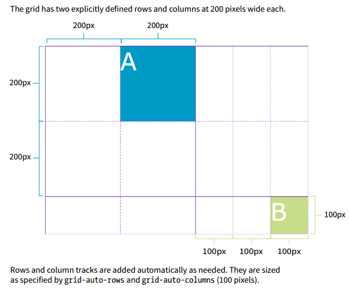

### Media Query

In media queries rem and em do NOT depend on html `font-size` ! Instead, 1rem = 1em = 16px.

As below, `max-width: 84em` represent `max-width: 1344px`, 1344 = 84 \* 16

```css
html {
  font-size: 62.5%;
}
```

```css
@media (max-width: 84em) {
  .hero {
    max-width: 120rem;
  }

  .heading-primary {
    font-size: 4.4rem;
  }

  .gallery {
    grid-template-columns: repeat(2, 1fr);
  }
}
```

## Tansitions, Transforms and Animation

### Time Functions

- ease
  Starts slowly, accelerates quickly, and then slows down at the end. This is the default value and works just fine for most short transitions.
- linear
  Stays consistent from the transition’s beginning to end. Because it is so consistent, some say it has a mechanical feeling.
- ease-in
  Starts slowly, then speeds up.
- ease-out
  Starts out fast, then slows down.
- ease-in-out
  Starts slowly, speeds up, and then slows down again at the very end. It is similar to ease, but with less pronounced acceleration in the middle.
- cubic-bezier(x1,y1,x2,y2)
- steps(#, start|end)
  Divides the transitions into a number of steps as defined by a stepping function. The first value is the number of steps, and the start and end keywords define whether the change in state happens at the beginning (start) or end of each step. Step animation is especially useful for keyframe animation with sprite images. For a better explanation and examples, I recommend the article “Using Multi-Step Animations and Transitions,” by Geoff Graham on CSS-Tricks (css-tricks.com/using-multistep-animations-transitions/).
- step-start
  Changes states in one step, at the beginning of the duration time (the same as steps(1,start)). The result is a sudden state change, the same as if no transition had been applied at all.
- step-end
  Changes states in one step, at the end of the duration time (the same as steps(1,end))

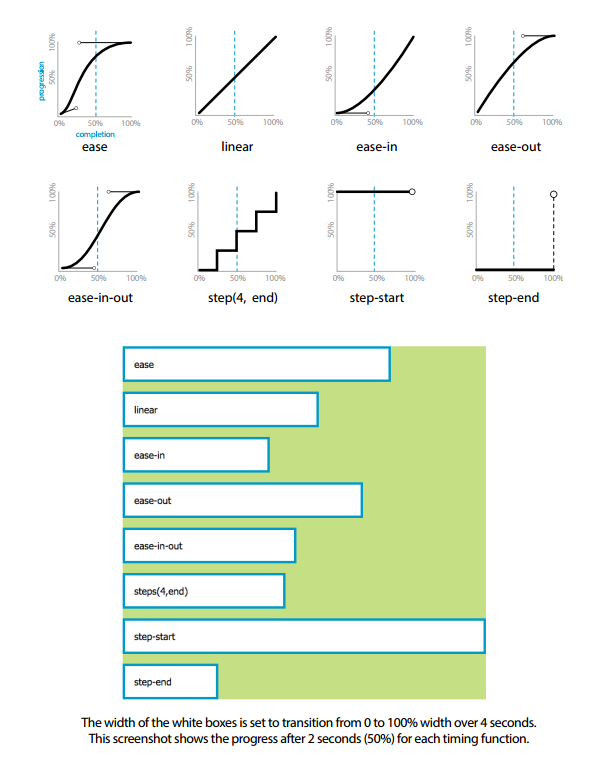

### Transforming the Position (translate)

Provide length values in any of the CSS units or as a percentage value. Percentages are calculated on the **width** of the bounding box—that is, from border edge to border edge (which, incidentally, is how percentages are calculated in SVG, from which transforms were adapted). You can provide positive or negative values.

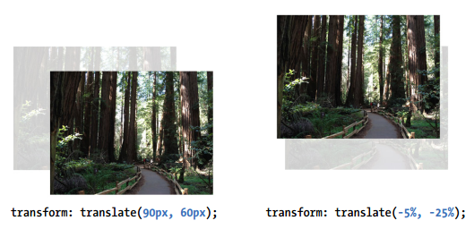

### Applying Multiple Transforms

It is important to note that transforms are applied in the order in which they are listed. For example, if you apply a `translate()` and then `rotate()`, you get a different result than with a `rotate()` and then a `translate()`. Order matters.

Another thing to watch out for is that if you want to apply an additional transform on a different state (such as `:hover`, `:focus`, or `:active`), you need to repeat all of the transforms already applied to the element. For example, this a element is rotated 45 degrees in its normal state. If I apply a `scale()` transform on the hover state, I would lose the rotation unless I explicitly declare it again:

```css
a {
  transform: rotate(45deg);
}

a:hover {
  transform: scale(1.25); /* rotate on a element would be lost */
}
```

To achieve both the rotation and the scale, provide both transform values:

```css
a:hover {
  transform: rotate(45deg) scale(1.25); /* rotates and scales */
}
```

### transform-origin

可以用两次位移变形 `translate` 来 代 替 变 形 原 点 `transform-origin`的作用。红色圆点表示每次变形的原点。 上图：演示了 transform-origin 的原理；下图：以分步的方式演示了两次位移代替 `transform-origin`的原理 。

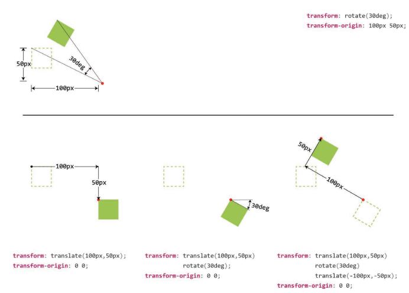

### Transition of hide to show

`display` 不能使用 transition, 可以使用 `opacity: 0` 到 `opacity: 1` 模拟元素从无到有。  

```css
 .main-nav {
    transform: translateX(100%);
    transition: all 0.5s ease-in;
     
    /* Hide navigation */
    /* Allows NO transitions at all */
    /* display: none; */

    /* 1) Hide it visually */
    opacity: 0;
    /* 2) Make it unaccessible to mouse and keyboard */
    pointer-events: none;
    /* 3) Hide it from screen readers */
    visibility: hidden;
  }
```

```css
  .nav-open .main-nav {
    transform: translateX(0);
    opacity: 1;
    pointer-events: auto;
    visibility: visible;
  }
```

## Center Layout

position + transform, 设置需要居中的原素 position: absolute, 然后 top: 50%, left: 50%, 此时元素的顶端距离浏览器顶端为浏览器高度的一边，左端离浏览器左端的距离为浏览器宽度的一半，最后 transform: translate(-50%, -50%); 将元素向左移动自身宽度的一半，向上移动自身高度的一半，即元素中心点距离浏览器顶端为浏览器高度的一边，离浏览器左端的距离为浏览器宽度的一半。

```html
<!DOCTYPE html>
<html lang="en">
  <head>
    <meta charset="UTF-8" />
    <meta name="viewport" content="width=device-width, initial-scale=1.0" />
    <title>center</title>
    <style>
      .box {
        width: 100px;
        height: 100px;
        position: absolute;
        /* 
                right: 50%;
                bottom: 50%;
                transform: translate(50%, 50%);
                */
        left: 50%;
        top: 50%;
        transform: translate(-50%, -50%);
        background-color: pink;
      }
    </style>
  </head>
  <body>
    <div class="box"></div>
  </body>
</html>
```

flex

```html
<!DOCTYPE html>
<html lang="en">
  <head>
    <meta charset="UTF-8" />
    <meta name="viewport" content="width=device-width, initial-scale=1.0" />
    <title>center</title>
    <style>
      body {
        display: flex;
        justify-content: center;
        align-items: center;
        min-height: 100vh;
      }

      .box {
        width: 100px;
        height: 100px;
        background-color: pink;
      }
    </style>
  </head>
  <body>
    <div class="box"></div>
  </body>
</html>
```

table

```html
<!DOCTYPE html>
<html lang="en">
  <head>
    <meta charset="UTF-8" />
    <meta name="viewport" content="width=device-width, initial-scale=1.0" />
    <title>center</title>
    <style>
      .box {
        width: 100px;
        height: 100px;
        background-color: pink;
        display: inline-block; /*if not use inline, text-align no effect*/
      }

      body {
        display: table;
        width: 100%;
        min-height: 100vh;
      }

      .cell {
        display: table-cell;
        vertical-align: middle;
        text-align: center;
      }
    </style>
  </head>
  <body>
    <div class="cell">
      <div class="box">hello</div>
    </div>
  </body>
</html>
```

## Table

```html
<!DOCTYPE html>
<html lang="en">
  <head>
    <meta charset="UTF-8" />
    <meta name="viewport" content="width=device-width, initial-scale=1.0" />
    <title>table</title>
  </head>
  <style>
    #customers {
      font-family: "Trebuchet MS", Arial, Helvetica, sans-serif;
      width: 100%;
      border-collapse: collapse;
    }

    #customers td,
    #customers th {
      font-size: 1em;
      border: 1px solid #98bf21;
      padding: 3px 7px 2px 7px;
    }

    #customers th {
      font-size: 1.1em;
      text-align: left;
      padding-top: 5px;
      padding-bottom: 4px;
      background-color: #a7c942;
      color: #ffffff;
    }

    #customers tr.alt td {
      color: #000000;
      background-color: #eaf2d3;
    }
  </style>
  <body>
    <table id="customers">
      <thead>
        <tr>
          <th>Company</th>
          <th>Contact</th>
          <th>Country</th>
        </tr>
      </thead>
      <tbody>
        <tr>
          <td>Alfreds Futterkiste</td>
          <td>Maria Anders</td>
          <td>Germany</td>
        </tr>
        <tr class="alt">
          <td>Berglunds snabbköp</td>
          <td>Christina Berglund</td>
          <td>Sweden</td>
        </tr>
        <tr>
          <td>Centro comercial Moctezuma</td>
          <td>Francisco Chang</td>
          <td>Mexico</td>
        </tr>
        <tr class="alt">
          <td>Ernst Handel</td>
          <td>Roland Mendel</td>
          <td>Austria</td>
        </tr>
        <tr>
          <td>Island Trading</td>
          <td>Helen Bennett</td>
          <td>UK</td>
        </tr>
        <tr class="alt">
          <td>Königlich Essen</td>
          <td>Philip Cramer</td>
          <td>Germany</td>
        </tr>
        <tr>
          <td>Laughing Bacchus Winecellars</td>
          <td>Yoshi Tannamuri</td>
          <td>Canada</td>
        </tr>
        <tr class="alt">
          <td>Magazzini Alimentari Riuniti</td>
          <td>Giovanni Rovelli</td>
          <td>Italy</td>
        </tr>
        <tr>
          <td>North/South</td>
          <td>Simon Crowther</td>
          <td>UK</td>
        </tr>
        <tr class="alt">
          <td>Paris spécialités</td>
          <td>Marie Bertrand</td>
          <td>France</td>
        </tr>
      </tbody>
    </table>
  </body>
</html>
```

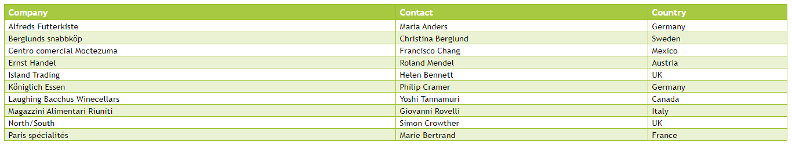

### thead

标题放在 `thead` 中打印时如果有多页后续页也会包含标题，另外也不会出现截断行数据的情况。

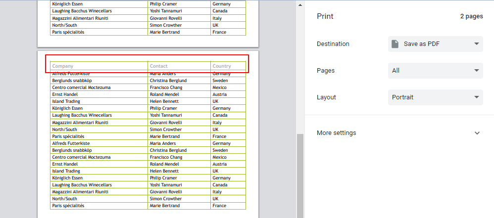

## Filter

### grayscale

在 `html` 标签设置 `grayscale(100%)`可以把整个网页都变成灰色效果。

```html
<!DOCTYPE html>
<html lang="en" class="gray">
  <head>
    <meta charset="UTF-8" />
    <meta name="viewport" content="width=device-width, initial-scale=1.0" />
    <title>grayscale</title>
    <style>
      html {
        filter: grayscale(100%);
      }
    </style>
  </head>
  <body>
    
  </body>
</html>
```


### brightness

当图片各部分颜色差别比较大时，使用 `grayscale`实现灰度效果时各部分对比会比较明显，不一致， 可以使用 `brightness + opacity ` 实现。


**grayscale**

```
filter: grayscale(100%);
```


**brightness + opacity**

```css
filter: brightness(0);
opacity: 50%;
```


### Change Theme Schema

反转网站主题色

1 将背景设置为与原来相反的黑色，使用滤镜反转整个网页中的元素

```css
 {
  background: black;
  filter: invert(1) hue-rotate(180deg);
}
```

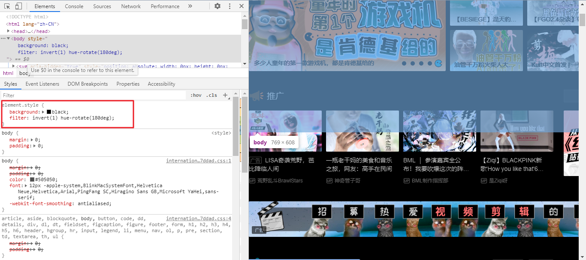

2 图片需要保持原来的模样

```js
document.querySelectorAll("img").forEach((item) => {
  item.style.filter = "invert(1) hue-rotate(189deg)";
});
```

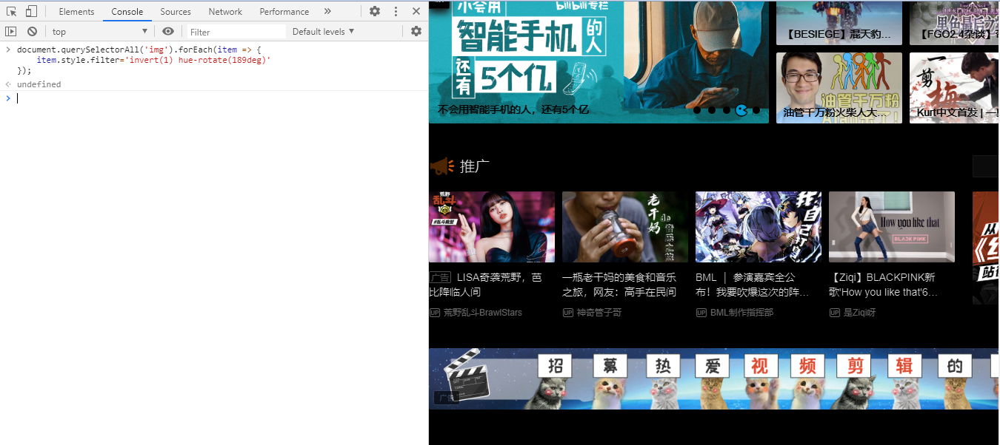

## CSS Mechanism

### CSS Values Processed

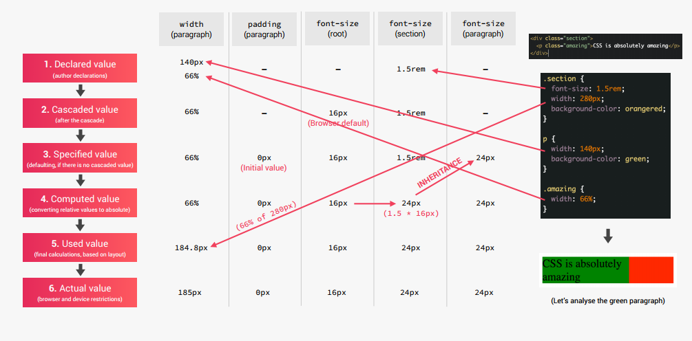

### CSS Inheritance

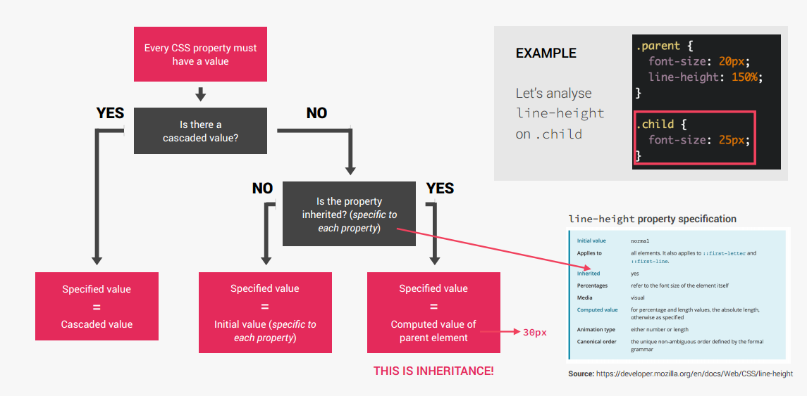

## CSS Selector

### Selector Specificity

(A, B, C, D) 前面的越大优先级越高。

A: 行内样式 (可以被 !important 覆盖, 例如使用 !important 覆盖 bootstrap 等的行内样式)。

B: ID 选择器 #container。

C: Class, 属性和伪类选择器 .title, input[type='text'], :hover。

D: 元素和伪元素择器 div, ::before。

```html
<!DOCTYPE html>
<html lang="en">
  <head>
    <meta charset="UTF-8" />
    <meta name="viewport" content="width=device-width, initial-scale=1.0" />
    <title>priority</title>
    <style>
      html {
        font-size: 40px;
      }

      #container .menu.menu li.item2 {
        /* (0, 1, 3, 1) */
        color: purple;
      }
      #container li:nth-child(2).item2 {
        /* (0, 1, 2, 1) */
        color: yellow;
      }
      #container li.item2 {
        /* (0, 1, 1, 1) */
        color: green;
      }
      li.item2 {
        /* (0, 0, 1, 1) */
        color: blue;
      }
      item2 {
        /* (0, 0, 1, 0) */
        color: red;
      }
    </style>
  </head>
  <body>
    <div id="container">
      <ul class="menu">
        <li id="item1" class="item1">项目1</li>
        <li class="item2">项目2</li>
        <li class="item3">项目3</li>
      </ul>
    </div>
  </body>
</html>
```

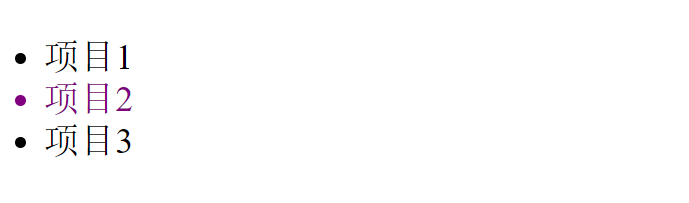

### Select not first child

- 使用 `not` 伪类选择器。

  ```css
  p:not(:first-child) {
    color: red;
  }
  ```

- 使用 `nth-child` 选择器，`nth-child(n + 2)` 中的 n 代表从 0 开始的自然数，n + 2 表示 `>= 2`的自然数。

  ```css
  p:nth-child(n + 2) {
    color: red;
  }
  ```

- 使用 `+ ` 选择器，表示选择紧跟着的兄弟元素。`p + p` 表示 p 元素相邻后面的 p 元素, 第一个 p 元素不会选中。`~` 表示选择所有后面所有的兄弟元素。

  ```css
  <!DOCTYPE html>
  <html lang="en">
      <head>
          <title>CSS Not First Child</title>
          <style>
              p + p {
                  color: red;
              }
          </style>
      </head>
      <body>
          <p>1</p>
          <p>2</p>
          <p>3</p>
          <p>4</p>
      </body>
  </html>
  ```

  Result:

  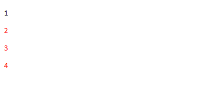

### focus

```css
*:focus {
  outline: none;
  /* outline: 4px dotted #e67e22;
  outline-offset: 8px; */
  box-shadow: 0 0 0 0.8rem rgba(230, 125, 34, 0.5);
}
```

### focus-within

The **:focus-within** CSS pseudo-class matches an element if the element or any of its descendants are focused. In other words, it represents an element that is itself matched by the [`:focus`](https://developer.mozilla.org/en-US/docs/Web/CSS/:focus) pseudo-class or has a descendant that is matched by `:focus`. (This includes descendants in [shadow trees](https://developer.mozilla.org/en-US/docs/Web/Web_Components/Using_shadow_DOM).)

```html
<!DOCTYPE html>
<html>
  <head>
    <style>
      .box {
        padding: 20px;
        border: 1px solid green;
      }

      .box:focus-within {
        background: maroon;
      }
    </style>
  </head>

  <body>
    <div class="box">
      <input type="text" />
    </div>
  </body>
</html>
```

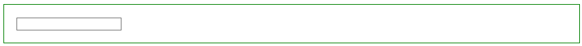

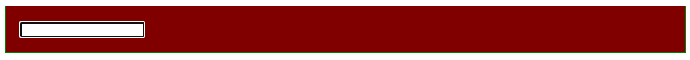

### not

The **:not()** CSS pseudo-class represents elements that do not match a list of selectors. Since it prevents specific items from being selected, it is known as the _negation pseudo-clas_.
The :not() pseudo-class requires a comma-separated list of one or more selectors as its argument. The list must not contain another negation selector or a pseudo-element. `:not( <complex-selector-list> )`

```html
<p>I am a paragraph.</p>
<p class="fancy">I am so very fancy!</p>
<div>I am NOT a paragraph.</div>
<h2>
  <span class="foo">foo inside h2</span>
  <span class="bar">bar inside h2</span>
</h2>
```

```css
.fancy {
  text-shadow: 2px 2px 3px gold;
}

/* <p> elements that don't have a class `.fancy` */
p:not(.fancy) {
  color: green;
}

/* Elements that are not <p> elements */
body :not(p) {
  text-decoration: underline;
}

/* Elements that are not <div> and not <span> elements */
body :not(div):not(span) {
  font-weight: bold;
}

/* Elements that are not <div>s or `.fancy` */
body :not(div, .fancy) {
  text-decoration: overline underline;
}

/* Elements inside an <h2> that aren't a <span> with a class of `.foo` */
h2 :not(span.foo) {
  color: red;
}
```

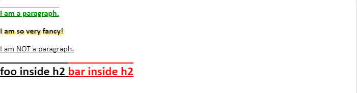

## Accessbility

### role and aria-label

当使用 `background-image` 而不是使用 img 标签设置图像时，为了 accessbility (可访问性)，可以为设置背景图像的元素设置 `role="img"`, 然后在 `aria-label` 设置类似 img 标签 alt 的内容。这样读屏设备就可以读取。  

**THE MARKUP**

```html
<div
  class="cta-img-box"
  role="img"
  aria-label="Woman enjoying food"
></div>
```

**THE STYLE**

```css
.cta-img-box {
  background-image: linear-gradient(
      to bottom right,
      rgba(235, 151, 78, 0.35),
      rgba(230, 125, 34, 0.35)
    ),
    url(../img/eating.jpg);
  background-size: cover;
  background-position: center;
}
```

## CSS image resize percentage of itself

> 引用：[html - CSS image resize percentage of itself? - Stack Overflow](https://stackoverflow.com/questions/8397049/css-image-resize-percentage-of-itself)

I am trying to resize an img with a percentage of itself. For example, I just want to shrink the image by half by resizing it to 50%. But applying `width: 50%;` will resize the image to be 50% of the container element (the parent element which maybe the `<body>` for example).

Question is, can I resize the image with a percentage of itself without using javascript or server side? (I have no direct information of the image size)

1. This method resize image only visual not it actual dimensions in DOM, and visual state after resize centered in middle of original size. you can use `transform-origin: top left` adjust scale origin.

   **html:**

   ```html
   
   ```

   **css:**

   ```css
   .fake {
     transform-origin: top left;
     -webkit-transform: scale(0.5); /* Saf3.1+, Chrome */
     -moz-transform: scale(0.5); /* FF3.5+ */
     -ms-transform: scale(0.5); /* IE9 */
     -o-transform: scale(0.5); /* Opera 10.5+ */
     transform: scale(0.5);
     /* IE6–IE9 */
     filter: progid:DXImageTransform.Microsoft.Matrix(M11=0.9999619230641713, M12=-0.008726535498373935, M21=0.008726535498373935, M22=0.9999619230641713,SizingMethod='auto expand');
   }
   ```

2. The trick is to let the container element shrinkwrap the child image, so it will have a size equal to that of the unsized image. Thus, when setting `width` property of the image as a percentage value, the image is scaled relative to its original scale.

   **html:**

   ```html
   <span>
     
   </span>
   ```

   **css:**

   ```css
   span {
     display: inline-block;
   }
   img {
     width: 50%;
     height: 50%;
   }
   ```

3. you can also take advantage of the newly introduced CSS3 `fit-content`. However, not all popular browser versions support it at the time of writing.

   **html:**

   ```html
   <figure>
     
   </figure>
   ```

   **css:**

   ```css
   figure {
     height: fit-content;
     width: fit-content;
   }

   img {
     height: 50%;
     width: 50%;
   }
   ```

## Tooltip by title attribute

```html
<!DOCTYPE html>
<html lang="en">
  <head>
    <style>
      div {
        width: 100px;
        height: 100px;
        background-color: violet;
      }
    </style>
  </head>
  <body>
    <div title="This is a violet div"></div>
  </body>
</html>
```

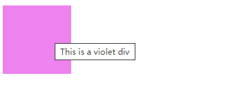

## offsetWidth, clientWidth, scrollWidth

offsetWidth: 包括所有边框的大小。如果元素有 display: block，则可以通过 width/height 和 padding 和 border 的和来计算

width(130px) + padding(10px _ 2) + border(5px _ 2) = 160px

clientWidth: 框内容的可视部分，不包括边框或滚动条，但包括填充。不能直接从 CSS 中计算，取决于系统的滚动条大小。

width(130px) + padding(10px \* 2) - scrollBarWidth(17px) = 133px

```js
const scrollbarWidth =
  ele.offsetWidth -
  ele.clientWidth -
  parseInt(getComputedStyle(ele).borderLeftWidth.replace("px", "")) -
  parseInt(getComputedStyle(ele).borderRightWidth.replace("px", ""));
```

scrollWidth: 框中所有内容的大小，包括当前隐藏在滚动区域之外的部分。不能直接从 CSS 计算，取决于内容。

```html
<!DOCTYPE html>
<html>
  <head>
    <title>Use of offsetWidth, clientWidth and scrollWidth property</title>

    <style>
      #box {
        height: 100px;
        width: 130px;
        border: 5px black solid;
        padding: 10px;
        margin: 5px;
        overflow: scroll;
        background-color: aqua;
        /* box-sizing: border-box; */
        white-space: nowrap;
      }
    </style>
  </head>

  <body>
    <div id="box">
      Understanding offsetWidth, clientWidth, scrollWidth and -Height,
      respectively
    </div>

    <p>Click on button to get result</p>

    <button onClick="display()">Click Here!</button>

    <div id="result"></div>

    <script>
      function display() {
        const ele = document.getElementById("box");
        const osw = ele.offsetWidth;
        const sw = ele.scrollWidth;
        const cw = ele.clientWidth;

        document.getElementById("result").innerHTML =
          "offsetWidth: " +
          osw +
          "px<br>clientWidth: " +
          cw +
          "px<br>scrollWidth : " +
          sw +
          "px";

        const scrollbarWidth =
          ele.offsetWidth -
          ele.clientWidth -
          parseInt(getComputedStyle(ele).borderLeftWidth.replace("px", "")) -
          parseInt(getComputedStyle(ele).borderRightWidth.replace("px", ""));

        console.log(scrollbarWidth);
      }
    </script>
  </body>
</html>
```

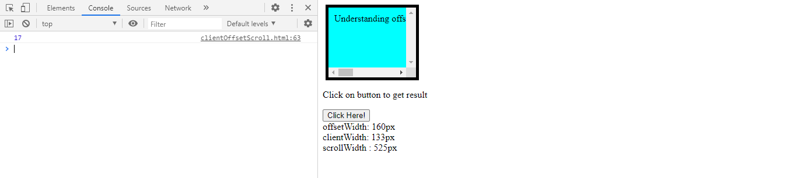

## getComputedStyle

getcomputedstyle()方法在应用活动样式表并解决这些值可能包含的任何基本计算之后，返回一个对象，其中包含元素的所有 CSS 属性的值。单个 CSS 属性值可以通过对象提供的 api 访问，或者通过对 CSS 属性名称进行索引访问。

```
const style = window.getComputedStyle(element [, pseudoElt]);
```

```html
<!DOCTYPE html>
<html lang="en">
  <head>
    <meta charset="UTF-8" />
    <meta name="viewport" content="width=device-width, initial-scale=1.0" />
    <title>getComputedStyle</title>
    <style>
      p {
        width: 400px;
        margin: 0 auto;
        padding: 20px;
        font: 2rem/2 sans-serif;
        text-align: center;
        background: purple;
        color: white;
      }

      h3::after {
        content: " rocks!";
      }
    </style>
  </head>
  <body>
    <p>Hello</p>

    <h3>Generated content</h3>
    <script>
      const paragraph = document.querySelector("p");
      const computedStyles = window.getComputedStyle(paragraph);
      console.log(computedStyles);

      paragraph.textContent = `font-size: ${computedStyles.getPropertyValue(
        "font-size"
      )}, line-height: ${computedStyles.getPropertyValue("line-height")}`;

      const h3 = document.querySelector("h3");
      const result = window.getComputedStyle(h3, ":after");
      console.log("the generated content is: ", result.content);
      console.log("font-size: " + result.fontSize);
    </script>
  </body>
</html>
```

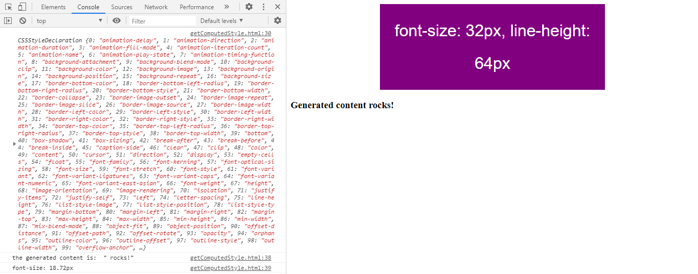

## requestAnimationFrame

**window.requestAnimationFrame()** 告诉浏览器——你希望执行一个动画，并且要求浏览器在下次重绘之前调用指定的回调函数更新动画。该方法需要传入一个回调函数作为参数，该回调函数会在浏览器下一次重绘之前执行

**注意：若你想在浏览器下次重绘之前继续更新下一帧动画，那么回调函数自身必须再次调用 window.requestAnimationFrame()**

```
window.requestAnimationFrame(callback);
```

- `callback`

  下一次重绘之前更新动画帧所调用的函数(即上面所说的回调函数)。该回调函数会被传入[`DOMHighResTimeStamp`](https://developer.mozilla.org/zh-CN/docs/Web/API/DOMHighResTimeStamp)参数，该参数与[`performance.now()`](https://developer.mozilla.org/zh-CN/docs/Web/API/Performance/now)的返回值相同，它表示`requestAnimationFrame()` 开始去执行回调函数的时刻。

- 返回值

  一个 `long` 整数，请求 ID ，是回调列表中唯一的标识。是个非零值，没别的意义。你可以传这个值给 [`window.cancelAnimationFrame()`](https://developer.mozilla.org/zh-CN/docs/Web/API/Window/cancelAnimationFrame) 以取消回调函数。

```html
<!DOCTYPE html>
<html lang="en">
  <head>
    <meta charset="UTF-8" />
    <meta name="viewport" content="width=device-width, initial-scale=1.0" />
    <title>requestAnimationFrame</title>
  </head>
  <body>
    <div
      id="box"
      style="width: 200px; height: 200px; background-color: red;"
    ></div>

    <script>
      const element = document.getElementById("box");
      let start;

      function step(timestamp) {
        if (start === undefined) start = timestamp;

        console.log(timestamp);

        const elapsed = timestamp - start;

        element.style.transform =
          "translateX(" + Math.min(0.1 * elapsed, 200) + "px";

        if (elapsed < 2000) {
          window.requestAnimationFrame(step);
        }
      }

      window.requestAnimationFrame(step);
    </script>
  </body>
</html>
```

## SCSS

### Common Use Mixins

**clearfix**

```scss
@mixin clearfix {
  &::after {
    content: "";
    display: table;
    clear: both;
  }
}
```

**absCenter**

```scss
@mixin absCenter {
  position: absolute;
  top: 50%;
  left: 50%;
  transform: translate(-50%, -50%);
}
```

**respond**

```scss
/*
0-600       Phone
600-900     Tablet portrait 
900-1200    Tablet landscape
1200-1800   Normal styles apply
1800 +      Big Dektop 
 
$breakpoint argument choices:
- phone 
- tab-port
- tab-land
- big-desktop
*/

// ORDER: Base + typography > general layout + grid > page layout > components
@mixin respond($breakpoint) {
  @if $breakpoint == phone {
    @media only screen and (max-width: 37.5em) {
      @content;
    } //600px
  }
  @if $breakpoint == tab-port {
    @media only screen and (max-width: 56.25em) {
      @content;
    } //900px
  }
  @if $breakpoint == tab-land {
    @media only screen and (max-width: 75em) {
      @content;
    } //1200px
  }
  @if $breakpoint == big-desktop {
    @media only screen and (min-width: 112.5em) {
      @content;
    } //1800px
  }
}

// Usage
html {
  font-size: 62.5%;

  @include respond(tab-land) {
    font-size: 56%;
  }

  @include respond(tab-port) {
    font-size: 50%;
  }

  @include respond(phone) {
    font-size: 50%;
  }

  @include respond(big-desktop) {
    font-size: 75%;
  }
}
```

## CSS Tools

> [Tint and Shade Generator](https://maketintsandshades.com/#e67e22)

> [Squoosh](https://squoosh.app/) Squoosh can reduce file size and maintain high quality

## Other

### CSS Meaingful Class Names

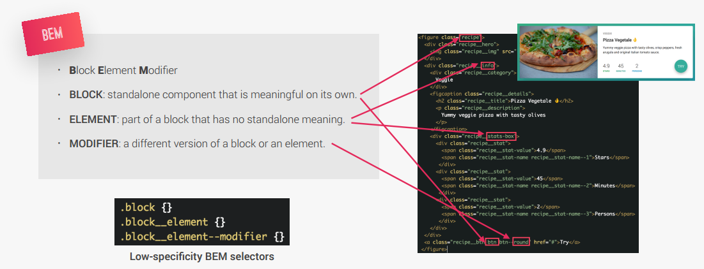

### Architecting with Files and Folders

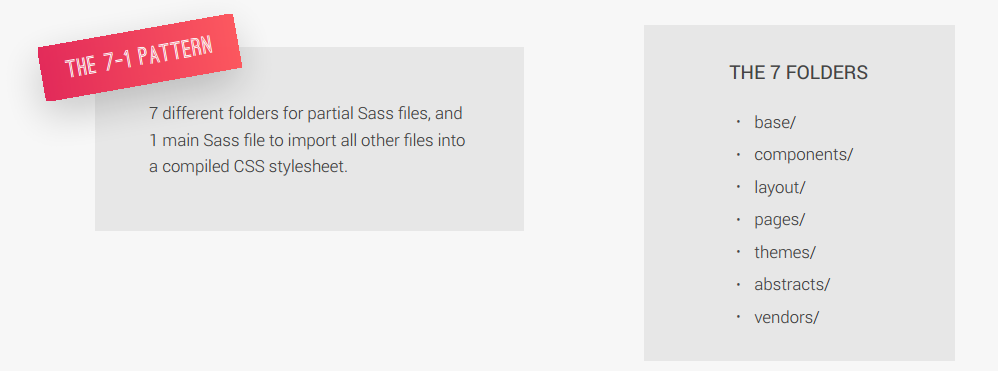

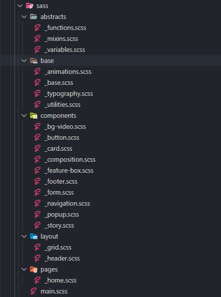