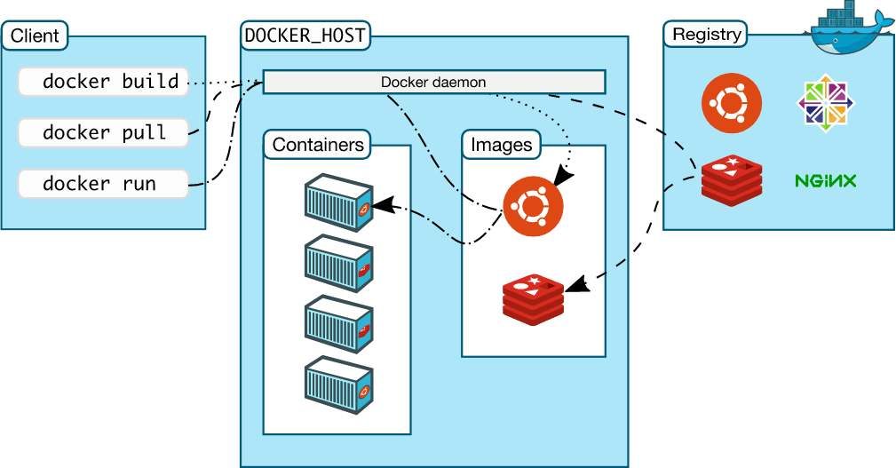
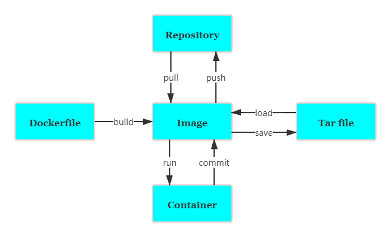
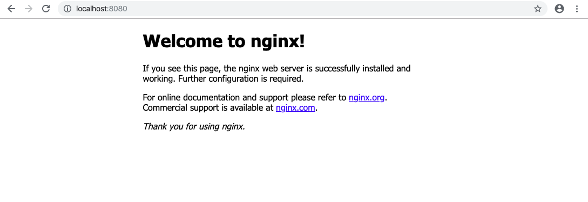
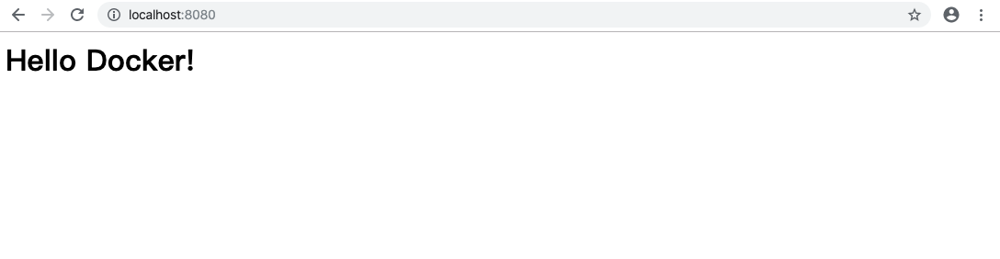

> 历史传承的意志，时代的浪潮，人的梦想，这些都是挡不住的，只要人们继续追求自由的解答，这一切都将永不停止。 - 海贼王

### Architecture



### Common Commands



| 命令                            | 含义                                         |
| ------------------------------- | -------------------------------------------- |
| docker pull                     | 获取 image                                   |
| docker build                    | 创建 image                                   |
| docker images                   | 列出 image                                   |
| docker rmi                      | 删除 image                                   |
| docker run                      | 运行 container，如果本地没有会从远程仓库拉取 |
| docker ps                       | 列出 container                               |
| docker ps -a                    | 列出所有 container 包括停止的历史 container  |
| docker stop                     | 停止 container                               |
| docker rm                       | 删除 container                               |
| docker cp                       | 在 host 和 container 之间拷贝文件            |
| docker commit                   | 保存 container 改动为新的 image              |
| docker inspect nginx            | 检查 container 信息                          |
| docker exec -it nginx /bin/bash | 进入 container                               |

**example**

1> `docker run -p 8080:80 -d nginx` 运行 nginx, -p 指定端口映射，外部 8080 端口映射到 nginx 80 端口，-d 以守护进程的方式运行

2> `docker ps`

CONTAINER ID IMAGE COMMAND CREATED STATUS PORTS NAMES
dc514a87b6f7 nginx "nginx -g 'daemon of…" 22 seconds ago Up 20 seconds 0.0.0.0:8080->80/tcp confident_brahmagupta



3> `docker cp index.html dc514a87b6f7://usr/share/nginx/html` 复制本地 index.html 到 nginx html 文件夹下

```html
<!--index.html-->
<h1>Hello Docker!</h1>
```



4> `docker commit -m 'hello' dc514a87b6f7 hello-docker` , hello-docker 是 image 的 tag。

对 container 所做的修改不会保存，需要手动提交为新的 image，否则下次再运行还是更改之前的。

5> `docker images`

REPOSITORY TAG IMAGE ID CREATED SIZE
hello-docker latest 1820b377b883 10 seconds ago 126MB

### Dockerfile

| Keyword    | Description              |
| ---------- | ------------------------ |
| FROM       | 基础镜像                 |
| MAINTAINER | 维护者信息               |
| RUN        | 运行命令                 |
| ADD        | 添加 COPY 文件并自动解压 |
| WORKDIIR   | 当前工作目录             |
| VLOUME     | 目录挂载                 |
| EXPOSE     | 暴露端口                 |

1> vim Dockerfile

```dockerfile
FROM alpine:latest
MAINTAINER jbn
CMD echo "Hello Docker!"
```

2> `docker build -t hello-docker .`

3> `docker images`

4> `docker run hello-docker`

Hello Docker!

Dockerfile 每一行都会产生一个新层，并且是 Read Only 的，根据 Dcokerfile 构建的 image 运行的 container 是 Read Write 的。

### Volume

提供独立于容器之外的持久化存储

1> `docker run -p 8080:80 -d -v $PWD/html:/usr/share/nginx/html nginx` 将 nginx container 目录 `/usr/share/nginx/html`挂载到本机当前目录下的 html

2> vim html/index.html

```html
<h1>Hello Docker！</h1>
```

3> 在本地的修改会反映到 container


创建仅有数据的容器，其它容器通过此容器挂载 volume

`docker create -v $PWD/data:/var/mydata --name data-container ubuntu`

`docker run -it --volumes-from data-container ubuntu /bin/bash`

root@6b1c68cb2185:/# cd var/mydata/
root@6b1c68cb2185:/var/mydata# touch hello.txt
root@6b1c68cb2185:/var/mydata# exit
exit
jbn@MacBook-Air  ~/Documents/study/docker  ls data
hello.txt

### Registry

镜像仓库

`docker search whalesay`

`dokcer pull whalesay`

`docker run docker/whalesay cowsay Hello Docker!`

```
  < Hello Docker! >
  \
   \
    \
                  ##        .
            ## ## ##       ==
          ## ## ## ##      ===
      /""""""""""""""""___/ ===
        \______ o          __/
          \    \        __/
            \____\______/
```

`docker tag docker/whalesay jbn/whalesay` 产生一个相同但 tag 是 jbn/whalesay 镜像

`doker login`

`docker push jbn/whalesay`

### Example

#### postgres

step 1: pull image `docker pull postgres`， pull image with specify version `docker pull postgres:11.5`

step 2: run container `docker run --name some-postgres -e POSTGRES_PASSWORD=mysecretpassword -d postgres`

step 3: show status of the container `docker ps`

step 4: login to the container `docker exec -it some_postgres bash`

step 5: access postgres use user postgres, run postgres command `su postgres`

step 6: leave postgres `\q`

step 7: login out the container `exit`

step 8: remove container `docker rm -f some_postgres`
