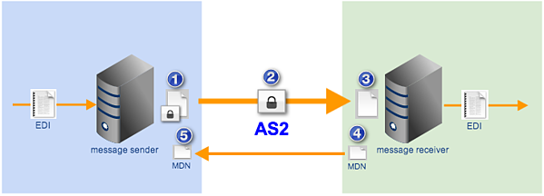
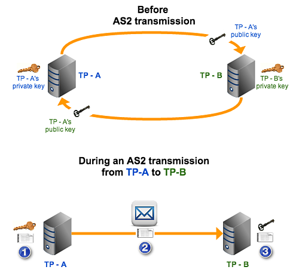
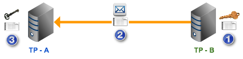
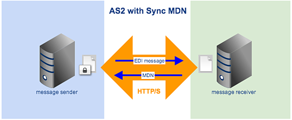
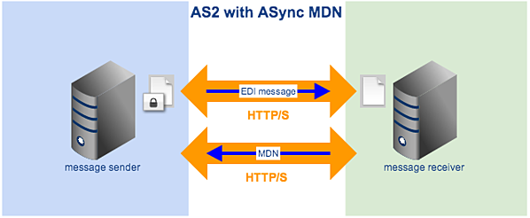
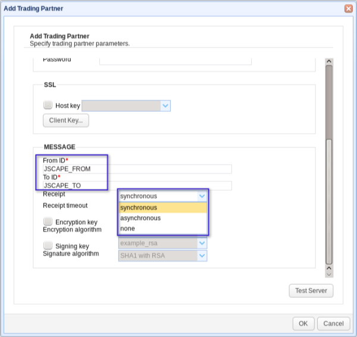
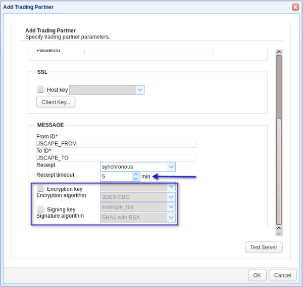

> Reproduced [What is an AS2 MDN?](https://www.jscape.com/blog/bid/100671/What-is-an-AS2-MDN#:~:text=An%20MDN%20is%20an%20electronic,and%20non%2Drepudiation%20in%20AS2.)

### Overview

An MDN is an electronic return receipt which a trading partner can optionally request during an [AS2 interchange](https://www.jscape.com/blog/bid/100435/AS2-Simplified). The use of MDNs help enforce data integrity and non-repudiation in AS2. In this post, we'll talk more about the value of issuing an AS2 MDN, what options you have when using it, and an overview of the usual configurable MDN settings in a managed file transfer server.

### Why use an MDN

After transmitting an EDI message to a trading partner, we usually want to confirm whether the message - in all its entirety - actually went through. More so if our EDI (Electronic Data Interchange) is carried out over the Internet, where message packets may have to go through a number of hops. This concern can be easily addressed if you do your EDI over AS2. That's because AS2 provides an electronic return receipt known as an MDN (Message Disposition Notification).

The Message Disposition Notification process is initiated by the EDI message sender and is usually concluded once the sender receives the requested MDN. Let me show you a typical AS2 transmission that utilizes this process:

_Figure 1_

Let's go through those steps briefly:

\1. The sender encrypts the EDI message, affixes its [digital signature](https://www.jscape.com/blog/what-is-a-digital-signature), and specifies an MDN option. We'll talk more about MDN options in a short while. But in the meantime, let's assume the option simply amounts to a request for the return receipt;

\2. The EDI message is transmitted over the Internet via AS2;

\3. The receiver decrypts the message and validates the sender's digital signature;

\4. The receiver recognizes the request for an MDN, prepares the MDN, affixes its own digital signature to it, and then sends it back to the original sender.

\5. Finally, the sender receives the MDN, validates the receiver's digital signature, and then closes the connection.

So, basically, the MDN serves to inform the sender about two things: 1) That the AS2 transmission completed successfully and 2) That the EDI message was received by the intended recipient devoid of any unauthorized modifications (i.e., data integrity was preserved).

This can be confirmed through the digital signature affixed to the MDN and can be used for non-repudiation. Hence, MDNs can be vital in establishing that certain SLA requirements have been met as well as in settling disputes concerning AS2 EDI transmissions.

But how does each trading partner validate the digital signature it receives?

### AS2 MDN Digital Signatures

Before two parties start sending EDI messages over AS2, they first share public keys with one another. Each public key corresponds to a specific private key, which is used for generating a digital signature and is held by the party who owns that particular signature.

The private key is kept secret and hence is never shared. The function of the public key is to validate the digital signature. Only the private key that corresponds to a particular public key can generate a signature that the public key can validate.

_Figure 2_

wherein:

\1. TP - A generates a digital signature using its private key;

\2. TP - A's digital signature is sent along with an AS2 EDI message;

\3. TP - B validates TP - A's digital signature using TP - A's public key that's already in its possession.

Once the signature has been validated, TP - B can already be sure that the EDI message came from a trusted trading partner and that the data was unaltered along the way.

The same thing happens when TP - B responds with an MDN:

_Figure 3_

wherein:

\1. TP - B generates a digital signature using its private key;

\2. TP - B's digital signature is sent along with an AS2 MDN;

\3. TP - A validates TP - B's digital signature using TP - B's public key that's already in its possession.

Once the signature has been validated, TP - A can already be sure the MDN came from the trading partner it sent the AS2 EDI message to and that the AS2 transmission completed successfully.

For more information on public key cryptography and the use of public and private keys, I suggest you read the following articles:

✔ _Roles of Server and Client Keys in Secure File Transfers_

✔ _What is an SSL File Transfer?_

✔ _Securing Data at Rest with OpenPGP_

As mentioned earlier in Step 1, the message sender is supposed to specify an MDN option. One of those options is to forgo the MDN. Of course, we don't recommend that. If you want a secure file transfer, then you will want to stick with the options that amount to an MDN transmission. And among those options there are two that are commonly used: AS2 with Sync MDN and AS2 with ASync MDN.

### Synchronous vs Asynchronous MDN

Synchronous or Sync MDN is an option wherein the MDN is sent to the message sender via the same HTTP/S connection that was used to deliver the original EDI message. On the other hand, Asynchronous or ASync MDN is an option wherein the MDN is sent at a later time via a different HTTP/S connection.

To illustrate the difference between these two options:

_Figure 4_

_Figure 5_

Because it uses the same HTTP connection as the original transmission, Sync MDN is the faster option. However, it is not suitable for large file transfers because it may be abruptly cancelled during timeout, especially in low-bandwidth conditions. So if you need to transfer large files but you or your trading partner are subject to poor network conditions, then ASync MDN would be a better choice.

MDN is only one of a handful of security features in AS2. To learn more about AS2, I recommend you read the blog post entitled _AS2 Simplified_.

### Typical MDN Settings

This section is meant to give you a glimpse of the MDN settings you would normally configure on your favorite managed file transfer server. In our case, that managed file transfer server would be [JSCAPE MFT Server](https://www.jscape.com/products/file-transfer-servers/jscape-mft-server/).

All MDNs will of course contain a FROM and TO ID. The FROM ID uniquely identifies where the AS2 message is coming from, while the TO ID uniquely identifies where it is being sent.

_Figure 6_

See that drop-down list box labeled 'Receipt'? (See _Figure 6_) The items on that box correspond to the MDN options we talked about earlier. 'None' simply refers to the option where no MDN will be transmitted. If you choose 'synchronous', you would also need to specify a 'Receipt timeout' (See _Figure 7_). When that timeout value is reached, the connection will automatically disconnect.

_Figure 7_

As you can see from the screenshot, you may also take advantage of optional security features like:

✔ Encryption - which you specify using the 'Encryption key' and 'Encryption algorithm' settings, and

✔ Digital signing - which you specify using the 'Signing key' and 'Signature algorithm' settings.

### Recommended Download

That concludes our discussion on AS2 MDN. If you want to give AS2 a test run, download the FREE, fully-functional evaluation edition of JSCAPE MFT Server.
