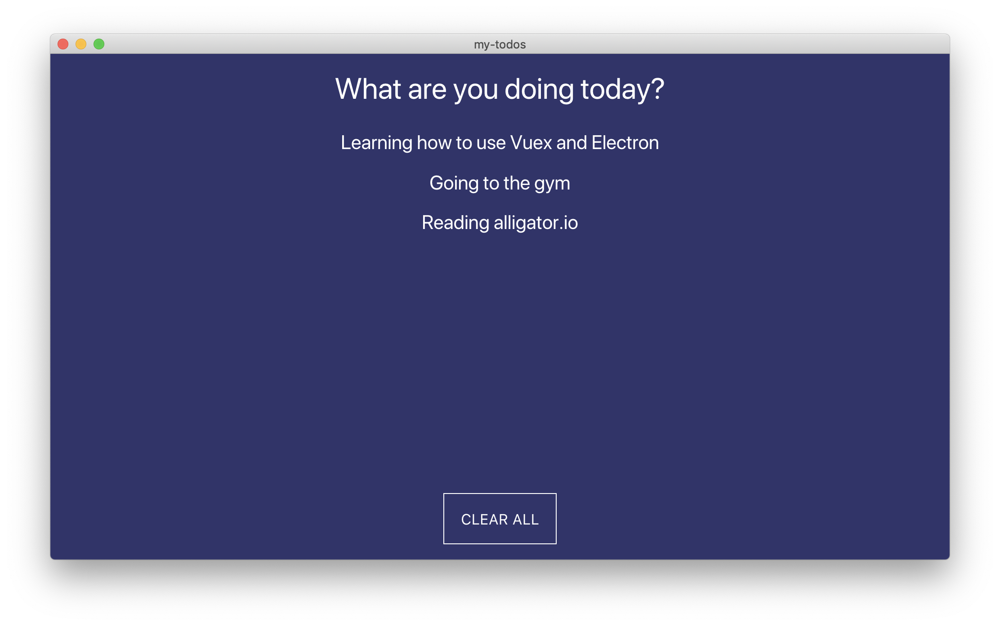

> [How to use Vue.js with Electron and Vuex | DigitalOcean](https://www.digitalocean.com/community/tutorials/vuejs-vue-electron)

While this tutorial has content that we believe is of great benefit to our community, we have not yet tested or edited it to ensure you have an error-free learning experience. It's on our list, and we're working on it! You can help us out by using the "report an issue" button at the bottom of the tutorial.

Electron makes it easy to create cross platform desktop applications with JavaScript. As it uses the Node.js runtime, we have the luxury of using any frontend framework we want! In this article, we’ll be looking at getting up and running with Vue and Electron to create our own applications.

Whilst we could set up our environment ourself, it’s worthwhile to use a dedicated starter such as [vue-electron](https://github.com/SimulatedGREG/vue-electron).


To get started, run the following in your terminal:

```shell
$ npm install vue-cli -g // vue2
$ npm install -g @vue/cli @vue/cli-init // vue3

$ vue init simulatedgreg/electron-vue my-todos
```

You’ll then be asked some questions about your project, fill them in to generate the config file:

```
Application Name > my-todos
Application Id > com.example.yourapp
Application Version > 0.0.1
Project Desription > Manage your Todos with Vue and Electron
Use Sass / Scss? Y
Select plugins to install > Axios, vue-electron, vue-router, vuex, vuex-electron
Linting with ESLint? > N
Unit testing with Karma + Mocha? N
End to end testing with Spectron + Mocha? N
Which build tool would you like to use? > electron-builder
Author > Paul Halliday
```

After filling in the above (you can switch some steps out if you want, most of it is personal preference), we have a folder named `my-todos` with our project inside. Install the dependencies and then open this with your favorite editor:

Note: If you’re a Windows user, you may need to follow the steps [outlined here](https://simulatedgreg.gitbooks.io/electron-vue/content/en/getting_started.html#a-note-for-windows-users) prior to continuing.

```shell
$ cd my-todos
$ npm install
$ code .

$ npm run dev
```

if occur process not defined error, modified index.ejs `process.browser` to require('process').browser

If we’ve done everything correctly at this stage, we should be greeted with a macOS application that contains information about our project:


Most of our work will be done inside of the `src` directory, and I’d like to bring your attention to the `main` and `renderer` folders.

**Main** houses `index.js` and `index.dev.js`, files that are related to the main process. This is things such as creating a new `BrowserWindow` with dimensions, listening for app-wide events, and so on.

**Renderer** is where we keep our Vue application and can be thought of as the directory for our frontend code.

For more information on the Electron architecture and the differences between the main and renderer process, [visit this page](https://electronjs.org/docs/tutorial/application-architecture).

In order to get a feel for how Electron works, let’s visit `src/main/index.js` and see how our main page is defined:

```javascript
const winURL = process.env.NODE_ENV === 'development'
  ? `http://localhost:9080`
  : `file://${__dirname}/index.html`

function createWindow () {
  mainWindow = new BrowserWindow({
    height: 563,
    useContentSize: true,
    width: 1000
  })

  mainWindow.loadURL(winURL)

  mainWindow.on('closed', () => {
    mainWindow = null
  })
}

app.on('ready', createWindow)
```

The `BrowserWindow` object can be used to display a new browser window (as the name suggests), and we’re using it to open `index.html` when the application is ready. In turn, this will start our Vue app, giving us the ability to hook into native desktop features.

Now that we know how the Vue application is started, let’s take a look at the defined routes within our application. Head over to `src/router/index.js`:

```javascript
export default new Router({
  routes: [
    {
      path: '/',
      name: 'landing-page',
      component: require('@/components/LandingPage').default
    },
    {
      path: '*',
      redirect: '/'
    }
  ]
})
```

As we can see, the `LandingPage` component is defined as the default route for our application. We can therefore edit or create a new `routes` object with our own components in the future.

In order to get Vuex to work with our Electron project, we’ll need to provide a path to our store within `src/main/index.js`:

```javascript
import { app, BrowserWindow } from 'electron';
import '../renderer/store';
```

We can then make a new Store module named `Todo.js` within `src/renderer/store/modules`:

```javascript
import {v4 as uuidv4} from 'uuid';

const state = {
  todos: []
};

const actions = {
  ADD_TODO ({ commit }, name) {
    console.log(name);
    commit('ADD_TODO', name);
  },
  COMPLETE_TODO ({ commit }, id) {
    commit('COMPLETE_TODO', id);
  },
  CLEAR_TODOS ({ commit }) {
    commit('CLEAR_TODOS');
  }
};

const mutations = {
  ADD_TODO (state, name) {
    state.todos = [ ...state.todos, { id: uuidv4(), name } ];
  },
  COMPLETE_TODO (state, id) {
    state.todos = state.todos.filter((todo) => todo.id != id);
  },
  CLEAR_TODOS (state) {
    state.todos = [];
  }
};

export default {
  state,
  actions,
  mutations
};
```

We’re using the third party `uuid` module to generate new IDs for each Todo. Install that via npm:

```shell
$ npm install uuid
```

Finally, we can edit our `LandingPage.vue` component to include our small Todo list:

```javascript
<template>
  <div class="container">
    <div>
      <input
        class="todo-input"
        type="text"
        v-model="todoItemName"
        placeholder="What are you doing today?"
        @keyup.enter.prevent="addTodo"
      >
    </div>
    <div class="todos">
      <ul>
        <li
          class="todo-item"
          v-for="todo in todos"
          :key="todo.id"
          @click="completeTodo(todo)"
        >{{todo.name}}</li>
      </ul>
    </div>

    <button class="clear-all" @click="clearTodos" v-if="todos.length > 0">CLEAR ALL</button>
  </div>
</template>

<script>
import { mapState } from "vuex";

export default {
  data() {
    return {
      todoItemName: ""
    };
  },
  methods: {
    addTodo() {
      this.$store.dispatch("ADD_TODO", this.todoItemName);

      this.todoItemName = "";
    },
    clearTodos() {
      this.$store.dispatch("CLEAR_TODOS");
    },
    completeTodo(selectedTodo) {
      this.$store.dispatch("COMPLETE_TODO", selectedTodo.id);
    }
  },
  computed: {
    ...mapState({
      todos: state => state.Todo.todos
    })
  }
};
</script>

<style>
.container {
  height: 100vh;
  text-align: center;
  background-color: #30336b;
}

.todos {
  overflow: scroll;
  height: 70vh;
  margin-top: 20px;
}

.todo-input {
  font-size: 36px;
  width: 90vw;
  border: 0px;
  outline: none;
  padding-top: 20px;
  text-align: center;
  background-color: transparent;
  color: white;
}

.todo-item {
  font-size: 24px;
  padding: 10px 0px;
  color: white;
}

.clear-all {
  border: 1px solid white;
  background: transparent;
  color: white;
  margin-top: 20px;
  padding: 20px;
  font-size: 18px;
}

::placeholder {
  color: white;
}
</style>
```

As this is a demonstration app, I’ve decided to not componentize this further. This finally gives us the following:




As we’re using `electron-builder` to build our application, we can run the following:

```shell
$ npm run build
```

If we look in our `package.json`, we can also see that we have a variety of other commands at our disposal:

```shell
$ npm run build:dir # - this builds an app without installer
$ npm run build:clear # - deletes all builds from the build folder
$ npm run build:web # - builds for web platform
```

This can be further customized inside of `package.json` by editing the following object:

```json
"build": {
  "productName": "my-todos",
  "appId": "com.example.yourapp",
  "directories": {
    "output": "build"
  },
  "files": [
    "dist/electron/**/*"
  ],
  "dmg": {
    "contents": [
      {
        "x": 410,
        "y": 150,
        "type": "link",
        "path": "/Applications"
      },
      {
        "x": 130,
        "y": 150,
        "type": "file"
      }
    ]
  },
  "mac": {
    "icon": "build/icons/icon.icns"
  },
  "win": {
    "icon": "build/icons/icon.ico"
  },
  "linux": {
    "icon": "build/icons"
  }
},
```

The results of our built application can be found in the `build/mac` or `build/platform` folder.