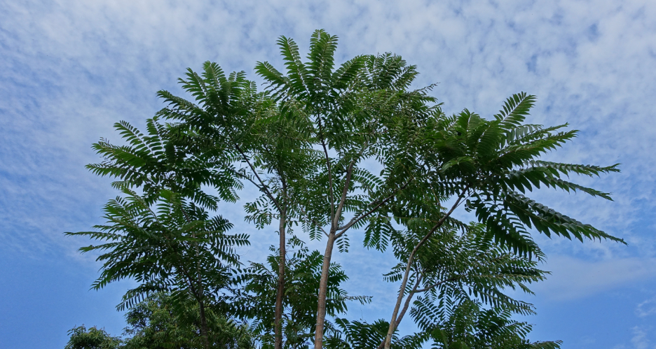
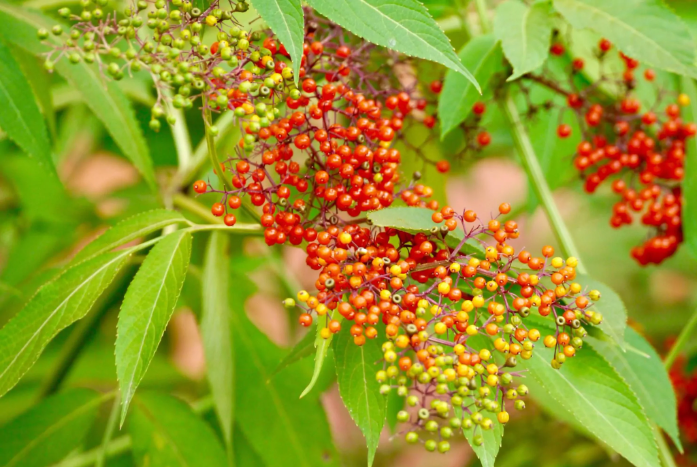
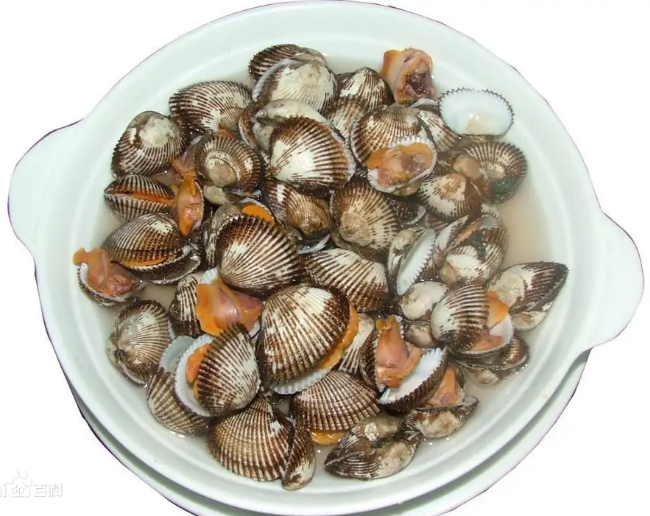
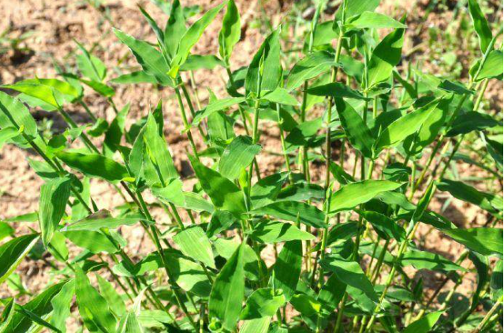
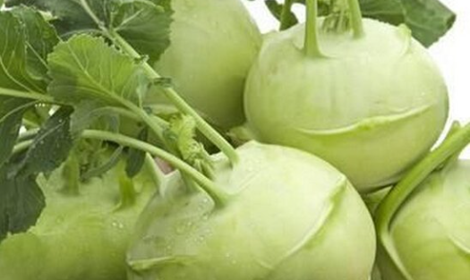
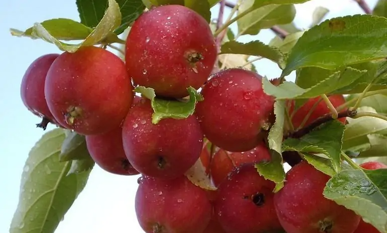
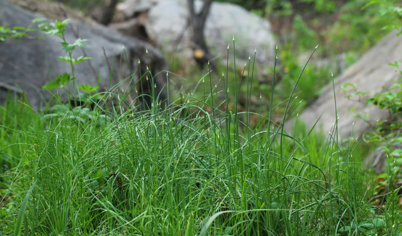
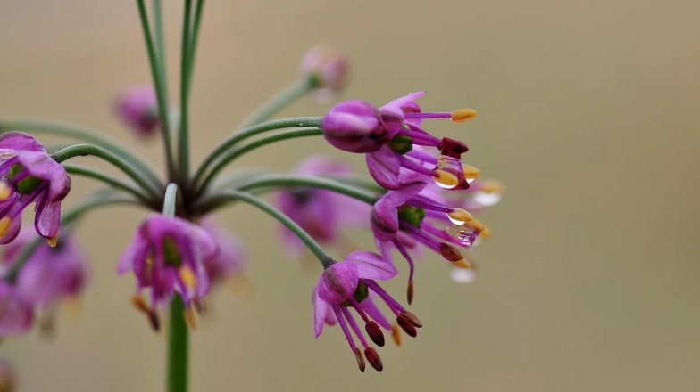
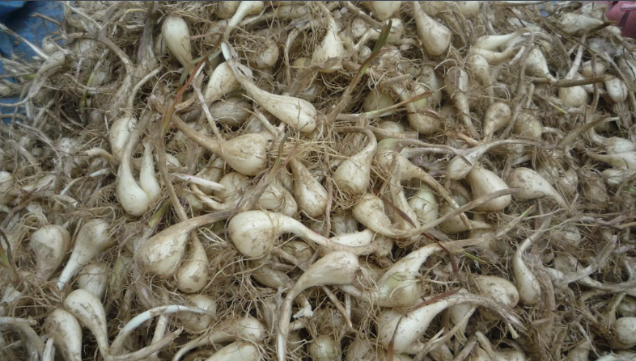
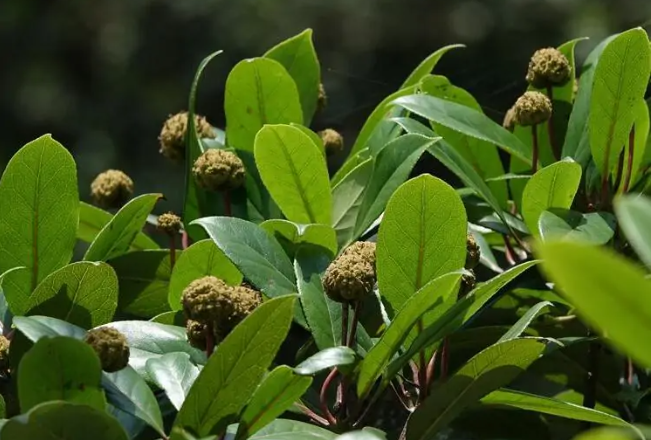

>[漢典 | 漢語字典](https://www.zdic.net/)

## A
### 晻 (àn/ǎn/yǎn)

1. àn
   - 古同“暗”：“三光～昧。”

2. ǎn
   - 〔～蔼〕ａ．昏暗不明，如“日～～以西迈。”ｂ．繁盛，如“华盖纷～～。”

3. yǎn
   - 〔～～〕昏暗不明，如“日～～而下颓。”

### 骜(ào)

- 骏马。
- 马不驯良，喻傲慢，不驯顺：～放。～忽。桀～不驯。

## B

### 甏(bèng)

- 瓮一类的器皿。

### 滗(bì)

- 挡住渣滓或泡着的东西，把液体倒出：壶里的茶水～干了。

### 箅(bì)

- 〔～子〕有空隙而能起间隔作用的片状器具，如“竹～～”、“纱～～”

### 襞(bì)

- 衣服和肠、胃等内部器官上的褶子：皱～。胃～。
- 摺叠衣裙。

### 弁(biàn) 

- 古代的一种帽子：～髦（①古代贵族子弟行加冠礼时用弁束住头发，礼成后把弁去掉不用，后喻没用的东西；②喻轻视）。
- 〔～言〕书籍或长篇文章的序文、引言。
- 旧时称低级武官：马～。武～。

### 磦(biāo)

- 古同“㠒”，山峰突出。

### 麃(biāo/páo)

1. biāo
   - 古通“穮”，除草：“厌厌其苗，绵绵其～。”
   - 草莓。
   - 〔～～〕勇武的样子。
   - 姓。
2. páo
   - 古同“狍”：“豺狼逐野～。”

### 邠(bīn) 

- 古同“豳”，古地名，在今中国陕西省旬邑县。
- 邠县，在中国陕西省。今作“彬县”。
- 古通“彬”，有文彩：“斐如～如，虎豹文如。”
- 姓。

### 鹁(bó)

- 〔～鸪〕鸟，羽毛黑褐色，俗称“水鸪鸪”；亦称“鹁姑”、“鹁鸠”。

## C

### 喰(cān/sūn/qī)

1. cān
   - 古同“餐”，吃。

2. sūn
   - 古同“飧”，简单的饭食。

3. qī
   - 爱饮食。

### 镵(chán)

- 锐器：～石（治病用的石针）。
- 古代的一种犁头，又是一种挖草药的器具：长～（装有弯曲长柄的器具）。
- 刺，凿。

### 刬(chǎn/chàn)

1. chǎn
   - 同“铲”。刬袜：只穿着袜子着地。

2. chàn
   - 〔一～〕方言，全部，一律，如“～～都是平川”。

### 撦(chě)

- 同“扯”。

### 抻(chēn)

- 扯，拉长：～面。～长（cháng ）。把它～一～。

### 偁(chēng/chèn)

1. chēng
   - 同 “称” 称赞; 称谓。

2. chèn
   - 古同 “称”。

### 舂(chōng) 

- 把东西放在石臼或乳钵里捣掉皮壳或捣碎：～米。～药。

### 枞(cōng/zōng)

1. cōng 
   - 常绿乔木，茎高大，树皮灰色，小枝红褐色。木材供制器具，又可做建筑材料，亦称“冷杉”。

2. zōng
   - 〔～阳〕地名，在安徽省。

### 俶(chù)

- 开始：～扰。
- 作，建造。俶建(建造，建立)。
- 整理：～装（整理行装）。
- 善;美好：“令终有～”。

### 搋(chuāi)

- 〔～子〕疏通下水道的工具，用木柄插入橡皮碗制成。
- 用手掌压、揉，使搀入的东西和匀：～面。

### 椎(chuí/zhuī)

1. chuí
   - 敲打东西的器具：铁～。木～。鼓～。
   - 敲打，用椎打击：～鼓。～杀。～心泣血（形容极度悲痛的样子）。
   - 愚钝，朴实：～鲁。

2. zhuī
   - 构成高等动物背部中央骨柱的短骨：～骨。脊～。颈～。胸～。尾～。

### 椿(chūn)

- 〔香～〕落叶乔木，嫩枝叶有香味，可食。简称“椿”，如“～芽”，“～龄”（祝人长寿之辞），“～庭”（古称父亲），“～萱”（父母的代称）。



### 皴(cūn)

- 皮肤因受冻或受风吹而干裂：～裂。～理（裂纹）。
- 皮肤上积存的泥垢和脱落的表皮：手上全是～。
- 中国画技法之一，涂出物体纹理或阴阳向背：～法。～笔。

### 厝(cuò)

- 安置：～火积薪。
- 停柩，把棺材停放待葬，或浅埋以待改葬：浮～。暂～。
- 磨刀石。
- 〈方〉在闽南语中代表房屋。

## D

### 迨 (dài) 

- 等到，达到：“卒～于祸”。
- 趁：～吉（男女嫁娶及时）。“请～其未毕陈而击之”（趁着他们没有完全摆好阵势时攻击他们）。

迨至菡萏成花。—明· 李渔 《闲情偶寄·种植部》

### 疸(dǎn)

- 〔黄～〕病名，病人的皮肤、黏膜和眼球的巩膜等都呈黄色，是由胆汁的胆红素大量出现在血液中所引起。亦作“黄病”。

### 焘 (dào/tāo)

- 覆盖：～育（天地养育万物）。

### 磴(dèng)

- 石头台阶：～道（山上有台阶的石径）。
- 台阶或楼梯的层级。

道皆砌石为磴。—清· 姚鼐 《登泰山记》

 ### 柢(dǐ)

- 树木的根；引申为基础：根深～固。他的英文很有根～。

### 蒂(dì)

- 花或瓜果跟枝茎相连的部分：花～。瓜～。～芥。根深～固。

### 藋(diào/zhuó)

1. diào
   
- 藜类植物。
  
2. zhuó

   - 〔蒴～〕高大草本至半灌木，浆果球形，野生山地，全草入药。亦称“陆芵”、“接骨草”。
   
   

### 碇(dìng)

- 系船的石墩：下～（停船）。起～（开船）。

### 碓(duì)

- 木石做成的捣米器具：～房（舂米的作坊）。

### 趸(dǔn)

- 整，整数：～批。～卖。
- 整批地买进：～货。现～现卖。

## E

## F

### 旛(fān)

- 同“幡”。

### 峯(fēng)

- 同“峰”。

### 蠭(fēng)

- 同“蜂”。

### 豐(fēng)

- 丰的异体字。

### 酆(fēng)

- 〔～都（dū）城〕迷信传说指阴间。
- 姓。

### 麸(fū)

- 〔～子〕小麦磨面过箩后剩下的皮。亦称“麸皮”。

### 拊(fǔ)

- 拍：～掌大笑。

- 古同“抚”，安抚，抚慰。

- 器物的柄。

### 蜂目豺声

- 亦作"蠭目豺声"。 眼如胡蜂﹐声似豺狼。形容凶恶的面貌和声音。

## G

### 旰(gàn/hàn)

1. gàn)
   - 晚，天色晚：～食宵衣（天晚才吃饭，天未亮就穿衣起床，多用以称谀帝王勤劳政事）。

2. hàn
   - 〔～～〕盛大的样子，如“皓皓～～，丹彩煌煌”。

### 槅(gé)

- 大车的轭，驾车时放在牲口颈上的曲木：“商旅联～”。
- 房屋或器物的隔断板：～扇。多宝～。
- 古代一种盛食物的器具：“并心汪希馔，端坐理盘～。”

### 艮(gèn)

- 八卦之一，代表山。
- 古代指时辰：“若依然葬书，多用乾、～二时，并是近半夜，此即文与礼违。”
- 指东北方：～维。
- 姓。

### 罟(gǔ)

- 鱼网：“是犹无鱼而为鱼～也。”
- 指法网：“岂不怀归？畏此罪～。”
- 罟师: 渔夫。

### 倌(guān)

- 农村中专管饲养某些家畜的人：羊～儿。
- 旧时称服杂役的人：堂～儿。

### 垙(guāng)

- 田间的小路。

### 瞆(guì)

- 极视。

- 瞎子；眼昏花：“如聋如～不少。”

## H

### 蚶(hān)

- 〔～子〕软体动物，介壳厚而坚实，生活在浅海泥沙中。肉可食，味鲜美。亦称“魁蛤”；俗称“瓦垄子”、“瓦楞子”。

  

### 旰(hàn/gàn)

1. hàn
   - 〔～～〕盛大的样子，如“皓皓～～，丹彩煌煌”。

2. gàn
   - 晚，天色晚：～食宵衣（天晚才吃饭，天未亮就穿衣起床，多用以称谀帝王勤劳政事）。

### 珩(héng)

- 佩玉上面的横玉，形状像磬。

### 纮(hóng)

- 系于颌下的帽带。
- 编磬成组的绳子。
- 维系。
- 网绳。
- 束。
- 形容中间宽阔。
- 古通“宏”，宏大。

### 瓠(hù/hú)

1. hù
   - 〔～子〕a.一年生草本植物，茎蔓生，夏天开白花，果实长圆形，嫩时可食；b.这种植物的果实。	
   - 瓠犀(xī) 瓠瓜的子。其排列整齐，色泽洁白，故用以比喻美人整齐的牙齿。《诗经．卫风．硕人》：「手如柔荑，肤如凝脂，领如蝤蛴，齿如瓠犀。」唐．权德舆〈杂兴〉诗五首之四：「新妆对镜知无比，微笑时时出瓠犀。」

2. hú
   - 瓦壶。

### 洄(huí)

- 水回旋而流。
- 上水，逆流：“溯～从之，道阻且长”。

### 溷(hùn)

- 肮脏，混浊：“世～浊而莫余知兮”。
- 厕所：“中丞匿于～藩以免”。
- 猪圈：“后产子，捐于猪～中”。

### 镬(huò)

- 锅：～盖。

- 古代的大锅：鼎～（常作为烹人的刑具）。～亨（“亨”，同“烹”）。汤～（古代酷刑，把人投入盛着沸水的锅中煮死）。

## I

## J

### 齑(jī)

- 捣碎的姜、蒜、韭菜等。
- 细，碎：～粉。～音（细碎的声音）。

### 墼(jī)

- 未烧的砖坯：土～。
- 粉末加水做成的块状物：炭～。

### 麂(jǐ)

- 哺乳动物的一属，像鹿，腿细而有力，善于跳跃，皮很软可以制革。通称“麂子”。

### 菅(jiān)

- 多年生草本植物，多生于山坡草地。很坚韧，可做炊帚、刷子等。杆、叶可作造纸原料：草～人命（比喻轻视人命）。
- 通“蕑”。兰草。
- 通“姦”：野蕪曠則民乃～。
- 姓。

### 缣(jiān)

- 双丝的细绢：～素。～缃。～帛。

### 藠(jiào)

- 薤的别称：～子。～头。

### 疖(jiē)

- 一种局限性皮肤和皮下组织化脓性炎症。俗称“疖子”。

### 荩(jìn)

- 一年生草本植物，茎很细，叶卵状披针形，茎和叶可做黄色染料，纤维可做造纸原料。通称“荩草”；亦称“黄草”。



- 同“进”：～臣（原指帝王所进用的臣子，后称忠诚之臣）。

- 同“烬”，没有烧尽的柴草。

### 菁(jīng)

- 韭菜的花：“秋韭冬～”。
- 古代指“芜菁”（即“蔓菁”）。
- 华采。如:菁华;菁英(精华;精英);菁藻(犹精华;精英)。
- 水草：如:菁茅(植物名。茅的一种，古时用来包裹东西。又香草名。古时用来滤酒，以除去酒中的杂质)。

### 丼(jǐng/dăn/don)

1. jǐng
   - 同“井”。《説文•井部》：“丼，八家一井，象構韓形。•，之象也。”《正字通•丶部》：“丼，同井。”

2. dăn
   - 投物井中聲。《集韻•感韻》：“丼，投物井中聲。”
   - 姓。《集韻•感韻》：“丼，姓。”
3. don(どん)
   - 盖饭

 ### 僦(jiù)

- 租赁：～屋。～载（雇用车马运载）。

### 浚(jùn/xùn)

1. jùn
   - 疏通，挖深：疏～。～河。～泥船。
   - 深：～哲（深沉而有智慧）。
   - 掘取，榨取。

2. xùn
   - 〔～县〕地名，在中国河南省。

### 濬(jùn/xùn)

1. jùn
   - 同“浚”。

2. xùn
   - 同“浚”。

## K

### 龛(kān)

- 供奉佛像、神位等的小阁子：佛～。神～。
- 古同“戡”，平定。

### 侉(kuǎ) 

- 〈方〉∶口音不正的，特指口音跟本地语音不同的。如:说着蛮不蛮，侉不侉的官话
- 粗大、不细巧的。

### 擓(kuǎi) 

- 〈方〉∶给…搔痒。如:擓痒痒。
- 〈方〉∶挎。如:擓着小竹篮。
- 舀。如:擓一勺水。

### 悃(kǔn)

- 至诚，诚实，诚心：～款。～诚。谢～。

## L

### 濑(lài)

- 从沙石上流过的急水：“石～兮浅浅”。

### 蕌(lěi)

- 古同“藟”。

### 藟(lěi)

- 藤：“南有樛木，葛～萦之。”
- 缠绕。

### 瘣(lěi/huì)

1. lěi
   - 〔魁（kuí）～〕木根节或枝叶盘结的样子。

2. huì
   - 内伤致病：“譬彼～木，疾用无枝。”
   - 结块；肿瘤。
   - 子宫下垂。
   - 高峻的样子。

### 豊(lǐ/fēng)

1. lǐ

- 古代祭祀用的礼器。后作“禮”。《説文•豊部》：“豊，行禮之器也。”

2. fēng

- 同“豐”。《玉篇•豐部》：“豐，大也。俗作豊。”

### 嫽(liáo)

- 美好：“貌～妙以妖蛊兮，红颜晔其扬华。”
- 聪慧。

### 簏(lù)

- 竹箱：书～。

- 〔～～〕形容下垂。

- 用竹篾编的盛零碎东西的小篓。

## M

### 霡(mài)

- 〔霡霂〕也作“霢霂”。小雨。《爾雅·釋天》：“霢，小雨謂之霢霂。”《廣韻•麥韻》：“霢，霢霂。亦作霡。”

### 颟(mān)

- 〔～顸(hān)〕ａ.糊涂，不明事理。ｂ.漫不经心（“顸”均读轻声）。

### 氓(méng/máng)

1. méng

- 古代称百姓（特指外来的）：～隶（充当隶役的平民）。群～。

2. máng

　- 〔流～〕a.指无固定工作、经常寻衅闹事的人流氓团。b.恶劣下流的行为。

### 宓(mì/fú)

1. mì
   - 安静。
   - 姓。

2. fú
   - 古同“伏”，“伏羲”亦作“宓羲”。

### 乜(miē/niè)

1. miē 
   - 〔～斜〕a.眼睛因困倦而眯成一条缝。b.眼睛略眯而斜着看，多指不满意或看不起的神情，如“他～～着眼睛，眼角闪现讥诮的笑意”。

2. niè 
   - 姓。

### 莫(mò/mù)

1. mò
	
	- 不要：～哭。
	
	- 没有，无：～大。～非。～名其妙（亦作“莫明其妙”）。
	
	- 不，不能：～如。～逆。～须有。～衷一是（不能得出一致的结论）。爱～能助。
	
	- 古同“漠”，广大。
	- 姓。

2. mù
   - 古同“暮”。

## N

### 雫(nǎ)

- 《龍龕手鑑．雨部》“雫,俗, 奴寡, 奴寬二反”.
- shizuku(罗马音)日本汉字。下雨;水滴。

### 艿(nǎi)

- 〔芋～〕即芋头 

### 赧(nǎn)

- 因羞惭而脸红：～～。～然。～愧。～颜。～然汗下。

### 铙(náo)

- 铜质圆形的打击乐器，比钹大。
- 古代军中乐器，像铃铛，但没有中间的锤。

### 乜(niè/miē)

1. niè 
   - 姓。

2. miē 
   - 〔～斜〕a.眼睛因困倦而眯成一条缝。b.眼睛略眯而斜着看，多指不满意或看不起的神情，如“他～～着眼睛，眼角闪现讥诮的笑意”。

## O

## P

### 爿(pán)

- 劈开的成片的木柴, 竹子。
- 量词，指商店、田地、工厂等：一～商店。一～水田。

### 圮(pǐ)

- 塌坏，倒塌。
- 破裂，分裂：“是以悲痛，肝心～裂”。
- 毁灭，断绝：“分野殊异，遂用～绝，不图今日乃相得也”。

### 擗(pǐ/bò)

1. pǐ

    - 捶胸：“～踊哭泣，哀以送之。”
    - 捶打：把脑袋～得粉碎。
    - 掰：～棒子。

2. bò 
    - 古同“擘”。

### 苤(piě)

- 〔～蓝〕二年生草本植物，茎扁球形，可食。



## Q

### 攲(qī/yǐ/jī)

1. qī
   - 倾斜：“～帆侧柁入波涛。”

2. yǐ
   - 古通“倚”，斜靠着：“～枕听鸣蛙。”
3. jī
   - 持箸取物。

### 欹

- 同“攲”。

### 芪(qí)

- 〔黄～〕多年生草本植物，茎横卧地上，根可入药。亦作“黄耆”。

### 圻(qí/yín) 

1. qí
   - 边际, 疆界;

2. yín
   - 同“垠”。边际

### 钎(qiān)

- 〔～子〕一头尖的长钢棍，多用来在岩石上打洞。

### 戗(qiāng/qiàng)

1. qiāng 
   - 逆，反方向：～风。～水。
   - （言语）冲突：两个人说～了。

2. qiàng
   - 填：～金（器物上作嵌金的花纹）。
   - 支撑，支持：墙歪了，用木头～住这堵墙。够～（形容很严重，难以支持）。

### 鲭(qīng)

- 鱼类的一科，身体呈梭形而侧扁，鳞圆而细小，头尖口大。“鲐鱼”即属于鲭科。

### 檎(qín)

- 〔林～〕ａ．落叶小乔木，果实像苹果而小，是常见的水果；ｂ．这种植物的果实。均亦称“花红”、“沙果”。



### 劬(qú)

- 过分劳苦，勤劳：～劳（指父母养育子女的劳苦）。～～。～录（勤劳，亦作“劬禄”）。
- 慰劳：“食（sì）子者三年而出，见于公宫，则～”。

### 癯(qú)

- 瘦：清～。～瘦。

### 阒(qù)

- 形容寂静：～无一人。～寂。～然。

### 悫(què)

- 诚实，谨慎：法正则民～。

### 氍毹(qú shū)

- 毛织的布或地毯,旧时演戏多用来铺在地上,故此“氍毹”或“红氍毹”常借指舞台

## R

### 瀼(ráng/ràng) 

1. ráng
   - 露很大的样子。恨程途渺茫，更风波零瀼，我这里千回百转自彷徨。——范居中《金殿喜重重·秋思》

2. ràng
   - 水名。瀼水分西瀼、东瀼;西瀼又称大瀼。都在今四川省奉节县境。瀼，水名，在蜀。——《集韵》


 ### 茹(rú)

- 吃，引申为忍受：～素。～荤。～痛（忍痛）。含辛～苦（原意吃苦辣的东西，引申为忍受辛苦）。～古涵今（接受、包含古今的所有知识）。
  - 茹素：吃素食，不吃鱼肉等荤腥。
- 臭，败：“以～鱼去蝇，蝇愈至，不可禁”。
- 柔软：“柔～而寡断。
- 菜：“菜～有畦”。
- 根互相牵连的样子：“拔茅～”。
- 姓。

### 箬(ruò)

- 一种竹子，叶大而宽，可编竹笠，又可用来包棕子：～竹。～笠。～帽。～席。

- 箬竹的叶子。

- 笋皮。

## S

### 辻(shí)

- 日本地名人名用字。

### 莳(shì/shí)

1. shì
   - 移植：～田。
   - 栽种：～花。
   
2. shí
   - 〔～萝〕多年生草本植物，果实椭圆形，可做香料，亦称“小茴香”。

### 蕼(sì)

- 堇草。
- 宽舒：“士君子之容……俨然，壮然，祺然，～然。”
- 草初生柔细的样子。

### 嗣(sì)

- 接续，继承：～后（以后）。～岁（来年）。～响（继承前人之业，如回声之相应）。～徽（继承先人的美德、声誉）。
- 子孙：后～。～子。

### 苫(shān/shàn)

1. shān
   - 草帘子，草垫子：草～子。

2. shàn
   - 用席、布等遮盖：车上～块塑料布。

 ### 畬(shē/yú)

1. shē
   - 播种前，焚烧田地里的草木，用草木灰做肥料下种；刀耕火种。
   - 古同“畲”（中国东南地区少数民族名）：“自将陈吊眼、许夫人诸～兵攻打蒲寿庚。”
   - 姓。

2. yú
   - 开垦过两年的田地：“如何新～？

### 榊(shén)

- 日本地名用字。

### 菽(shū)

- 豆的总称：～水（泛指粗茶淡饭，用以指对父母的奉养，如“～～承欢”）。～麦。～粟。

1. 豆的总称：～水（泛指粗茶淡饭，用以指对父母的奉养，如“～～承欢”）。～麦。～粟。

### 闩(shuān)

- 横插在门后使门推不开的棍子。
- 插上门闩：把门～上。

### 榫(sǔn)

- 器物两部分利用凹凸相接的凸出的部分：～子。～卯。

### 睃(suō)

- 瞧；斜视：～了他一眼。

## T

### 趿(tā)

- 〔～拉〕穿鞋只套上脚尖（拉”读轻声）。
- 〔～拉儿（lar）〕拖鞋，只能套着脚尖没有后帮的鞋。

### 薹(tái)

- 多年生草本植物，生于水田，叶扁平而长，可制蓑衣。
- 蒜、韭菜、油菜等的花茎。如:蒜薹

### 炱(tái)

- 烟气凝积而成的黑灰（俗称“烟子”或“煤子”）：煤～。松～（松烟）。

### 焘 (tāo/dào)

-  覆盖：～育（天地养育万物）。

### 笹(tì)

- 同“屉”（日本汉字）。

### 笤(tiáo)

- 〔～帚(zhǒu)〕扫除尘土的用具。亦作“苕帚”。

### 粜(tiào)

- 卖粮食：～米。～谷。～粮。

### 氽(tǔn) 

- 漂浮。如:木头在水上氽

- 〈方〉: 用油炸。如:油氽花生米

## U
## V
## W

### 韪(wěi)

- 是，对（常和否定词连用）：冒天下之大不～。

### 璺(wèn)

- 裂纹：缸上有道～。打破沙锅～到底。

### 斡(wò)

- 杓柄；瓢把。《説文•斗部》：“斡，蠡柄也。”
- 旋转；运转。斡旋: 调解周旋。
- 姓。《奇姓通》：“斡道仲，靈武人，其先從夏主遷興州，世掌夏國史。”

### 杌(wù)

- 小凳：～子。
- 砍树剩余的桩子。

## X

### 翕(xī)

- 合，聚，和顺：～动。～张（一合一开）。“兄弟既～，和乐且湛。
- 鸟类躯部背面和两翼表面的总称。

### 挦(xián)

- 扯，拔（毛发）：～扯。～鸡毛。

- 摘取：～字摘句。

### 蚬(xiǎn)

- 软体动物，介壳形状像心脏，表面暗褐色，有轮状纹，内面色紫，栖淡水软泥中。肉可食，壳可入药。亦称“扁螺”。

### 鲞(xiǎng)

- 剖开晾干的鱼：～鱼。白～。鳗～。
- 泛指成片的腌腊食品：茄～。笋～。牛肉～。

### 篠(xiǎo)

- 小竹；细竹。可以制箭。《爾雅•釋草》：“篠，箭。”《書•禹貢》：“三江既入，震澤底定，篠蕩既敷。”
- 竹器。《農政全書•農器•圖譜四》“篠”下釋文：“或曰盛穀種器。南方盛稻種，用簞，以竹為之；北方藏粟種，用簍，多以草木之條編之。篠，蓋是類也。”按：“篠”，一本作“蓧”。
- 通“蓧”。芸田器，在田里除草的工具。北周庾信《竹杖賦》：“終堪荷蓧，自足驅禽。”

### 咲(xiào)

- 古同“笑”。

### 薤(xiè)

- 百合科。多年生草本。鳞茎作蔬菜。又称藠头。

```poem
薤露
佚名 〔两汉〕

薤上露，何易晞。
露晞明朝更复落，人死一去何时归。
```







### 踅(xué)

- 折回，旋转：～来～去。～摸（寻找。“摸”读轻声）。
- 同“茓”。

### 欻(xū/chuā)

1. xū
   - 忽然：“神山崔巍，～从背见。”
   - 迅速：“夫～而生者，必～而灭。”

2. chuā
   - 象声词，急促的声响：～的一声，队伍立刻立定。

### 溆(xù)

- 〔～水〕水名。古名序水，又名双龙江。源出湖南省溆浦县，流入沅江。
- 〔～浦〕地名。在湖南省。
- 水边。

### 蕈(xùn)
- 〔～树〕常绿乔木，高十余米。叶侧卵形，结蒴果。为优质木材。

- 生长在树林里或草地上的某些高等菌类植物，伞状，种类很多，有的可食，有的有毒：毒蝇～。香～。松～。



## Y

### 旸(yáng)

- 太阳升起：～乌（指太阳）。～谷（古代传说中日出之处）。
- 晴天。

### 靿(yào)

- 靴或袜子的筒儿：高～儿靴子。高～儿袜子。

### 烨(yè)

- 火光，日光，光辉灿烂：～～。

### 黟(yī) 

- 黑木。
- 县名，在安徽省。

### 簃(yí)

- 楼阁旁边的小屋。

### 瘞(yì)

- 埋藏；隱藏。

### 翊(yì)

- 辅佐，帮助：～戴（辅佐拥戴）。～赞。
- 古同“翌”，明日。

### 瀛(yíng)

- 海：～海。～洲（古代神话中仙人居住的山，在海上）。～眷（仙眷，常用作对别人眷属的敬称）。～寰（地球水陆的总称，指全世界）。
- 姓。

### 猷(yóu)

- 计谋，打算，谋划：新～。宏～。鸿～。

### 蚰(yóu)

- 〔～蜒〕节肢动物，像蜈蚣而略小，黄褐色，触角和脚很长，毒颚很大，栖息房屋内外阴湿处。

### 莜(yóu)

- 〔～麦〕一年生草本植物，种子可磨成面供食用。亦作“油麦”。

### 卣(yǒu)

- 古代一种盛酒的器具，口小腹大，有盖和提梁。

### 迂(yū)

- 曲折，绕远：～回。～缓（行动迟缓）。

- 言行或见解陈旧不合时宜：～论。～气。～儒。～阔（不切合实际）。～腐（说话、行事拘泥于陈旧的准则，不适应新时代）。～夫子（迂腐的读书人）。
- **迂阔** 思想行为不切实际事理。

### 窳(yǔ)

- （事物）恶劣，粗劣：～劣。～败（腐败；败坏）。～陋（粗劣，质量很差）。良～（优劣）。
- 懒：～惰。
- 瘦弱。

### 峪(yù)

- 山谷（多用于地名）：嘉～关（在中国甘肃省）。慕田～（在中国北京市）。

###  渕(yuān)

- 同“渊”。

### 筠(yún/jūn)

1. yún
   - 竹子的青皮：“其在人也，如竹箭之有～也。”
   - 竹子：“柴门空闭锁松～”。

2. jūn
   - 〔～连〕地名，在中国四川省。

### 赟(yūn)

- 美好（多用于人名）。

## Z

### 錾(zàn)

- 凿金石用的工具：～子。石～。
- x在金石上雕刻：～字。～花。

### 沢(zé)

- 同“泽”（日本汉字）。

### 昃(zè)

- 太阳偏西：～食宵衣（旧时称颂帝王勤于政事的套话，太阳偏西时才吃饭，天未亮就穿衣）。旰～（天晚，喻勤于政事）。

### 磔(zhé)

- 古代分裂牲体以祭神。
- 古代一种酷刑，把肢体分裂：～刑。
- 汉字笔形之一，即“捺（nà）”。

### 赭(zhě)

- 红褐色：～石（矿物，土状赤铁矿，可做颜料）。～衣（古代罪人穿的赤褐色的衣服，借指罪人）。

### 桢(zhēn)

- 坚硬的木头。
- 古代打土墙时所立的木柱，泛指支柱：～干（gàn ）（喻能胜重任的人）。
- 古书上指女贞树。

### 徵(zhēng/zhǐ)

1. zhēng
   - 召，征召。《爾雅•釋言》：“徵，召也。”

2. zhǐ
   - 古代五声音阶“宫商角徵羽”的第四音

 ### 祇(zhǐ/qí)

1. zhǐ
   - 正、恰、只。《詩經•小雅•何人斯》：“胡逝我梁，祇攪我心。”三國•魏•曹丕《煌煌京洛行》：“多言寡誠，祇令事敗。”

2. qí
   - 地神。說文解字：“祇，地祇，提出萬物者也。”如：“神祇”。
   - 安心。《詩經•小雅•何人斯》：“壹者之來，俾我祇也。”鄭玄•箋：“一者之來見我，我則知之，是使我心安也。”
   - 大。《易經•繫辭下》：“不遠復，無祇悔。”

### 踬(zhì)

- 被东西绊倒：颠～。
- 事情不顺利，受挫折：～踣。屡试屡～。

### 栉(zhì)

- 梳子和篦子的总称，喻像梳齿那样密集排列着：～比。
- 梳头：～发。～沐（“沐”，洗脸）。
- 剔除：“～垢爬痒”。

### 潴(zhū)

- 水积聚：停～。～积。～留（医学上指液体聚集停留，如“尿～～”）。
- 水积聚的地方。

### 斸(zhú)

- 大锄：“恶金以铸鉏（锄）、夷、斤、～，试诸壤土。”
- 挖：“其下常～掘，种绿豆、小豆。”
- 砍：“谁将修月斧，～取一尖来。”

### 褚(zhǔ/chǔ)

1. zhǔ

- 用丝绵装衣服。
- 囊袋。
- 古同“储”，贮藏。
- 古代覆盖棺材的红布：～幕。

2. chǔ
   - 姓。

### 苎(zhù)

- 〔～麻〕ａ．多年生草本植物，茎皮含纤维质很多，是纺织工业的重要原料；ｂ．这种植物的茎皮纤维。

### 羜(zhù)

- 出生五个月的小羊：“既有肥～，以速诸父。”

### 翥(zhù)

- 鸟向上飞：轩～。龙翔凤～。

### 斫(zhuó)

- 大锄；引申为用刀、斧等砍：～伐。～丧（sàng ）（喻摧残、伤害，特指因沉溺酒色而伤害身体）。

### 缴(zhuó/jiǎo)

1. zhuó
   - 系在箭上的丝绳：“一心以为有鸿鹄将至，思援弓～而射之”。

2. jiǎo
   - 交纳，交付：～付。～销。～款。～纳。
   - 迫使交付：～械。～获。
   - 缠绕，扭转：“只一～，那后生的棒丢在一边”。

### 髭(zī)

- 嘴上边的胡子：～须。

### 惣(zǒng)

- “揔”的讹字

### 揔(zǒng)

- 古同“总”。
- 持；揽。

### 子午

- 指南北。古人以“子”为正北，以“午”为正南。经线是一条条长度相等的弧线，连接南北两极。因为经线指示南北方向，所以，经线又叫子午线。
- 指夜半和正午。旧时计时法，以夜间十一时至一时为“子”时，以白昼十一时至一时为“午”时。

