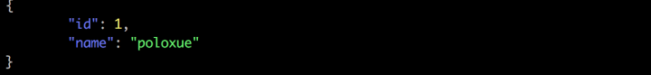

> 转载: [GO 小知识之如何做 JSON 美化 - 知乎](https://zhuanlan.zhihu.com/p/65905512)

后端 http 接口测试常需要打印 JSON 返回，但是默认的 json 展示形式是紧凑型的，不易阅读，或许很多人习惯于使用在线格式化工具。但如果能用代码直接 JSON 美化，为什么还要多开一次浏览器呢？

### 非 string 类型的结构体、map 等类型的 Marsh 美化

比如有这样一个 map 或者结构体。

```go
u := map[string]interface{}{
	"id":   1,
	"name": "poloxue",
}
```

使用 GO 内置的包 encoding/json。

如果用 json.Marshal 转化，代码如下：

```go
uglyBody, err := json.Marshal(u)
if err != nil {
	panic(err)
}
fmt.Printf("%s\n", uglyBody)
```

打印结果：

```json
{"id":1,"name":"poloxue"}
```

效果并不友好，如果是复杂的 map，结果将非常乱。

可以使用 json.MarchalIndent，代码如下：

```go
body, err := json.MarshalIndent(u, "", "\t")
if err != nil {
	panic(err)
}
fmt.Printf("%s\n", body)
```

\t 表示缩进效果。最终的结果如下：

```json
{
	"id": 1,
	"name": "poloxue"
}
```

看着舒服了很多。

### JSON 的 string 如何美化

如果是一个 JSON 字符串怎么办？比如 上面示例中的 uglyBody 的结果。

**方法一**

使用 encoding/json 包中 Indent 方法。

代码如下：

```go
var out bytes.Buffer
err = json.Indent(&out, uglyBody, "", "\t")
if err != nil {
	panic(err)
}
fmt.Printf("%s\n", out.String())
```

结果如下：

```json
{
	"id": 1,
	"name": "poloxue"
}
```

**方法二**

github 上面有人实现了一个 JSON pretty 的包。

地址在：[https://github.com/tidwall/pretty](https://link.zhihu.com/?target=https%3A//github.com/tidwall/pretty)

使用非常简单，代码如下：

```go
fmt.Printf("%s\n", pretty.Pretty(uglyBody))
```

结果如下：

```json
{
  "id": 1,
  "name": "poloxue"
}
```

这个库没有依赖 encoding/json，纯代码解析字符串。而且还可以做 color 美化。

color 美化的示例代码：

```go
fmt.Printf("%s\n", pretty.Color(uglyBody, pretty.TerminalStyle))
fmt.Printf("%s\n", pretty.Color(pretty.Pretty(uglyBody), pretty.TerminalStyle))
```

pretty.TerminalStyle 表示打印控制台的着色风格，结果如下：


SO 漂亮！

### 一个 JSON 美化小工具

利用上面介绍的这些，开发一个非常简单的小工具，代码如下：

```go
package main

import (
	"flag"
	"fmt"

	"github.com/tidwall/pretty"
)

var help bool
var uglyJson string
var indent string

func init() {
	flag.BoolVar(&help, "h", false, "show help")
	flag.StringVar(&uglyJson, "s", "", "json string")
	flag.StringVar(&indent, "i", "\t", "indent string, default tab")
}

func main() {
	flag.Parse()

	if help {
		fmt.Printf("usage:\n\n")
		flag.PrintDefaults()
		return
	}

	var Options = &pretty.Options{Width: 80, Prefix: "", Indent: indent, SortKeys: false}
	fmt.Printf("%s\n", pretty.Color(pretty.PrettyOptions([]byte(uglyJson), Options), pretty.TerminalStyle))
}
```

编译成功之后，就可以用了。比如生成的可执行文件名为 `prettyjson`，美化 {"id":1,"name":"poloxue"}。

```go
$ ./jsonpretty -s '{"id":1,"name":"poloxue"}'
```

效果如下：


