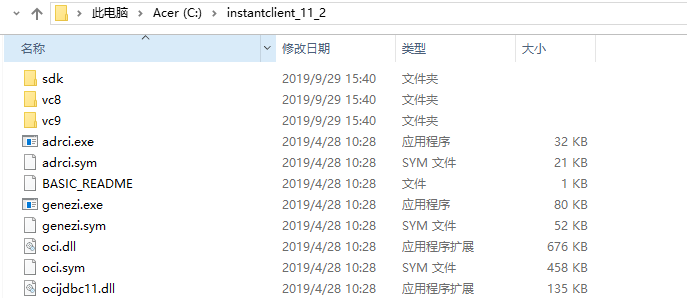
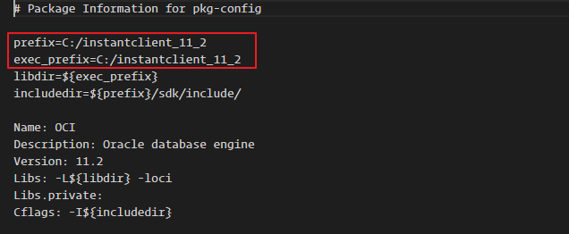
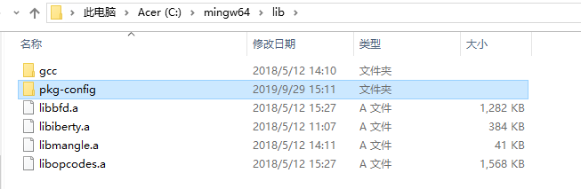

### 下载 ORACLE INSTANCCLIENT 和对应的 SDK

下载地址: https://www.oracle.com/database/technologies/instant-client/winx64-64-downloads.html

下载之后先解压 basic 压缩包，然后将 sdk 解压到 basic 目录下，添加 `C:\instantclient_11_2` 到系统 PATH 变量

注意: 不要将解压缩的文件放到有空格的目录中，例如 `C:\Program Files\instantclient_11_2` 否则后续会找不到 oci.h



### 下载安装 MINGW64

解决 WIN 中没有 GCC 的问题, 如果不安装后期会出现问题：（exec: "gcc": executable file not found in %PATH%），因为之前下载的 ORACLE INSTANCCLIENT 是 64 位的所以我们也需要下载 MINGW64 才能编译(如果版本不对应会出现编译错误)。安装完成后添加 `C:\mingw64\bin`到 PATH 环境变量。

### 获取 GO-OCI8 驱动

执行命令：`go get github.com/wendal/go-oci8`

会报一个错误：`pkg-config: exec: "pkg-config": executable file not found in %PATH%`

先忽略，后面解决

### 修改 OCI8.PC

进入 GOPATH 目录 `%GoPath%\src\github.com\wendal\go-oci8\windows`，找到 OCI8.PC 文件，修改 `prefix` 和 `exec_prefix`



然后

1. 复制此目录下 pkg-config.exe 到 mingw64 下的 bin 目录

2. 复制此目录下 oci8.pc 到 mingw64 下的 lib/pkg-config 目录（pkg-config 目录需要自己建), 添加 `PKG_CONFIG_PATH` 环境变量, 值为 oci8.pc 所在位置 `C:\mingw64\lib\pkg-config`

   

### 继续安装 go-oci8

再次执行 `go get github.com/wendal/go-oci8` 出现如下错误

github.com/wendal/go-oci8

In file included from C:/instantclient_11_2/sdk/include/oci.h:541,
from D:\study\go\src\github.com\wendal\go-oci8\oci8.go:4:
C:/instantclient_11_2/sdk/include/oratypes.h:236:25: error: expected '=', ',', ';', 'asm' or '**attribute**' before 'ubig_ora'
typedef unsigned \_int64 ubig_ora;

找到 `C:/instantclient_11_2/sdk/include/oratypes.h` 文件中添加 `#define _int64 __int64` 或者

直接按照如下方式修改:

```c
typedef unsigned __int64 ubig_ora;
typedef   signed __int64 sbig_ora;
// #ifndef lint
// #ifdef __BORLANDC__
// typedef unsigned __int64 ubig_ora;
// typedef   signed __int64 sbig_ora;
// #else
// typedef unsigned _int64 ubig_ora;
// typedef   signed _int64 sbig_ora;
// #endif /* End of __BORLANDC__ */
// #else
// #define ubig_ora unsigned _int64
// #define sbig_ora signed _int64
// #endif /* End of lint */
```

继续执行 `go get github.com/wendal/go-oci8` 出现错误

github.com/wendal/go-oci8

D:\study\go\src\github.com\wendal\go-oci8\oci8.go:124:3: cannot use \_cgo2 (type **\_Ctype_struct_OCIServer) as type **\_Ctype_struct_OCISvcCtx in argument to \_Cfunc_OCILogon

打开 GOPATH 目录下 `%GoPath%\src\github.com\wendal\go-oci8`，oci8.go 文件修改四处 `OCIServer` 为 `OCISvcCtx`

然后再执行 `go get github.com/wendal/go-oci8` 成功。

### Test Oracle Connect

```go
package main

import (
	"database/sql"
	"fmt"
	"log"
	"os"

	_ "github.com/wendal/go-oci8"
)

type Order struct {
	EdiID        int
	EdiType      int
	EdiDate      string
	CustomerID   string
	CustPoNumber string
}

func test() {
	os.Setenv("NLS_LANG", "AMERICAN_AMERICA.AL32UTF8")
	log.SetFlags(log.Lshortfile | log.LstdFlags)

	db, err := sql.Open("oci8", "username/password@instance")
	if err != nil {
		log.Fatal(err)
	}
	defer db.Close()

	sqlStr := "select edi_id, edi_type, edi_date, customer_id, cust_po_number from som_edi_temp_h where edi_id < :edi_id" // 注意 oracle 占位符使用 : 不是 ?
	stmt, err := db.Prepare(sqlStr)
	if err != nil {
		log.Fatal(err)
		return
	}
	defer stmt.Close()

	rows, err := stmt.Query(100)
	if err != nil {
		log.Fatal(err)
		return
	}
	defer rows.Close()

	var orders []Order
	for rows.Next() {
		order := Order{}
		rows.Scan(&order.EdiID, &order.EdiType, &order.EdiDate, &order.CustomerID, &order.CustPoNumber)
		orders = append(orders, order)
	}
	fmt.Println(orders)
}


func main() {
	test()
}

```
