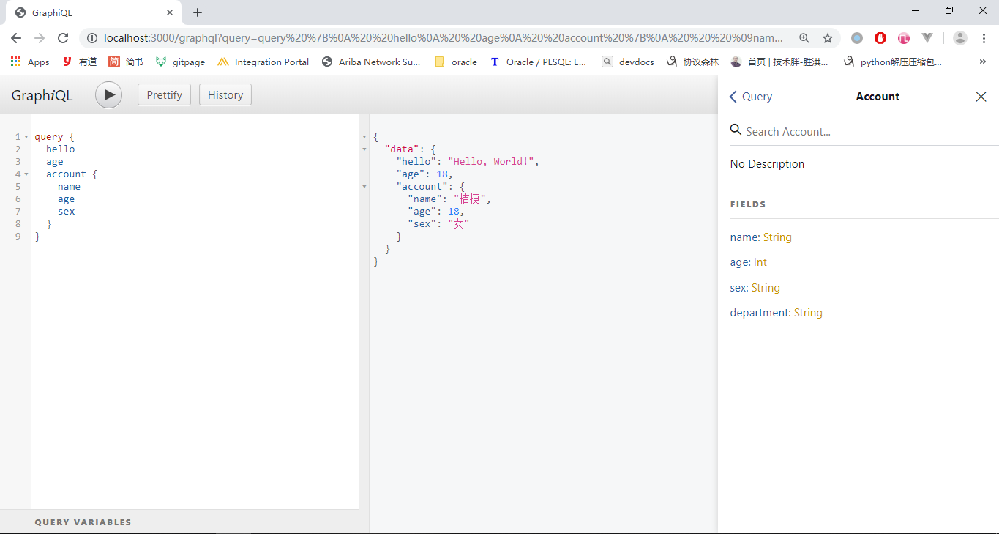
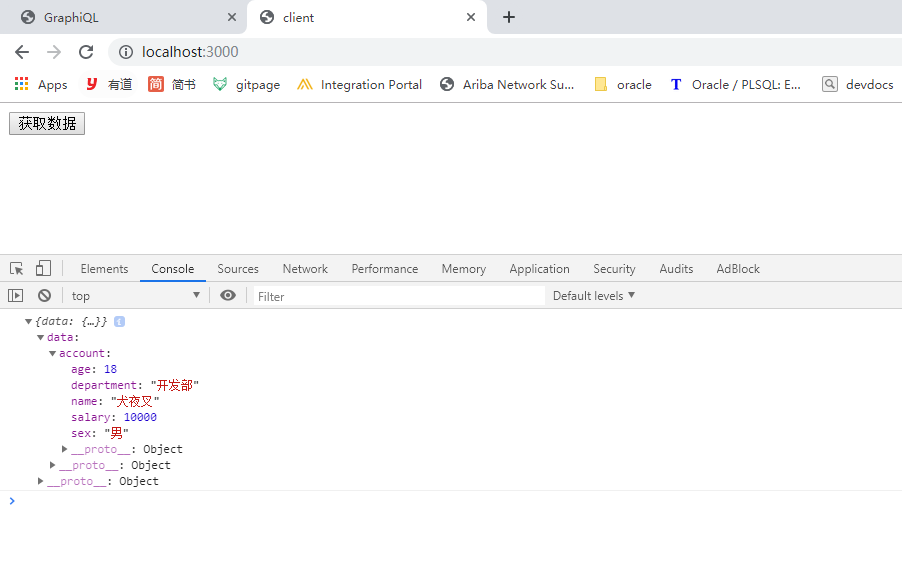

### GraphQL 特点

1. 精确请求需要的数据，不多不少。例如: account 中有 name, sex, age 可以只取得需要的字段 name。
2. 可以只用一个请求获取多个资源。
3. 描述所有可能的类型系统，方便维护，可以根据需求平滑演进，添加或隐藏字段。

### GraphQL 与 restful 区别

1. restful 一个接口只能返回一个资源，graphql 一次可以获得多个资源
2. restful 使用不同 url 来区分资源，graphql 使用类型区分资源。

### GraphQL 参数类型

基本类型: String, Int, Float, Boolean, ID；可以在 schema 声明的时候直接使用。

数组类型: [类型] 代表数组，例如 [Int] 代表整型数组。

```js
// hello.js
const express = require('express')
const graphqlHTTP = require('express-graphql')
const { buildSchema } = require('graphql')

// 构建 schema, 定义查询语句和类型
const schema = buildSchema(`
    type Account {
        name: String
        age: Int
        sex: String
        department: String
    }
    type Query {
        hello: String
        age: Int
        account: Account
    }
`)

// 定义查询对应的 resolver, 也就是查询对应的处理器
const root = {
  hello: () => {
    return 'Hello, World!'
  },
  age: () => {
    return 18
  },
  account: () => {
    return {
      name: '桔梗',
      age: 18,
      sex: '女',
      department: '技术部'
    }
  }
}

const app = express()

app.use(
  '/graphql',
  graphqlHTTP({
    schema: schema,
    rootValue: root,
    graphiql: true // debug
  })
)

app.listen(3000, () => {
  console.log('listening on 3000...')
})
```

启动 hello.js `node hello.js`, 在浏览器输入 http://localhost:3000/graphql， 在 GraphiQL 调试面板输入 query 语句， 中间面板会返回查询语句

```graphql
query {
  hello
  age
  account {
    name
    age
    sex
  }
}
```



### GraphQL 参数和返回值

1. 和 js 一样，小括号内定义形参，参数需要定义类型。
2. `!` 表示参数不能为空。
3. 返回需要定义返回类型

```js
type Query {
    rollDice(numDice: Int!, numSides: Int): [Int]
}
```

### GrphQL clients

base.js

```js
const express = require('express')
const graphqlHTTP = require('express-graphql')
const { buildSchema } = require('graphql')

// 构建 schema, 定义查询语句和类型
const schema = buildSchema(`
   type Account {
       name: String
       age: Int
       sex: String
       department: String
       salary(city: String): Int
   }
   type Query {
       getClassMates(classNo: Int!): [String]
       account(username: String): Account 
   }
`)

// 定义查询对应的 resolver, 也就是查询对应的处理器
const root = {
  // {classNo} 从 arguments 中解构出 classNo
  getClassMates({ classNo }) {
    const obj = {
      1: ['java', 'scala', 'groovy'],
      2: ['python', 'ruby', 'php'],
      3: ['oracle', 'mysql', 'mongo']
    }
    return obj[classNo]
  },
  account({ username }) {
    const name = username
    const sex = '男'
    const age = 18
    const department = '开发部'
    const salary = ({ city }) => {
      if (city === '北京' || city === '上海') return 10000
      return 3000
    }
    return {
      name,
      sex,
      age,
      department,
      salary
    }
  }
}

const app = express()

app.use(
  '/graphql',
  graphqlHTTP({
    schema: schema,
    rootValue: root,
    graphiql: true // debug
  })
)

// 公共文件夹，供用户访问静态资源
app.use(express.static('public'))

app.listen(3000, () => {
  console.log('listening on 3000...')
})
```

public/index.html

```html
<!DOCTYPE html>
<html lang="en">
  <head>
    <meta charset="UTF-8" />
    <meta name="viewport" content="width=device-width, initial-scale=1.0" />
    <meta http-equiv="X-UA-Compatible" content="ie=edge" />
    <title>client</title>
  </head>

  <body>
    <button onclick="getData()">获取数据</button>
    <script>
      function getData() {
        const query = `
                query Account($username: String, $city: String){
                    account(username: $username) {
                        name
                        age
                        sex
                        department
                        salary(city: $city)
                    }
                }
            `
        const variables = {
          username: '犬夜叉',
          city: '北京'
        }

        fetch('/graphql', {
          method: 'POST',
          headers: {
            'Content-Type': 'application/json',
            Accept: 'application/json'
          },
          body: JSON.stringify({
            query: query,
            variables: variables
          })
        })
          .then(res => res.json())
          .then(json => {
            console.log(json)
          })
      }
    </script>
  </body>
</html>
```

启动 base.js, `node base.js`



### GraphQL + MySql

`query` 查询数据， `Mutations` 修改数据

accouont 表结构如下:

```sql
CREATE TABLE `account` (
  `id` int(11) NOT NULL AUTO_INCREMENT,
  `name` varchar(45) DEFAULT NULL,
  `age` int(11) DEFAULT NULL,
  `sex` varchar(45) DEFAULT NULL,
  `department` varchar(45) DEFAULT NULL,
  PRIMARY KEY (`id`)
) ENGINE=InnoDB AUTO_INCREMENT=4 DEFAULT CHARSET=utf8 COMMENT='graphql test table'
```

db.js

```js
const express = require('express')
const graphqlHTTP = require('express-graphql')
const { buildSchema } = require('graphql')
const mysql = require('mysql')
const connection = mysql.createConnection({
  host: 'localhost',
  user: 'root',
  password: 'root',
  database: 'test'
})

// 构建 schema, 定义查询语句和类型
const schema = buildSchema(`
    input AccountInput {
        name: String
        age: Int
        sex: String
        department: String
    }

    type Account {
        name: String
        age: Int
        sex: String
        department: String
    }
    
    type Mutation {
        createAccount(input: AccountInput): Account
        updateAccount(id: ID!, input: AccountInput): Account
        deleteAccount(id: ID!): Boolean
    }

    type Query {
        accounts: [Account]
    }
`)

// 定义查询对应的 resolver, 也就是查询对应的处理器
const root = {
  createAccount({ input }) {
    // 数据保存
    const data = {
      name: input.name,
      sex: input.sex,
      age: input.age,
      department: input.department
    }
    return new Promise((resolve, reject) => {
      connection.query('INSERT INTO account SET ?', data, function(error) {
        if (error) {
          console.log('error: ' + error.message)
          return
        }
      })
      // 返回结果
      resolve(data)
    })
  },

  deleteAccount({ id }) {
    return new Promise((resolve, reject) => {
      connection.query('delete from account where name = ?', id, function(
        error
      ) {
        if (error) {
          console.log('error: ' + error.message)
          reject(false)
          return
        }
      })
      // 删除成功
      resolve(true)
    })
  },

  updateAccount({ id, input }) {
    // 数据更新
    // const data = {
    //     name: input.name,
    //     sex: input.sex,
    //     age: input.age,
    //     department: input.department
    // }
    // 如果只更新 department, 其它属性就为空，用上面方式会将 name 等都更新为 null
    // 直接让 data=input, 就不会动到其它属性
    // # mutation {
    // #   updateAccount(id: "虞姬", input: {
    // #     department: "程序猿"
    // #   }) {
    // #     department
    // #   }
    // # }
    const data = input
    return new Promise((resolve, reject) => {
      connection.query(
        'update account set ? where name = ?',
        [data, id],
        function(error) {
          if (error) {
            console.log('error: ' + error.message)
            return
          }
        }
      )
      // 返回更新后的数据
      resolve(data)
    })
  },

  accounts() {
    return new Promise((resolve, reject) => {
      connection.query(
        'select name, age, sex, department from account',
        (error, results) => {
          if (error) {
            console.log('error: ' + error.message)
            return
          }
          const arr = []
          for (let i = 0; i < results.length; i++) {
            arr.push({
              name: results[i].name,
              age: results[i].age,
              sex: results[i].sex,
              department: results[i].department
            })
          }
          resolve(arr)
        }
      )
    })
  }
}

const app = express()

app.use(
  '/graphql',
  graphqlHTTP({
    schema: schema,
    rootValue: root,
    graphiql: true // debug
  })
)

app.listen(3000, () => {
  console.log('listening on 3000...')
})
```

GraphQL crud

```js
// create
mutation {
  createAccount(input: {
    name: "虞姬"
    age: 20
    sex: "女"
    department: "程序媛"
  }){
   name
  }
}


mutation {
  createAccount(input: {
    name: "aaa"
    age: 20
    sex: "女"
    department: "程序媛"
  }){
   name
  }
}


// delete
mutation {
  deleteAccount(id: "aaa")
}


// update
mutation {
  updateAccount(id: "虞姬", input: {
    department: "程序猿"
  }) {
    department
  }
}


// retrieve
query {
  accounts {
    name
    age
    sex
    department
  }
}
```
