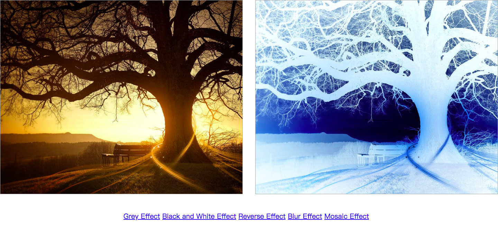

### canvas

HTML5 canvas 元素用于图形的绘制，通过脚本 (通常是 JavaScript)来完成，canvas 标签只是图形容器，您必须使用脚本来绘制图形。你可以通过多种方法使用 canvas 绘制路径,盒、圆、字符以及添加图像。

### canvas flow

1. 定义 canvas 元素；
2. 获取 canvas 元素；
3. 请求图形的绘图上下文可以获取 2d 的和 3d 的绘图环境；
4. 在绘图上下文上调用相应的绘制函数,以绘制图形；

### canvas demo

利用 canvas 显示 original 图片和 filter 后的图片

```html
<!DOCTYPE html>
<html>
  <head lang="en">
    <meta charset="UTF-8" />
    <title></title>
    <style>
      #canvasa {
        display: block;
        float: left;
        border: 1px solid #aaa;
      }
      #canvasb {
        display: block;
        float: right;
        border: 1px solid #aaa;
      }
    </style>
  </head>
  <body>
    <div style="margin: 20px auto; width:1440px;">
      <!--1. 定义canvas元素-->
      <canvas id="canvasa" width="700" height="560"> </canvas>

      <canvas id="canvasb" width="700" height="560"> </canvas>
    </div>
    <div style="clear: both"></div>

    <div style="text-align:center; margin-top:50px;font-size:20px;">
      <a href="javascript:greyEffect()">Grey Effect</a>
      <a href="javascript:blackEffect()">Black and White Effect</a>
      <a href="javascript:reverseEffect()">Reverse Effect</a>
      <a href="javascript:blurEffect()">Blur Effect</a>
      <a href="javascript:mosaicEffect()">Mosaic Effect</a>
    </div>
    <script>
      // 2. 获取<canvas>元素
      var canvasa = document.getElementById('canvasa')
      // 3. 请求图形的绘图上下文可以获取2d的和3d的绘图环境；
      var contexta = canvasa.getContext('2d')

      var canvasb = document.getElementById('canvasb')
      var contextb = canvasb.getContext('2d')

      var image = new Image()

      window.onload = function() {
        image.src = 'autumn.jpg'
        image.onload = function() {
          // 4. 在绘图上下文上调用相应的绘制函数,以绘制图形；
          contexta.drawImage(image, 0, 0, canvasa.width, canvasa.height)
        }
      }

      // 图像灰度处理
      function greyEffect() {
        var imageData = contexta.getImageData(
          0,
          0,
          canvasa.width,
          canvasa.height
        )
        var pixelData = imageData.data
        for (var i = 0; i < canvasb.width * canvasb.height; i++) {
          var r = pixelData[i * 4 + 0]
          var g = pixelData[i * 4 + 1]
          var b = pixelData[i * 4 + 2]

          var grey = r * 0.3 + g * 0.59 + b * 0.11

          pixelData[i * 4 + 0] = grey
          pixelData[i * 4 + 1] = grey
          pixelData[i * 4 + 2] = grey
        }

        contextb.putImageData(
          imageData,
          0,
          0,
          0,
          0,
          canvasb.width,
          canvasb.height
        )
        context.putImageData()
      }

      function blackEffect() {
        var imageData = contexta.getImageData(
          0,
          0,
          canvasa.width,
          canvasa.height
        )
        var pixelData = imageData.data
        for (var i = 0; i < canvasb.width * canvasb.height; i++) {
          var r = pixelData[i * 4 + 0]
          var g = pixelData[i * 4 + 1]
          var b = pixelData[i * 4 + 2]

          var grey = r * 0.3 + g * 0.59 + b * 0.11
          if (grey > 125) {
            pv = 255
          } else {
            pv = 0
          }

          pixelData[i * 4 + 0] = pv
          pixelData[i * 4 + 1] = pv
          pixelData[i * 4 + 2] = pv
        }

        contextb.putImageData(
          imageData,
          0,
          0,
          0,
          0,
          canvasa.width,
          canvasa.height
        )
      }

      function reverseEffect() {
        var imageData = contexta.getImageData(
          0,
          0,
          canvasa.width,
          canvasa.height
        )
        var pixelData = imageData.data
        for (var i = 0; i < canvasb.width * canvasb.height; i++) {
          var r = pixelData[i * 4 + 0]
          var g = pixelData[i * 4 + 1]
          var b = pixelData[i * 4 + 2]

          pixelData[i * 4 + 0] = 255 - r
          pixelData[i * 4 + 1] = 255 - g
          pixelData[i * 4 + 2] = 255 - b
        }

        contextb.putImageData(
          imageData,
          0,
          0,
          0,
          0,
          canvasb.width,
          canvasb.height
        )
      }

      function blurEffect() {
        var tmpImageData = contexta.getImageData(
          0,
          0,
          canvasa.width,
          canvasa.height
        )
        var tmpPixelData = tmpImageData.data

        var imageData = contexta.getImageData(
          0,
          0,
          canvasa.width,
          canvasa.height
        )
        var pixelData = imageData.data

        var blurR = 3
        var totalnum = (2 * blurR + 1) * (2 * blurR + 1)

        for (var i = blurR; i < canvasb.height - blurR; i++)
          for (var j = blurR; j < canvasb.width - blurR; j++) {
            var totalr = 0,
              totalg = 0,
              totalb = 0
            for (var dx = -blurR; dx <= blurR; dx++)
              for (var dy = -blurR; dy <= blurR; dy++) {
                var x = i + dx
                var y = j + dy

                var p = x * canvasb.width + y
                totalr += tmpPixelData[p * 4 + 0]
                totalg += tmpPixelData[p * 4 + 1]
                totalb += tmpPixelData[p * 4 + 2]
              }

            var p = i * canvasb.width + j
            pixelData[p * 4 + 0] = totalr / totalnum
            pixelData[p * 4 + 1] = totalg / totalnum
            pixelData[p * 4 + 2] = totalb / totalnum
          }

        contextb.putImageData(
          imageData,
          0,
          0,
          0,
          0,
          canvasb.width,
          canvasb.height
        )
      }

      function mosaicEffect() {
        var tmpImageData = contexta.getImageData(
          0,
          0,
          canvasa.width,
          canvasa.height
        )
        var tmpPixelData = tmpImageData.data

        var imageData = contexta.getImageData(
          0,
          0,
          canvasa.width,
          canvasa.height
        )
        var pixelData = imageData.data

        var size = 16
        var totalnum = size * size
        for (var i = 0; i < canvasb.height; i += size)
          for (var j = 0; j < canvasb.width; j += size) {
            var totalr = 0,
              totalg = 0,
              totalb = 0
            for (var dx = 0; dx < size; dx++)
              for (var dy = 0; dy < size; dy++) {
                var x = i + dx
                var y = j + dy

                var p = x * canvasb.width + y
                totalr += tmpPixelData[p * 4 + 0]
                totalg += tmpPixelData[p * 4 + 1]
                totalb += tmpPixelData[p * 4 + 2]
              }

            var p = i * canvasb.width + j
            var resr = totalr / totalnum
            var resg = totalg / totalnum
            var resb = totalb / totalnum

            for (var dx = 0; dx < size; dx++)
              for (var dy = 0; dy < size; dy++) {
                var x = i + dx
                var y = j + dy

                var p = x * canvasb.width + y
                pixelData[p * 4 + 0] = resr
                pixelData[p * 4 + 1] = resg
                pixelData[p * 4 + 2] = resb
              }
          }

        contextb.putImageData(
          imageData,
          0,
          0,
          0,
          0,
          canvasb.width,
          canvasb.height
        )
      }
    </script>
  </body>
</html>
```

### Reverse Effect 显示效果



> 引用: https://www.imooc.com/
