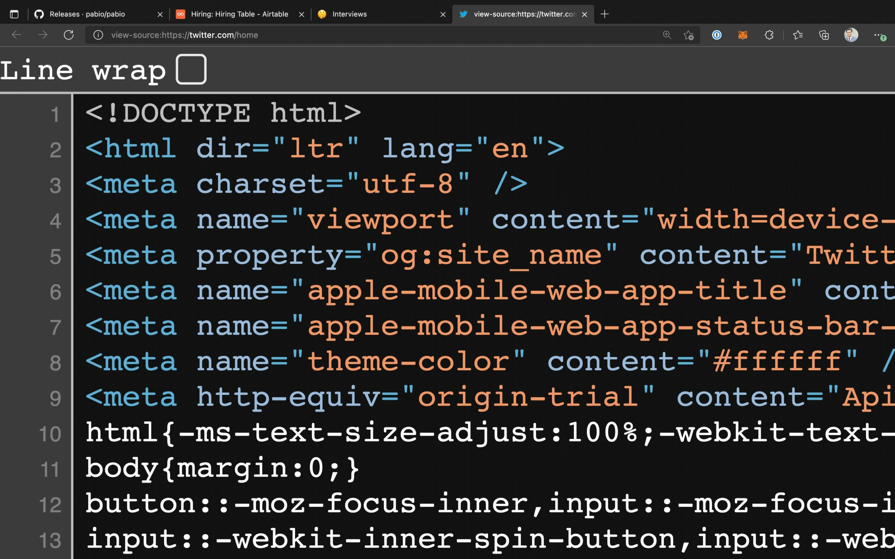

> 转载：[Explain the First 10 Lines of Twitter's Source Code to Me | CSS-Tricks - CSS-Tricks](https://css-tricks.com/explain-the-first-10-lines-of-twitter-source-code/)

For the past few weeks, I’ve been hiring for a senior [full-stack](https://css-tricks.com/what-does-it-mean-to-be-full-stack/) JavaScript engineer at my rental furniture company, [Pabio](https://pabio.com/en-de/). Since we’re a remote team, we conduct our interviews on Zoom, and I’ve observed that some developers are not great at live-coding or whiteboard interviews, even if they’re good at the job. So, instead, we have an hour-long technical discussion where I ask them questions about web vitals, accessibility, the browser wars, and other similar topics about the web. One of the questions I always like to ask is: **“Explain the first ten or so lines of the Twitter source code to me.”**

I think it’s a simple test that tells me a lot about the depth of fundamental front-end knowledge they have, and this article lists the best answers.



Note that since our technical discussion is a conversation. I don’t expect a perfect answer from anyone. If I hear some right keywords, I know that the candidate knows the concept, and I try to push them in the right direction.

### Line 1: `<!DOCTYPE html>`

The first line of every document’s source code is perfect for this interview because how much a candidate knows about the `DOCTYPE` declaration closely resembles how many years of experience they have. I still remember my Dreamweaver days with the long XHTML DOCTYPE line, like Chris listed in his article [“The Common DOCTYPES”](https://css-tricks.com/snippets/html/the-common-doctypes/) from 2009.

**Perfect answer:** This is the document type (doc-type) declaration that we always put as the first line in HTML files. You might think that this information is redundant because the browser already knows that the MIME type of the response is `text/html`; but [in the Netscape/Internet Explorer days](https://css-tricks.com/chapter-8-css/), browsers had the difficult task of figuring out which HTML standard to use to render the page from multiple competing versions.

This was especially annoying because each standard generated a different layout so this tag was adopted to make it easy for browsers. Previously, `DOCTYPE` tags were long and even included the specification link (kinda like SVGs have today), but luckily the simple `<!doctype html>` was standardized in HTML5 and still lives on.

**Also accepted:** This is the `DOCTYPE` tag to let the browser know that this is an HTML5 page and should be rendered as such.

### Line 2: `<html dir="ltr" lang="en">`

This line in the source code tells me if the candidate knows about accessibility and localization. Surprisingly, only a few people knew about the `dir` attribute in my interviews, but it’s a great segue into a discussion about screen readers. Almost everyone was able to figure out the `lang="en"` attribute, even if they hadn’t used it before.

**Perfect answer:** This is the root element of an HTML document and all other elements are inside this one. Here, it has two attributes, direction and language. The direction attribute has the value left-to-right to tell user agents which direction the content is in; other values are right-to-left for languages like Arabic, or just `auto` which leaves it to the browser to figure out.

The language attribute tells us that all content inside this tag is in English; you can set this value to any language tag, even to differentiate `en-us` and `en-gb`, for example. This is also useful for screen readers to know which language to announce in.

### Line 3: `<meta charset="utf-8">`

**Perfect answer:** The meta tag in the source code is for supplying metadata about this document. The character set (char-set) attribute tells the browser which character encoding to use, and Twitter uses the standard UTF-8 encoding. UTF-8 is great because it has many character points so you can use all sorts of symbols and emoji in your source code. It’s important to put this tag near the beginning of your code so the browser hasn’t already started parsing too much text when it comes across this line; I think the rule is to put it in the first kilobyte of the document, but I’d say the best practice is to put it right at the top of `<head>`.

As a side note, it looks like Twitter omits the `<head>` tag for performance reasons (less code to load), but I still like to make it explicit as it’s a clear home for all metadata, styles, etc.

### Line 4: `<meta name="viewport" content="width=device-...`

**Perfect answer:** This meta tag in the source code is for properly sizing the webpage on small screens, like smartphones. If you remember the original iPhone keynote, Steve Jobs showed the entire New York Times website on that tiny 4.5-inch screen; back then it was an amazing feature that you had to pinch to zoom to actually be able to read.

Now that websites are responsive by design, `width=device-width` tells the browser to use 100% of the device’s width as the viewport so there’s no horizontal scrolling, but you can even specify specific pixel values for width. The standard best practice is to set the initial scale to `1` and the width to `device-width` so people can still zoom around if they wish.

The screenshot of the source code doesn’t show these values but it’s good to know: Twitter also applies `user-scalable=0` which, as the name suggests, disables the ability to zoom. This is not good for accessibility but makes the webpage feel more like a native app. It also sets `maximum-scale=1` for the same reason (you can use minimum and maximum scale to clamp the zoom-ablity between these values). In general, setting the full width and initial scale is enough.

### Line 5: `<meta property="og:site_name" content="Twitt...`

About 50% of all candidates knew about Open Graph tags, and a good answer to this question shows that they know about SEO.

**Perfect answer:** This tag is an Open Graph (OG) meta tag for the site name, Twitter. [The Open Graph protocol](https://ogp.me/) was made by Facebook to make it easier to unfurl links and [show their previews in a nice card layout](https://css-tricks.com/microbrowsers-are-everywhere/); developers can add all sorts of authorship details and cover images for fancy sharing. In fact, these days it’s even common to auto-generate the open graph image using something like Puppeteer. ([CSS-Tricks uses a WordPress plugin](https://css-tricks.com/automatic-social-share-images/) that does it.)

Another interesting side note is that meta tags usually have the `name` attribute, but OG uses the non-standard `property` attribute. I guess that’s just Facebook being Facebook? The title, URL, and description Open Graph tags are kinda redundant because we already have regular meta tags for these, but people add them just to be safe. Most sites these days use a combination of Open Graph and other metatags and the content on a page to generate rich previews.

### Line 6: `<meta name="apple-mobile-web-app-title" cont...`

Most candidates didn’t know about this one, but experienced developers can talk about how to optimize a website for Apple devices, like `apple-touch-icon`s and Safari pinned tab SVGs.

**Perfect answer:** You can pin a website on an iPhone’s homescreen to make it feel like a native app. Safari doesn’t support progressive web apps and you can’t really use other browser engines on iOS, so you don’t really have other options if you want that native-like experience, which Twitter, of course, likes. So they add this to tell Safari that the title of this app is Twitter. The next line is similar and controls how the status bar should look like when the app has launched.

### Line 8: `<meta name="theme-color" content="#ffffff"...`

**Perfect answer:** This is the proper web standards-esque equivalent of the Apple status bar color meta tag. [It tells the browser to theme the surrounding UI](https://css-tricks.com/meta-theme-color-and-trickery/)[.](https://css-tricks.com/meta-theme-color-and-trickery/) Chrome on Android and Brave on desktop both do a pretty good job with that. You can put any CSS color in the content, and can even use the `media` attribute to only show this color for a specific media query like, for example, to support a dark theme. You can also define this and additional properties in the web app manifest.

### Line 9: `<meta http-equiv="origin-trial" content="...`

Nobody I interviewed knew about this one. I would assume that you’d know this only if you have in-depth knowledge about all the new things that are happening on the standards track.

**Perfect answer:** Origin trials let us use new and experimental features on our site and the feedback is tracked by the user agent and reported to the web standards community without users having to opt-in to a feature flag. For example, Edge has an origin trial for dual-screen and foldable device primitives, which is pretty cool as you can make interesting layouts based on whether a foldable phone is opened or closed.

**Also accepted:** I don’t know about this one.

### Line 10: `html{-ms-text-size-adjust:100%;-webkit-text...`

Almost nobody knew about this one too; only if you know about CSS edge cases and optimizations, you’d be able to figure this line out.

**Perfect answer:** Imagine that you don’t have a mobile responsive site and you open it on a small screen, so the browser might resize the text to make it bigger so it’s easier to read. The CSS [`text-size-adjust`](https://developer.mozilla.org/en-US/docs/Web/CSS/text-size-adjust) property can either disable this feature with the value none or specify a percentage up to which the browser is allowed to make the text bigger.

In this case, Twitter says the maximum is `100%`, so the text should be no bigger than the actual size; they just do that because their site is already responsive and they don’t want to risk a browser breaking the layout with a larger font size. This is applied to the root HTML tag so it applies to everything inside it. Since this is an experimental CSS property, vendor prefixes are required. Also, there’s a missing `<style>` before this CSS, but I’m guessing that’s minified in the previous line and we don’t see it.

**Also accepted:** I don’t know about this property in specific but the `-ms` and `-webkit-` are vendor prefixes needed by Internet Explorer and WebKit-based browsers, respectively, for non-standard properties. We used to require these prefixes when CSS3 came out, but as properties go from experimental to stable or are adopted to a standards track, these prefixes go away in favor of a standardized property.

### Bonus — Line 11: `body{margin:0;}`

This line from Twitter’s source code is particularly fun because you can follow-up with a question about the difference between resetting and normalizing a webpage. Almost everyone knew a version of the right answer.

**Perfect answer:** Because different browsers have different default styles (user agent stylesheet), you want to overwrite them by resetting properties so your site looks the same across devices. In this case, Twitter is telling the browser to remove the body tag’s default margin. This is just to reduce browser inconsistencies, but I prefer normalizing the styles instead of resetting them, i.e., applying the same defaults across browsers rather than removing them altogether. People even used to use `* { margin: 0 }` which is totally overkill and not great for performance, but now it’s common to import something like `normalize.css` or `reset.css` (or even [something newer](https://css-tricks.com/an-interview-with-elad-shechter-on-the-new-css-reset/)) and start from there.

### More lines!

I always enjoy playing with the browser Inspector tool to see how sites are made, which is how I came up with this idea. Even though I consider myself sort of an expert on semantic HTML, I learn something new every time I do this exercise.

Since Twitter is mostly a client-side React app, there’s only a few dozen lines in the source code. Even with that, there’s so much to learn! There are a few more interesting lines in the Twitter source code that I leave as an exercise for you, the reader. How many of them could you explain in an interview?

```html
<link rel="search" type="application/opensearchdescription+xml" href="/opensearch.xml" title="Twitter">
```

…tells browsers that users can add Twitter as a search engine.

```html
<link rel="preload" as="script" crossorigin="anonymous" href="https://abs.twimg.com/responsive-web/client-web/polyfills.cad508b5.js" nonce="MGUyZTIyN2ItMDM1ZC00MzE5LWE2YmMtYTU5NTg2MDU0OTM1" />
```

…has many interesting attributes that can be discussed, especially `nonce`.

```html
<link rel="alternate" hreflang="x-default" href="https://twitter.com/" />
```

…for international landing pages.

```css
:focus:not([data-focusvisible-polyfill]){outline: none;}
```

…for removing the focus outline when not using keyboard navigation (the CSS `:focus-visible` selector is polyfilled here).