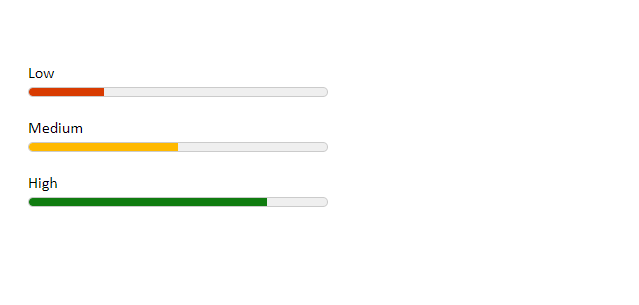
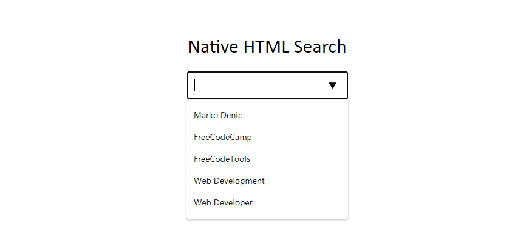
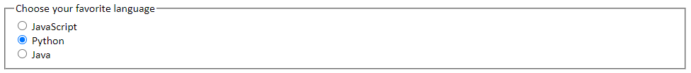
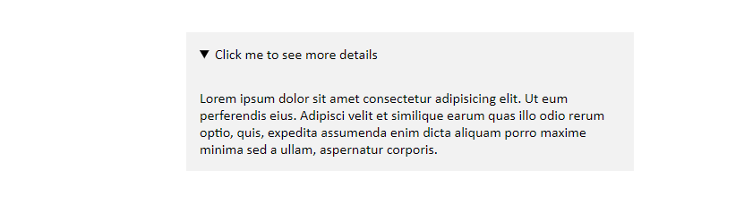
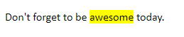
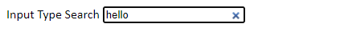
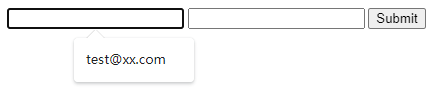
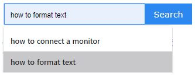
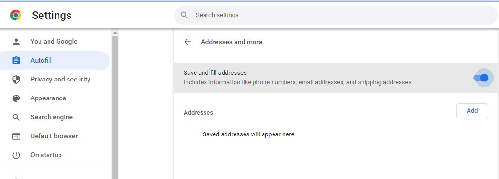

> 转载: [HTML Tips - Marko Denic - Web Developer](https://markodenic.com/html-tips/)

In this article, I will share with you some very useful **HTML Tips**. Enjoy!

But first, what is HTML? Hypertext Markup Language (HTML) is the standard markup language for documents designed to be displayed in a web browser. It can be assisted by technologies such as Cascading Style Sheets (CSS) and scripting languages such as JavaScript.

### The `loading=lazy` attribute

Performance tip. You can use the `loading=lazy` attribute to defer the loading of the image until the user scrolls to them.

```html

```

### Email, call, and SMS links:

```html
<a href="mailto:{email}?subject={subject}&body={content}"> Send us an email </a>

<a href="tel:{phone}"> Call us </a>

<a href="sms:{phone}?body={content}"> Send us a message </a>
```

### Ordered lists `start` attribute.

Use the `start` attribute to change the starting point for your ordered lists.

```HTML
<ol start="11">
     <li>HTML</li>
     <li>CSS</li>
     <li>JavaScript</li>
     <li>Python</li>
     <li>Go</li>
</ol>
```

### The `meter` element

You can use the `<meter>` element to display quantities. No JavaScript/CSS needed.

```html
<label for="value1">Low</label>
<meter
    id="value1"
    min="0"
    max="100"
    low="30"
    high="75"
    optimum="80"
    value="25"
></meter>

<label for="value2">Medium</label>
<meter
    id="value2"
    min="0"
    max="100"
    low="30"
    high="75"
    optimum="80"
    value="50"
></meter>

<label for="value3">High</label>
<meter
    id="value3"
    min="0"
    max="100"
    low="30"
    high="75"
    optimum="80"
    value="80"
></meter>
```

```css
body {
    padding: 40px 20px;
}

label {
    display: block;
    margin-top: 15px;
}

meter {
    width: 300px;
    height: 20px;
}
```



### HTML Native Search

```html
<div class="wrapper">
    <h1>Native HTML Search</h1>

    <input list="items" />

    <datalist id="items">
        <option value="Marko Denic"></option>
        <option value="FreeCodeCamp"></option>
        <option value="FreeCodeTools"></option>
        <option value="Web Development"></option>
        <option value="Web Developer"></option>
    </datalist>
</div>
```

```css
.wrapper {
    padding-top: 30px;
    text-align: center;
}

.wrapper h1 {
    font-weight: normal;
}

.wrapper input {
    padding: 10px;
    font-size: 1.2em;
}
```



### Fieldset Element

You can use the `<fieldset>` element to group several controls as well as labels (`<label>`) within a web form.

```html
<form>
    <fieldset>
        <legend>Choose your favorite language</legend>

        <input type="radio" id="javascript" name="language" />
        <label for="javascript">JavaScript</label><br />

        <input type="radio" id="python" name="language" />
        <label for="python">Python</label><br />

        <input type="radio" id="java" name="language" />
        <label for="java">Java</label>
    </fieldset>
</form>
```



### Window.opener

Pages opened with `target="_blank"` allow the new page to access the original’s `window.opener`. This can have security and performance implications. Include `rel="noopener"` or `rel="noreferrer"` to prevent this.

```html
<a href="https://markodenic.com/" target="_blank" rel="noopener">
    Marko's website
</a>
```

### Base Element

If you want to open all links in the document in a new tab, you can use `<base>` element:

```html
<head>
    <base target="_blank" />
</head>
<!-- This link will open in a new tab. -->
<div class="wrapper">
    This link will be opened in a new tab: &nbsp;
    <a href="https://freecodetools.org/"> Free Code Tools </a>

    <p>
        Read more: <br /><a
            href="https://developer.mozilla.org/en-US/docs/Web/HTML/Element/base"
        >
            MDN Documentation
        </a>
    </p>
</div>
```

### Favicon cache busting

To refresh your website’s favicon you can force browsers to download a new version by adding `?v=2` to the filename.

This is especially helpful in production to make sure the users get the new version.

```html
<link rel="icon" href="/favicon.ico?v=2" />
```

### The `spellcheck` attribute

Use the `spellcheck` attribute to define whether the element may be checked for spelling errors.

```html
<label for="input1">spellcheck="true"</label>
<input type="text" id="input1" spellcheck="true" />

<label for="input2">spellcheck="false"</label>
<input type="text" id="input2" spellcheck="false" />
```

### Native HTML sliders

You can use `<input type="range">` to create sliders.

```html
<label for="volume">Volume: </label>
<input type="range" id="volume" name="volume" min="0" max="20" />

<label for="result">Your choice: </label>
<input type="number" id="result" name="result" />
```

```java
const volume = document.getElementById('volume');
const result = document.getElementById('result');
result.value = volume.value;

volume.addEventListener('change', () => {
  result.value = volume.value;
});
```

### HTML Accordion

You can use the `details` element to create a native HTML accordion.

```html
<div class="wrapper">
    <details>
        <summary>Click me to see more details</summary>

        <p>
            Lorem ipsum dolor sit amet consectetur adipisicing elit. Ut eum
            perferendis eius. Adipisci velit et similique earum quas illo odio
            rerum optio, quis, expedita assumenda enim dicta aliquam porro
            maxime minima sed a ullam, aspernatur corporis.
        </p>
    </details>
</div>
```

```css
.wrapper {
    padding: 30px;
    display: flex;
    justify-content: center;
}

details {
    width: 100%;
    max-width: 500px;
}

summary {
    background: #f2f2f2;
    cursor: pointer;
    padding: 15px;
}

p {
    padding: 15px;
    margin: 0;
    background: #f2f2f2;
}
```



### `mark` tag

You can use the `<mark>` tag to highlight text.

```html
<p>Don't forget to be <mark>awesome</mark> today.</p>
```



### `download` attribute

You can use the `download` attribute in your links to download the file instead of navigating to it.

```html
<a href="path/to/file" download> Download </a>
```

### Performance tip

Use the `.webp` image format to make images smaller and boost the performance of your website.

```html
<picture>
    <!-- load .webp image if supported -->
    <source srcset="logo.webp" type="image/webp" />

    <!-- 
	Fallback if `.webp` images or <picture> tag 
	not supported by the browser.
  -->
    
</picture>
```

### Video thumbnail

Use the `poster` attribute to specify an image to be shown while the video is downloading, or until the user hits the play button.

```html
<video poster="path/to/image"></video>
```

### input `type="search"`

Use the `type="search"` for your search inputs and you get the “clear” button for free.

```html
<body>
    <label for="search">Input Type Search</label>
    <input type="search" name="search" id="search" />
</body>
```



### Comments

#### input autocomplete

When submit form, the Browser will record the history of the input. The next time you focus on the same type of input will popup the history for autofill. If your website doesn't want the Browser to do this, you can set `autocomplete="off"`. 

```html
<form>
  <input type="email" name="email">
  <input type="email" name="email" autocomplete="off">
  <input type="submit" value="Submit">
</form>
```



If you are a user, you can clean the history as below: 

- Deleting unwanted entries one at a time. Reference [How to Delete Autocomplete History](https://www.computerhope.com/issues/ch000553.htm)
  1. Open Google Chrome.
  2. Locate the [field](https://www.computerhope.com/jargon/f/field.htm) where the unwanted item is being autocompleted. This field can be any search box or the [address bar](https://www.computerhope.com/jargon/a/addrebar.htm).
  3. Start typing the unwanted phrase or web address, or press the **down arrow key** until it is highlighted.
  4. Press [Delete](https://www.computerhope.com/jargon/d/delete.htm). If the entry is not removed, press Shift+Delete.



- Close Autofill function. 

