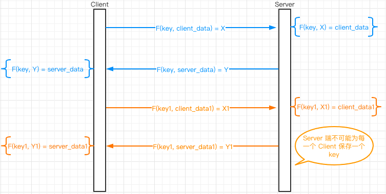
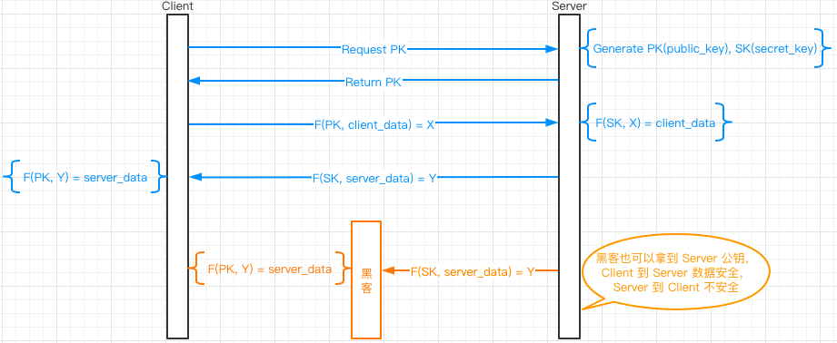
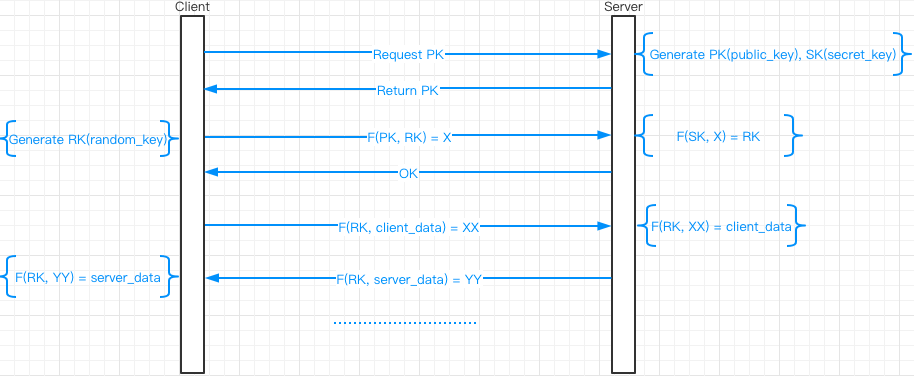
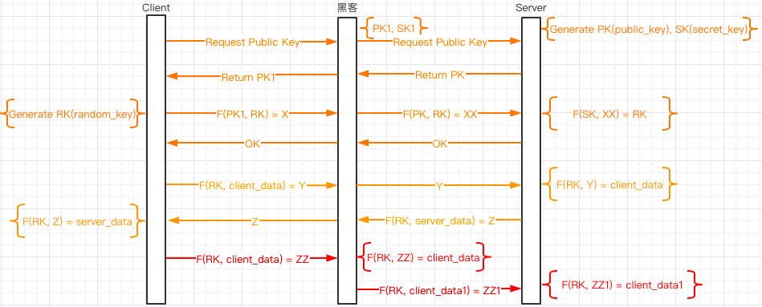
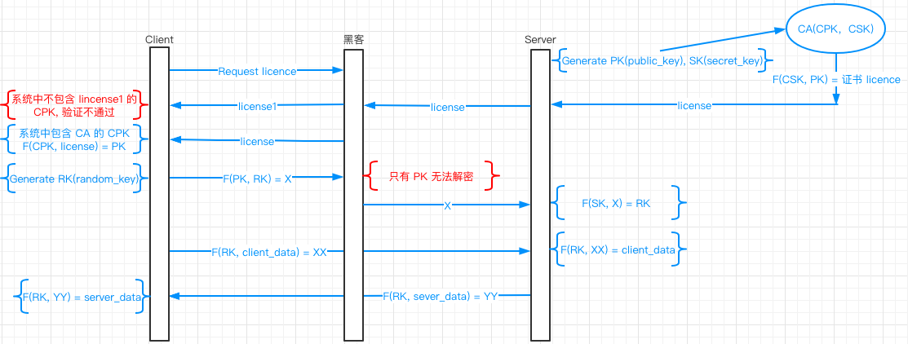

## 只使用对称加密

每个 Client 生成一个自己一个 Key，Server 也用对应的 Client 的 Key 解密。Server 传送到 Client 也使用对应的 Key 加密，Client 再使用自己的 Key 解密。这种情况要求 Server 要保存每一个 Client 的 Key。

## 只使用非对称加密

1. Client 向 Server 请求 PK。
2. Server 将生成的 PK 返回给 Client。
3. Client 使用 Server 生成的 PK 加密传送给 Server 的数据，Server 使用 SK 解密。
4. Server 使用 SK 加密传送给 Client 的数据。
5. Client 使用 PK 解密。

这种情况下，黑客也可以拿到 Server 公钥，Client 到 Server 数据安全，Server 到 Client 不安全。

## 对称加密，非对称加密混合使用

1. Client 向 Server 请求 PK。
3. Server 将生成的 PK 返回给 Client。
4. Client 生成用于数据传输的对称加密的密钥 RK。
5. Client 使用 Server 生成的 PK 加密 RK。
6. Server 使用 SK 解密得到Client的 RK。
7. Server 返回解密成功的讯息到Client。
8. Client 和 Server 使用共有的 RK 进行数据加解密。

## 中间人攻击

对称加密，非对称加密混合使用中存在的一个问题是中间人攻击，黑客可以充当服务器的角色，在 Client 和 Server 之间传送数据。因为客户拿到的是黑客给的 PK1，使用 SK1 就可以获得客户生成的 RK,  然后如图红色部分，客户使用 RK 加密数据，黑客使用 RK 获取数据，并且可以篡改 Client 数据传送到 Server. 

## 证书认证

1. Server 会先使用自己生成的 PK, SK 向 CA 机构购买证书，证书机构会使用自己的私钥 CSK 加密 Server 的 PK 生成证书，然后返回给 Server。
2. Client 访问 Server 时会先向 Server 请求证书。
3. Server 将 CA 下发的证书传送给 Client。

   - 这时如果黑客截获了证书 license，并将自己的证书 license1 传送给Client, Client 系统中不包含篡改后的证书的公钥 CPK, 验证不会通过。
4. Client 系统中包含 CA 的 CPK 可以解密 Licence 获取 Server 的 PK。
5. Client 使用 Server 生成的 PK 加密 RK。
6. Server 使用 SK 解密得到Client的 RK。
   - 因为黑客在第 3 步也可以获得 Server 下发的 Licence, 黑客系统中也可以有 CA 的 CPK, 所以也可以获得 Server 的 PK, 但是因为只有 PK 没有办法解密 Client 的数据，所以无法获得 Client 的 RK。
7. Clicen  和 Server 使用 RK 加密解密数据。

