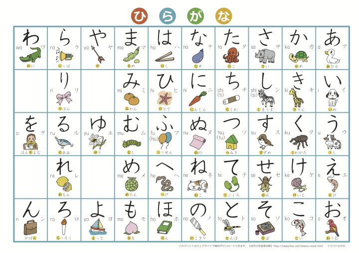
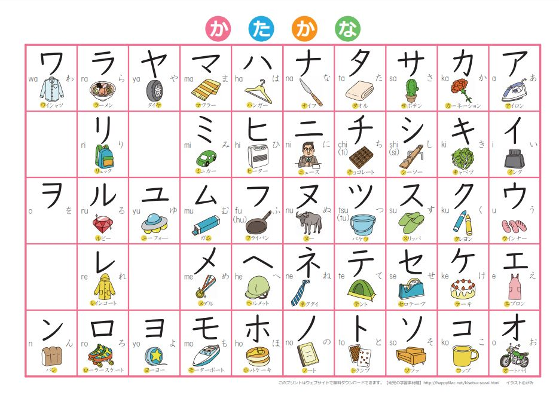
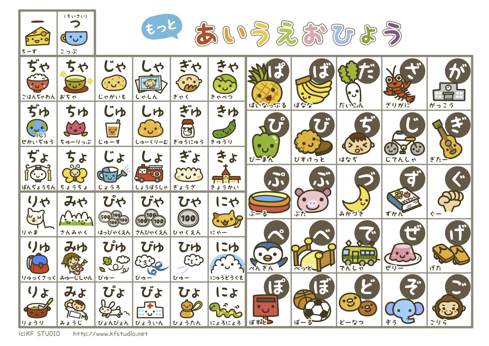

## 日本文字的构成

{私^わたし}{昨日^きのう}SONY のカメラを{買い^かい}ました。

### 汉字

{山^やま} {水^みず} {山水^さんすい}

#### 中日汉字字形比较

完全相同：山 水 教室 学校

大同小异：涼(凉) 強(强)

差异较大：仏(佛) 假(仮) 简(簡) 难(難)

模仿创造的国字: 峠 畑

#### 中日汉字字义比较

中日同义: 日本 学生 教室 学校

中日异义：手紙(信) 新聞(报纸) 丈夫(结实) 愛人(情人)

#### 日本汉字的发音方式

音读：模仿中国古汉语发音。

{山水^さんすい} {森林^しんにん} {親友^しんゆう} {大事^だいじ}

训读：日本的固有发音，借用中国汉字表意。

{山^やま}{水^みず} {森^もり}{林^はやし} {親^おや}{友^とも} {大^おお}{事^こと}

### 假名

#### 平假名

あ い う え お

平(平易简单)假(假借)名(文字)：把假借而来的汉字平易简单化，来自汉字草书，书写柔美圆润。

#### 片假名

ア イ ウ エ オ

片(片面不完整)假(假借)名(文字)：只取假借汉字的一部分，多取自偏旁部首，来自汉字楷书，书写刚劲有力。

**片假名的用途**

外来语：コーヒー(咖啡) パソダ(熊猫)

拟声拟态词：ニャーニャー(猫叫声) ザーザー(雨声）

动植物名称：ヒマワリ(向日葵) ネコ(猫)

### 罗马字

使用拉丁字母表示日语发音。

{あ^a} {い^i} {う^u} {え^e} {お^o}

#### 罗马字用途

招牌广告：TOYOTA SONY。

录入文字：a -> あ。

## 日语的声调

### 高低型

音节(假名)之间高低起伏。

あめ ⓪ (糖果) あめ ① (雨)

### 声调表记法

#### 数字表记法

声调核：最后一个高读音节。 ⓪ ① ② ③ ④ ⑤

#### 横线表记法

横线：高音 竖线：下降。

### 声调规则

1. 单词的第一个高音节和第二个音节的高低相反。

    第一个音节高，则第二个音节低；反之，第一个音节低，则第二个音节高。

2. 一个单词的声调中，或没有下降，或只有一处下降。

### 声调类型

1. 平板型 ⓪

    一低二高一直高，助词也高。

     い う え お が (mi)

    あ(do)

2. 头高型 ①

    一高二低一直低，助词也低。

    あ(mi)

     い う え お が(do)

3. 中高型 ② ③ ......

    两头低中间高，助词低。

     い い う

    あ う え お が あ え お が

4. 尾高型 ⑤ ......

    一低二高一直高，助词低。

     お

    あ い う え が

## 五十音

### あ 行

| あ  | い  | う  | え  | お  |
| :-: | :-: | :-: | :-: | :-: |
| ア  | イ  | ウ  | エ  | オ  |
|  a  |  i  |  u  |  e  |  o  |

あ：比”阿“口型更小，发音部位靠后。

い：比“衣”左右开口小，嘴左右不要咧开。

う：比“乌”嘴唇扁平，不要突出。

え：相当于英语的小口[e]。

お: 口型偏圆，声音圆滑。类似英语的 [dog] [box]

#### あ 行例词

あい (愛) ① [爱]

え( 絵) ① [画]

あおい (青い) ② [蓝色]

うお (魚) ⓪ [鱼]

### か 行

| か  | き  | く  | け  | こ  |
| :-: | :-: | :-: | :-: | :-: |
| カ  | キ  | ク  | ケ  | コ  |
| ka  | ki  | ku  | ke  | ko  |

#### か 行例词

いか (烏賊) ⓪ 【鱿鱼】

えき (駅) ① 【车站】

いけ (池) ②【池塘】

かく (書く) ①【书写】

かお (顏) ⓪ 【脸】

あき(秋) ①【秋天】

### さ行

| さ  | し  | す  | せ  | そ  |
| :-: | :-: | :-: | :-: | :-: |
| サ  | シ  | ス  | セ  | ソ  |
| sa  | shi | su  | se  | so  |

#### さ 行例词

すし (寿司) ① ②【寿司】

いす(椅子) ⓪【椅子】

さけ(酒) ⓪【酒】

おかし (お菓子) ②【电信卡】

せかい (世界) ①【世界】

あさ (朝) ①【早上】

### た行

| た  | ち  | つ  | て  | と  |
| --- | --- | --- | --- | --- |
| タ  | チ  | ツ  | テ  | ト  |
| ta  | chi | tsu | te  | To  |

#### た 行例词

つくえ (机) ⓪【桌子】

たこ ①【章鱼】

いと(糹) ①【线】

て(手) ①【手、手掌】

とかい (都会) ⓪【城市】

あつい(暑い) ②【热】

#### 送气音和不送气音

か、た、ぱ　行根据闻之的不同发音有两种。

1. 词头 -> 送气音

    **か**お (顏) ⓪ 【脸】

    **た**こ ①【章鱼】

2. 词中或词尾 -> 不送气音

    つ**く**え (机) ⓪【桌子】

    た**つ**(立つ)①【站立】

### な 行

| な  | に  | ぬ  | ね  | の  |
| --- | --- | --- | --- | --- |
| ナ  | ニ  | ヌ  | ネ  | ノ  |
| na  | ni  | nu  | ne  | no  |

#### な 行例词

いぬ(犬) ②【狗】

ねこ (猫) ①【猫】

にく(肉) ②【肉】

のき(軒) ⓪【屋檐】

なつ (夏) ②【夏天】

あに (兄) ①【哥哥】

### は 行

| は  | ひ  | ふ  | へ  | ほ  |
| --- | --- | --- | --- | --- |
| ハ  | ヒ  | フ  | ヘ  | ホ  |
| ha  | hi  | fu  | he  | ho  |

#### は 行例词

はな（花） ②【花】

はし（橋） ②【桥】

ひたい（額） ②【额头】

ほし（星） ②【星星】

へた（下手） ②【不擅长】

ふさい（夫妻） ①②【夫妻】

### ま 行

| ま  | み  | む  | め  | も  |
| --- | --- | --- | --- | --- |
| マ  | ミ  | ム  | メ  | モ  |
| ma  | mi  | mu  | me  | mo  |

#### ま 行例词

まち（町） ②【街道】

あめ（雨） ①【雨】

かいもの（買い物） ⓪【购物】

かみ（髪） ②【头发】

むすめ（娘）③ 【女儿】

むし（虫）⓪【虫子】

### や 行

| や  | （い） | ゆ  | （え)  | よ  |
| :-: | :----: | :-: | :----: | :-: |
| ヤ  | （イ） | ユ  | （エ） | ヨ  |
| ya  | （i）  | yu  | （e）  | yo  |

#### ま 行例词

やおや（八百屋）⓪【果蔬店】

おかゆ（お粥）⓪【粥】

よなか（夜中）⓪【半夜】

やすみ（休み）③【休息】

### ら 行

| ら  | り  | る  | れ  | ろ  |
| --- | --- | --- | --- | --- |
| ラ  | リ  | ル  | レ  | ロ  |
| ra  | ri  | ru  | re  | ro  |

#### ら 行例词

さくら（桜）⓪【樱花】

くすり（薬）⓪【药】

ホテル（hotel）①【旅馆】

かれし（彼氏）①【男朋友】

はしる（走る）② 【奔跑】

ロシア（Russia）① 【俄罗斯】

### わ 行

| わ  | （い） | （う） | （え） | を  |
| :-: | :----: | :----: | :----: | :-: |
| ワ  | （イ） | （ウ） | （エ） | ヲ  |
| wa  | （i）  | （u）  | （e）  |  o  |

#### わ 行例词

にわ（庭）⓪ 【院子】

わらう（笑う）⓪【笑】

### 寒暄语

お休(やす)みなさい【晚安】　　`なさい`表近语，口语中可以直接使用 お休(やす)み。

またね【再见、回头见】

また、明日(あした) 【明天见】

## 浊音、半浊音

### が 行

| が  | ぎ  | ぐ  | げ  | ご  |
| :-: | :-: | :-: | :-: | :-: |
| ガ  | ギ  | グ  | ゲ  | ゴ  |
| ga  | gi  | gu  | ge  | go  |

#### が 行例词

かぎ（鍵）② 【钥匙】

かいがい（海外）① 【海外】

およぐ（泳ぎ）② 【游泳】

かげ（影）① 【影子】

いちご（苺）⓪ 【草莓】

かいぎ（会議）①③ 【会议】

#### 清浊音对比

|       清音        |      浊音       |
| :---------------: | :-------------: |
| かかく（価格）⓪ ① | かがく（科学）① |
|    かき（柿）⓪    |   かぎ（鍵）②   |
|   かく（書く）①   |  かぐ（家具）①  |
|   げか（外科）⓪   |  けが（怪我）②  |
|     ここ　 ⓪      |  ごご（午後）①  |

#### 浊音和鼻浊音

**が** 行根据位置的不同发音有两种

1. 词头 -> 浊音

    ぐあい（具合）⓪【情形】

    ごい（語彙）① 【词汇】

2. 词中或词尾 -> 浊音和鼻浊音均可（鼻浊音一般由播音员，女性，老年人使用）

    かがく（科学）① 【科学】

    かげ（影）① 【影子】

### ざ 行

| ざ  | じ  | ず  | ぜ  | ぞ  |
| --- | --- | --- | --- | --- |
| ザ  | ジ  | ズ  | ゼ  | ゾ  |
| za  | ji  | zu  | ze  | zo  |

#### ざ行例词

かぞく (家族)　 ① 【家人】

みずうみ　(湖)　 ③ 【湖泊】

ちず　(地図)　 ① 【地图】

ふくざつ　(複雑)　 ⓪ 【复杂】

じこ　(事故）① 【事故】

かぜ　(風邪)　 ⓪ 【感冒】

#### 清浊音对比

| 清音           | 浊音           |
| -------------- | -------------- |
| す(酢) ①       | ず(図) ⓪       |
| かさ(傘) ①     | かざり(飾り) ⓪ |
| しし(獅子) ①   | しじ(指示) ①   |
| かせ(枷) ①     | かぜ(風邪) ⓪   |
| かそく(加速) ⓪ | かぞく(家族) ① |

### だ行

| だ  |   ぢ   |   づ   | で  | ど  |
| :-: | :----: | :----: | :-: | :-: |
| ダ  |   ヂ   |   ヅ   | デ  | ド  |
| da  | ji(di) | zu(du) | de  | do  |

#### だ行例词

くだもの　(果物)　 ② 【水果】

ちぢむ　(縮む)　 ⓪ 【缩小】

ドア　(door)　 ① 【门】

でぐち　(出口)　 ① 【出口】

#### 清浊音对比

| 清音           | 浊音           |
| -------------- | -------------- |
| いたい(痛い) ② | いだい(偉大) ⓪ |
| いと(糸) ①     | いど(井戸) ①   |
| とこ(床) ⓪     | どこ(何処) ①   |

#### 发音相同的两组浊音

【ざ行】じ　ず: 使用频率高，文字录入：じ(ji)　ず(zu)。

【だ行】ぢ　づ：使用频率低，记住特例 ちぢむ、つづく。文字录入：ぢ(di)　づ(du)。

### ばぱ行

浊音

| ば  | び  | ぶ  | べ  | ぼ  |
| --- | --- | --- | --- | --- |
| バ  | ビ  | ブ  | ベ  | ボ  |
| ba  | bi  | bu  | be  | bo  |

半浊音

| ぱ  | ぴ  | ぷ  | ぺ  | ぽ  |
| --- | --- | --- | --- | --- |
| パ  | ペ  | プ  | ペ  | ポ  |
| pa  | pi  | pu  | pe  | Po  |

#### ばぱ行例词

バイク　(bike)　 ⓪ 【摩托车】

ながれぼし　(流れ星)　 ③ 【流星】

ピアス　(pierced earrings)　 ① 【耳钉、耳坠】

ピアノ　(piano)　 ⓪ ① ② ③ 【钢琴】

#### 清浊音对比

| 清音           | 浊音                       |
| -------------- | -------------------------- |
| はす(蓮) ⓪     | バス(bus) ① 　パス(pass) ① |
| ふろ(風呂) ① ② | プロ(professional) ①       |
| ふた(蓋) ⓪     | ぶた(豚) ⓪                 |

### 寒暄语

いただきます 【我开动了】

お帰(かえ)りなさい 【欢迎回来】

ただいま 【我回来了】

お久(ひさ)しぶりです【好久不见】

## 拗音

拗音是模仿中国古代汉语的发音而产生的。

い 段（い、ぢ 除外）+ や、ゆ、よ(小一号)

い 段假名: き　し　ち　に　ひ　み　り ざ じ び　ぴ

把两个假名拼读成一拍：きゃ(kya)　きゅ(kyu)　きょ(kyo)　しゃ(sha)　しゅ(shu)　しょ(sho)

### 拗音

|      や      |      ゆ       |      よ      |
| :----------: | :-----------: | :----------: |
| きゃキャ kya | きゅキュ kyu  | きょキョ kyo |
| しゃシャ sha | しゅシュ shu  | しょショ sho |
| ちゃチャ cha | ちゅ チュ chu | ちょショ cho |
| にゃニャ nya | にゅニュ nyu  | にょニョ nyo |
| ひゃヒャ hya | ひゅヒュ hyu  | ひょヒョ hyo |
| みゃミャ mya | みゅミュ myu  | みょミョ myo |
| りゃリャ rya | りゅリュ ryu  | りょリョ ryo |
| ぎゃギャ gya | ぎゅギュ gyu  | ぎょギョ gyo |
| じゃジャ ja  |  じゅジュ ju  | じょジョ jo  |
| びゃビャ bya | びゅビュ byu  | びょビョ byo |
| ぴゃピャ pya | ぴゅピュ pyu  | ぴょピョ pyo |

#### 拗音例词

おちゃ　(お茶)　 ⓪ 【茶】

ジャズ　 ① 【爵士乐】

しゅくしゃ　(宿舎)　 ② 【宿舍】

しょくぶつ　(植物)　 ② 【植物】

### 合拗音

合拗音是明治维新以后为了模仿西方外来语的发音儿产生的。专门用于表记外来语。只有片假名，没有平假名。

| ア       | イ            | ウ           | エ       | オ           |
| -------- | ------------- | ------------ | -------- | ------------ |
| ツァ tsa | ウィ wi       | トゥ tu(twu) | ウェ we  | ウォ wo(who) |
| ファ fa  | ティ ti (thi) | ドゥ du(dwu) | シェ she | ツォ tso     |
|          | フィ fi       | ヂュ dyu     | チェ che | フォ fo(fwo) |
|          | ディ di(dhi)  |              | ツェ tse |              |
|          |               |              | フェ fe  |              |
|          |               |              | ジェ je  |              |

#### 合拗音

フィルム　(film)　 ① 【胶卷】

プロジェクト　(project)　 ② ③ 【企画、项目】

チェス　(chess)　 ① 【国际象棋】

サファイア　(sapphire)　 ② 【蓝宝石】

### 寒暄语

お邪(じゃ)魔(ま)します【打扰了】

## 拨音

拨音、促音、长音都是特殊音节，有如下特点。

1. 均不能单独发音。
2. 均不是以元音结尾。
3. 均占一拍（一个音节）。

拨音`ん ン n`不能单独发音，发音受到其后音节的影响。

| 后面的发音        | 实际发音 | 举例                             |
| ----------------- | -------- | -------------------------------- |
| ぱ　ば　ま    行  | m        | さんぼ（散歩）　しんぶん（新聞） |
| た　だ　な　ら 行 | n        | ほんらい（本来）しんねん（新年） |
| 其它              | ng       | へんか（変化）れんあい（恋愛）   |

拨音的发音方式也可以按照下面的方式理解。

| あ段 +ん | ang |
| :------: | :-: |
| い段 +ん | in  |
| う段 +ん | un  |
| え段 +ん | en  |
| お段 +ん | ong |

### 拨音例词

ワイン　(wine)　 ① 【红酒、葡萄酒】

ふじさん　(富士山)　 ① 【富士山】

げんき　(元気)　 ① 【精神】

プレゼント　(present)　 ② 【礼物、礼品】

しゅんかん　(瞬間)　 ⓪ 【瞬间】

チャンス　(chance)　 ① 【机会、良机】

### 寒暄语

こんにちは【你好】

こんばんは【晚上好】

すみません【对不起、打扰了】

ごめんなさい【对不起】

## 促音

平假名：つ（小写）

片假名：ツ（小写）

罗马字：双写促音后一个假名的第一个辅音字母。

`みっつ mi ttsu` `ペット pe tto`　发音需要顿促一下。

促音读法

1. 促音不可以单独发音。
2. 促音占一拍。
3. 促音分为阻塞促音和摩擦促音。
    - 阻塞促音: 促音位于 　か　た　ぱ　行之前。憋一口气形成阻塞 -> 做好下一个音的口型准备 -> 放开气流急冲而出。`さっき sa kki もっと mo tto いっぱい i ppai`
    - 摩擦促音: 促音位于 さ 之前。基本不停止发音，而是摩擦发出 s 的声音。`まっすぐ ma ssugu ざっしい za sshi っさい i ssai `

### 促音例词

きって　(切手)　 ⓪ 【邮票】

ベット　(bed)　 ① 【床】

けっこん　(結婚)　 ⓪ 【结婚】

ざっし　(雑誌)　 ⓪ 【杂志】

ペット （pet）① 【宠物】

チケット （ticket）① ②【票、券】

こっか　(国家)　 ① 【国家】

せっけん　(せっけん)　 ⓪ 【肥皂】

###   促音与非促音对比

| 非促音          | 促音              |
| :-------------- | ----------------- |
| せかい（世界）① | せっかい（石灰）① |
| じけん（事件）① | じっけん（実験）⓪ |
| かこ（過去）①   | かっこ（括弧）①   |
| おと（音）②     | おっと（夫）⓪     |
| まち（町）②     | マッチ（match）①  |

### 寒暄语

いらっしゃいませ【欢迎光临】

行(い)ってきます【我出门了，我走了】

行(い)ってらっしゃい【慢走，走好】

## 长音

平假名长音标记方式

|    表记方式     |               例词               |
| :-------------: | :------------------------------: |
|    あ段 + あ    |  おか**あ**さん　おば**あ**さん  |
|    い段 +い     |    おに**い**さん　い**い**え    |
|    う段 +う     | つ**う**やく　ゆ**う**びんきょく |
| え段 +い (多数) |    せんせ**い**　け**い**けん    |
| え段 +え(少数)  |    おね**え**さん　え**え**と    |
| お段 + う(多数) |   おと**う**さん　おと**う**と   |
| お段 + お(少数) |     と**お**い　お**お**さか     |

平假名长音标记方式

`ー` 就是数字 0 后面的符号

| 表记方式 |        例词        |
| :------: | :----------------: |
|    ー    | スーパー　コーヒー |

平假名拗长音的标记方式

|     表记方式      |               例词               |
| :---------------: | :------------------------------: |
| 【い段+ゃ】 +　あ | じゃ**あ**　にゃ**あ**にゃ**あ** |
| 【い段+ゅ】 +　う |  ちゃ**う**ごく　りゃ**う**がく  |
| 【い段+ょ】 +　う |    りゃ**う**り　きみゃ**う**    |

片假名拗长音的标记方式

| 表记方式 |                  例词                  |
| :------: | :------------------------------------: |
|    ー    | チャ**ー**ハソ　コンピャ**ー**タ**ー** |

### 长短音对比

长音符号只有 「あいうえお」，单词符号里有「あいうえお」才有长音，但不一定全是长音。

长音可以区分词义。

おばさん【阿姨、婶婶、姑姑、舅妈】

おば**あ**さん【奶奶、姥姥】

おじさん【叔叔、伯伯、姑父、舅舅】

おじ**い**さん【爷爷、姥爷】

ビル【大楼】

ビ**ー**ル【啤酒】

### 长音例词

おいし**い**　(美味しい)　 ⓪ ③ 【好吃、可口】

がくせ**い**　(学生)　 ⓪ 【学生】

はつも**う**で　(初詣)　 ③ 【新年首次参拜神社】

お**お**さか　(大阪)　 ⓪ 【大阪】

ご**う**かく　(合格)　 ⓪ 【合格、及格】

すも**う**　(相撲)　 ⓪ 【相扑】

サッカー　(soccer)　 ① 【足球】

テーブル　(table)　 ⓪ 【桌子】

べんきょ**う**　(勉強)　 ⓪ 【勤奋、学习】

こきゅ**う**　(故宮)　 ① 【故宫】

きゅ**う**り　(胡瓜)　 ① 【黄瓜】

ちゅうい　(注意)　 ① 【注意、小心】

ニュース　(news)　 ① 【新闻】

ジャーナリアスト　(journalist)　 ④ 【记者】

### 寒暄语

おはよ**う**ございます【早上好】

ありがと**う**ございます【谢谢】

い**い**え、ど**う**いたしまして【不用谢】

ご馳(ち)走様(そうさま)でした【我吃好了】

始(たじ)めまして、どうぞよろしくお願い(ねがい)します【初次见面, 请多多关照】

さようなら 【再见】

## 五十音图







## 日本国歌

**原文**

```poem
君が代は
千代に八千代に
さざれ石の
巌となりて
苔の生すまで
```

**假名**

```poem
きみがよは
ちよにやちよに
さざれいしの
いわおとなりて
こけのむすまで
```

**中文**

```poem
吾皇盛世兮，千秋万代；
砂砾成岩兮，遍生青苔。
```
