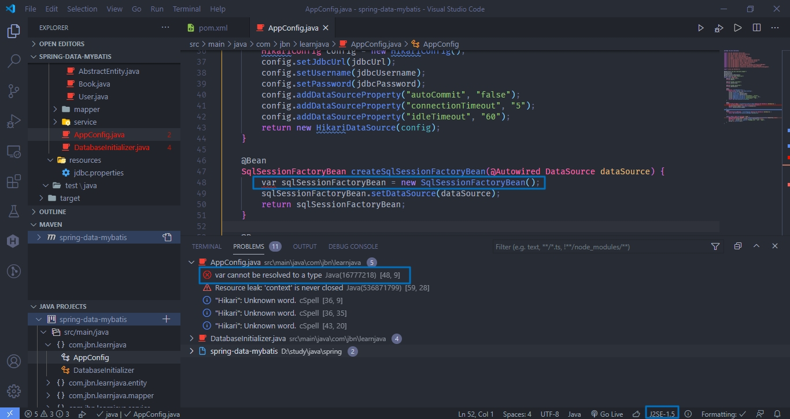
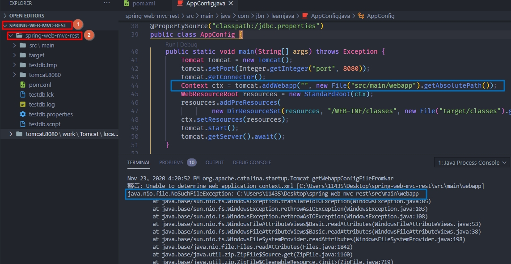
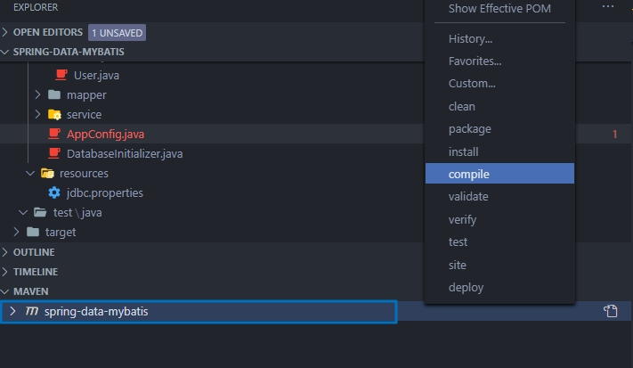

### maven compiler

maven project 在 vscode settings.json 中设定了 runtimes, bottom status bar 仍然显示使用 SDK 1.5, 并且无法使用高版本特性

```json
"java.configuration.runtimes": [
    {
        "name": "JavaSE-13",
        "path": "C:/Program Files/Java/jdk-13.0.1"
    },
    {
        "name": "JavaSE-1.8",
        "path": "C:/Program Files/Java/jdk1.8.0_181"
    }
]
```



解决方法在 pom.xml 中添加如下配置

```xml
<properties>
    <project.build.sourceEncoding>UTF-8</project.build.sourceEncoding>
    <project.reporting.outputEncoding>UTF-8</project.reporting.outputEncoding>
    <maven.compiler.source>13</maven.compiler.source>
    <maven.compiler.target>13</maven.compiler.target>
    <java.version>13</java.version>
</properties>
```

### Spring MVC, embed tomcat set webapp dir

java.nio.file.NoSuchFileException: C:\Users\11435\Desktop\spring-web-mvc-rest\src\main\webapp



spring-web-mvc-rest 下面还有一个目录 spring-web-mvc-rest, 应该从 2 位置打开导入项目

### vscode maven remove target, occur ClassNotFoundException

错误: 找不到或无法加载主类 com.jbn.learnjava.AppConfig
原因: java.lang.ClassNotFoundException: com.jbn.learnjava.AppConfig

重新执行 maven compile/package


