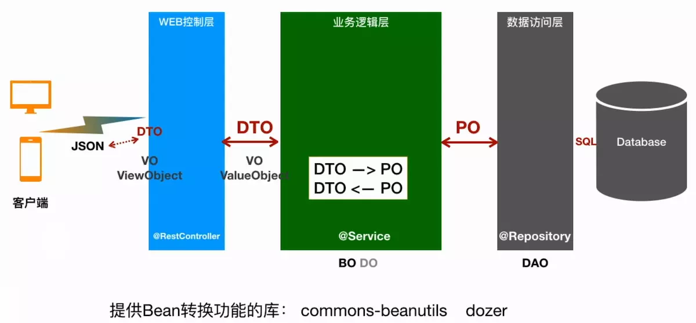

> 转载：[Java 中的 PO、VO、DTO、BO、POJO、BO/DO、DAO - 简书](https://www.jianshu.com/p/d9cfd1a85068)

## 简单 Java 对象

### PO

`persistent object`，持久对象。与数据库里表字段一一对应。PO 是一些属性，以及 set 和 get 方法组成。一般情况下，一个表对应一个 PO，直接与操作数据库的 crud 相关。

### VO

`view object`/`value object`，表现层对象。通常用于业务层之间的数据传递，和 PO 一样也是仅仅包含数据而已。但应是抽象出的业务对象，可以和表对应，也可以不。这根据业务的需要而定。对于页面上要展示的对象，可以封装一个 VO 对象，将所需数据封装进去。

### DTO

`data trasfer object`，数据传输对象。主要用于远程调用等需要大量传输对象的地方。

比如我们一张表有 100 个字段，那么对应的 PO 就有 100 个属性。 但是我们界面上只要显示 10 个字段， 客户端用 WEB service 来获取数据，没有必要把整个 PO 对象传递到客户端，

这时我们就可以用只有这 10 个属性的 DTO 来传递结果到客户端，这样也不会暴露服务端表结构 . 到达客户端以后，如果用这个对象来对应界面显示，那此时它的身份就转为 VO。

### POJO

`plain ordinary java object`/`pure old java object` 简单无规则 java 对象，纯的传统意义的 java 对象。

## 复杂 Java 对象

### BO/DO

`bussiness object` 业务对象、`Domain Object` 域对象。封装业务逻辑的 Java 对象 , 通过调用 DAO 方法 , 结合 PO，VO 进行业务操作。 一个 BO 对象可以包括多个 PO 对象。如常见的工作简历例子为例，简历可以理解为一个 BO，简历又包括工作经历，学习经历等，这些可以理解为一个个的 PO，由多个 PO 组成 BO。

### DAO

`data access object`，数据访问对象。此对象用于访问数据库。通常和 PO 结合使用， DAO 中包含了各种数据库的操作方法。通过它的方法 , 结合 PO 对数据库进行相关的操作。夹在业务逻辑与数据库资源中间。
