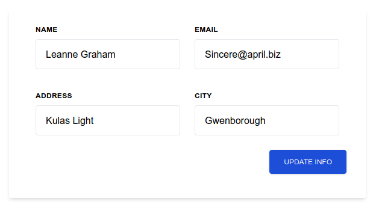

> 转载：[Using Native Fetch With AlpineJs - Witty Programming](https://www.wittyprogramming.dev/articles/using-native-fetch-with-alpinejs/)

One of the most common web app patterns involves collecting data from a form and submitting it to a REST API or, the opposite, populating a form from data originating from a REST API. This pattern can easily be achieved in Alpinejs using the native javascript [Fetch Api](https://developer.mozilla.org/en-US/docs/Web/API/Fetch_API/Using_Fetch). As a bonus, I describe the `fetch` async version at the end of the article.

If you are not familiar with the Alpinejs, checkout [my introduction article](https://www.wittyprogramming.dev/articles/introduction-to-alpinejs/) and how can help you introduce simple interactions in your web page very easily.

If you do not like using the native `fetch`, there is the magic helper [$fetch](https://developer.mozilla.org/en-US/docs/Web/API/Fetch_API/Using_Fetch) which is using [Axios](https://github.com/axios/axios) behind the scenes. I prefer to use the native javascript approach to a library that adds another `~15KB` payload to my build. Nowadays, with the ability to cancel the `fetch`, I do not see a reason not to use it. But if you like the Axios library, know that there is an Alpinejs way to it, too.

## Backend JSON Server

For testing purposes, we will use a [free fake API](https://jsonplaceholder.typicode.com/) powered by [JSON Server](https://github.com/typicode/json-server) and [LowDB](https://github.com/typicode/lowdb). Check these projects out cause they are amazing and may help in your endeavours. In this example, we hit the free fake API at `https://jsonplaceholder.typicode.com/users/1`, which returns the following data:

```json
{
  "id": 1,
  "name": "Leanne Graham",
  "username": "Bret",
  "email": "Sincere@april.biz",
  "address": {
    "street": "Kulas Light",
    "suite": "Apt. 556",
    "city": "Gwenborough",
    "zipcode": "92998-3874",
    "geo": {
      "lat": "-37.3159",
      "lng": "81.1496"
    }
  },
  "phone": "1-770-736-8031 x56442",
  "website": "hildegard.org",
  "company": {
    "name": "Romaguera-Crona",
    "catchPhrase": "Multi-layered client-server neural-net",
    "bs": "harness real-time e-markets"
  }
}
```

We will only use the **name**,**email**, **address.city**, and **address.street** attributes from the JSON not to complicate the form structure too much.

Below you may check up the final result. We use the native JavaScript `fetch` in an Alpinejs component to receive data to populate the form. You may change the form data, and by clicking on the “update info” button, we are making a POST request to an API Endpoint with the updated data. The endpoint does not exist. Therefore, it returns an error, but I want to show how to use the `fetch` to make a post request.

## Form Design Using Tailwindcss

Initially, let’s build our form using the tailwindcss. [Tailwindcss](https://tailwindcss.com/) is a utility-first CSS that let you compose your design directly in your markup. It has the same philosophy as the Alpinejs so, they often grouped together.

```html
<div class="flex flex-col content-center justify-center h-screen">
  <div
    class="flex flex-col self-center px-8 pt-6 pb-8 my-2 mb-4 bg-white rounded shadow-md max-w-7xl"
  >
    <div class="mb-6 md:flex">
      <div class="px-3 mb-6 md:w-1/2 md:mb-0">
        <label
          class="block mb-2 text-xs font-bold tracking-wide uppercase text-grey-darker"
          for="name"
        >
          Name
        </label>
        <input
          class="block w-full px-4 py-3 mb-3 border rounded appearance-none bg-grey-lighter text-grey-darker border-red"
          required
          type="text"
          id="name"
        />
      </div>
      <div class="px-3 md:w-1/2">
        <label
          class="block mb-2 text-xs font-bold tracking-wide uppercase text-grey-darker"
          for="email"
        >
          email
        </label>
        <input
          class="block w-full px-4 py-3 border rounded appearance-none bg-grey-lighter text-grey-darker border-grey-lighter"
          required
          type="email"
          id="email"
        />
      </div>
    </div>
    <div class="mb-6 md:flex">
      <div class="px-3 mb-6 md:w-1/2 md:mb-0">
        <label
          class="block mb-2 text-xs font-bold tracking-wide uppercase text-grey-darker"
          for="address"
        >
          Address
        </label>
        <input
          class="block w-full px-4 py-3 border rounded appearance-none bg-grey-lighter text-grey-darker border-grey-lighter"
          required
          type="text"
          id="address"
        />
      </div>
      <div class="px-3 md:w-1/2">
        <label
          class="block mb-2 text-xs font-bold tracking-wide uppercase text-grey-darker"
          for="city"
        >
          City
        </label>
        <input
          class="block w-full px-4 py-3 border rounded appearance-none bg-grey-lighter text-grey-darker border-grey-lighter"
          required
          type="text"
          id="city"
        />
      </div>
    </div>
    <div class="flex justify-end mb-2 md:flex">
      <button
        class="inline-block px-6 py-2 text-xs font-medium leading-6 text-center text-white uppercase transition bg-blue-700 rounded shadow ripple hover:shadow-lg hover:bg-blue-800 focus:outline-none"
      >
        Update Info
      </button>
    </div>
  </div>
</div>
```

The above markup produces the following responsive form design:




_The form design using tailwindcss_

## Form Initialization

Next, we create an alpinejs component by defining an object `person` in the `x-data` attribute, which it stores all the information needed for the form:

```json
x-data="{ person : {
          name: null,
          email: null,
          address: null,
          city: null
        }}"
```

The best time to get our values from the REST API and display them in the form is during the alpinejs component’s initialization using the `x-init` attribute:

```js
x-init="fetch('https://jsonplaceholder.typicode.com/users/1')
          .then(response=> {
              if (!response.ok) alert(`Something went wrong: ${response.status} - ${response.statusText}`)
              return response.json()
          })
          .then(data => person = {
              name: data.name,
              email: data.email,
              address: data.address.street,
              city: data.address.city
          })"
```

We are using the `fetch` to hit our REST endpoint, which returns a promise. At first, we resolve the response from the endpoint and check if it was a success. If not, we alert the user about the problem. To extract the JSON data from the response object, we use the `json()` command, which also returns a promise that it resolves at last to a javascript object containing the data returned from the endpoint. Finally, we are populated our `person` object with these data.

## Two-Way Form Binding

To display the data in the form, we are binding the `person` object attributes to the corresponding `input` text boxes in our form using the `x-model` attribute. The `x-mode` attributes create a two-way binding between the `input` elements' value and the value of corresponding `person` attributes. For example, for the **name** input box, we are two-way binding to the `person.name`:

```html
<input
  x-model="person.name"
  class="block w-full px-4 py-3 mb-3 border rounded appearance-none bg-grey-lighter text-grey-darker border-red"
  required
  type="text"
  id="name"
/>
```

## Form Submission

Finally, by clicking the “UPDATE INFO” button, we are sending the form data to a REST endpoint by a **POST** request through the `fetch` command. To do that, we attach a listener to the **click** event using the Alpinejs event syntax `@:event`:

```html
<button
  @click="fetch('/update', {
                    method: 'POST',
                    body: JSON.stringify(person)
                })
                .then(response => {
                    if (response.ok) alert('Updated Successfully!')
                    else alert(`Something went wrong: ${response.status} - ${response.statusText}`)
                })"
  class="inline-block px-6 py-2 text-xs font-medium leading-6 text-center text-white uppercase transition bg-blue-700 rounded shadow ripple hover:shadow-lg hover:bg-blue-800 focus:outline-none"
>
  Update Info
</button>
```

The `fetch` command will send a **POST** response to a non-existent endpoint, so the output will be an error alert. If you want to pass a header to the request, you may add it in the options object. For learning about available full options, you may check out the [mozilla MDN web docs](https://developer.mozilla.org/en-US/docs/Web/API/Fetch_API/Using_Fetch#supplying_request_options)

```html
<button
  @click="fetch('/update', {
                    method: 'POST',
                    body: JSON.stringify(person),
                    headers: {
                        'Content-Type': 'application/json'
                        }
                })
                .then(response => {
                    if (response.ok) alert('Updated Successfully!')
                    else alert(`Something went wrong: ${response.status} - ${response.statusText}`)
                })"
  class="inline-block px-6 py-2 text-xs font-medium leading-6 text-center text-white uppercase transition bg-blue-700 rounded shadow ripple hover:shadow-lg hover:bg-blue-800 focus:outline-none"
>
  Update Info
</button>
```

The final code is:

```html
<div class="flex flex-col content-center justify-center h-screen">
        <div class="flex flex-col self-center px-8 pt-6 pb-8 my-2 mb-4 bg-white rounded shadow-md max-w-7xl"
            x-data="{ person : {
                        name: null,
                        email: null,
                        address: null,
                        city: null
                        }}"
            x-init="fetch('https://jsonplaceholder.typicode.com/users/1')
                    .then(response=> {
                        if (!response.ok) alert(`Something went wrong: ${response.status} - ${response.statusText}`)
                        return response.json()
                    })
                    .then(data => person = {
                        name: data.name,
                        email: data.email,
                        address: data.address.street,
                        city: data.address.city
                    })">
            <div class="mb-6 md:flex">
                <div class="px-3 mb-6 md:w-1/2 md:mb-0">
                    <label class="block mb-2 text-xs font-bold tracking-wide uppercase text-grey-darker" for="name">
                        Name
                    </label>
                    <input
                        x-model="person.name"
                        class="block w-full px-4 py-3 mb-3 border rounded appearance-none bg-grey-lighter text-grey-darker border-red"
                        required type="text" id="name">
                </div>
                <div class="px-3 md:w-1/2">
                    <label class="block mb-2 text-xs font-bold tracking-wide uppercase text-grey-darker" for="email">
                        email
                    </label>
                    <input x-model="person.email"
                        class="block w-full px-4 py-3 border rounded appearance-none bg-grey-lighter text-grey-darker border-grey-lighter"
                        required type="email" id="email">
                </div>
            </div>
            <div class="mb-6 md:flex">
                <div class="px-3 mb-6 md:w-1/2 md:mb-0">
                    <label class="block mb-2 text-xs font-bold tracking-wide uppercase text-grey-darker" for="address">
                        Address
                    </label>
                    <input x-model="person.address"
                        class="block w-full px-4 py-3 border rounded appearance-none bg-grey-lighter text-grey-darker border-grey-lighter"
                        required type="text" id="address">
                </div>
                <div class="px-3 md:w-1/2">
                    <label class="block mb-2 text-xs font-bold tracking-wide uppercase text-grey-darker" for="city">
                        City
                    </label>
                    <input x-model="person.city"
                        class="block w-full px-4 py-3 border rounded appearance-none bg-grey-lighter text-grey-darker border-grey-lighter"
                        required type="text" id="city">
                </div>
            </div>
            <div class="flex justify-end mb-2 md:flex">
                <button @click="fetch('/update', {
                                    method: 'POST',
                                    body: JSON.stringify(person),
                                    headers: {
                                        'Content-Type': 'application/json'
                                        }
                                })
                                .then(response => {
                                    if (response.ok) alert('Updated Successfully!')
                                    else alert(`Something went wrong: ${response.status} - ${response.statusText}`)
                                })"
                        class="inline-block px-6 py-2 text-xs font-medium leading-6 text-center text-white uppercase transition bg-blue-700 rounded shadow ripple hover:shadow-lg hover:bg-blue-800 focus:outline-none">
                    Update Info
                </button>

            </div>
        </div>
    </div>
</body>
```

## Using `Async`

Although, in the code above we are resolving the `fetch` promise through its classic approach, the `async`/`await` have achieve a [very wide support on the modern browsers](https://caniuse.com/?search=await). So there nothing holding back to not use it (except for supporting legacy browsers). The only consideration is that alpinejs expects a function expression in its attributes instead of a function declaration. That means that we need to surround the arrow function with a self-execute function. Therefore, our `x-init` code is transformed:

```js
x-init="(async () => {
                const response = await fetch('https://jsonplaceholder.typicode.com/users/1')
                if (! response.ok) alert(`Something went wrong: ${response.status} - ${response.statusText}`)
                data = await response.json()
                person = {
                            name: data.name,
                            email: data.email,
                            address: data.address.street,
                            city: data.address.city
                        }
            })()"
```

And the `async`/`await` version for the **POST** request code is:

```js
click="(async () => {
                const response = await fetch('/api/update', {
                    method: 'POST',
                    body: JSON.stringify(person)
                })
                if (response.ok) alert('Updated Successfully!')
                else alert(`Something went wrong: ${response.status} - ${response.statusText}`)
            })()"
```

The final example using the `async`/`await` version is:

<iframe height="600" style="width: 100%;" scrolling="no" title="Alpine.js Fetch" src="https://codepen.io/lhchen74/embed/gOvmjre?default-tab=html%2Cresult" frameborder="no" loading="lazy" allowtransparency="true" allowfullscreen="true">
  See the Pen <a href="https://codepen.io/lhchen74/pen/gOvmjre">
  Alpine.js Fetch</a> by lhchen74 (<a href="https://codepen.io/lhchen74">@lhchen74</a>)
  on <a href="https://codepen.io">CodePen</a>.
</iframe>

```js
<div class="flex flex-col h-screen justify-center content-center">
  <div class="flex flex-col self-center px-8 pt-6 pb-8 max-w-7xl my-2 mb-4 bg-white rounded shadow-md" x-data="{person : {
                        firstName: null,
                        lastName: null,
                        address: null,
                        city: null
                        }}" x-init="(async () => {
                                  const response = await fetch('https://jsonplaceholder.typicode.com/users/1')
                                  if (! response.ok) alert(`Something went wrong: ${response.status} - ${response.statusText}`)
                                  data = await response.json()
                                  person = {
                                             name: data.name,
                                             email: data.email,
                                             address: data.address.street,
                                             city: data.address.city
                                             }
                                             })()">
    <div class="mb-6 md:flex">
      <div class="px-3 mb-6 md:w-1/2 md:mb-0">
        <label class="block mb-2 text-xs font-bold tracking-wide uppercase text-grey-darker" for="name">
          Name
        </label>
        <input x-model="person.name" class="block w-full px-4 py-3 mb-3 border rounded appearance-none bg-grey-lighter text-grey-darker border-red" required type="text" id="name">
      </div>
      <div class="px-3 md:w-1/2">
        <label class="block mb-2 text-xs font-bold tracking-wide uppercase text-grey-darker" for="email">
          email
        </label>
        <input x-model="person.email" class="block w-full px-4 py-3 border rounded appearance-none bg-grey-lighter text-grey-darker border-grey-lighter" required type="email" id="email">
      </div>
    </div>
    <div class="mb-6  md:flex">
      <div class="px-3 mb-6 md:w-1/2 md:mb-0">
        <label class="block mb-2 text-xs font-bold tracking-wide uppercase text-grey-darker" for="address">
          Address
        </label>
        <input x-model="person.address" class="block w-full px-4 py-3 border rounded appearance-none bg-grey-lighter text-grey-darker border-grey-lighter" required type="text" id="address">
      </div>
      <div class="px-3 md:w-1/2">
        <label class="block mb-2 text-xs font-bold tracking-wide uppercase text-grey-darker" for="city">
          City
        </label>
        <input x-model="person.city" class="block w-full px-4 py-3 border rounded appearance-none bg-grey-lighter text-grey-darker border-grey-lighter" required type="text" id="city">
      </div>
    </div>
    <div class="mb-2  md:flex flex justify-end">
      <button @click="(async () => {
                                    const response = await fetch('/api/update', {
                                        method: 'POST',
                                        body: JSON.stringify(person)
                                    })
                                    if (response.ok) alert('Updated Successfully!')
                                    else alert(`Something went wrong: ${response.status} - ${response.statusText}`)
                                })()" class="inline-block px-6 py-2 text-xs font-medium leading-6 text-center text-white uppercase transition bg-blue-700 rounded shadow ripple hover:shadow-lg hover:bg-blue-800 focus:outline-none">
        Update Info
      </button>

    </div>
  </div>
</div>
```

As you see, using the `fetch` command is very straightforward, and I think it is the preferred way to deal with REST APIs in our Alpinejs components.
