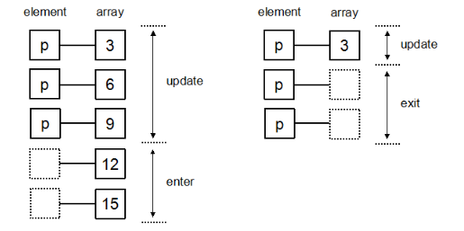
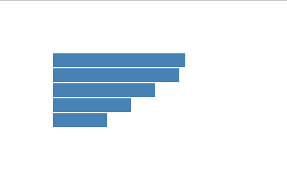
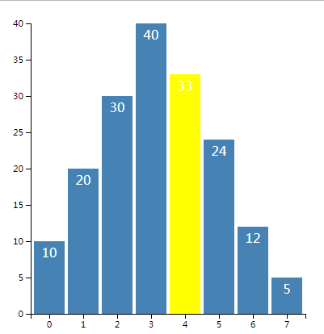

### hello d3

```html
<!DOCTYPE html>
<html lang="en">
  <head>
    <meta charset="UTF-8" />
    <meta name="viewport" content="width=device-width, initial-scale=1.0" />
    <meta http-equiv="X-UA-Compatible" content="ie=edge" />
    <title>hello</title>
    <script src="http://d3js.org/d3.v3.min.js" charset="utf-8"></script>
  </head>

  <body>
    <p>Hello World 1</p>
    <p>Hello World 2</p>
  </body>
  <script>
    d3.select('body')
      .selectAll('p')
      .text('hello d3')
      .style('color', 'red')
      .style('font-size', '60px')
  </script>
</html>
```

### 选择元素和绑定数据

```html
<body>
  <p>Hello World 1</p>
  <p>Hello World 2</p>
  <p>Hello World 2</p>
</body>
<script>
  var str = 'D3.JS'
  var p = d3.select('body').selectAll('p')
  p.datum(str)
  p.text(function(d, i) {
    return '第 ' + i + ' 个绑定的元素是 ' + d
  })

  var dataArr = ['吃饭', '睡觉', '打豆豆']
  p.data(dataArr)
  p.text(function(d, i) {
    return d
  })
</script>
<!-- <body>
    <p>吃饭</p>
    <p>睡觉</p>
    <p>打豆豆</p>
</body> -->
```

### 插入

```html
<body>
  <p id="first">Hello World 1</p>
  <p>Hello World 2</p>
  <p>Hello World 3</p>
</body>
<script>
  var body = d3.select('body')
  var p1 = body.selectAll('#first')
  p1.style('color', 'red')
  // body.append('p').text('append');
  //为 p1 设置的样式也会应用到 append 的元素, 因为是在 p1 内部
  p1.append('p').text('append')
  // body.insert('p','#first').text('insert before select element');
</script>

<!-- <body>
    <p id="first" style="color: red;">Hello World 1<p>append</p></p>
    <p>Hello World 2</p>
    <p>Hello World 3</p>
</body> -->
```

### enter、exit、update

Update、Enter、Exit 是 D3 中用于处理当选择集和数据的数量关系不确定的情况。
如果数组为 [3, 6, 9, 12, 15]，将此数组绑定到三个 p 元素的选择集上。可以想象，会有两个数据没有元素与之对应，这时候 D3 会建立两个空的元素与数据对应，这一部分就称为 Enter。而有元素与数据对应的部分称为 Update。如果数组为 [3]，则会有两个元素没有数据绑定，那么没有数据绑定的部分被称为 Exit。



update

```html
<body>
  <p>Hello World 1</p>
  <p>Hello World 2</p>
</body>
<script>
  var dataset = [3, 6, 9, 10]

  var p = d3.select('body').selectAll('p')

  // 获取update部分，dataset num > p num 对应前两个元素
  var update = p.data(dataset)

  // 获取enter部分，对应后两个元素
  var enter = update.enter()

  update.text(function(d) {
    return 'update' + d
  })

  // enter 部分处理，添加 p 元素
  enter.append('p').text(function(d) {
    return 'enter' + d
  })
</script>
<!-- <body>
    <p>update3</p>
    <p>update6</p>
    <p>enter9</p>
    <p>enter10</p>
</body> -->
```

exit

```html
<body>
  <p>Hello World 1</p>
  <p>Hello World 2</p>
</body>
<script>
  var dataset = [3]

  //选择body中的p元素
  var p = d3.select('body').selectAll('p')

  //获取update部分
  var update = p.data(dataset)

  //获取exit部分
  var exit = update.exit()

  //update部分的处理：更新属性值
  update.text(function(d) {
    return 'update ' + d
  })
  //exit部分的处理：修改p元素的属性
  exit.text(function(d) {
    return 'exit'
  })
  // exit部分的处理通常是删除元素
  // exit.remove();
</script>
<!-- <body>
    <p>update 3</p>
    <p>exit</p>
</body> -->
```

### 简单图形

```html
<script>
  var width = 300 //画布的宽度
  var height = 300 //画布的高度

  var svg = d3
    .select('body') //选择文档中的body元素
    .append('svg') //添加一个svg元素
    .attr('width', width) //设定宽度
    .attr('height', height) //设定高度

  var dataset = [250, 210, 170, 130, 90] //数据（表示矩形的宽度）

  var recHeight = 25 //每个矩形所占的宽度包括空白
  svg
    .selectAll('rect')
    .data(dataset)
    .enter()
    .append('rect')
    .attr('x', 80) //每个矩形离浏览器器左端的距离
    .attr('y', function(d, i) {
      return i * recHeight + 80 //每个矩形离浏览器器左端的距离
    })
    .attr('width', function(d, i) {
      //每个矩形的长度
      return d
    })
    .attr('height', recHeight - 2) //每个矩形的宽度
    .attr('fill', 'steelblue')
</script>
```



### 比例尺

```html
<body></body>
<script>
  var dataset = [1.2, 2.3, 0.9, 1.5, 3.3]
  var min = d3.min(dataset)
  var max = d3.max(dataset)

  var linear = d3.scale
    .linear()
    .domain([min, max])
    .range([0, 300])
  console.log(linear(0.9)) //0
  console.log(linear(2.3)) //175

  var index = [0, 1, 2, 3, 4]
  var color = ['red', 'blue', 'green', 'yellow', 'black']

  var ordinal = d3.scale
    .ordinal() //ordinal 序数
    .domain(index)
    .range(color)
  console.log(ordinal(1)) //blue
</script>
```

### 坐标轴

```html
<script>
  var width = 300 //画布的宽度
  var height = 300 //画布的高度

  var svg = d3
    .select('body') //选择文档中的body元素
    .append('svg') //添加一个svg元素
    .attr('width', width) //设定宽度
    .attr('height', height) //设定高度

  var dataset = [2.5, 2.1, 1.7, 1.3, 0.9]

  var linear = d3.scale
    .linear()
    .domain([0, d3.max(dataset)])
    .range([0, 250])

  var rectHeight = 25 //每个矩形所占的像素高度(包括空白)

  svg
    .selectAll('rect')
    .data(dataset)
    .enter()
    .append('rect')
    .attr('x', 20)
    .attr('y', function(d, i) {
      return i * rectHeight
    })
    .attr('width', function(d) {
      return linear(d)
    })
    .attr('height', rectHeight - 2)
    .attr('fill', 'steelblue')

  var axis = d3.svg
    .axis() //D3 中坐标轴的组件，能够在 SVG 中生成组成坐标轴的元素。
    .scale(linear) //指定比例尺
    .orient('bottom') //指定刻度的方向
    .ticks(7) //指定刻度的数量

  svg
    .append('g')
    .attr('class', 'axis')
    .attr('transform', 'translate(20,130)') //坐标轴的位置
    .call(axis)
</script>
```

### 动画

```html
<script>
  var width = 500 //画布的宽度
  var height = 500 //画布的高度

  var svg = d3
    .select('body') //选择文档中的body元素
    .append('svg') //添加一个svg元素
    .attr('width', width) //设定宽度
    .attr('height', height) //设定高度

  var circle1 = svg
    .append('circle')
    .attr('cx', 100)
    .attr('cy', 100)
    .attr('r', 45)
    .style('fill', 'green')

  //在1秒（1000毫秒）内将圆心坐标由100变为300
  circle1
    .transition()
    .duration(1000)
    .ease('circle')
    .attr('r', 20)
    .attr('cx', 300)
    .attr('fill', 'red')
</script>
```

### 完整柱形图

```html
<html>
  <head>
    <meta charset="utf-8" />
    <title>交互式操作</title>
  </head>

  <style>
    .axis path,
    .axis line {
      fill: none;
      stroke: black;
      shape-rendering: crispEdges;
    }

    .axis text {
      font-family: sans-serif;
      font-size: 11px;
    }

    .MyRect {
    }

    .MyText {
      fill: white;
      text-anchor: middle;
    }
  </style>

  <body>
    <script src="http://d3js.org/d3.v3.min.js" charset="utf-8"></script>
    <script>
      //画布大小
      var width = 400
      var height = 400

      //在 body 里添加一个 SVG 画布
      var svg = d3
        .select('body')
        .append('svg')
        .attr('width', width)
        .attr('height', height)

      //画布周边的空白
      var padding = {
        left: 30,
        right: 30,
        top: 20,
        bottom: 20
      }

      //定义一个数组
      var dataset = [10, 20, 30, 40, 33, 24, 12, 5]

      //x轴的比例尺
      var xScale = d3.scale
        .ordinal()
        .domain(d3.range(dataset.length))
        .rangeRoundBands([0, width - padding.left - padding.right])

      //y轴的比例尺
      var yScale = d3.scale
        .linear()
        .domain([0, d3.max(dataset)])
        .range([height - padding.top - padding.bottom, 0])

      //定义x轴
      var xAxis = d3.svg
        .axis()
        .scale(xScale)
        .orient('bottom')

      //定义y轴
      var yAxis = d3.svg
        .axis()
        .scale(yScale)
        .orient('left')

      //矩形之间的空白
      var rectPadding = 4

      //添加矩形元素
      var rects = svg
        .selectAll('.MyRect')
        .data(dataset)
        .enter()
        .append('rect')
        .attr('class', 'MyRect')
        .attr(
          'transform',
          'translate(' + padding.left + ',' + padding.top + ')'
        )
        .attr('x', function(d, i) {
          return xScale(i) + rectPadding / 2
        })
        .attr('y', function(d) {
          return yScale(d)
        })
        .attr('width', xScale.rangeBand() - rectPadding)
        .attr('height', function(d) {
          return height - padding.top - padding.bottom - yScale(d)
        })
        .attr('fill', 'steelblue') //填充颜色不要写在CSS里
        .on('mouseover', function(d, i) {
          d3.select(this).attr('fill', 'yellow')
        })
        .on('mouseout', function(d, i) {
          d3.select(this)
            .transition()
            .duration(500)
            .attr('fill', 'steelblue')
        })

      //添加文字元素
      var texts = svg
        .selectAll('.MyText')
        .data(dataset)
        .enter()
        .append('text')
        .attr('class', 'MyText')
        .attr(
          'transform',
          'translate(' + padding.left + ',' + padding.top + ')'
        )
        .attr('x', function(d, i) {
          return xScale(i) + rectPadding / 2
        })
        .attr('y', function(d) {
          return yScale(d)
        })
        .attr('dx', function() {
          return (xScale.rangeBand() - rectPadding) / 2
        })
        .attr('dy', function(d) {
          return 20
        })
        .text(function(d) {
          return d
        })

      //添加x轴
      svg
        .append('g')
        .attr('class', 'axis')
        .attr(
          'transform',
          'translate(' + padding.left + ',' + (height - padding.bottom) + ')'
        )
        .call(xAxis)

      //添加y轴
      svg
        .append('g')
        .attr('class', 'axis')
        .attr(
          'transform',
          'translate(' + padding.left + ',' + padding.top + ')'
        )
        .call(yAxis)
    </script>
  </body>
</html>
```


