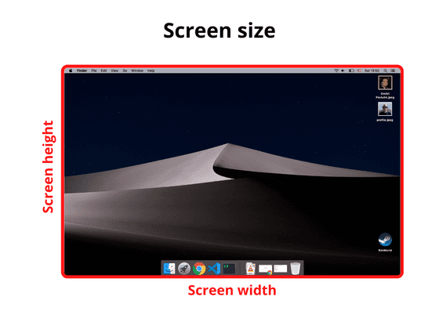
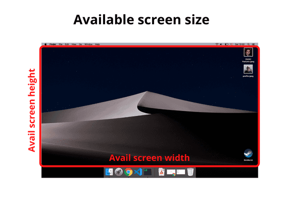
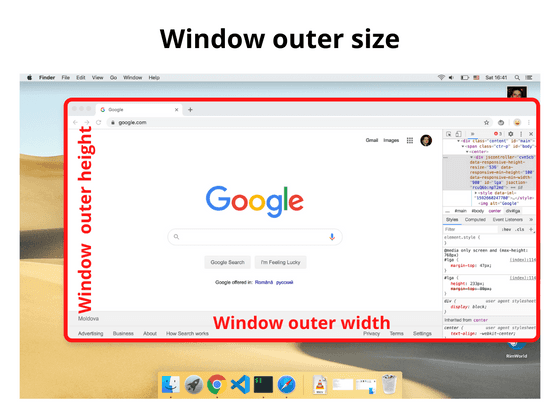
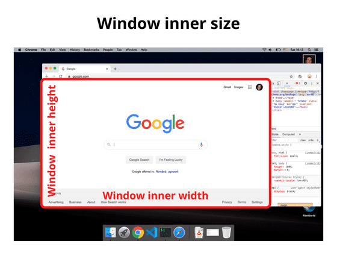
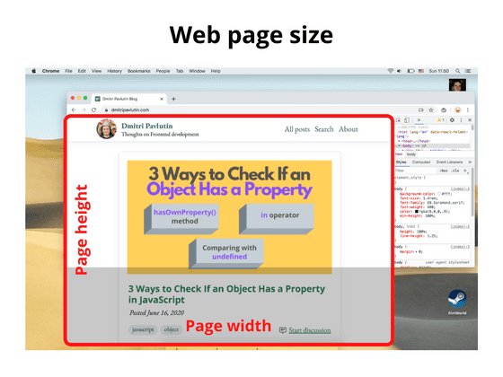

> 转载：[How to Get the Screen, Window, and Web Page Sizes in JavaScript](https://dmitripavlutin.com/screen-window-page-sizes/)

To detect whether the browser window is in landscape or portrait mode, you can compare the browser window's width and height.

But from my experience it's easy to get confused in the bunch of sizes: screen, window, web page sizes.

How are these sizes defined, and, importantly, how to access them is what I'm going to discuss in this post.

## 1. The screen

### 1.1 The screen size

> _The screen size_ is the width and height of the screen: a monitor or a mobile screen.



`window.screen` is the object that holds the screen size information. Here's how to access the screen width and height:

```js
const screenWidth = window.screen.width;
const screenHeight = window.screen.height;
```

### 1.2 The available screen size

> _The available screen size_ consists of the width and height of the active screen without the Operating System toolbars.



To access the available screen size you can use again the `window.screen` object:

```js
const availScreenWidth = window.screen.availWidth;
const availScreenHeight = window.screen.availHeight;
```

## 2. The window

### 2.1 The window outer size

> _The window outer size_ consists of the width and height of the entire browser window, including the address bar, tabs bar, and other browser panels.



To access the outer window size, you can use the properties `outerWidth` and `outerHeight` that are available directly on the `window` object:

```js
const windowOuterWidth = window.outerWidth;
const windowOuterHeight = window.outerHeight;
```

### 2.2 The window inner size

> _The window inner size_ (aka _viewport size_) consists of the width and height of the viewport that displays the web page.



`window` object provides the necessary properties `innerWidth` and `innerHeight`:

```js
const windowInnerWidth = window.innerWidth;
const windowInnerHeight = window.innerHeight;
```

If you'd like to access the window inner size _without the scrollbars_, you can use the following:

```js
const windowInnerWidth = document.documentElement.clientWidth;
const windowInnerHeight = document.documentElement.clientHeigh;
```

## 3. The web page size

> _The web page size_ consists of the width and height of the page content rendered.



Use the following to access the size of the web page content (includes the page's padding, but not border, margin or scrollbars):

```js
const pageWidth = document.documentElement.scrollWidth;
const pageHeight = document.documentElement.scrollHeight;
```

If `pageHeight` is bigger than the window inner height, then a vertical scrollbar is displayed.

## 4. Summary

Hopefully, now you have a better idea of how to determine different kinds of sizes.

_The screen size_ is the size of your entire screen (or monitor), while _the available screen size_ is the size of the monitor excluding the OS taskbars or toolbars.

_The window outer size_ measures the entire browser window (including the address bar, tabs bar, side panels if opened), while _the window inner size_ is the size of viewport where the web page renders.

Finally, the web page size is the size of the web page with its content.
