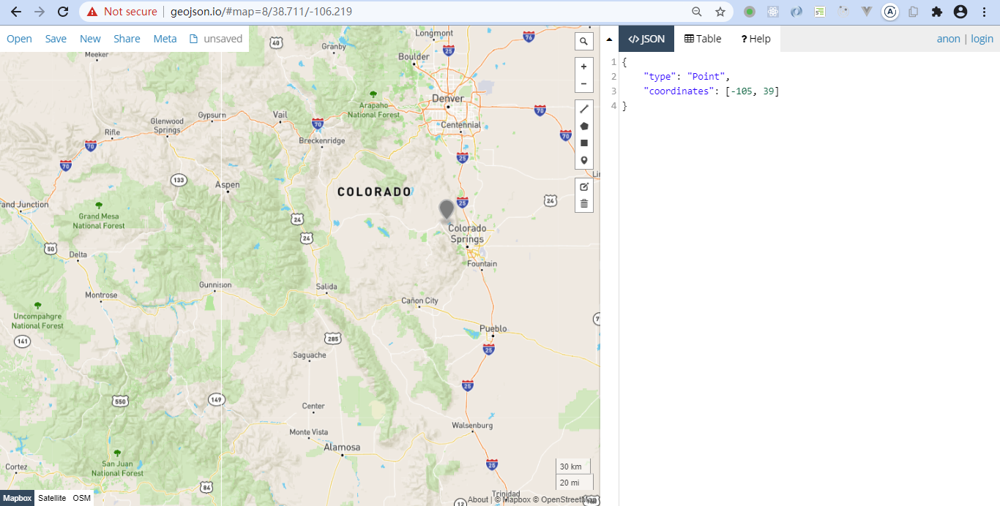

### GeoJSON

GeoJSON is a format for encoding a variety of geographic data structures.

GeoJSON supports the following geometry types: Point, LineString, Polygon, MultiPoint, MultiLineString, and MultiPolygon. Geometric objects with additional properties are Feature objects. Sets of features are contained by FeatureCollection objects.

[geojson.io](http://geojson.io/#map=2/20.0/0.0) 



**Point**

```json
{
    "type": "Point",
    "coordinates": [-105, 39]
}
```

**LineString**

```json
{
    "type": "LineString",
    "coordinates": [
        [-105, 39],
        [-107, 38]
    ]
}
```

**Polygon**

```json
{
    "type": "Polygon",
    "coordinates": [
        [
            [30, 0],
            [31, 0],
            [31, 5],
            [30, 5],
            [30, 0]
        ]
    ]
}
```

**GeometryCollection**

```json
{
    "type": "GeometryCollection",
    "geometries": [
        {
            "type": "Point",
            "coordinates": [-105, 39]
        },
        {
            "type": "LineString",
            "coordinates": [
                [-105, 39],
                [-107, 38]
            ]
        }
    ]
}
```

**Feature**

```json
{
    "type": "Feature",
    "properties": {
        "name": "北京"
    },
    "geometry": {
        "type": "Point",
        "coordinates": [116.3671875, 39.977120098439634]
    }
}
```
