> 来源：[数学公式怎么敲？LaTeX保姆级教程](https://www.bilibili.com/video/BV1no4y1U7At)

## 希腊字母

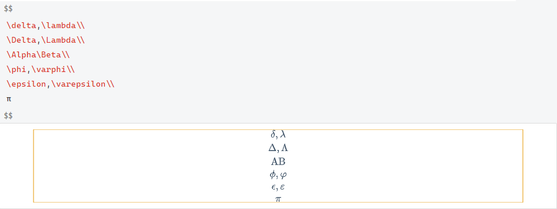

## 上下标

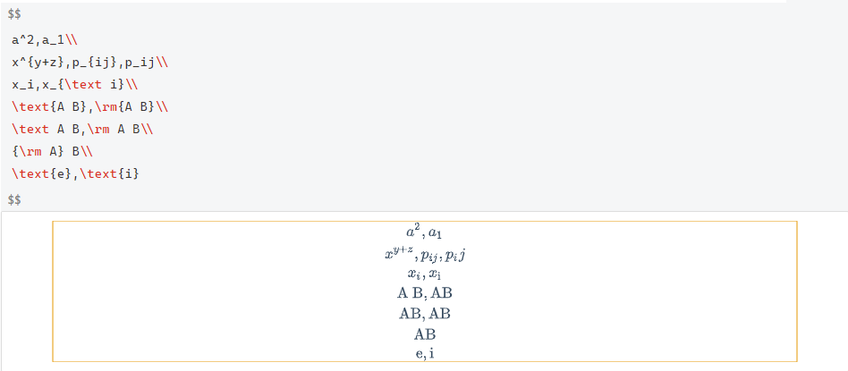

## 分式与根式

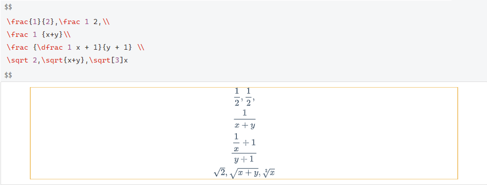

## 普通运算符

degree °

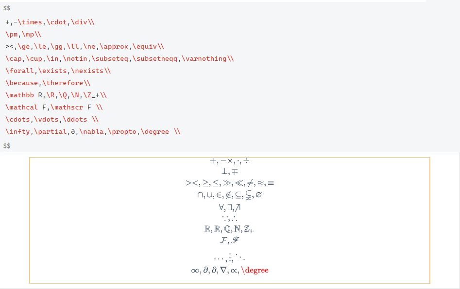

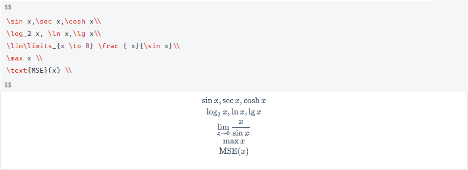

## 大型运算符

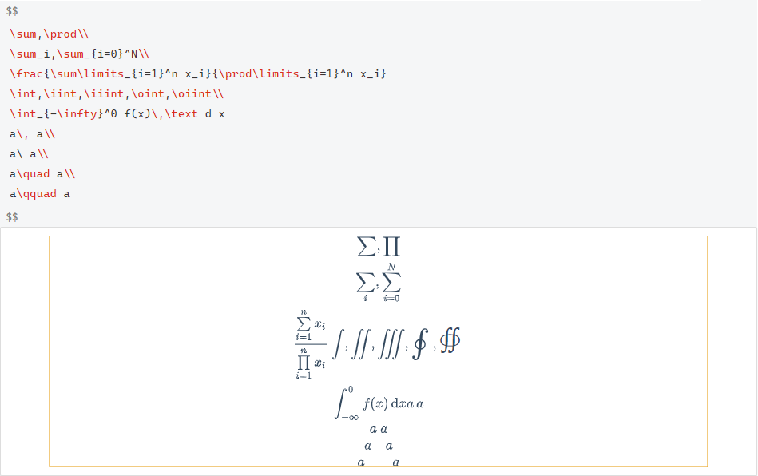

## 标注符号和箭头

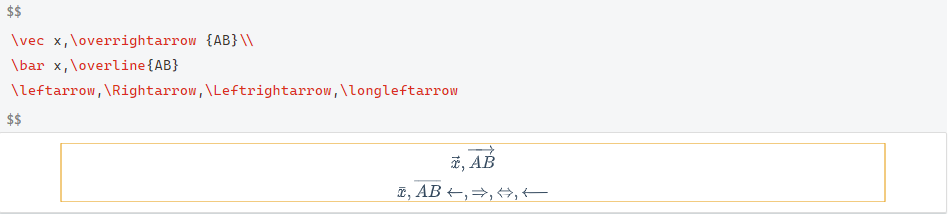

## 括号与定界符

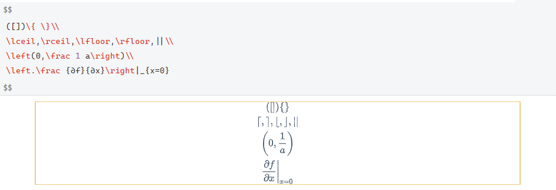

## 多行公式

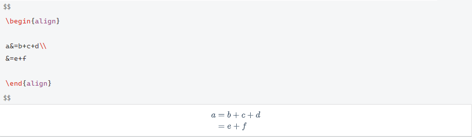

## 大括号

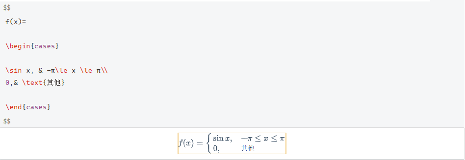

## 矩阵

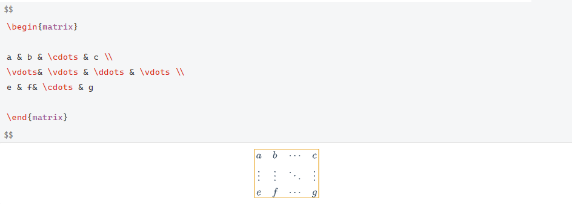
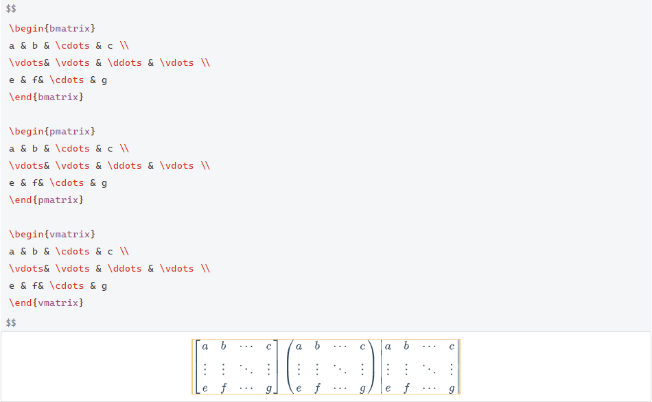
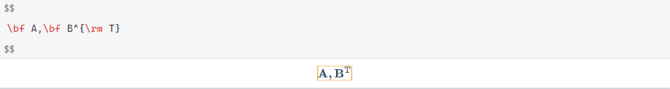

## 实战演练

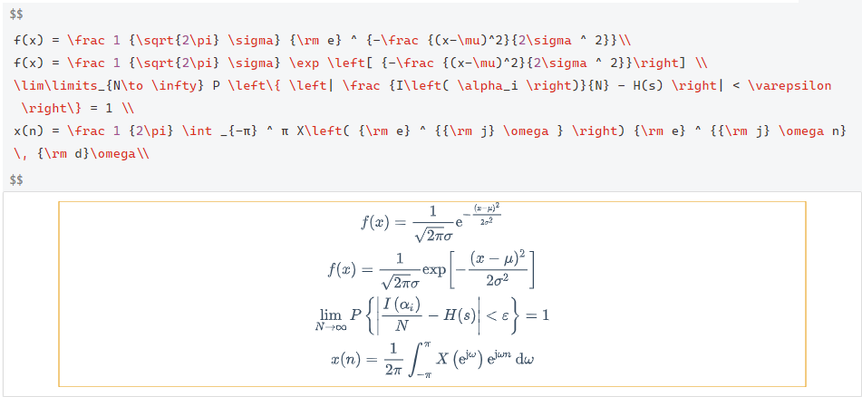
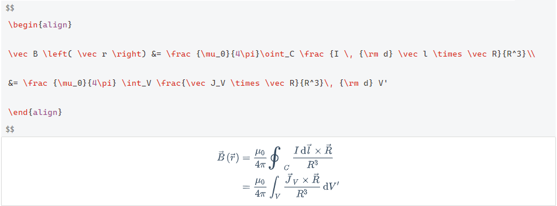
