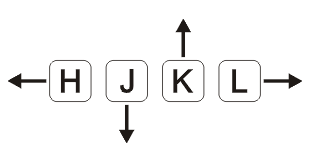
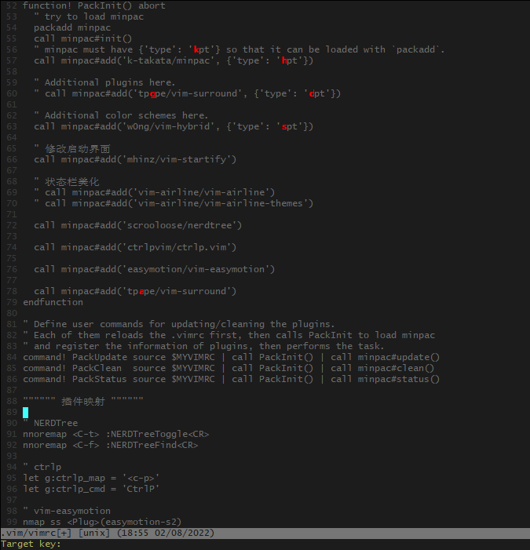

## NORMAL 普通模式

进入 vim 默认是 `normal` 模式（因为大部分情况是浏览而不是编辑）。`normal` 模式下可以进行各种命令操作和移动。使用 `Esc` 可以从 `insert` 模式回到 `normal` 模式。

### 光标移动

- h 向左移动光标。
- j 向下移动光标。
- k 向上移动光标。
- l 向右移动光标。



### 单词移动

- `w/W` 移动到下一个 word/WORD 开头, `e/E` 移动到下一个 word/WORD 结尾。
- `b/B` (back word) 回到上一个 word/WORD 开头。
- word 指以非空白字符分割的单词，WORD 以空白字符分割的单词。

### 行间搜索移动

同一行快速移动的方式是搜索一个字符并且移动到该字符。

- 使用 `f{char}` 可以移动到 char 字符上, `t` 移动到 char 的前一个字符。
- 使用 `;` 或 `,` 继续搜索该行下一个或上一个。
- 大写的 `F` 表示反过来搜索前面的字符。

### 水平移动

快速移动到一行的行首或行尾。

- `0` 移动到行首第一个字符，`^` 移动到第一个非空白字符。
- `$` 移动到行尾，`g_` 移动到行尾非空白字符。

### 页面移动

- `gg / G` 移动到文件开头和结尾，可以使用 `Ctrl + o` 快速返回，一直往后退到上次的文件和位置。
- `H / M / L` 跳转到窗口的开头（Head），中间（Middle) 和结尾（Lower)。
- `Ctrl + u / Ctrl + f` 上下翻页（upward/forward)。
- `zz` 把光标所在位置的内容移动到窗口中间。

### 快速删除

- `x` 快速删除一个字符。
- `d` 配合文本对象快速删除一个单词 `daw/dw`(delete around word)。
- `dd` 删除一行，`d0` 删除到行首，`d$` 删除到行尾，`dt;` 删除到 `;` 不包含 `;`，`df;` 刪除到 `;` 包含 `;`。
- `d` 和 `x` 可以搭配数字执行，表示重复执行，`4dd` 删除 4 行，`4x` 删除 4 个字符。

### 快速修改

- `r` replace 替换一个字符，`R` 进入 `replace` 模式，连续向后替换。
- `s` substitute 删除当前字符并进入插入模式，`4s` 删除 4 个字符进入插入模式，`S` 整行删除进入插入模式。
- `c` change 配合文本对象修改，`cw` 删除当前单词进入插入模式; `ct;` 删除到 `;` 不包含 `;` 进入插入模式，`cf;` 删除到 `;` 包含 `;`进入插入模模式; `C` 整行删除进入插入模式。

### 查询

- `/` 或者 `?` 进行前向或者反向搜索。
- `n / N` 跳转到下一个或者上一个匹配，需要先使用 `enter` 退出搜索。
- `* / #` 进行当前单词的前向和后向匹配。

### 复制/剪切/黏贴

- `d` delete 删除。
- `y` yank 复制。
- `P` put 在当前行上方粘贴。
- `p` put 在当前行下方粘贴。

### 撤销和重做

- `u` 撤销上一步的操作。
- `Ctrl+r` 恢复上一步被撤销的操作。

## INSERT 插入模式

### 进入 INSERT 模式

`normal` 模式切换到 `insert` 模式有如下几种方式。

| Command | Meaning                            |
| ------- | ---------------------------------- |
| i       | insert before of current character |
| a       | append after of current character  |
| I       | insert of line start               |
| A       | append of line end                 |
| o       | append a line below                |
| O       | insert a line above                |

### 删除操作

如下命令也可以在 Terminal 中使用。

- `Ctrl + h` 删除上一个字符。
- `Ctrl + w` 删除上一个单词。
- `Ctrl + u` 删除当前行。

## COMMAND 命令模式

| Command          | Meaning                     |
| ---------------- | --------------------------- |
| `:wq/:x`         | 写入并退出                  |
| `:vs`            | vertical split 垂直分屏     |
| `:sp`            | split 水平分屏              |
| `:set nu`        | 设置行号                    |
| `:set nu!`       | 取消行号设置                |
| `:% s/foo/bar/g` | 全局替换 foo -> bar         |
| `:help s`        | 查询帮助                    |
| `:e b.txt`       | 打开当前目录下的 b.txt 文件 |
| `:e！`           | 重新加载并且不保存当前文件  |

### 替换命令

`substitute` 命令可以用来查找并且替换文本，并且支持正则表达式。

`:[range]s[ubstitute]/{pattern}/{string}/[flags]`

- `range` 表示范围，例如: 10,20 表示 10-20 行，% 表示全部。
- `pattern` 要替换的模式。
- `string` 需要替换成的文本。
- `flags` 替换标志位。
  - `g(global)` 表示全局范围内执行。
  - `c(confirm)` 表示确认，可以确认或者拒绝修改。
  - `n(number)` 报告匹配的次数而不替换，可以用来查询匹配次数。

example: `:% s/\<foo\>/bar` 精确匹配 foo, 替换成 bar.

## VISUAL 可视模式

`visual` 模式一般用来块状选择文本。`normal` 模式下进入 `visual` 模式有如下三种方式。

- `v` 进入 `VISUAL` 模式选择一个字符。

- `V` 进入 `VISUAL LINE` 模式选择整行。 

- `Ctrl + v` 进入 `VISUAL BLOCK` 进行块状选择。

注释多行 Python 文本。

1. `Ctrl + v`  进入 `VISUAL BLOCK`, 选中要注释的行。
2. `I # ` 在行前加上 `# `。
3. `Esc` 退出，所有块选的行都会添加上 `# `。

## 模式切换

**insert => normal**

`Esc` 可以从 `insert` 模式回到 `normal` 模式，也可以使用 `Ctrl + c` 或者 `Ctrl + [` 代替 `Esc`(可能会中断某些插件)。

**normal => insert**

`i, a, I, A, o, O` 进入插入模式。

`gi` 快速跳转到最后一次编辑的地方并进入插入模式。

## 多文件操作

Buffer 是指打开的一个文件的内存缓冲区，Window 是 Buffer 可视化的分割区域，Tab 可以组织多个 Window 为一个工作区。

### Buffer

Buffer 是指打开的一个文件的内存缓冲区。

- Vim 打开一个文件后会加载文件内容到缓存区，之后的修改都是针对内存中的缓存区，并不会直接保存到文件，直到我们执行 `:w` (write) 的时候才会把修改内容写入到文件里。
- `:e filename` 打开多个文件，创建多个缓存区，使用 `:ls` 会列举当前缓存区，然后使用 `:b n` 跳转到第 `n` 个缓存区。
- `:bpre` `:bnext` `:bfirst` `:blast` 分別跳转到上一个，下一个，第一个最后一个缓存区。
- `:b buffer_name` 跳转到指定缓存区。

### Window

Window 是 Buffer 可视化的分割区域。

- 一个缓存区可以分割成多个窗口，每个窗口也可以打开不同的缓存区。
- `<Ctrl + w> s` 水平分割，`<Ctrl + w> v` 垂直分割。或者使用 `:sp` 和 `:vs`。

注意：`<Ctrl + w> s`  这种命令要先按 `Ctrl + w`, 松开后按 `s`。

| Command        | Meaning          |
| -------------- | ---------------- |
| `<Ctrl + w> w` | 在窗口间循环切换 |
| `<Ctrl + w> h` | 切换到左边的窗口 |
| `<Ctrl + w> j` | 切换到下边的窗口 |
| `<Ctrl + w> k` | 切换到上边的窗口 |
| `<Ctrl + w> l` | 切换到右边的窗口 |
| `<Ctrl + w> H` | 把窗口移动到左边 |
| `<Ctrl + w> L` | 把窗口移动到右边 |

可以在 `vimrc` 加入映射配置使窗口切换更加简单。

```shell
" 使用 Ctrl + h/j/k/l 切换窗口
noremap <C-h> <C-w>h
noremap <C-j> <C-w>j
noremap <C-k> <C-w>k
noremap <C-l> <C-w>l
```

### Tab

Tab 可以组织 Window 为一个工作区。

- Vim 的 Tab 和其它编辑器不太一样，可以想象成 Linux 的虚拟桌面。

- 比如一个 Tab 全部用来编辑 Python 文件，一个 Tab 全部是 HTML 文件。

| Command                 | Meaning                          |
| ----------------------- | -------------------------------- |
| `:tabn[ew] {filename}`  | 在新标签页打开 {filename}        |
| `:tabe[dit] {filename}` | 在新标签页打开 {filename}        |
| `<Ctrl+w> T`            | 把当前窗口移动到一个新的标签页   |
| `:tabc[lose]`           | 关闭当前标签页及其中的所有窗口   |
| `:tabo[nly]`            | 只保留活动标签页，关闭其它标签页 |

| Ex Command       | Normal Command | Meaning                     |
| ---------------- | -------------- | --------------------------- |
| `:tabn[ext] {N}` | `{N}gt`        | 切换到编号为 `{N}` 的标签页 |
| `:tabn[ext]`     | `gt`           | 切换到下一标签页            |
| `:tabp[revious]` | `gT`           | 切换到上一标签页            |

## Text Object

Text Object 文本对象。

- Vim 里文本也有对象的概念，比如一个单词，一段句子，一个段落。
- Vim 可以通过操作文本对象来修改文本比指操作单个字符高效。

Text Object 文本对象操作方式

- `[number] <command> [text object]`
  - `number` 表示次数
  - `command` 是命令，`d(elete)`, `c(hange)`, `y(ank)`
  - text object 是要操作的文本对象，比如单词 `w`, 句子 `s`, 段落 `p`

`iw` 表示 **inner word**, 如果键入 `viw` 那么首先 `v` 将进入选择模式，然后 `iw` 选中当前单词。

`aw` 表示 **around word**, 它不但会选中当前单词，还会包含单词之后的空格。

`i(` ， `i)` 选中 `()` 里面的内容, 其它的 `i<` ， `i"` 等也可以。

`a(` ， `a)` 选中 `()` 和 `()` 里面的内容。

## 复制粘贴与寄存器

### NORMAL 模式下的复制与粘贴

- normal 模式下复制粘贴分別使用 `y(yank)` 和 `p(put)`, 剪切使用 `d(delete) + p(put)`.
- 可以使用 `v(visual)` 命令选中所要接收复制内容的地方，然后使用 `p` 粘贴。
- 配合文本对象，比如使用 `yiw` 复制一个单词， `yy` 复制一行。

### INSERT 模式下的复制与粘贴

- 和其它文本编辑器差不多，使用 `Ctrl + c` 选中，使用 `Crtl + v` 粘贴（Widows Git 中使用 Vim, 使用鼠标右键复制粘贴）。
- 在 `vimrc` 中设置了 `autoindent` 的情况下，粘贴 Python 代码缩进会混乱，这个时候需要使用 `:set paste` 进行粘贴，粘贴之后执行`:set nopaste`。

### 寄存器

Vim 在 normal 模式下复制/剪贴的内容去了哪？

- Vim 里操作的是寄存器而不是系统剪贴板，这和其它编辑器不同。
- 默认我们使用 `d` 删除或者 `y` 复制的内容以及`x` 删除一个字符都放到了*无名寄存器*。

### 深入寄存器(register)

Vim 不使用单一剪贴板进行剪贴，复制与粘贴，而是多组寄存器。

- 通过 `"{register}` 前缀可以指定寄存器，不使用默认的无名寄存器。
- 比如 `"ayiw` 复制一个单词到寄存器 `a` 中，`"bdd` 删除当前行到寄存器 `b` 中。
  - `:reg a` 查看 `a` 寄存器。
  - `"ap` 粘贴 `a` 寄存器中的内容。 
- Vim 中 `""` 表示无名寄存器，缺省使用。`""p` 其实就等于 `p`. 

### 其它常用寄存器

除了有名的寄存器 `a-z`, Vim 中还有一些其它常见的寄存器。

- 复制专用寄存器 `"0`, 使用 `y` 复制文本到无名寄存器的同时会被拷贝到复制寄存器 `0`.
- 系统剪贴板 `"+`, 可以在复制前加上 `"+` 复制到系统剪贴板。
  - `:echo has('clipboard')` 输出的是 `1` 表示支持系统剪贴板。
  - `:set clipboard=unnamed` 可以让你直接复制粘贴系统剪贴板内容，在 Vim 中 `y` 复制的内容，可以在其它编辑软件中 `Ctrl + v` 粘贴，在其它编辑软件 `Ctrl + c` 复制的内容，在 Vim 中可以用 `p` 直接粘贴（Widows Git 中使用 Vim 默认支持这种方式的复制粘贴）。 
- 其它一些寄存器，比如 `"%` 表示当前文件名，`".` 上次插入的文本。

## Macro 宏

宏可以看成一系列命令的集合。我们可以使用宏*录制*一系列操作，然后用于*回放*。宏可以非常方便把一系列命令用在多行文本上。

- Vim 使用 `q` 来录制宏，同时也是使用 `q` 结束录制。
- 使用 `q{register}` 选择要保存的寄存器，把录制的命令保存其中。
- 使用 `@{register}` 回访寄存器中保存的一系列命令。

使用宏给如下文本每行前后添加上双引号。

1. normal 模式定位到第一行，`qa` 开始录制宏到 `a` 寄存器。
2. (Caps Lock 切换到大写) `I` 进入 insert 模式，在行首添加 `"`; `Esc` 退回到 normal 模式; `A` 进入 insert 模式，在行末添加 `"`。
3. (Caps Lock 切换到小写) `Esc` 退回到 normal 模式; `q` 结束宏录制。
4. normal 模式定位到第二行，`V` 进入 visual 模式并选中当前行，`G` 向下选中所有行。
5. command 模式使用 normal 命令，`:'<,'>normal @a` 回放 `a` 寄存器中的宏命令。

```
https://khmdb.googleapis.com
https://storage.googleapis.com
https://translate.googleapis.com
https://update.googleapis.com
https://safebrowsing.googleapis.com
https://cn.gravatar.com
https://connectivitycheck.gstatic.com
https://csi.gstatic.com
https://fonts.gstatic.com
```

不使用宏给上面文本每行前后添加上双引号。

1. normal 模式定位到第一行，`V` 进入 visual 模式并选中当前行，`G` 向下选中所有行。
2. `:'<,'>normal I"` 在每行行首添加上 `"`.
3. `:` 然后按下 `Ctrl + p` 执行上一个命令，替换命令为 `:'<,'>normal A"` 在每行行尾添加上 `"`.

## 补全

常见的三种补全方式。

- 使用 `Ctrl + n` 和 `Ctrl + p` 补全单词。
- 使用 `Ctrl + x`  + `Ctrl + f` 补全文件名。
  - `:r[ead]` 插入命令输出到 buffer。
  - `:r! echo %` 插入当前文件名。
  - `:r! echo %:p` 插入当前文件全路径名。
- 使用 `Ctrl + x` `Ctrl + o` 补全代码, 需要开启文件类型检查，安装插件。 

## 配色

- 使用 `:colorscheme` 显示当前的主题色，默认是 `default`.
- 使用 `:colorscheme <Ctrl + d>` 可以显示所有的配色。
- 使用 `:colorscheme {schemename}` 可以修改配色。

使用网上下载的配色，以 [GitHub - w0ng/vim-hybrid: A dark color scheme for Vim](https://github.com/w0ng/vim-hybrid) 为例。复制 `colors/hybrid.vim` 到 `~/.vim/colors/hybrid.vim`, 没有 `~/.vim/colors` 目录需要先手动建立，之后可以使用插件管理器管理，然后在使用 `:colorscheme hybrid` 选择配色。如果要持久化配色方案需要在 `~/.vim/vimrc` 中添加相应配置。

```shell
set background=dark
colorscheme hybrid
```

注意：Windows Git 默认 term 是 xterm, 不支持 256 色，需要调整为 xterm-256color，`:set term=xterm-256color`.

## 配置

- 可以把常用的设置写到 `~/.vim/vimrc` 中，避免每次打开 vim 重新设置。
- 比如设置行号 `set nu`; 设置主题 `colorscheme hybrid`.

```shell
" 设置行号
set number

" 设置 term, Windows Git 默认 term 是 xterm
set term=xterm-256color

" 按 F2 进入粘贴模式
set pastetoggle=<F2>

" 设置主题
set background=dark
colorscheme hybrid

" 高亮搜索
set hlsearch
```

如何使配置生效，第一种是重新打开 Vim, 第二种是 `w` 保存但是不退出，然后执行`:source %`， `%` 表示当前文件名。

## 映射

Vim 映射就是把*一个操作*映射到*另一个操作*。

### 基本映射

基本映射指的是 normal 模式下的映射。使用 `map` 添加映射命令，`unmap` 取消映射命令。

- `:map - x`  按下 `-` 会删除字符。
- `:map <space> viw` 按下空格的时候会选中整个单词。 
- `:map <c-d> dd` 按下 `Ctrl + d` 执行 `dd` 删除一行。
- `:unmap -` 取消 `-` 的映射。

### 模式映射

Vim 常用模式 normal/visual/insert 都可以定义映射，用 `nmap`,`vmap`,`imap` 定义只在 normal/visual/insert 分別有效。

- `:vmap \ U` 在 visual 模式下使用 `\` 转换所选字符或块字母为大写（U/u转换大小写）。
- 在 insert 模式下映射 `Ctrl + d` 来删除一行 `:imap <c-d> <Esc>ddi`.

### 递归映射与非递归映射

如下，当你按下 `\` 时，Vim 会解释其为 `-`， 然后又映射了 `-`, Vim 会继续解释 `-` 为 `dd`, 即它会删除整行。`nmap`,`vmap`,`imap` 命令有递归的风险，如果安装了一个插件，插件映射了同一个按键的不同行为，就会有冲突，有一个就会失效。

```shell
:nmap - dd
:nmap \ -
```

所以 Vim 提供了非递归映射(no recursive map)，这些命令不会递归解释，`nnoremap`, `vnoremap`, `inoremap`. 

在 `~/.vim/vimrc` 中添加映射配置。 

```shell
""""""" 基本配置 """"""

" 设置行号
set number

" 设置 term, Windows git 默认 term 是 xterm
set term=xterm-256color

" 按 F2 进入粘贴模式
set pastetoggle=<F2>

" 设置主题
set background=dark
colorscheme hybrid

" 高亮搜索
set hlsearch


"""""" 映射配置 """"""

" 默认是 \
let mapleader=','

" 使用 jj 进入 normal 模式，:help `^
inoremap jj <Esc>`^
" 使用 leader+w 直接保存
inoremap <leader>w <Esc>:w<cr>
noremap <leader>w :w<cr>

" 使用 Ctrl + h/j/k/l 切换窗口
noremap <C-h> <C-w>h
noremap <C-j> <C-w>j
noremap <C-k> <C-w>k
noremap <C-l> <C-w>l

" json 格式化
com! FormatJSON %!python -m json.tool
```

## 插件

### 如何安装插件

- 原始的方式是直接 clone 插件代码。
- 现在可以使用插件管理器。常见的插件管理器有 **vim-plug** , **Vundle**, **Pathogen**, **Dein.Vim**, **volt**, **minpac** 等。

以 `minpac` 为例。

> [Meet minpac](http://vimcasts.org/episodes/minpac/)

> [GitHub - k-takata/minpac: A minimal package manager for Vim 8 (and Neovim)](https://github.com/k-takata/minpac)

在 `~/.vim/vimrc` 中添加插件配置。 

```shell
" Use Vim settings, rather than Vi settings (much better!).
" This must be first, because it changes other options as a side effect.
" Avoid side effects when it was already reset.
if &compatible
  set nocompatible
endif

""""""" 基本配置 """"""

" 设置行号
set number

" 设置 term, Windows git 默认 term 是 xterm
set term=xterm-256color

" 按 F2 进入粘贴模式
set pastetoggle=<F2>

" 设置主题
set background=dark
colorscheme hybrid

" 高亮搜索
set hlsearch


"""""" 映射配置 """"""

" 默认是 \
let mapleader=','

" 使用 jj 进入 normal 模式 :help `^
inoremap jj <Esc>`^
" 使用 leader+w 直接保存
inoremap <leader>w <Esc>:w<cr>
noremap <leader>w :w<cr>

" 使用 Ctrl + h/j/k/l 切换窗口
noremap <C-h> <C-w>h
noremap <C-j> <C-w>j
noremap <C-k> <C-w>k
noremap <C-l> <C-w>l

" json 格式化
com! FormatJSON %!python -m json.tool


"""""" 插件配置 """"""

" settings for minpac
function! PackInit() abort
  " try to load minpac
  packadd minpac
  call minpac#init()
  " minpac must have {'type': 'opt'} so that it can be loaded with `packadd`.
  call minpac#add('k-takata/minpac', {'type': 'opt'})

  " Additional plugins here.
  " call minpac#add('tpope/vim-surround', {'type': 'opt'})

  " Additional color schemes here.
  call minpac#add('w0ng/vim-hybrid', {'type': 'opt'})
endfunction

" Define user commands for updating/cleaning the plugins.
" Each of them reloads the .vimrc first, then calls PackInit to load minpac
" and register the information of plugins, then performs the task.
command! PackUpdate source $MYVIMRC | call PackInit() | call minpac#update()
command! PackClean  source $MYVIMRC | call PackInit() | call minpac#clean()
command! PackStatus source $MYVIMRC | call PackInit() | call minpac#status()
```

### 如何搜寻插件

1. 大部分插件托管在了 github 上，可以通过 google 搜索关键词寻找想要的插件，例如 *vim file manager plugin*, *vim python plugin github*.
2. 可以在 Vim Awesome 查找需要的插件, [Vim Awesome](https://vimawesome.com/): AWESOME VIM PLUGINS from ACROSS THE UNIVERSE.

3. 浏览网上开源的 vim 配置借鉴想要的插件。

### 常用插件

#### vim-startify

> [GitHub - mhinz/vim-startify: The fancy start screen for Vim.](https://github.com/mhinz/vim-startify)

 ```shell
call minpac#add('mhinz/vim-startify')
 ```

#### vim-airline

> [GitHub - vim-airline/vim-airline: lean & mean status/tabline for vim that's light as air](https://github.com/vim-airline/vim-airline)

```shell
call minpac#add('vim-airline/vim-airline')
call minpac#add('vim-airline/vim-airline-themes')
```

#### vim-indentline

> [GitHub - Yggdroot/indentLine: A vim plugin to display the indention levels with thin vertical lines](https://github.com/Yggdroot/indentLine)

```shell
call minpac#add('Yggdroot/indentLine')
```

#### nerdtree

> [GitHub - preservim/nerdtree: A tree explorer plugin for vim.](https://github.com/preservim/nerdtree)

```shell
call minpac#add('preservim/nerdtree')

nnoremap <C-t> :NERDTreeToggle<CR>
```

#### ctrlp

> [GitHub - kien/ctrlp.vim: Fuzzy file, buffer, mru, tag, etc finder.](https://github.com/kien/ctrlp.vim)

```shell
call minpac#add('kien/ctrlp.vim')

let g:ctrlp_map = '<c-p>'
```

#### easymotion

> [GitHub - easymotion/vim-easymotion: Vim motions on speed!](https://github.com/easymotion/vim-easymotion)

```shell
call minpac#add('easymotion/vim-easymotion')

nmap ss <Plug>(easymotion-s2)
```

1. normal 模式下，连续按两次 `s`. 输入需要查找的两个字符。例如 `op`.

2. 选择 Tagget key, 例如这里选择 `s` 会定位到第 `63` 行的 opt 前面。

   

 #### vim-surround

> [GitHub - tpope/vim-surround: surround.vim: Delete/change/add parentheses/quotes/XML-tags/much more with ease](https://github.com/tpope/vim-surround)

```shell
call minpac#add('tpope/vim-surround')
```

normal 模式下增加，删除，修改成对内容。

- `ys` (you add a surrounding) `ys iw "` 为当前光标定位的单词前后添加 `"`.

- `cs` (change a surrounding)  `cs ( [` 替换 `()` 为 `[  ]` 此时 `[  ]` 前后有空格，如果不需要空格，使用 `cs ( ]`.

- `ds` (delete a surrounding) `ds "` 删除单词左右的 `"`.

#### fzf.vim

> [GitHub - junegunn/fzf.vim: fzf vim](https://github.com/junegunn/fzf.vim)

```shell
call minpac#add('junegunn/fzf.vim')
```

- `:Files [PATH]` 模糊搜索当前目录文件，`:Files /` 搜索当前目录。
- `:Ag [PATTERN]` 模糊搜索字符串，`Ctrl + j` 到下一个匹配项，`Ctrl + k` 到上一个匹配项；并且可以继续输入字符串进行更精确的匹配。（Windows 需要额外配置）

#### far.vim

> [GitHub - brooth/far.vim: Find And Replace Vim plugin](https://github.com/brooth/far.vim)

```shell
call minpac#add('brooth/far.vim')
```

1. `:Far foo bar **/*.py` 替换 foo 为 bar。
2. `:Fardo` 确认替换。

## Terminal 快速操作

| Command    | Meaning          |
| ---------- | ---------------- |
| `Ctrl + h` | 删除上一个字符   |
| `Ctrl + w` | 删除上一个单词   |
| `Ctrl + u` | 删除当前行       |
| `Ctrl + a` | 移动到行首       |
| `Ctrl + e` | 移动到行尾       |
| `Ctrl + b` | 向前移动一个字符 |
| `Ctrl + f` | 向后移动一个字符 |
