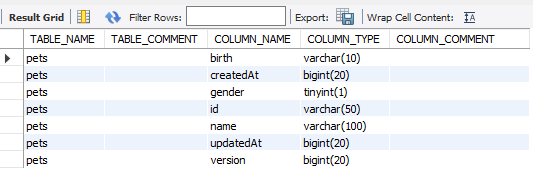

### mysql 命令常用参数

| 参数            | 含义                               |
| --------------- | ---------------------------------- |
| -u, --user=     | 用户名                             |
| -p, --password= | 密码                               |
| -P, --port=     | 端口号                             |
| -h, --host=     | 服务器名称                         |
| -D, --database= | 打开指定数据库                     |
| --delimiter=    | 指定分隔符                         |
| --prompt=       | 设置提示符                         |
| -V,--version    | 输出版本信息并退出（必须是大写 V） |

登陆 mysql

```mysql
--one
mysql -uroot -proot -P3306 -h127.0.0.1

--two
mysql -uroot -p -P3306 -h127.0.0.1
Enter password: ****
```

### 常用命令


```mysql
-- 显示当前服务器版本
SELECT VERSION(); /  mysql --version 

-- 显示当前日期时间
SELECT NOW();

-- 显示当前用户
SELECT USER();

-- 当前数据库
select database();

-- 查看其它数据库中的表
show tables from test;

-- 查看表结构
desc student;
```

### 创建数据库

{}是必选项，[]是可选项，|是做选择项

```mysql
CREATE {DATABASE | SCHEMA} [IF NOT EXISTS] db_name
[DEFAULT] CHARACTER SET [=] charset_name

CREATE DATABASE mysql-learn;
```

### 修改数据库

修改数据库的语法结构：

```mysql
ALTER {DATABASE | SCHEMA}  [db_name]
[DEFAULT]  CHARACTER SET [=] charset_name
```

比如将刚刚创建的 mysql-learn 的编码方式修改为 utf8

```mysql
ALTER DATABASE people CHARACTER SET utf8;
```

### 创建数据表

```mysql
CREATE TABLE [IF NOT EXISTS] table_name (
	column_name data_type
)
```

```mysql
CREATE TABLE people(
    name VARCHAR(20),
    age TINYINT UNSIGNED,
    salary FLOAT(8,2) UNSIGNED
);
```

### 主外键约束

```mysql
CREATE TABLE card(
    id SMALLINT UNSIGNED PRIMARY KEY AUTO_INCREMENT,
    card_no VARCHAR(20) NOT NULL
);

CREATE TABLE people(
    id SMALLINT UNSIGNED PRIMARY KEY AUTO_INCREMENT,
    name VARCHAR(10) NOT NULL,
    cid SMALLINT UNSIGNED,
    FOREIGN KEY(cid) REFERENCES idcard(id) ON DELETE CASCADE
);
```

### 自定义函数

**创建不带参数的自定义函数**

```mysql
SELECT DATE_FORMAT(NOW(), '%Y 年%m 月%d 日 %H 点%i 分%s 秒');
```

```
+-------------------------------------------------------+
| DATE_FORMAT(NOW(), '%Y 年%m 月%d 日 %H 点%i 分%s 秒') |
+-------------------------------------------------------+
| 2019 年11 月08 日 16 点20 分59 秒                     |
+-------------------------------------------------------+
1 row in set (0.00 sec)
```

```mysql
CREATE FUNCTION chinese_date() RETURNS VARCHAR(30)
RETURN DATE_FORMAT(NOW(),'%Y 年%m 月%d 日 %H 点%i 分%s 秒');

SELECT chinese_date();
```

mysql8.0 出现如下错误
ERROR 1418 (HY000): This function has none of DETERMINISTIC, NO SQL, or READS SQL DATA in its declaration and binary logging is enabled (you _might_ want to use the less safe log_bin_trust_function_creators variable)

```mysql
SHOW variables like 'log_bin_trust_function_creators';
--如果为 OFF, 开启 log_bin_trust_function_creators
SET GLOBAL log_bin_trust_function_creators = 1;
```

**带有参数的自定义函数**

```mysql
CREATE FUNCTION avg (num1 SMALLINT UNSIGNED,num2 SMALLINT UNSIGNED)
RETURNS FLOAT(10,2) UNSIGNED
RETURN (num1 + num2) / 2;
```

**具有复合结构函数体的自定义函数**

首先需要修改 DELIMITER`DELIMITER //`, 因为 mysql 默认使用 `;` 作为语句的结束

```mysql
CREATE FUNCTION adduser(name VARCHAR(20))
RETURNS INT UNSIGNED
BEGIN
    INSERT people(name) VALUES (name);
    RETURN LAST_INSERT_ID();
END
//
```

### 存储过程

**不带参数的存储过程**

```mysql
CREATE PROCEDURE v() SELECT VERSION();
call v();
```

**带有 IN 和 OUT 类型参数的存储过程**

```mysql
CREATE PROCEDURE remove1(IN p_id INT UNSIGNED, OUT user_counts INT UNSIGNED)
BEGIN
    DELETE FROM users WHERE id = p_id;
    SELECT COUNT(id) FROM users INTO user_counts;
END
//

CALL remove1(44,@counts)
SELECT @counts;
```

**带有多个 OUT 类型参数的存储过程**

```mysql
CREATE PROCEDURE remove2(IN p_age SMALLINT UNSIGNED,OUT delete_counts SMALLINT UNSIGNED, OUT user_counts SMALLINT UNSIGNED)
BEGIN
DELETE FROM users WHERE age = p_age;
SELECT ROW_COUNT() INTO delete_counts;
SELECT COUNT(id) FROM users INTO user_counts;
END
//
CALL remove2(21, @a, @b);
```

### mycli

mycli 是一个 mysql 命令行提示工具, 安装完成后使用和 mysql 一致，例如登陆 mysql ， `mycli -uroot -proot`

```python
pip install mycli
```

### information_schema

mysql 的 `information_schema.tables` 和 `information_schema.columns` 分別保存着表和栏位的相关信息。

```sql
SELECT  b.table_name, b.table_comment, a.column_name, a.column_type,a.column_comment
FROM information_schema.columns a
JOIN information_schema.tables b
ON a.table_schema =b.table_schema AND a.table_name =b.table_name
WHERE a.table_name='pets';
```



### dual

```sql
SELECT 1 + 1 FROM DUAL;
SELECT 1 + 1;
-- FROM DUAL could be used when you only SELECT computed values, but require a WHERE clause, perhaps to test that a script correctly handles empty resultsets:
SELECT 1 FROM DUAL WHERE FALSE;
```

### variables

```sql
--查询变量设置
show variables like '%connect_timeout%'; --默认 session 变量
show local variables like '%connect_timeout%';
show session variables like '%connect_timeout%';
show global variables like '%connect_timeout%';

--全局变量设置
SET GLOBAL log_bin_trust_function_creators=1;
SET @@global.log_bin_trust_function_creators=1;
--sesseion 变量设置
SET log_bin_trust_function_creators=1; --默认 session 变量
SET SESSION log_bin_trust_function_creators=1;
SET @@session.log_bin_trust_function_creators=1;

--自定义变量
set @test="test";
select @test;
```

### 批量插入

```sql
insert into some_table (col1, col2) values (val1, val2), (val3, val4), (val5, val6)
```

### +

mysql 中的 `+` 只有作为运算符，没有作为连接符的功能, 连接字符使用 `concat` 。+  运算如果是字符型，会试图将字符转换为数字，转换成功做加法运算，转换失败将字符转换为 0 做加法运算

```mysql
select 1 + 1; --2
select '1' + 1; --2 
select '1' + '1'; --2
select 'a' + 1; --1
select 'a' + 'a'; --0
select null + 1; -- NULL
select concat(1, 1); --11
```

### <=> 

`<=>`  安全等于可以用来判断是否等于 null.

```mysql
select * from employees where commission_pct is null; 
select * from employees where commission_pct <=> null;
select * from employees where commission_pct <=> 100;
```

### like null

`select * from employees`  和 `select * from employees where commission_pct like '%%' and last_name like '%%'`  结果是否一样？

不一定，因为 commission_pct 和 last_name 中可能存在 `null`

### mod or %

`mod or %`  取余数 `mod(a, b) ⇒ a - a / b * b`  其中 `a / b`  是取整运算 `10 / 3 = 3`


```mysql
select mod(10, 3), mod(10, -3), -10 % -3, -10 % 3; --1, 1, -1, -1
```

### 逻辑运算符 xor

mysql 可以使用逻辑运算符 xor

```mysql
mysql> select 1 from dual where 1=1 xor 1=0;
+---+
| 1 |
+---+
| 1 |
+---+
1 row in set (0.01 sec)

mysql> select 1 from dual where 1=1 xor 1=1;
Empty set (0.00 sec)

mysql> select 1 from dual where 0=0 xor 0=0;
Empty set (0.00 sec)
```

位运算符

```mysql
mysql> select 1&0;
+-----+
| 1&0 |
+-----+
|   0 |
+-----+
1 row in set (0.00 sec)

mysql> select 1|0;
+-----+
| 1|0 |
+-----+
|   1 |
+-----+
1 row in set (0.00 sec)

mysql> select ~1;
+----------------------+
| ~1                   |
+----------------------+
| 18446744073709551614 |
+----------------------+
1 row in set (0.00 sec)

mysql> select 1^0;
+-----+
| 1^0 |
+-----+
|   1 |
+-----+
1 row in set (0.01 sec)

mysql> select 1>>1;
+------+
| 1>>1 |
+------+
|    0 |
+------+
1 row in set (0.00 sec)

mysql> select 1<<1;
+------+
| 1<<1 |
+------+
|    2 |
+------+
1 row in set (0.00 sec)
```

### GROUP_CONCAT

```mysql
CREATE TEMPORARY TABLE emp(
   empno  varchar(10),
   ename  varchar(100),
   deptno varchar(10)
);

insert into emp values ('10', 'Babb', '10');
insert into emp values ('20', 'Julian', '10');
insert into emp values ('30', 'Owen', '10');
insert into emp values ('40', 'Yoyo', '20');
insert into emp values ('50', 'Sunny', '20');

select deptno, group_concat(ename), count(*)
  from emp
 group by deptno;

+--------+---------------------+----------+
| deptno | group_concat(ename) | count(*) |
+--------+---------------------+----------+
| 10     | Babb,Julian,Owen    |        3 |
| 20     | Yoyo,Sunny          |        2 |
+--------+---------------------+----------+
2 rows in set (0.00 sec)
```

### CTE Common Table Expression

[CTE](https://docs.oracle.com/cd/E17952_01/mysql-8.0-en/with.html)

```SQL
WITH cte (col1, col2) AS
(
  SELECT 1, 2
  UNION ALL
  SELECT 3, 4
)
SELECT col1, col2 FROM cte;


with cte as
(
	select 1 as col1, 2 as col2
    union all
    select 3, 4
)
select col1, col2 from cte;

with cte1 as (select 1)
select * from (with cte2 as (select 2) select * from cte2 join cte1) as dt;


with recursive cte(n) as
(
	select 1
    union all
    select n + 1 from cte where n < 5
)
select * from cte;

-- Error Code: 1406. Data too long for column 'str' at row 1
with recursive cte as
(
	select 1 as n, 'abc' as str
    union all
    select n + 1, concat(str, str) from cte where n < 3
)
select * from cte;


with recursive cte as
(
	select 1 as n, cast('abc' as char(20)) str
    union all
    select n + 1, concat(str, str) from cte where n < 3
)
select * from cte;


with recursive fibonacci(n, fib_n, next_fib_n) as
(
	select 1, 0, 1
    union all
    select n + 1, next_fib_n, fib_n + next_fib_n from fibonacci where n < 10
)
select * from fibonacci where n = 8;


with recursive dates (date) as
(
	select sysdate()
    union all
    select date + interval 1 day from dates
    where date <= sysdate() + interval 10 day

)
select * from dates;


use test;
CREATE TABLE employees (
  id         INT PRIMARY KEY NOT NULL,
  name       VARCHAR(100) NOT NULL,
  manager_id INT NULL,
  INDEX (manager_id),
FOREIGN KEY (manager_id) REFERENCES employees (id)
);
INSERT INTO employees VALUES
(333, "Yasmina", NULL),  # Yasmina is the CEO (manager_id is NULL)
(198, "John", 333),      # John has ID 198 and reports to 333 (Yasmina)
(692, "Tarek", 333),
(29, "Pedro", 198),
(4610, "Sarah", 29),
(72, "Pierre", 29),
(123, "Adil", 692);

select * from employees;

with recursive employee_paths (id, name, path)  as
(
	select id, name, cast(id as char(200))
    from employees
    where manager_id is null
    union all
    select e.id, e.name, concat(ep.path, ',', e.id)
    from employee_paths as ep join employees as e
    on ep.id = e.manager_id
)
select * from employee_paths order by path;
```
