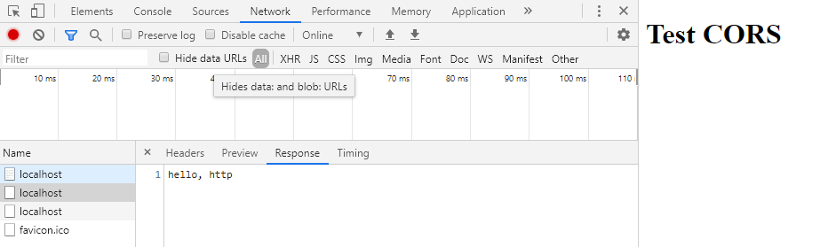

启动 server.js， server2.js 访问 http://localhost:8080/, 会读取 test.html 内容，在 test.html 中跨域访问 http://localhost:8888/ ，允许 跨域访问主要在被访问的服务的 response head 中设置相应属性。

| head                         | meaning                                                        | sample                                 |
| ---------------------------- | -------------------------------------------------------------- | -------------------------------------- |
| Access-Control-Allow-Origin  | 允许跨域的 url                                                 | http://localhost:8080, \* 表示任意 url |
| Access-Control-Allow-Headers | 允许跨域的 headers                                             | 需要在 请求的 heder 中携带             |
| Access-Control-Allow-Methods | 允许跨域的 method                                              | GET, POST, PUT, DELETE ...             |
| Access-Control-Max-Age       | 不再对跨域限制最大时间, 不再发送 OPTION 方法预处理 (preflight) | 单位是 s, 例如 1000 表示 1000s         |

server.js

```js
const http = require('http')
const fs = require('fs')

http
  .createServer((request, response) => {
    const html = fs.readFileSync('./test.html', 'utf8')
    response.writeHead(200, {
      'Content-Type': 'text/html'
    })
    response.end(html)
  })
  .listen(8080, () => {
    console.log('server is listening on 8080')
  })
```

test.html

```html
<!DOCTYPE html>
<html lang="en">
  <head>
    <meta charset="UTF-8" />
    <meta name="viewport" content="width=device-width, initial-scale=1.0" />
    <meta http-equiv="X-UA-Compatible" content="ie=edge" />
    <title>test</title>
  </head>
  <body>
    <h1>Test CORS</h1>

    <script>
      fetch('http://127.0.0.1:8888', {
        method: 'GET',
        headers: {
          'X-Test-CORS': '666'
        }
      }).then(console.log)
    </script>

    <!-- <script>
        var xhr = new XMLHttpRequest()
        xhr.open('GET', 'http://127.0.0.1:8888')
        xhr.send()    
    </script> -->

    <!--jsonp-->
    <!-- <script src="http://127.0.0.1:8888"></script> -->
  </body>
</html>
```

server2.js

```js
const http = require('http')

http
  .createServer((request, response) => {
    response.writeHead(200, {
      // 'Access-Control-Allow-Origin': '*',
      // 允许跨域的 url
      'Access-Control-Allow-Origin': 'http://localhost:8080',
      // 允许跨域的 headers
      'Access-Control-Allow-Headers': 'X-Test-CORS',
      // 允许跨域的 method
      'Access-Control-Allow-Methods': 'GET',
      // 1000s 内不再对跨域限制, 不再发送 OPTION 方法预处理 (preflight)
      'Access-Control-Max-Age': '1000'
    })
    response.end('hello, http')
  })
  .listen(8888, () => {
    console.log('server is listening on 8888')
  })
```


