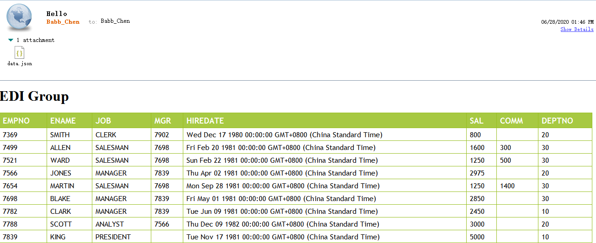

mail.js

```js
const fs = require('fs')
const path = require('path')
const nodemailer = require("nodemailer");
const ejs = require('ejs')
const { MAIL_TRANSPORT_CONFIG, MAIL_FROM, MAIL_TO } = require('./config')
const usersService = require('./services/users')

const renderHtml = async function () {
    const users = await usersService.query({ ename: null, deptno: null })
    const template = ejs.compile(fs.readFileSync(path.resolve(__dirname, 'template', 'email.ejs'), 'utf8'), { async: false });
    const html = template({
        title: 'EDI Group',
        users: users
    })

    return html
}


// async..await is not allowed in global scope, must use a wrapper
async function mail () {
    // create reusable transporter object using the default SMTP transport
    let transporter = nodemailer.createTransport(MAIL_TRANSPORT_CONFIG);

    // send mail with defined transport object
    let info = await transporter.sendMail({
        from: MAIL_FROM, // sender address
        to: MAIL_TO, // list of receivers
        subject: "Hello ✔", // Subject line
        text: "Hello world?", // plain text body
        html: await renderHtml(), // html body
        attachments: [
            {   // file on disk as an attachment
                filename: 'data.json',
                path: './data.json' // stream this file
            },
        ]
    });

    console.log("Message sent: %s", info.messageId);
    // Message sent: <b658f8ca-6296-ccf4-8306-87d57a0b4321@example.com>
}

mail().catch(console.error);
```

config.js

```js
const MAIL_CONFIG = {
    MAIL_TRANSPORT_CONFIG: {
        host: "xxx",
        port: xx
    },
    MAIL_FROM: "Babb_Chen@xx.com",
    MAIL_TO: "Babb_Chen@xx.com"
}

module.exports = MAIL_CONFIG
```

services/users.js

读取数据库返回 node 对象数组

```js
const oracledb = require('oracledb');

oracledb.outFormat = oracledb.OBJECT;

function query (queryObj) {
    return new Promise(async function (resolve, reject) {
        let connection;

        try {
            connection = await oracledb.getConnection({
                user: "xxx",
                password: "xxx",
                connectString: "DEV"
            });

            const sql =
                `SELECT empno, ename, job, mgr, hiredate, sal, comm, deptno FROM scott.emp
                  WHERE ename = nvl(:ename, ename)
                    AND deptno = nvl(:deptno, deptno)`

            const result = await connection.execute(sql, [queryObj.ename, queryObj.deptno]);

            resolve(result.rows);

        } catch (err) { // catches errors in getConnection and the query
            reject(err);
        } finally {
            if (connection) {   // the connection assignment worked, must release
                try {
                    await connection.release();
                } catch (e) {
                    console.error(e);
                }
            }
        }
    });
}

module.exports = {
    query
}
```

template/email.ejs

```ejs
<!DOCTYPE html>
<html lang="en">
    <head>
        <meta charset="UTF-8" />
        <meta name="viewport" content="width=device-width, initial-scale=1.0" />
        <title>table</title>
    </head>
    <style>
        #table {
            font-family: "Trebuchet MS", Arial, Helvetica, sans-serif;
            width: 100%;
            border-collapse: collapse;
        }

        #table td,
        #table th {
            font-size: 1em;
            border: 1px solid #98bf21;
            padding: 3px 7px 2px 7px;
        }

        #table th {
            font-size: 1.1em;
            text-align: left;
            padding-top: 5px;
            padding-bottom: 4px;
            background-color: #a7c942;
            color: #ffffff;
        }
    </style>
    <body>
        <h1><%= title %></h1>
        <table id="table">
            <tr>
                <th>EMPNO</th>
                <th>ENAME</th>
                <th>JOB</th>
                <th>MGR</th>
                <th>HIREDATE</th>
                <th>SAL</th>
                <th>COMM</th>
                <th>DEPTNO</th>
            </tr>
            <% for (let i = 0; i < users.length; i++) { %>
            <tr>
                <td><%= users[i].EMPNO %></td>
                <td><%= users[i].ENAME %></td>
                <td><%= users[i].JOB %></td>
                <td><%= users[i].MGR %></td>
                <td><%= users[i].HIREDATE %></td>
                <td><%= users[i].SAL %></td>
                <td><%= users[i].COMM %></td>
                <td><%= users[i].DEPTNO %></td>
            </tr>
            <% } %>
        </table>
    </body>
</html>
```

result

