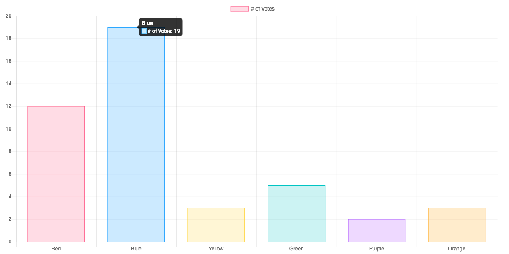

### cheerio

[cherrio](https://www.npmjs.com/package/cheerio) Fast, flexible & lean implementation of core jQuery designed specifically for the server.

#### 解析链接

```javascript
const http = require("http");
const cheerio = require("cheerio");
const url = "http://sports.sina.com.cn/nba/1.shtml";
http.get(url, (res) => {
    let html = "";
    res.on("data", function (chunk) {
        html += chunk;
    });
    res.on("end", function () {
        const $ = cheerio.load(html);
        $("#right a").each(function () {
            console.log($(this).attr("href"));
        });
    });
}).on("error", (e) => {
    console.log(e.message);
});
```

#### 解析网页内容到文件

```javascript
const http = require("http");
const cheerio = require("cheerio");
const fs = require("fs");
const url = "http://sports.sina.com.cn/nba/1.shtml";

function httpGet(url, cb) {
    let html = "";
    http.get(url, function (res) {
        res.on("data", function (chunk) {
            html += chunk;
        });
        res.on("end", function () {
            cb(html);
        });
    }).on("error", function (e) {
        console.log(e.message);
    });
    return html;
}

httpGet(url, function (html) {
    const $ = cheerio.load(html);
    $("#right a").each(function (index) {
        const newUrl = $(this).attr("href");
        httpGet(newUrl, function (body) {
            const jq = cheerio.load(body);
            fs.writeFile(
                `./news/${index}.txt`,
                jq("#artibody").text(),
                function (err) {
                    if (err) {
                        console.log(err.message);
                    }
                    console.log("success");
                }
            );
        });
    });
});
```

### Chart.js

[Chart.js](https://www.chartjs.org/docs/latest/) Simple yet flexible JavaScript charting for designers & developers

```html
<!DOCTYPE html>
<html lang="en">
    <head>
        <meta charset="UTF-8" />
        <meta name="viewport" content="width=device-width, initial-scale=1.0" />
        <meta http-equiv="X-UA-Compatible" content="ie=edge" />
        <title>chartjs</title>
        <script src="bower_components/chart.js/dist/Chart.js"></script>
    </head>
    <body>
        <div
            class="chart-container"
            style="position: relative; height:40vh; width:80vw"
        >
            <canvas id="myChart"></canvas>
        </div>
    </body>
    <script>
        var ctx = document.getElementById("myChart");
        var myChart = new Chart(ctx, {
            type: "bar",
            data: {
                labels: ["Red", "Blue", "Yellow", "Green", "Purple", "Orange"],
                datasets: [
                    {
                        label: "# of Votes",
                        data: [12, 19, 3, 5, 2, 3],
                        backgroundColor: [
                            "rgba(255, 99, 132, 0.2)",
                            "rgba(54, 162, 235, 0.2)",
                            "rgba(255, 206, 86, 0.2)",
                            "rgba(75, 192, 192, 0.2)",
                            "rgba(153, 102, 255, 0.2)",
                            "rgba(255, 159, 64, 0.2)",
                        ],
                        borderColor: [
                            "rgba(255,99,132,1)",
                            "rgba(54, 162, 235, 1)",
                            "rgba(255, 206, 86, 1)",
                            "rgba(75, 192, 192, 1)",
                            "rgba(153, 102, 255, 1)",
                            "rgba(255, 159, 64, 1)",
                        ],
                        borderWidth: 1,
                    },
                ],
            },
            options: {
                scales: {
                    yAxes: [
                        {
                            ticks: {
                                beginAtZero: true,
                            },
                        },
                    ],
                },
            },
        });
    </script>
</html>
```



### colors

[get color and style in your node.js console](https://www.npmjs.com/package/colors)

### chalk

[Terminal string styling done right](https://www.npmjs.com/package/chalk)

### mockjs

[生成随机数据，拦截 Ajax 请求](http://mockjs.com/)

### pm2

[Advanced, production process manager for Node.js](http://pm2.keymetrics.io/)

### lowdb

[Small JSON database for Node, Electron and the browser. Powered by Lodash](https://www.npmjs.com/package/lowdb)

### chokidar

[A neat wrapper around Node.js fs.watch / fs.watchFile / FSEvents.](https://www.npmjs.com/package/chokidar)

### yrm

yrm yarn registry manager
yrm 不仅可以快速切换镜像源，还可以测试自己网络访问不同源的速度

**安装 yrm**
`npm install -g yrm`

**列出当前可用的所有镜像源**

`yrm ls`

npm ----- https://registry.npmjs.org/
cnpm ---- http://r.cnpmjs.org/
taobao -- https://registry.npm.taobao.org/
nj ------ https://registry.nodejitsu.com/
rednpm -- http://registry.mirror.cqupt.edu.cn
skimdb -- https://skimdb.npmjs.com/registry
yarn ---- https://registry.yarnpkg.com

**使用淘宝镜像源**
`yrm use taobao`

**测试访问速度**
`yrm test taobao`

### Prism

[Prism is a lightweight, extensible syntax highlighter, built with modern web standards in mind. It’s used in millions of websites, including some of those you visit daily.](https://prismjs.com/)

### furigana-markdown-it

[furigana-markdown-it  A markdown-it plugin which adds furigana support](https://www.npmjs.com/package/furigana-markdown-it)

