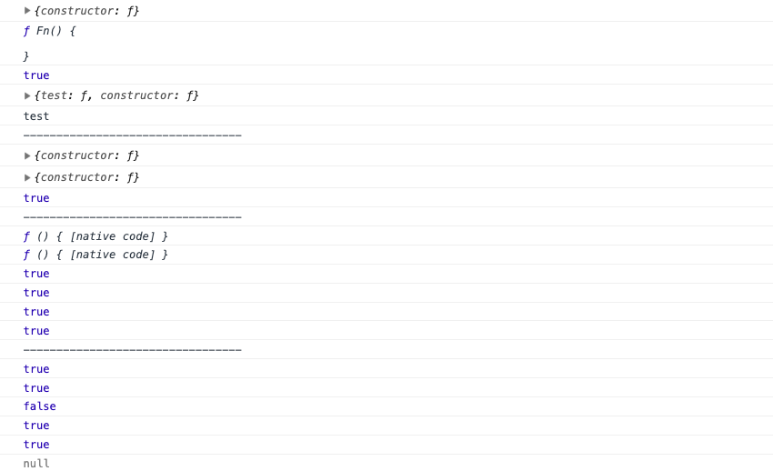
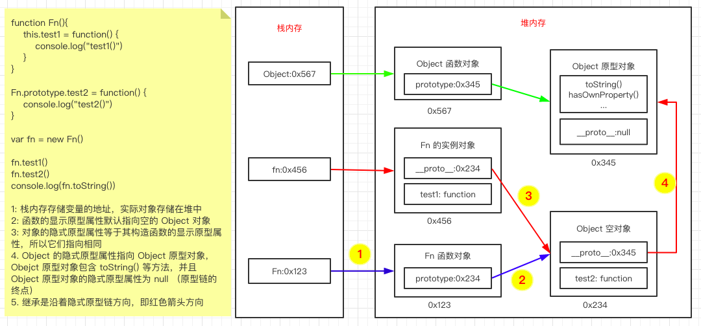

## javascript

### javascript 数据类型

#### 类型分类

基本(值)类型: `String, Number, Boolean, null, undefined`
对象(引用)类型: `Object, Function, Array`, 其中 Function 和 Array 也是一种特别的 Object 类型

#### 类型判断

**typeof** , 返回对象的字符串表示形式，由下表可以看出 `typeof` 可以用来比较 `String, Number, Boolean, undefined, Function` 等类型，但是无法比较 `null, Array, Object` , 因为 `typeof(null), typeof(Array), typeof(Object)` 返回的都是 `'object'`

| Type       | Result       |
| ---------- | ------------ |
| String     | 'string'     |
| Number     | 'number'     |
| Boolean    | 'boolean'    |
| **null**   | **'object'** |
| undefined  | 'undefined'  |
| **Object** | **'object'** |
| **Array**  | **'object'** |
| Function   | 'function'   |

**instanceof** 用于判断对象的具体类型，可以判断`Object, Array, Function`, 由于 Function 和 Array 也是一种特别的 Object 类型，所以 `Array|Function's instance instanceof Object 返回 true`, 具体判断如下

| Instance | Type     | Result |
| -------- | -------- | ------ |
| array    | Array    | true   |
| function | Function | true   |
| array    | Object   | true   |
| function | Object   | true   |
| object   | Object   | true   |

**===** 可以用来判断 `undefined, null` 因为它们是全局唯一的，undefined 和 null 区别如下：

undefined 表示变量未赋值，null 表示变量赋了值，但是值为 null
null 作用:

1. var b = null 初始赋值为 null, 表明将要赋值为对象（typeof b === 'object')
   b = ['a', 2]
2. b = null 让 b 指向的对象成为垃圾对象（被垃圾回收器回收）

#### 数据类型和变量类型

| 数据类型 | 变量类型（变量内存值的类型）     |
| -------- | -------------------------------- |
| 基本类型 | 基本类型: 保存的是基本类型的数据 |
| 引用类型 | 引用类型: 保存的是地址值         |

#### 数据、变量和内存

`内存是存储数据的空间，变量是内存的标识`

**数据**
存储在内存中代表特定信息的东西，本质上是 '0101...', 数据是内存中所有操作的目标, 算术运算、逻辑运算、赋值、运行函数
数据特点: 可传递，可运算

```javascript
var a = 2;
var b = a;
var c = a + 2;
```

**内存**
内存条通电后产生的可一存储数据的空间，是临时的，断电后内存空间和数据都会消失,一块小内存包含 `内部存储的数据` 和 `地址值`
内存分为栈和堆
栈: 存储全局变量和局部变量

```javascript
var a = 1;
var b = { name: "bbb" }; // b 的值是对象在堆中的地址，对象存储在堆中，变量 b 存储在栈中
```

堆: 存储对象

**变量**
可变化的量，由变量名和变量值组成，每个变量都对应一块内存，变量名用来查找对应的内存，变量的值就是内存中保存的数据

#### 引用变量赋值

```javascript
var obj1 = { name: "aaa" };
// 拷贝 obj1 的内容到 obj2, 只不过 obj1 的值是对象的地址，
// 所以 obj2 和 obj1 指向同一对象
var obj2 = obj1;
```

### javascript 函数

#### 函数定义方式

函数声明和函数表达式

```javascript
// 函数声明
function fn1() {
    console.log("fn1()");
}
// 函数表达式
var fn2 = function () {
    console.log("fn2()");
};
```

#### 函数调用

| call                 | desc                        |
| -------------------- | --------------------------- |
| test()               | 直接调用                    |
| new test()           | new 方式调用                |
| obj.test()           | 对象调用                    |
| test.call/apply(obj) | 让 test 成为 obj 的方法调用 |

#### 回调函数

定义的函数没有手动调用，但最终它会执行，常见回调函数

-   dom 事件回调函数
-   定时器函数
-   ajax 请求回调函数
-   生命周期回调函数

#### IIFE

Immediately-InvokedFunctionExpression(立即执行函数表达式)，其实就是 `匿名函数自调用`，作用是隐藏实现，并且不会污染全局空间

```javascript
(function () {
    var a = 3;
    console.log(a + 3);
})();
```

#### this

任何函数本质上都是通过某个对象调用，在浏览器中没有直接指定就是 window，所有函数内部都有一个变量 this， 它的值是调用函数的当前对象，可通过如下方式判断：

| call                 | this         |
| -------------------- | ------------ |
| test()               | window       |
| new test()           | 新创建的对象 |
| obj.test()           | obj          |
| test.call/apply(obj) | obj          |

```javascript
function Person(color) {
    console.log(this)
    this.color = color
    this.setColor = function(color) {
        console.log(this)
        this.color = color
    }
}

Person("red")                  // window

var p = new Person("yellow")   // Person {}
p.setColor('red')              // Person { color: 'yellow'， setColor: [Function] }

var obj = {name: 'obj'}
p.setColor.call(obj， 'black') // { name: 'obj' }
```

#### 何时加分号

需要加分号`;`的地方，以 `() or []` 开头的语句

```javascript
// 如果不加分号就会出现 3(...)， TypeError: 3 is not a function
var a = 3
;(function(){

})()
// 如果不加分号，4[1， 2， 3] 返回 undefined， TypeError: Cannot read property 'forEach' of undefined
var b = 4
;[1，2，3].forEach(function(){

})
```

#### js 调用函数传递变量参数是值传递还是引用传递

可以说都是值（基本/地址值）传递
也可以说可能是值传递，也可能是引用传递(地址值)

### javascript 对象

1. 什么是对象
   用来保存多个数据的容器，用于统一管理数据
   一个对象用来代表现实世界中的一个事物
2. 对象组成

    属性
    方法（一种特别属性）

3. 访问对象内部数据

    .属性名

    [属性名] - 属性名包含特殊字符 -、空格、变量名等时使用

```javascript
var p = {};

// p.content-type = 'text/json'

p["content-type"] = "text/json";

console.log(p["content-type"]);

var propName = "Age";

var propValue = 18;

p[propName] = propValue;

console.log(p[propName]);
```

### javascript 原型

**原型对象**

-   每个函数都有一个 prototype 属性，它默认指向一个 Object 空对象（即原型对象）

-   原型对象中有一个属性 constructor, 它指向函数本身

作用

-   函数对象的所有实例会自动拥有原型中的属性和方法

**显示原型和隐式原型**

-   每个函数 function 都有一个 prototype, 即显示原型属性，默认指向一个空的 Object 对象

-   每个实例对象都有一个 `__proto__`, 即隐式原型

-   对象隐式原型的值为其构造函数的显示原型的值

**原型链**

-   访问一个对象的属性时，先从自身查找，然后沿着 `__proto__` 向上查找，
-   当查找不到时(`__proto__` === null)返回 undefine

**总结**

-   函数的 prototype 属性在定义函数时自动添加，默认为 Object 空对象
-   对象的 `__proto__` 属性在创建对象时自动添加，默认为构造函数的 prototype 属性值

*   所有函数都是通过 new Function() 产生的，所以所有函数的`__proto__` 都相等, 都是 Function.prototype

*   因为 Function 也是通过 new Function() 产生的，所以 Function.`__proto__` === Function.prototype

```javascript
function Fn() {}

console.log(Fn.prototype);
console.log(Fn.prototype.constructor);
console.log(Fn.prototype.constructor === Fn);

Fn.prototype.test = function () {
    console.log("test");
};
console.log(Fn.prototype);
var fn = new Fn();
fn.test();

console.log("---------------------------------");

function F0() {}

var f0 = new F0();

console.log(F0.prototype);
console.log(f0.__proto__);
console.log(f0.__proto__ == F0.prototype);

console.log("---------------------------------");

function F1() {}

function F2() {}

var F3 = new Function();
// 所有函数都是通过 new Function() 产生的，所以所有函数的 __proto__ 都相等, 都是 Function.prototype
// 因为 Function 也是通过 new Function() 产生的，所以 Function.__proto__ === Function.prototype
console.log(F1.__proto__);
console.log(F3.__proto__);
console.log(F1.__proto__ === F2.__proto__);
console.log(F1.__proto__ === Function.prototype);
console.log(F3.__proto__ === Function.prototype);
console.log(Function.__proto__ === Function.prototype);

console.log("---------------------------------");

// 1. 函数的显示原型指向的对象默认是空 Object 实例对象（Object例外)
console.log(Fn.prototype instanceof Object);
console.log(Function.prototype instanceof Object);
console.log(Object.prototype instanceof Object);

// 2. 所有函数都是 Function 实例，包括 Function
console.log(Function.__proto__ === Function.prototype);
console.log(Object.__proto__ === Function.prototype);

// 3. Object 的原型对象是原型链的尽头
console.log(Object.prototype.__proto__); // null
```



图解原型链



## node

### 模块

#### exports

exports 对象是当前模块的导出对象，用于导出模块公有方法和属性。别的模块通过 require 函数使用当前模块时得到的就是当前模块的 exports 对象。以下例子中导出了一个公有方法。`const exports = module.exports` , exports 是 module.exports 的快捷方式, NodeJS 对外暴露模块是通过 module.exports, 不能修改 exports 的指向，否则就不会导出模块。

```javascript
exports.hello = function () {
    console.log("Hello World!");
};

// 改变了 exports 指向， module.exports 不会导出 hello
exports = {
    hello: function () {
        console.log("Hello World!");
    },
};
// 可以使用 module.exports 直接导出对象
module.exports = {
    hello: function () {
        console.log("Hello World!");
    },
};
```

#### module

通过 module 对象可以访问到当前模块的一些相关信息，但最多的用途是替换当前模块的导出对象。例如模块导出对象默认是一个普通对象，如果想改成一个函数的话，可以使用以下方式。

```javascript
module.exports = function () {
    console.log("Hello World!");
};
```

以上代码中，模块默认导出对象被替换为一个函数。

#### 模块初始化

一个模块中的 JS 代码仅在模块第一次被使用时执行一次，并在执行过程中初始化模块的导出对象。之后，缓存起来的导出对象被重复利用。例如有以下目录。

```javascript
-/home/ersu / hello / -util / counter.js;
main.js;
```

其中 counter.js 内容如下：

```javascript
var i = 0;

function count() {
    return ++i;
}

exports.count = count;
```

该模块内部定义了一个私有变量 i，并在 exports 对象导出了一个公有方法 count。主模块 main.js 内容如下：

```javascript
var counter1 = require("./util/counter");
var counter2 = require("./util/counter");

console.log(counter1.count());
console.log(counter2.count());
console.log(counter2.count());
```

运行该程序的结果如下：

```js
$ node main.js
1
2
3
```

可以看到，counter.js 并没有因为被 require 了两次而初始化两次。

#### 模块路径解析规则

**内置模块**

如果传递给 require 函数的是 NodeJS 内置模块名称，不做路径解析，直接返回内部模块的导出对象，例如 require(‘fs’)。

**node_modules 目录**

NodeJS 定义了一个特殊的 node_modules 目录用于存放模块。例如某个模块的绝对路径是/home/user/hello.js，在该模块中使用 require(‘foo/bar’)方式加载模块时，则 NodeJS 依次尝试使用以下路径。

`/home/user/node_modules/foo/bar` -> `/home/node_modules/foo/bar` -> `/node_modules/foo/bar`

**NODE_PATH 环境变量**

与 PATH 环境变量类似，NodeJS 允许通过 `NODE_PATH` 环境变量来指定额外的模块搜索路径。NODE_PATH 环境变量中包含一到多个目录路径，路径之间在 Linux 下使用 `:` 分隔，在 Windows 下使用 `;` 分隔。例如定义了以下 NODE_PATH 环境变量：

`NODE_PATH=/home/user/lib;/home/lib`

当使用 require(‘foo/bar’)的方式加载模块时，则 NodeJS 依次尝试以下路径。

`/home/user/lib/foo/bar` -> `/home/lib/foo/bar`

### 命令行程序

在 Windows 系统下的做法完全不同，我们得靠.cmd 文件来解决问题。
假设 node-echo.js 存放在 C:\Users\user\bin 目录，并且该目录已经添加到 PATH 环境变量里了。
接下来需要在该目录下新建一个名为 node-echo.cmd 的文件，文件内容如下：

`@node "C:\User\user\bin\node-echo.js" %*`

这样处理后，我们就可以在任何目录下使用 node-echo 命令了。

### package.json 中的 bin

许多包有一个或多个可执行文件希望被安装到系统路径。在 npm 下要这么做非常容易(事实上，npm 就是这么运行的)。这需要在你的 package.json 中提供一个 bin 字段，它是一个命令名和本地文件名的映射。在安装时，如果是全局安装,npm 将会使用符号链接把这些文件链接到 prefix/bin，如果是本地安装，会链接到./node_modules/.bin/。比如，要使用 myapp 作为命令时可以这么做：

```json
{ "bin": { "myapp": "./cli.js" } }
```

这么一来，当你安装 myapp，npm 会从 cli.js 文件创建一个到/usr/local/bin/myapp 的符号链接(这使你可以直接在命令行执行 myapp)。如果你只有一个可执行文件，那么它的名字应该和包名相同，此时只需要提供这个文件路径(字符串)，比如：

```json
{
    "name": "my-program",
    "version": "1.2.5",
    "bin": "./path/to/program"
}
```

这和以下这种写法相同：

```json
{
    "name": "my-program",
    "version": "1.2.5",
    "bin": {
        "my-program": "./path/to/program"
    }
}
```

### process

process 是一个全局变量，可通过 process.argv 获得命令行参数。由于 argv[0] 固定等于 NodeJS 执行程序的绝对路径，argv[1] 固定等于主模块的绝对路径，因此第一个命令行参数从 argv[2] 这个位置开始。

```javascript
var fs = require("fs");

function copy(src, dst) {
    fs.createReadStream(src).pipe(fs.createWriteStream(dst));
}

function main(argv) {
    copy(argv[0], argv[1]);
}

main(process.argv.slice(2));
```

### 文件操作

#### Stream

stream 以流的方式读写文件

```javascript
var fs = require("fs");
var rs = fs.createReadStream(src);

rs.on("data", function (chunk) {
    // 处理数据前暂停数据读取，并在处理数据后继续读取数据
    rs.pause(); //暂停
    doSomething(chunk, function () {
        rs.resume(); //继续
    });
});

rs.on("end", function () {
    cleanUp();
});

// 如果写入速度跟不上读取速度的话，只写数据流内部的缓存会爆仓。
// 我们可以根据 write 方法的返回值来判断传入的数据是写入目标了，还是临时放在了缓存了，
// 并根据 drain 事件来判断什么时候只写数据流已经将缓存中的数据写入目标， 可以传入下一个待写数据了。
// 因此代码可以改造如下：
var rs = fs.createReadStream(src);
var ws = fs.createWriteStream(dst);
rs.on("data", function (chunk) {
    if (ws.write(chunk) === false) {
        rs.pause();
    }
});

rs.on("end", function () {
    ws.end();
});

ws.on("drain", function () {
    //drain 排水，流干
    rs.resume();
});
```

#### BOM 的移除

BOM 用于标记一个文本文件使用 Unicode 编码，其本身是一个 Unicode 字符（"\uFEFF"），位于文本文件头部。
在不同的 Unicode 编码下，BOM 字符对应的二进制字节如下：

```

    Bytes      Encoding
----------------------------
    FE FF       UTF16BE
    FF FE       UTF16LE
    EF BB BF    UTF8
```

因此，我们可以根据文本文件头几个字节等于啥来判断文件是否包含 BOM，以及使用哪种 Unicode 编码。但是，BOM 字符虽然起到了标记文件编码的作用，其本身却不属于文件内容的一部分，如果读取文本文件时不去掉 BOM，在某些使用场景下就会有问题。例如我们把几个 JS 文件合并成一个文件后，如果文件中间含有 BOM 字符，就会导致浏览器 JS 语法错误。因此，使用 NodeJS 读取文本文件时，一般需要去掉 BOM。例如，以下代码实现了识别和去除 UTF8 BOM 的功能。

```javascript
function readText(pathname) {
    var bin = fs.readFileSync(pathname);

    if (bin[0] === 0xef && bin[1] === 0xbb && bin[2] === 0xbf) {
        bin = bin.slice(3);
    }
    return bin.toString("utf-8");
}
```

#### GBK 转 UTF8

NodeJS 支持在读取文本文件时，或者在 Buffer 转换为字符串时指定文本编码，但遗憾的是，GBK 编码不在 NodeJS 自身支持范围内。因此，一般我们借助 iconv-lite 这个三方包来转换编码。使用 NPM 下载该包后，我们可以按下边方式编写一个读取 GBK 文本文件的函数。

```javascript
var iconv = require("iconv-lite");
function readGBKText(pathname) {
    var bin = fs.readFileSync(pathname);
    return iconv.decode(bin, "gbk");
}
```

### http

```javascript
// server
http.createServer(function (request, response) {
    response.writeHead(200, { "Content-Type": "text/plain" });

    request.on("data", function (chunk) {
        response.write(chunk);
    });

    request.on("end", function () {
        response.end();
    });
}).listen(80);

// client
var options = {
    hostname: "www.example.com",
    port: 80,
    path: "/upload",
    method: "POST",
    headers: {
        "Content-Type": "application/x-www-form-urlencoded",
    },
};

var request = http.request(options, function (response) {});

request.write("Hello World");
request.end();
```

### event

扩展事件发射器实现文件监听

```javascript
var events = require("events");
var util = require("util");
var fs = require("fs");
var watchDir = "./watch";
var processDir = "./done";

// 创建文件监视器构造器
function Watcher(watchDir, processDir) {
    this.watchDir = watchDir;
    this.processDir = processDir;
}

// 继承事件发射器行为
util.inherits(Watcher, events.EventEmitter);

// 扩展事件发射器行为

// Node wacthFile 监控目录文件变动，触发 watch 方法
Watcher.prototype.start = function () {
    var watcher = this;
    fs.watchFile(this.watchDir, function () {
        watcher.watch();
    });
};

// wacth 方法对每一个文件发出 process 事件
Watcher.prototype.watch = function () {
    var watcher = this;
    fs.readdir(this.watchDir, function (err, files) {
        if (err) throw err;
        for (var index in files) {
            watcher.emit("process", files[index]);
        }
    });
};

var watcher = new Watcher(watchDir, processDir);

// 监听文件 process 事件，将文件名转换为小写从原始目录移动到目标目录
watcher.on("process", function process(file) {
    var wacthFile = this.watchDir + "/" + file;
    var processFile = this.processDir + "/" + file.toLowerCase();
    fs.rename(wacthFile, processFile, function (err) {
        if (err) throw err;
    });
});

watcher.start();
```

### 正则

`\b` 匹配单词边界

`x(?=y)` 如果 y 跟随在 x 后面，匹配 x

`x(?=y)` 如果 y 不跟随在 x 后面，匹配 x

```js
let date = new Date("2019-03-01T08:02:06Z");
let localDateString = date.toLocaleDateString();
console.log(localDateString); // 2019-3-1
console.log("2019-3-1".replace(/(\b\d\b)/g, "0")); // 2019-0-0
// x(?=y)  Matches x only if x is followed by y.
console.log("2019-3-1".replace(/(?=\b\d\b)/g, "0")); // 2019-03-01
console.log("123xx123".replace(/\d(?!$)/g, "•")); //  •••xx••3 替换非最后一个数字为 •
```

### 判断空字符串，null，undefined

```js
// !name 可以判断  name="", null, undefined
// /^[ ]+$/.test(name) 可以判断 name=" ", "   "
if (!name || /^[ ]+$/.test(name)) {
    console.log("missing name");
}

// 只判断 name="", " ", "   " 不判断 null, undefined
function isNull(str) {
    if (str == "") return true;
    let re = new RegExp("^[ ]+$");
    return re.test(str);
}
```

### GenerateRandomAlphaNum

```js
// toString(36) 转换为 36 进制
function generateRandomAlphaNum(len) {
    let rmdString = "";
    for (
        ;
        rmdString.length < len;
        rmdString += Math.random().toString(36).substr(2)
    );
    return rmdString.substr(0, len);
}

console.log(generateRandomAlphaNum(12)); // 6qy9i7w5j1sw
```

### parseInt & ~~

```js
console.log(~1.5, ~-1.5); // -2 0
console.log(
    ~~1.5,
    ~~-1.5,
    Math.floor(1.5),
    Math.floor(-1.5),
    Math.ceil(1.5),
    Math.ceil(-1.5)
); // 1 -1 1 -2 2 -1
console.log(
    parseInt(1.5),
    parseInt(-1.5),
    parseInt(0.000001),
    parseInt(0.0000001),
    ~~0.0000001
); // 1 -1 0 1 0
```

### const

```js
// es5
Object.defineProperty(window, "name", {
    value: "babb",
    writable: false,
});
name = "babb chen";
console.log(name); // babb

const name = "babb";
const name2 = "babb chen";
console.log(window.name); // , window has name property, default is empty
console.log(window.name2); // undefined, const not belong top window

// const obj = {
//     name: "babb",
//     age: 18,
// };

// Object.freeze(obj);

// obj.name = "babb chen";
// console.log(obj); // {name: "babb", age: 18}

// const obj = {
//     name: "ES6",
//     extensions: ["es7", "es8", "es9"],
// };
// Object.freeze(obj);
// obj.extensions[0] = "es2016";
// console.log(obj.extensions); // ["es2016", "es8", "es9"]

const obj = {
    name: "ES6",
    extensions: ["es7", "es8", "es9"],
};
function myFreeze(obj) {
    Object.freeze(obj);
    Object.keys(obj).forEach((k) => {
        if (typeof obj[k] === "object") {
            myFreeze(obj[k]);
        }
    });
}
myFreeze(obj);
obj.extensions[0] = "es2016";
console.log(obj.extensions);
```

### node .

```json
{
    "name": "npx-example",
    "version": "1.0.0",
    "main": "index.js",
    "bin": "index.js",
    "scripts": {
        "start": "node ."
    },
    "license": "MIT"
}
```

Node will try to load module located in the folder you pass (. - just bash variant of current folder), and start whatever is written in "main" section of package.json.

if no package.json found in the folder, node will still try to run index.js file.

### JS trap

#### 1 / 0

在 node 中除以 0 不会产生异常

```js
console.log(0 / 0, 1 / 0, -1 / 0);
// NaN Infinity -Infinity
```

#### undefined compare

undefined 可以和其它类型比较

```js
console.log(undefined < 1, undefined > 1, undefined < "1");
// false false false
```

## JS Quiz

### 数组扁平化，去重，升序

```javascript
const arr = [
    [1, 2, 2],
    [3, 4, 5, 5],
    [6, 7, 8, 9, [11, 12, [12, 12, [13]]]],
    10
]

// 递归实现扁平化
Array.prototype.flat = function () {
    const result = this.map(item => {
        if (Array.isArray(item)) {
            return item.flat()
        }

        return [item]
    })

    return [].concat(...result)
}

// while 循环实现扁平化
Array.prototype.flat2 = function () {
    let result = this;

    while (result.some(item => Array.isArray(item))) {
        result = [].concat(...result)
    }
    return result;
}

Array.prototype.unique = function () {
    return [...new Set(this)]
}

const sortFn = (a, b) => a - b;

let result = arr.flat().unique().sort(sortFn)
console.log(result)
result = arr.flat2().unique().sort(sortFn)
console.log(result)

// [1, 2, 3, 4, 5, 6, 7, 8, 9, 10, 11, 12, 13]
// [1, 2, 3, 4, 5, 6, 7, 8, 9, 10, 11, 12, 13]
```

### 实现 AOP

```js
Function.prototype.before = function (callback) {
    return () => {
        callback(this.name)
        this()
    }
}

function hello () {
    console.log('Hello World')
}

const wrapHello = hello.before((funcName) => {
    console.log(`start call ${funcName}`)
})

wrapHello()

// start call hello
// Hello World
```

