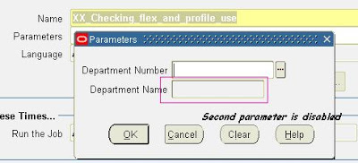
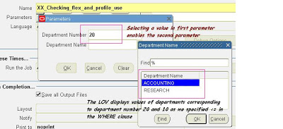
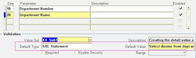
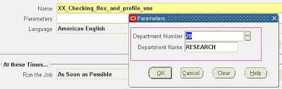
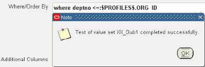
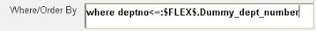
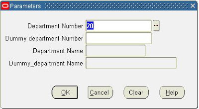
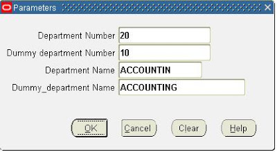
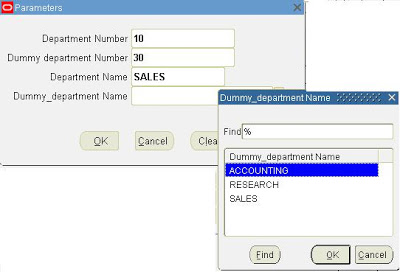

> 转载：[All about Oracle Applications: \$FLEX\$ and \$PROFILES\$](http://oracledollarschennai.blogspot.com/2008/07/flex-and-profiles.html)

`$FLEX$` and `$PROFILES$` are Special Variables in oracle Apps environment and are used to hold values at runtime.
Every Oracle Apps technical consultant will be familiar with the term `$FLEX$` and `$PROFILES$`. Whenever we are working with value sets, we will be using both of these for modifying the data fetched, for basing the values of a parameter on the other parameter and also fetching the Profile Option values.

To segregate this based on the functionality.
`$FLEX$`: Used for basing the value of a parameter on another parameter.
`$PROFILES$`: used for fetching the data stored in the specified profile option value which is currently active.

## Where is it used?

Both these variables are used in the **Parameter form** of a Concurrent Program and are used at the **Where Clause** window in the value set of **Table type**.

## Syntax

`:$FLEX$.previous_value_set_name`

1. `$FLEX$ `must always be in capitals.
2. A ':' must precede the declaration of `$FLEX$`.
3. The previous value set name must have already been assigned and saved on a different parameter.

`:$PROFILES$.Profile_option_name`

1. `$PROFILES$` must be always in capitals.
2. ':' must always precede the declaration.
3. Profile option name is the Profile Name and not to be confused with the User profile Name.

## Some use of the Special Variables

**Pre-Requisites:**
Created an Executable and a concurrent program which is registered in the Application Object Library. The Query for the report is as below:

```sql
SELECT e.ename, e.empno, e.sal, e.hiredate, e.deptno, d.dname, d.loc
  FROM emp  e,
       dept d
 WHERE d.deptno = :x_deptno;
```

The name of the concurrent program is taken as "XX_Checking_flex_and_profile_use"

**Scenario 1:** Changing the value of Parameter B based on the Parameter A:

In this, we created two value sets and they are: XX_SCENARIO_1 and XX_Sub1.

Create the value set **XX_SCENARIO_1** using the validation type as ‘Table’.
Create the second value set **XX_Sub1** using the validation type as ‘Table’ and in the where clause field specify the following code:
`where deptno <= :$FLEX$.XX_SCENARIO_1`

To check the working of this concurrent program, lets submit this
In the picture here, the First parameter contains no value, so the second parameter is disabled as the WHERE clause in value set is equated to NULL, making the field disabled.



When a value is selected in the first parameter, the second parameter gets enabled and when the LOV is clicked, it shows the departments which are in department number 20 and below it, as we have specified <= in the where clause.



**Scenario 2:** Use of :`$FLEX$`in the default type option of a Parameter form:

The query used in the Default Value test field is as below: `Select dname from dept where deptno =:$FLEX$.XX_SCENARIO_1`
Ensure that the default value for the field Department Number is given as SQL Statement.



Since the default value was given as a SQL statement, the result of that is shown in the first parameter and the second parameter has the value based on the first parameter as specified in the SQL statement.



**Scenario 3:** Use of `$PROFILES$` in where clause and Default Value. It is done in the same way as is used in `$FLEX$`.

Modifying the where clause using `$PROFILES$` returns Successful upon validation.



**Scenario 4:** Use of **Parameter name instead of a value set name** in the `$FLEX$` Special Variable. Where Clause of the value set of table type using the parameter name.
Reason: When we provide the name of the value set in `$FLEX$ `then we will be able to change the value of the parameter which is dependent on it. If the value set is used by more than one parameter then it becomes difficult to get the exact value in the dependent parameter as it will fetch the values based on the last used value of the value set. It could have been last used by the first parameter or any other parameter in the form. To avoid this kind of confusion, the alternative is to provide the name of the Parameter itself in the `$FLEX$` variable. No matter how many times the value set is used, if we provide the parameter name, we will get the dependent parameter value based on its parent parameter only. Let me explain this using the pictures below:
Where Clause of the value set of table type using the parameter name.



The first and third parameter are based on value set names and the second and fourth parameter are based on parameter name. Since the second parameter is not initialized, the third parameter (value set based )is also not initialized.



Since the latest value is from Second parameter, hence the value in third is based on the second parameter. The third value is based on the value of the second parameter and is irrespective of the value set. Shown in the next picture.



Here the third parameter takes the latest value of the value set, hence shows the department name corresponding to that and the fourth parameter values are dependent on the value of the second parameter.



These were some of the basic uses of `$FLEX$` and `$PROFILES$`. Feel free to post your queries and comments on this topic.
